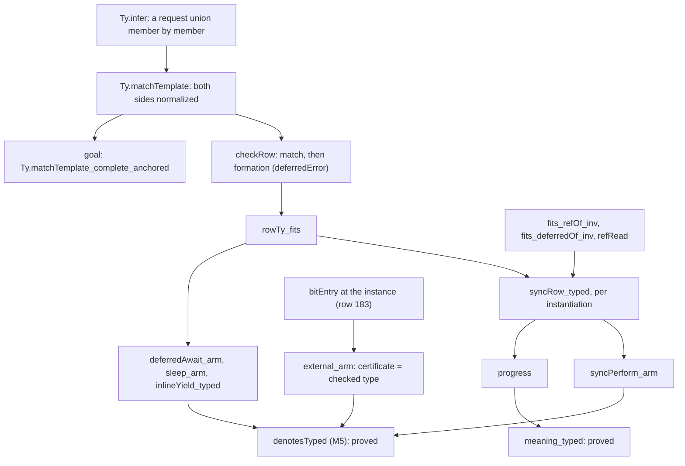

# 2026-10-04 seat T3a receipt: the Ref and Deferred rows as templates

Status: receipt (history, not authority). Branch `seat/t3a`, worktree
`/Users/pooks/Dev/lean4-effect4-t3a`, base `26fbc785`. Brief: the coordinator's seat T3a brief and
its phase-2 rulings D1 to D11. Plan: `docs/research/2026-10-04-claude-lead/state-any-type-plan.md`,
slice T3a (decisions rows 42, 155 (a), 183, 209). Design: `docs/research/2026-10-04-seat-T3a-design.md`.

**The one thing to know before merging.** Four places depart from the phase-1 design. Each was
found while landing, and each is measured. None needs a new ruling to merge; §6 proposes the rows.

1. The match guard normalizes both sides (`sub request.normalize (instantiate σ' t).normalize`),
   not the instance alone as P7 wrote. With the instance alone, p1 stopped building: an atom's
   argument type is not normal, and raw `sub` never distributes a product over a union
   (`E4-TYPED-CE-009`). The guard with both sides normalized accepts more than the raw guard,
   never fewer requests.
2. The anchored goal carries a premise P7 lacked, `Ty.bottomFree r`: no `never` outside an
   invariant handle's argument. Without it the statement is false for the repaired `infer`
   (tested, `neverR` in `Test/Program/TypeAlgebraContract.lean`). With it a finite pool finds no
   failure (tested, 1968 triples; §4).
3. The two retired handle spellings now have no member, so the inhabitance fold reads them as
   empty (`retiredHandleTargets`, `inhabitedAlg`). P5 retired the spellings' membership and left
   the fold at `true`, which made `inhabited_iff_fits` false at two targets. `handle_inhabited`
   gained the premise that the target is not retired.
4. The spelling-key list is `builtinKeys`, not `nativeKeys`: the law graph already declares
   `Effect4.Program.nativeKeys` (the handle alphabet, `Laws/Program/Handles/Alphabet.lean`).

Rows 183 and 155 (a) landed as the owner ratified them. `syncRow_typed` is proved (D9 (a)).
`denote-typed` and `straight-meaning-typed` stay proved and rest on no goal.

## 1. Base and head

| Item | Commit |
| --- | --- |
| Base | `26fbc785` (`a917b768` plus the coordinator's documents) |
| The core, the laws, the derived groups and the batteries | `69a51bec` |
| The faces: the tools read `NativeOp.spelled`; the lcnf, eff, wire, cas, ts and readme groups; the target lane's rows | `48acc3ef` |
| Conservativity (D2 (b)); the compatibility and case policies | `4ae78271` |
| Control G2 retires the constructor from all three manifests | `ca5328fc` |
| The registry, `docs/core/semantics.md`, contract item 8, the register, `generated/semantics.md` | `dbe09d19` |
| The TypeScript reader's two expectations | `80c13fb1` |
| D5 (a)'s pin | `e9df6acc` (the gated head) |
| The design note and the probes (force-added) | `638184f4` |
| This receipt | the commit after `638184f4`; it adds this file only |

Nothing is pushed. `docs/core/decisions.md`, `lakefile.toml` and `docs/STATE.md` are untouched.

**Changed files** (116, `git diff --stat 26fbc785..e9df6acc`: 2793 insertions, 2733 deletions), by
area:

- the core, `src/Effect4/Program/`:
  - `Native.lean`: the rows, `deferredMakeOf`, `NativeOp.spelled`, `syncOpOf`, service code 7;
  - `Ty.lean`: `infer`'s union arm, structural on the request, and the guard;
  - `Typed.lean`: `Val.hasTy`'s two handle arms, `internalHandleTargets`, `retiredHandleTargets`;
  - `Columns.lean`: `admitRowColumn` and the inhabitance fold;
  - `Table.lean`: `builtinKeys`, `NativeOp.rowKey_mem`; `SigApp.lean`; `Formation.lean`;
  - `src/Effect4/Codegen/Read.lean`: `rowHeadReadable`, `nativeSpell`;
  - `src/Effect4/Store/Domain/ProgramWire.lean`: `pAwait`;
- the generated Lean groups: `Store/Domain/Derived/Program.lean`, `Api/RefusalsDerived.lean`,
  `Program/Authoring/Rows.lean`, `Laws/Program/Authoring/Rows.lean`;
- the laws: `Laws/Program/{Template, TypeAlgebra, Typed, Admits, Signature, Author, Progress}.lean`,
  `Laws/Program/Typed/{Membership, Denotation, Residual, LayerArm}.lean`,
  `Laws/Codegen/ReadLeaf.lean`;
- the batteries: 31 files under `Test/` (the contracts, the counterexamples, the dogfood
  batteries p3, p4, p5 and their README, `Gen.lean`) and `Test/fixtures/proof-style/baseline.tsv`;
- the generators' inputs: `tools/Effect4Gen/{manifest.json, wire-tags.json, Rows.lean}` and three
  guard files; the tools: `tools/Drivers/{TsGen, ForeignCorpus}.lean`,
  `tools/Tools/{RowTypes, TyVectors, SemanticsRegistry}.lean`, `tools/target/rows.ts`,
  `src/OCaml5/Eff/{Emit, Goldens}.lean`, `src/OCaml5/Tools/EffGen.lean`;
- OCaml: the regenerated `ocaml/eff`, `ocaml/goldens/eff`, `ocaml/gen/api_gen.ml`,
  `ocaml/engine/api_engine.ml`, `ocaml/engine/e4_program_layout.ml` and closures; by hand
  `ocaml/engine/e4_program.ml`, `ocaml/engine/test/test_engine.ml`, `ocaml/gen/api_check.ml`,
  `ocaml/eff/README.md`;
- TypeScript: the regenerated `ts/eff/{eff, json, profile, wire}.gen.ts`,
  `ts/eff/ingest/README.md`; by hand `ts/eff/test/read.test.ts`;
- the projections: `generated/{row-types, row-citations, corpus-index, semantics}`;
- the policies: `scripts/lib/conservativity.py`, `Test/fixtures/conservativity/mutations.json`,
  `Test/fixtures/baseline/66ee4657-supplement-v1.policy.json`,
  `tools/Conform/Effect4/cases-policy.json`;
- the documents: `docs/core/semantics.md`, `Test/contracts/program-denotation.contract.md`,
  `Test/Counterexamples/REGISTER.md`.

## 2. What landed



- **The rows** (D1 (a)). The `Ref` rows without a function and the six `Deferred` rows are
  templates over their parameters, as the design's P1 table states. `NativeOp.deferredMake`
  retired at wire tag 13; `NativeOp.deferredMakeOf (value error : Ty)` is appended at tag 23. Its
  row's type arguments are `["number", "number"]` at `(nat, nat)` and `[""]` elsewhere, which the
  printer refuses by name (`PrintRefusal.typeSpelling "Deferred.make"`). The eight
  read-modify-write rows stay at `refOf nat`. `syncOpOf` decodes any value.
- **The handle judgments.** A cell or a promise fits `refOf _` or `deferredOf _ _` at any
  argument (`Val.hasTy`, `Fits`). `HandleFits` lost its cell and promise arms (row 96 D2 retired),
  `FlatFits` gained a cell arm, and `flatCarrier (refOf t)` holds. The retired spellings have no
  member (`Val.hasTy_handle_retired`), and the inhabitance fold reads them as empty.
- **Collisions by key** (D8). `NativeOp.spelled` holds one operation per spelling key, row by row in
  the profiles' order. `builtinKeys` is its key list; `rowChecks`, `Table.lawful`, `nativeSpell`,
  TsGen, the OCaml emitter, RowTypes and the foreign corpus read it. `NativeOp.all`, its two
  hand copies and OCaml's `row_of`, `ref_ty` and `deferred_ty` are deleted.
- **The match** (D3 (a)). `Ty.infer` reads a request union member by member and is structural on
  the request, which keeps `decide +kernel` closing the atom table. The guard normalizes both
  sides (the first point above). `E4-CHECK-CE-018` is registered.
- **Formation** (D4 (a)). A deferred's error column must be in the error alphabet
  (`HeadFormed`'s `deferredOf` arm, `FormationReason.deferredError`, appended).
- **Row 155 (a)** (`admitRowColumn`) and **row 183** (`bitEntry` reads the row's instance).
  `external_arm` certifies at the checked type; `fits_instantiate`, `valueVars_normalize`,
  `valueVars_of_noInternalHandle`, `exitOk_instantiate`, `hostRow_valueVars` and their helpers had
  no other consumer and are deleted (447 lines of `Membership.lean`).
- **The faces** (D7 (a)). `LawfulSpelling.spell_row` gained the premise `rowHeadReadable`; its five
  uses discharge it. The faces keep today's spellings: `Deferred<number, number>` prints and reads
  back; another instance is refused by name; the `Ref` rows print at every instance.
- **The acceptance batteries.** p4's `Window` builds in one `Ref`, as p5's `Account` does. Both are
  written and read. p3 has two refused parts: the log's first append at `Ref<never[]>`, and the gate
  `Deferred<void, never>` in TypeScript. The gate builds and runs, and its `await` cannot fail.
  The programs keep today's instances, so their stages do not move.

## 3. Commands and results

Every Lean command ran through `/Users/pooks/Dev/lean4-effect4/scratch/lean-slot.sh`.

| Command | Result |
| --- | --- |
| `lake build` | `Build completed successfully (903 jobs).` |
| `lake build OCaml5 Tools` | `Build completed successfully (397 jobs).` |
| `lake env lean -DwarningAsError=true Test/All.lean` | exit 0; the three gate lines below |
| `#print axioms` of 70 new or restated theorems, the goal included | below |
| `python3 scripts/generate.py --only G --output-dir D`, G in variances, derived, eff, wire, cas, ts, readme | `PASS` each |
| `python3 scripts/generate.py --only lcnf` in place, then `git status` | no drift |
| `lake env lean -M4096 --run tools/Tools/RowTypes.lean generated/row-types.tsv --check` | `PASS row-types` |
| `make check-cases` | `conform cases: PASS, exit 0` (after re-pinning eleven functions' covers from the scan) |
| `make check-proof-style` | exit 0: 1917 recorded uses, 60 unread commands, 1178 entries |
| `make record-proof-style` | the baseline loses six rows (the deleted proofs' `first` and one `simp`); none added |
| `make check-ocaml` | exit 0; every suite `ALL PASS`; the cross face reports `agree=9 differ=2` |
| `make check-truth` | `PASS: 38 programs agree on exits, schedules and sync exits; 1 signed divergence(s)` (U-01) |
| `make check-ts-reader` | exit 0: files 447, matched 416, mismatched 0; 696 `bun test` pass; tsgo typecheck exit 0 |
| `bun run typecheck` in `ts/eff` | exit 0 (tsgo 7.0.0-dev.20260629.1) |
| `make corpus` | `kept 408 (readable 385) refused 0` |
| `scripts/check-conservativity.sh 26fbc785 HEAD` | `PASS (4 of 4 clauses pass)` |
| `scripts/check-conservativity.sh --self-test` | `20 of 20 controls as expected` |
| `make gen-semantics` | committed in `dbe09d19` |
| `make check-docs` | `PASS check-docs: every path, link, citation and make target in 72 documents resolves` |
| `make check-target` | refused at the assignability lane (§5, pre-existing); `bun tools/target/rows.ts` then `make gen-row-citations` promoted the rows lane |

The gate lines:

```
Effect4 library-root gate: 162 API/utility modules, 275 Laws-only modules; every library source is reachable; Effect4 never reaches Laws
Effect4 module and axiom gate: checked 664 modules and 81289 declarations; … semantic/test axioms are [propext, Quot.sound]; exact implementation boundary (17 module(s), 23 declaration(s)) additionally allows Classical.choice
Effect4 goal gate: 14 planned goal(s), each a theorem whose body is `sorry` outside the Effect4 root; 7 declaration(s) rest on goals; no other declaration reaches sorryAx
```

The goal count moved from 13 (seat E2's receipt) to 14: the one planned goal this slice adds is
`Effect4.Program.Ty.matchTemplate_complete_anchored`. The seven declarations that rest on goals are
the `Test/Audit` fixtures, as before.

**Axioms.** Every theorem below prints `[propext, Quot.sound]` or a subset. The goal prints
`[propext, sorryAx, Quot.sound]`. `not_retired_of_inhabited` depends on no axiom. Ten print
`[propext]`: `NativeOp.rowKey_mem`, `closed_of_lookup`, `Val.hasTy_refOf_inv`,
`Val.hasTy_deferredOf_inv`, `Val.hasTy_handle_retired`, `syncOpOf_isSome`, `NativeOp.row_hygiene`,
`nativeRowOf_builtin`, `handleFits_map` and `live_handle`. The list, in `Effect4.Program`:

```
NativeOp.rowKey_mem builtinLookup_none Ty.matchTemplateArgs_length Ty.closed_of_lookup
Ty.infer_closed Ty.matchTemplate_sound Ty.matchTemplate_closed Ty.matchTemplate_widens
Ty.matchTemplateArgs_widens rowTy_closed rowTy_closed_some NativeOp.row_templateAdmissible
NativeOp.row_wellScoped Ty.matchTemplate_complete_anchored Ty.infer_widensSub
Val.hasTy_refOf_inv Val.hasTy_deferredOf_inv Val.hasTy_handle_retired syncOpOf_isSome
Fits.instantiate LawfulSig.tableLawful Authoring.build_table_lawful nativeLawful methodLawful
NativeOp.row_hygiene nativeRow_hygiene lawfulTable_member NativeOp.external_not_mem_spelled
nativeRowOf_builtin rowHeadReadable_of_typeArgs rowHeadReadable_of_value
rowHeadReadable_of_method read_printRow progress NativeOp.syncOpOf_cellImplements
Denote.meaning_typed
Typed.flatFits_fits Typed.fits_flatFits Typed.flatFits_map Typed.handleFits_map
Typed.handle_fits_hasTy Typed.live_handle Typed.fits_context_inv Typed.inhabited_of_hasTy
Typed.not_retired_of_inhabited Typed.fits_handle_fresh Typed.fits_of_inhabited_fresh
Typed.inhabited_iff_fits Typed.handle_inhabited Typed.FitsAll.instantiate Typed.fits_memoMap_inv
Typed.fits_refOf_inv Typed.fits_deferredOf_inv Typed.refRead Typed.rowTy_fits
Typed.Formation.headFormed_of_nodes Typed.syncRow_typed Typed.builtinPerform_inv
Typed.syncPerform_arm Typed.deferredAwait_arm Typed.sleep_arm Typed.external_arm
Typed.perform_arm Typed.inlineYield_typed Typed.subN_normalize₁ Typed.bitEntry_rows_append
Typed.asyncPre_rows_append Typed.typedProg_rows_append Typed.asyncPre_mono Typed.denotesTyped
```

## 4. The measurements the rulings asked for

**D3: the corpus verdicts the shared match moves** (tested, `make corpus` over 408 programs, the
diff of `generated/corpus-index.tsv`). Two rows move, and both trace to the `Ref.make` template:

| Program | Before | After | Why |
| --- | --- | --- | --- |
| `g158`, `Effect.raceAll([Ref.make("hi")])` | refused, `requestNotSubtype` | well typed | `Ref.make` takes any type |
| `g277`, an `Effect.forkIn` whose body's finalizer runs `Ref.make(a0)` and whose scope term is `lt(9, undefined)` | refused at `Ref.make(a0)` | refused at the term `lt(9, undefined)` | `Ref.make(a0)` types, so the first refusal moves past it |

The union arm and the guard move no other corpus row. The policy names both moves
(`verdict_moves`). The dogfood battery p1 is the case the guard repair rests on. With the guard
normalized at the instance alone, p1 refused (`typing: term`, at the retry cursor's update term).
With both sides normalized it builds, and its measured stage is unchanged (tested).

**D3: the anchored goal's statement** (tested, `docs/research/2026-10-04-seat-T3a/AnchoredGoal.lean`,
the output beside it). The pool:

- eight normal, admissible, anchored templates: the five native request templates and three
  nested ones;
- 27 substitutions;
- 1987 normal requests, and every instance and union of two instances of each template.

| Request set | Premise | Triples checked | Failures |
| --- | --- | --- | --- |
| the 1987 pool requests | `bottomFree` | 318 | 0 |
| the 1987 pool requests | none | 891 | 69 |
| the instances and their unions | `bottomFree` | 1650 | 0 |
| the instances and their unions | none | 1782 | 0 |

The 69 failures are the `never`-at-anchor shape the premise excludes. A finite probe: it tests the
statement on the pool and proves nothing about other types.

**D6: an authoring-side ascription** (tested, `docs/research/2026-10-04-seat-T3a/AscriptionProbe.lean`,
measured, not built). The language's one written term type is a record's declared field, so the
probe ascribes `e : T` as `field (record [("v", false, T)] [("v", e)]) "v"`.

- Bare: `Ref.make([])` types at `Ref<never[]>`; p3's log append and p5's `seen` append are
  refused (`requestNotSubtype`).
- Ascribed: the cell types at `Ref<ReadonlyArray<string>>` (`Ref<ReadonlyArray<number>>`); both
  appends build, and the log runs to `["open 1"]`. Both programs print and read back.
- The printed text carries the declared type as a type argument of the record helper:
  `Ref.make(recordRequired<"v">("v")(recordValue<{ readonly v: ReadonlyArray<string> }>([…], { v: nil() })))`.
  So tsgo would see the element type too (reading; not run under tsgo).

So yes: the ascription types p3's log and p5's `seen` at their element today, with no
`refMakeOf`. It is verbose in TypeScript; T5's `Ref.make<A>` prints the rc.112 spelling.

**The target lane** (tested, tsgo 7.0.0-dev.20260629.1, `generated/row-citations.tsv`). The
template rows are queried at their probes (`typeof Ref.make<"p0">`), as template atoms are. The
report moves from 32 agree, 2 mismatch, 28 refused to 38, 3, 21. Six rows now agree exactly with
rc.112's generic declarations: `Ref.make`, `Ref.get`, `Deferred.isDone`, `Deferred.succeed`,
`Deferred.fail` and `Deferred.await`. `Deferred.poll` reads as a mismatch on its signed exception
(DI-98), since its request now resolves. A report, not a gate on agreement.

## 5. Findings outside the slice

- **`generated/assignability.tsv` is stale since `4594b8fa`** (2026-10-02, the number tower).
  `make check-target` refuses at the assignability lane at the base too (reading). The two moved
  rows are the `nat`/`int` pair, which T3a does not touch, and the file dates from 2026-09-19.
  T3a keeps the lane's inputs unchanged (`TyVectors.refT` stays the literal handle spelling).
  `make gen-assignability` promotes it; that is the coordinator's call.
- **The OCaml cross face reports `pAcquire` and `pProvide` as differing**, reported and not gated.
  The base reports the same two (tested: the base's `test_diff` built and run from
  `git archive 26fbc785`).
- **`E4-CHECK-CE-013` lives in the archive register** (`Test/Counterexamples/Archive/REGISTER.md`,
  `RESERVED`), while its witnesses are live in `Test/Codegen/ReadContract.lean` (the generic
  signature, and since T3a the native `Deferred.make` section). The archive is history, so this
  slice did not edit it; moving the row to the live register is proposed in §6.

## 6. Proposed decisions rows

For the coordinator to write; each states the landed behaviour.

| Proposal | Text |
| --- | --- |
| D1 | `NativeOp.deferredMake` retired at wire tag 13; `NativeOp.deferredMakeOf (value error : Ty)` appended at tag 23. The faces spell the instance `Deferred<number, number>` until T5 and refuse another by name (`PrintRefusal.typeSpelling "Deferred.make"`); the readers read that instance only |
| D4 | A deferred's error column must be in the error alphabet (`admittedErrTy`) or an open template column (`FormationReason.deferredError`, appended): a failure carries a value `errOf` can encode, so M5's completion precondition holds |
| D5 | A parameter inside an operation's own type arguments is accepted and types at `never` (pinned, `Test/Program/FormationContract.lean`), until T5 makes operation data a program annotation |
| D6 | `Ref.make<A>` lands at T5. Measured: an ascription through a declared record field types p3's log and p5's `seen` at their element today, prints and reads back, but prints verbosely (§4) |
| F8 | `internalHandleTargets` keeps `Ref.Ref<number>` and `Deferred.Deferred<number, number>` reserved, so no external handle prints as a native type. Since T3a the two spellings have no member at all (`retiredHandleTargets`), and the inhabitance fold reads them as empty |
| T3a-a | The match guard compares both sides normalized (the first point above), the checker's order (`subN`) |
| T3a-b | The anchored completeness carries `Ty.bottomFree` on the request (the second point above; §4) |
| T3a-c | Conservativity's C2 manifests drop a constructor the policy names as retired before the prefix check, as C3's count tables do (D2 (b) extended); controls R11 and G2 |
| T3a-d | Move `E4-CHECK-CE-013` back to the live register with its live witnesses (§5) |

## 7. Placement of the landed theorems

| Theorem (file) | Concept, property | Claim, requirement | Consumer | Reach | Does not establish | Unlocks |
| --- | --- | --- | --- | --- | --- | --- |
| `Ty.matchTemplate_complete_anchored` (goal, `Laws/Program/Template.lean`) | `subtyping-algebra`: the match's completeness half (soundness is `matchTemplate_sound`) | `template-match-anchored`, R4 | the checker's completeness at template rows | normal, admissible, anchored templates; normal requests with `bottomFree` | a parameter first met covariantly; a union template; a nominal reference | template rows with no silent refusal |
| `Ty.matchTemplate_sound`, `matchTemplate_closed` (restated) | `subtyping-algebra`: the guard is the law | step of `instantiated-formation` and `denote-typed` | `rowTy_fits`, `Fits.instantiate`, `FitsAll.instantiate` | every template and request | completeness | the both-sides guard |
| `Ty.infer_closed`, `Ty.infer_widensSub`, `closed_of_lookup` | `subtyping-algebra` | steps of `matchTemplate_closed` and of the atoms' instantiation | `rowTy_closed`, `matchTemplate_widens` | every substitution | — | the union arm |
| `rowTy_fits` (`Typed/Denotation.lean`) | `residual-program-typing`: inversion of the row rule | step of `denote-typed` (M5), R4 | `syncRow_typed`, `deferredAwait_arm`, `sleep_arm`, `inlineYield_typed` | every row, request type and world | a row's post | one decomposition for every template row |
| `syncRow_typed` (restated, proved) | `residual-program-typing`, serving `store-typing` | steps of `denote-typed`, `straight-meaning-typed`; R4 | `syncPerform_arm`, `inlineYield_typed`, `progress` | native `sync` rows at every instance the checker admits; every world | host rows (R6); the asynchronous rows | M5–M7 at non-number state |
| `fits_refOf_inv`, `fits_deferredOf_inv`, `refRead` | `store-typing`: the reference read (TAPL §13.4, as §2.2 adapts it) | steps of `denote-typed` | `syncRow_typed`, `deferredAwait_arm`, `inlineYield_typed` | every world and declared type | liveness beyond the declaration | the read at any instance |
| `Formation.headFormed_of_nodes` | `subtyping-algebra`: formation | step of `denote-typed` | `syncRow_typed`'s `deferredFail` arm | every site list | — | D4 at the instance |
| `builtinPerform_inv`, `external_arm`, `bitEntry_rows_append` (restated) | `residual-program-typing` | `denote-typed`'s arms; row 183 | `perform_arm`; `asyncPre_rows_append` | built-in and host rows | host correspondence (R6) | a host answer at a template row admissible by membership |
| `Val.hasTy_refOf_inv`, `Val.hasTy_deferredOf_inv`, `syncOpOf_isSome` (restated) | `residual-program-typing` | contract item 8 | the contract packet | every instance | that the store operation steps | — |
| `Val.hasTy_handle_retired`, `not_retired_of_inhabited`, `handle_inhabited` (restated) | `store-typing`: inhabitance | `inhabited_iff_fits` (row 127) | `inhabited_of_hasTy`, `fits_of_inhabited_fresh` | every value and allocation table | — | the retired spellings refused as empty columns |
| `NativeOp.rowKey_mem`, `nativeLawful` (re-proved), `NativeOp.row_hygiene` | `exact-codecs`: the reader's spelling inverse | steps of `read_print` and `read_exact` (R8) | `LawfulSpelling` at the native profile | every built-in operation | anything about type arguments | collisions without enumeration |
| `NativeOp.row_templateAdmissible`, `NativeOp.row_wellScoped` (restated) | `subtyping-algebra`: the template profile | R4 | the goal's hypotheses at the native rows | operations with closed type arguments (`NativeOp.typeArgsClosed`) | completeness | the profile `rowChecks` asks of supplied rows, held by the native table |

## 8. Open obligations and bounded evidence

- The planned goal `Ty.matchTemplate_complete_anchored` (R4). Expected route: induction on the
  template; at an anchor, invariance and `sub_trans` fix the binding up to equivalence.
- T3b: the eight read-modify-write rows' binder terms, and `modify` answering `B` while storing
  `A`. T5: the faces of `Ref<A>` and `Deferred<A, E>` at every instance. R4's open parts say so.
- These are finite: the anchored-goal probe, the corpus, the truth lane (38 programs), the OCaml
  differential and the target lane. Each is tested on what it ran, nothing more. The target lane
  and the truth lane are host lanes (tsgo 7.0.0-dev.20260629.1, bun 1.4.2, rc.112).
- `ts/eff/test/read.test.ts` was outside the design's file list; its two expectations follow the
  regenerated profile. `ts/eff/node_modules` and `harness/truth/node_modules` were cloned
  copy-on-write from the main checkout, as the brief allows.
