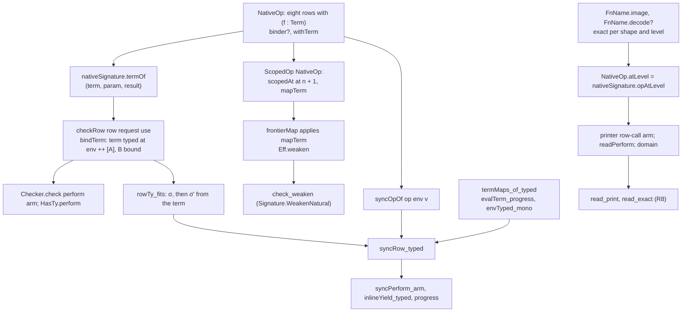
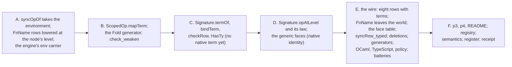

# 2026-10-04 seat T3b design: the read-modify-write rows carry binder terms

Status: research note (history, not authority). Base: `5949fe4b` (`refactor/phase1-phase3` after
seat T3a), branch `seat/t3b`, worktree `/Users/pooks/Dev/lean4-effect4-t3b`. Seat T4 merged during
phase 1. `seat/t3b` is fast-forwarded to `917d4b5d`, and every probe re-ran there (F17). Phase 1
of the seat T3b brief: slice T3b of the state plan
(`docs/research/2026-10-04-claude-lead/state-any-type-plan.md` §3), decisions rows 42, 43 and 210.
No tree file changed. The probes sit in `docs/research/2026-10-04-seat-T3b/`, each with its output
beside it.

**The one thing to know first.** Five findings change the plan's T3b, and each needs a ruling
before phase 2.

1. **The faces need the node's level.** An operation's term runs at `env ++ [current]`, so the
   current value is `var n` at a node of level `n` (the environment's length, `ScopedOp`'s
   convention). T2's lowering reads `var 0` at `env = []`. So the same name is a different term at
   every level, and no row can name its function by itself. The TypeScript printer and the
   readers already know the level. The proposal gives them one signature hook,
   `Signature.opAtLevel`, with one law (D4).
2. **T2's lowerings collide.** `incr` and `takeAndBump` lower to one term at every shape;
   `zeroWhenPositive` and `noChange` lower to one term at the two total shapes. A decoder cannot be
   a retraction on them. A canonical decoder moves the printed text of 14 corpus programs (tested).
   The proposal re-images the two later names (`add(a, 1)`, `add(a, 0)`). The five names are
   then an exact embedding at every shape and level, and no printed text moves (D5).
3. **`Eff.weaken` leaves operation data alone.** Weakening shifts the request and not an
   operation's term. So `check_weaken` fails, and `Forms.insert` makes the term read the wrong
   binder. The scope class gains the term map, and the generated frontier map
   applies it (D3).
4. **`FnName` leaves the program world.** No program carries it after T3b. EffGen refuses a
   program-world family the golden corpus does not reach, and the conservativity check refuses
   its manifest lines and coverage rows leaving. The proposal adds a named family retirement to the
   policy and to `scripts/lib/conservativity.py` (D6).
5. **`Row.fn` would change `Row`'s codec.** The plan puts the function's templates in `Row`. That
   moves the `row-populated` golden of `ocaml/eff/goldens/metadata.tsv` (an ordered table with no
   migration route) and every serialized row table. Host rows never take a function (row 43). The
   proposal puts the templates beside the term on the signature, `Signature.termOf` (D2).

The rest of the plan's T3b holds as written:
- the wire route (row 210) and the checker's term typing;
- the scope check at `n + 1` and the authoring lift;
- the store's point environment and the discharge of `TermMaps` from the term's typing;
- the deletions, the census witnesses and the acceptance programs.

Seat T4's merge (`917d4b5d`) moves no measurement of this note (F17). It reaches the eight rows:
their request match is complete relative to the guard, by `Ty.matchTemplate_complete_anchored`.
`Ref.modify`'s `B` lies in the limit that theorem already states, a parameter first met
covariantly. The coordinator's "main" is `refactor/phase1-phase3`. The local `main` ref is
`2daa76c4`, on another line, so the merge goes by commit id (F17).

## Question

Slice T3b gives the eight read-modify-write rows of `NativeOp` their binder terms (decisions row
43). The rows become templates over `refOf (var 0)`, and `Ref.modify` answers its own type `B`.
`FnName` leaves the operations and the store, and T2's connector goes. This note answers the
brief's phase 1:

- items 1–8 as found in the code, with the consumers of `FnName` and the eight constructors
  measured;
- every file that changes, the generated ones marked;
- the restated statements as Lean, the goals expected and the placement of each theorem;
- the decisions, with options and recommendations, and the merge plan.

## What was read or run

| Item | How |
| --- | --- |
| The state plan in full; T0's, T2's and T3a's receipts and design notes; decisions rows 42, 43, 120, 136, 155, 163, 183, 203–213; the monitor's audit (`state-binder-and-capture`, `state-step-preservation`) | read |
| `Program/Native.lean`, `Machine/Stores.lean`, `Machine/Term.lean`, `Program/ScopedOp.lean`, `Program/Typing/Rules.lean`, `Program/Checker.lean`, `Program/Typing.lean`, `Program/Compile.lean`, `Program/Formation.lean`, `Program/Eff.lean`, `Program/Fold.lean` (gen), `Program/Authoring/{Lifts,Rows}.lean` (gen) | read |
| `Laws/Program/Typed/{Residual,Denotation,Adequacy}.lean`, `Laws/Program/Progress.lean`, `Laws/Program/Typing/{HasTy,CheckInversion,Sound}.lean`, `Laws/Program/Template.lean`, `Laws/Program/Authoring{,/Tactic}.lean`, `Laws/Codegen/{Forms,ReadLeaf,ReadPrint,Read}.lean`, `Laws/Program/Handles/{Term,Compile,Alphabet}.lean` | read |
| The faces: `Codegen/{PrintLeaf,Print,Templates,Read,Forms,Styles}.lean`, `ts/eff/read.ts`, `ts/eff/profile.gen.ts`, `tools/Drivers/TsGen.lean`, `src/OCaml5/Eff/{Emit,Goldens}.lean`, `src/OCaml5/Tools/EffGen.lean`, `harness/truth/{prelude.ts,Truth.lean,corpus.json}` | read |
| The generators and gates: `tools/Effect4Gen/{Rows,Fold}.lean`, `manifest.json`, `wire-tags.json`, `tools/Tools/{WireTags,ProgramStructure}.lean`, `scripts/lib/conservativity.py`, the compatibility policy, `tools/Conform/Effect4/cases-policy.json`, `ocaml/engine/externs.txt`, `src/OCaml5/Lcnf/{Externs,Types}.lean`, `ocaml/engine/tools/api_engine_prelude.ml` | read |
| The p3 and p4 batteries, their rc.112 texts and `Test/Dogfood/README.md` | read |
| `Census.lean`: every declaration of the `Effect4` and `Test` roots that names a listed constant | tested |
| `sites.py`: every source line outside a comment that names a read-modify-write `NativeOp` row with its function, the `FnName` alphabet or the faces' name vocabulary | tested |
| `CorpusMoves.lean`: the corpus programs that perform a read-modify-write row, their verdicts, and the moves a canonical face would make | tested |
| `GoldenMoves.lean`: the golden and wire-corpus programs that perform such a row | tested |
| `Probes.lean`: T2's collisions, the injective face table, binding `B` from the raw type, the level of the current value; §5, added at `917d4b5d`: what seat T4's theorem reaches at the eight rows | tested (`#guard`s, exit 0) |
| `ProbesRed.lean`: §5's red control, two guards flipped by `sed` | tested (exit 1, exactly the two flipped guards fail) |
| Anonymous constructors on a structure with a defaulted field (a scratch file) | tested |
| Seat T4's merge: `git diff 5949fe4b 917d4b5d`, T4's `Template.lean` and receipt, the added lines searched for every census constant | read; tested (search) |

Replay each Lean probe from the worktree root under the shared lock:
`lake env lean -M8192 docs/research/2026-10-04-seat-T3b/<name>.lean`. `GoldenMoves.lean` needs
`lake build OCaml5.Eff.Goldens` first. Replay `sites.py` with
`python3 docs/research/2026-10-04-seat-T3b/sites.py`. Every probe ran at `5949fe4b`, and again at
`917d4b5d` with the same output (F17).

## Findings

### F1. The consumers of `FnName` and of the eight constructors (measurement)

`sites.py` counts the source lines, outside comments, that name one of three things:
- a read-modify-write `NativeOp` row with its function;
- the `FnName` alphabet;
- the faces' name vocabulary.

It finds 44 files, 144 declarations and 466 lines (tested). Eight more lines of
`src/Effect4/Laws/Machine/RefKernel.lean` are `case refUpdate =>` tags of `SyncOp`, which T3b does
not touch. The counts above exclude them.

| Area | Files | Declarations | Lines | The declarations |
| --- | --- | --- | --- | --- |
| core, `src/Effect4/` | 8 | 50 | 178 | `NativeOp`, `kind`, `row`, `syncOpOf`, `NativeOp.spelled`, `fnSpelling`, `fnNames` (`Program/Native.lean`); `FnName`, its four interpretations, four lowerings, four agreements, two census witnesses (`Machine/Stores.lean`); `FnNameC`, `NativeOpC` (`Store/Domain/Derived/Program.lean`, gen); the eight row wrappers (`Program/Authoring/Rows.lean`, gen); `lambdaShape`, `lambdaAtom` (`Codegen/Forms.lean`); `atom?` (`Codegen/Styles.lean`); `NativeOp.rowKey_mem` (`Program/Table.lean`); `pLoop` (`Store/Domain/ProgramWire.lean`) |
| laws, `src/Effect4/Laws/` | 6 | 27 | 87 | `syncRow_typed`, the four discharges, the four value facts (`Typed/Denotation.lean`); `NativeOp.fnKernel`, `kernel_term_agrees` (`Progress.lean`); the eight row lemmas (`Authoring/Rows.lean`, gen); `syncOpOf_isSome` (`Typed.lean`); `nativeLawful`, `NativeOp.row_hygiene`, `NativeOp.external_not_mem_spelled` (`Codegen/ReadLeaf.lean`); the four W7 operations (`Machine/Witnesses.lean`) |
| `src/OCaml5/` | 4 | 11 | 45 | `fnO`, `opO`, `fnNames`, `allOps` (`Eff/Emit.lean`); `fnV`, `opV`, `pOps` (`Eff/Goldens.lean`); `World.lean`; `EffGen.lean` |
| `tools/` | 6 | 11 | 34 | `allFnNames`, `allNativeOps`, `fnJs`, `lambdaJs`, `opJs` (`Drivers/TsGen.lean`); `Drivers/Styles.lean`; `guards/program.lean`, `guards/rows.lean`; `ProgramStructure.blocks`; the registry's R4 |
| `Test/` | 19 | 43 | 120 | `ProgressContract` 37 lines, `ProtocolPosts` 17, `Gen` 10, `StoresLawsContract` 9, `TypedContract` 8, `TypedCorpus` 8, `CompileContract` 7, `P4RateLimiter` 5, `FormsContract` 3, `TrivialPosts` 3, `LoopSugarContract` 3, `P3WorkerQueue` 2, `ReadContract` 2, and one line each in six more |
| `harness/` | 1 | 2 | 2 | `layerBump`, `layerCount` (`harness/truth/Truth.lean`) |

The environment census counts more, because a whole-type case split names every constructor in
its compiled matcher (tested, `Census.out`). `FnName` reaches 266 declarations in 55 modules, and
`NativeOp.refUpdate` 154 declarations in 58 modules. The hand edits are the source sites above and
the pattern sites the compiler lists.

Three functions whose signatures T3b changes reach further (tested, `Census.out`):

| Constant | Reach | Where |
| --- | --- | --- |
| `NativeOp.syncOpOf` | 56 declarations, 17 modules | `Program/Compile.lean`; `Laws/Program/{Agreement,Agreement.Machine,Denote,DenoteR,Folds.Denote,Guard.RaceSites,Handles.Compile,Handles.Term,Intro.Elementary,Intro.Equations,Intro.Identity,Invocation,MeaningSound,Progress,Typed,Typed.Denotation}` |
| `rowTy` | 72 declarations, 12 modules | `Typing/HasTy` (38), `Typed/Denotation` (8), `ExpandFix` (6), `Signature` (6), `Template` (3), `Typing/CheckInversion`, `CheckSound`, `Inversion`, `Typed/Residual`, `Progress`, `Typing/Rules`, `Test.Program.TypedProgRows` |
| `Eff.weaken` | 30 declarations, 5 modules | `Program/Fold` (13, gen), `Program/Typing` (10), `Codegen/Forms` (3), `Laws/Codegen/Forms` (2), `Laws/Program/Typing/Sound` (2) |

Outside Lean, `FnName` is named by the generated OCaml and TypeScript faces (`ocaml/eff/*`,
`ocaml/gen/api_gen.ml`, `ocaml/engine/api_engine.ml`, `ocaml/engine/e4_program_layout.*`,
`ts/eff/{eff,json,wire,profile,forms}.gen.ts`). The hand mirrors are
`ocaml/engine/e4_program.{ml,mli}`, `ocaml/engine/test/test_engine.ml`,
`ocaml/eff/test/prop_wire.ml`, `ts/eff/test/{tables,wire,read}.test.ts`,
`ts/eff/ingest/{oxc,ck}.ts` and `harness/truth/prelude.ts` (tested by `grep`). The frozen
baselines under `Test/fixtures/baseline/66ee4657*` name it too. T3b does not touch them.

### F2. The wire (item 1)

The eight rows are wire tags 5 to 12 of `Effect4.Program.NativeOp`
(`tools/Effect4Gen/wire-tags.json`), each with one `FnName` field. Row 210 refuses a re-typed
constructor: the eight retire at their tags, and eight appended constructors carry `(f : Term)` at
tags 24 to 31. `deferredMakeOf` holds 23.

T3a's route carries over. The policy names the eight retirements and the eight additions. C2 drops
the retired names from each manifest line before the prefix check, and C3 lets their coverage rows
leave. Removing the eight from the middle of the declaration moves the later constructors'
declaration positions. The tags do not move. `ocaml/engine/e4_program_layout.ml` re-cuts with the
LCNF group, as at T3a.

The Program derive group lists `NativeOp` before `FieldReadMode` and `Term`
(`tools/Effect4Gen/manifest.json`). A `NativeOp` with a `Term` field needs `TermC` first, so the
group's order changes. The generated file moves. No byte moves, since a codec keys on names and
tags (assumed: phase 2 runs C1).

### F3. The binder convention makes the term depend on the node's level

T0 fixed the convention in `ScopedOp` (`src/Effect4/Program/ScopedOp.lean`). A term an operation
carries runs at `env ++ [current]`, is checked at level `n + 1`, and reads the current value at
`var n`. Row 43 rules the same ("exactly as `iterate` does"). T2's lowerings read the current value at
`var 0`, which is right only at `env = []` (`FnName.updateTerm`, `Machine/Stores.lean`).

Measured (tested, `Probes.lean` §4): at the environment `[7, 1]` and the current value `4`,
`evalTerm ([7, 1] ++ [4]) FnName.incr.updateTerm` answers `8`, the first outer value plus one. The
image at level 2, `succ(var 2)`, answers `5`. Three consequences:

- `syncOpOf` must run the term at the point's environment, and the term a program carries must be
  its function's image at the node's level. A program built with T2's level-0 lowering at a deeper
  node reads an outer value.
- A row cannot name the term's function by itself. `NativeOp.row (refUpdateWith (succ(var 3)))` is
  `incr` at level 3, and "the outer value at index 3, plus one" at level 5. The faces have to see
  the level.
- The generic printer and readers do see it: `rowPrint` and `readRowCall` carry the environment's
  length `n` (`src/Effect4/Codegen/Templates.lean`, `src/Effect4/Codegen/Read.lean`). What they do
  not have is a way to ask the signature about an operation at a level. `spell` and `rowOf` are
  level-free, and the round-trip laws are stated over them (`LawfulSpelling`).

### F4. T2's lowerings collide at a shape

Tested (`Probes.lean` §1): the five names lower to 3 distinct terms at `A → A`, 4 at
`A → Option<A>`, 3 at `A → [B, A]` and 4 at `A → [B, Option<A>]`. `incr` and `takeAndBump` share
a term at every shape. `zeroWhenPositive` and `noChange` share the identity at the two total
shapes, since `FnName.total` answers a value unchanged for both.

So "a decoder exact on T2's lowering images" cannot be a retraction: `takeAndBump` decodes as
`incr`, or the reverse. A decoder that picks one name per term moves the printed text of every
program that used the other name. Measured over the corpus `make corpus` indexes (tested,
`CorpusMoves.out`):

| Decoder | Printed programs whose text moves |
| --- | --- |
| the first name in declaration order | 15 (`g18`, `g76`, `g108`, `g124`, `g126`, `g127`, `g191`, `g197`, `g198`, `g231`, `g239`, `g255`, `g259`, `g294`, `g379`) |
| each name's own shape first (`incr` for the update shapes, `takeAndBump` for the two `modify` shapes, `noChange` for the identity) | 14 |

Each move changes the program's `chars` column in `generated/corpus-index.tsv`. C3 refuses that
unless the policy names it.

The injective table of `Probes.lean` §2 keeps T2's term for one name of each colliding pair and
gives the other a new term. `takeAndBump` reads `add(a, 1)` where `incr` reads `succ(a)`, and
`zeroWhenPositive` reads `add(a, 0)` where `noChange` reads `a`. Tested at levels 0 to 5:

- the images are distinct at every shape;
- every name decodes back from its image (retraction);
- a term that is no name's image at that level decodes to nothing;
- each new image agrees with T2's lowering on the numbers 0 to 9;
- every image types at `nat` under the native signature.

With it, no printed text moves, and the faces' names are an exact embedding of five names into
terms at each shape and level (D5).

### F5. The checker types no operation data, and where the templates go (item 2)

`checkRow row request` matches the normal request against the normal request template, checks the
instantiated columns' formation, and instantiates the answer and error (`Typing/Rules.lean`). The
checker's `perform` arm calls it with no environment (`Program/Checker.lean`). `HasTy.perform`
states the same rule (`Laws/Program/Typing/HasTy.lean`).

To type a term at `env ++ [A]`, `checkRow` needs the term's typer at the node's environment. The
plan proposes `Row.fn : Option (Ty × Ty)` for the templates and `Signature.termOf` for the term.
`Row` is a canonical structure with a codec (`RowC`, `src/Effect4/Store/Domain/Derived/Program.lean`).
A thirteenth field changes:

- the `row-populated` golden of `ocaml/eff/goldens/metadata.tsv`, an ordered table that C3 keeps
  line for line, with no migration route (`scripts/lib/conservativity.py`);
- every serialized row table and row codec: the truth corpus's `hostRows`
  (`harness/truth/corpus.json`), `ts/eff/{eff,json,wire}.gen.ts` and the OCaml `eff` group.

Host rows never take a function: functions as values stay refused by the profile (row 43), and
`NativeOp.external` carries no term. So the templates are data of the native operation, as the term
is. The proposal puts both on the signature, `Signature.termOf : Op → Option BinderTerm`, with the
term and its two templates (D2). `Row` stays as it is.

Every native signature derives from `nativeSignature` with `{ … with … }` (`SigApp.signature`,
`nativeSignatureWith`, `ProgramSource.signature`), so each inherits the field. `docsSig`
(`Program/Provision.lean`) uses the positional constructor and gains the field. An anonymous
constructor takes every field, defaults included (tested).

### F6. Binding `B` from the term's type

`Ty.matchTemplate σ template request` infers from the raw request and guards on both sides
normalized (`Program/Ty.lean`). At `modify`, `σ` binds `A` from the request, and the result
template `prod (var 1) (var 0)` binds `B` from the term's type. Tested (`Probes.lean` §3): the
term `pair(x, a)` at `x : "a" | "b"` types at the raw product `prod ("a" | "b") nat`.

- Matched at the raw type, `B` binds to the union and the guard passes.
- Matched at the normal form `prod "a" nat | prod "b" nat`, `B` binds to `"a"` and the guard
  refuses.

So the match reads the term's raw type. The guard is the law either way (`matchTemplate_sound`),
so soundness does not depend on the choice.

Completeness relative to `Ty.matchTemplate`'s guard splits three ways (tested, `Probes.lean` §5):
- The request half is complete relative to the guard. `refOf (var 0)` is normal, admissible and
  anchored, so `Ty.matchTemplate_complete_anchored` (proved, seat T4) covers it. Its premise is a
  normal request with no `never` outside a handle's argument.
- The term half at `update` and `updateSome` is the guard. The result template mentions only
  `var 0`, which the request bound. So inference answers its seed (`Ty.infer_of_bound`, seat T4).
- The term half at `modify` and `modifySome` is not complete relative to the guard. `B` first
  occurs covariantly, the limit that `template-match-anchored`'s property line states. Take a term
  typed at a union of products, a variable for example. The match binds `B` at the first member,
  and the guard refuses, although a binding exists. That is T4's `covT` control in a term's form
  (D10).

### F7. `Eff.weaken` leaves an operation's data alone (item 3, new)

`Eff.weaken` is the frontier fold of `weakenAlg cut = frontierMap (Term.weaken cut)
(CauseTerm.weaken cut)` (generated, `Program/Fold.lean`). The map's `perform` arm is
`.perform a0 (g a1)`: the request is weakened, the operation is not. Today no operation carries a
variable, so nothing is lost.

With a term in the operation, weakening at a cut below the node shifts the request and leaves the
term's `var n` naming the inserted slot. Two laws depend on it:

- `check_weaken` (`Program/Typing.lean`, core) states that inserting an unused slot changes no
  success projection. Its `perform` arm would type the term at the wrong slot.
- `Forms.insert` (`Codegen/Forms.lean`) weakens a derived form's argument effect under a new
  binder. `effTy_insert` (`Laws/Codegen/Forms.lean`) transports its typing. A term operation in
  the argument would read the new binder instead of its own current value.

The generator emits the map from the constructor table (`tools/Effect4Gen/Fold.lean`, `mapOf`,
`weakenOf`). An argument of type `Op` maps to itself. The proposal gives `ScopedOp` the term map,
`mapTerm : (Term → Term) → Op → Op` with the identity as its default, and has the frontier map
apply it (D3). Weakening at cut `c` maps every slot by `Term.weaken c`, the term's slot included:
the current value at `n ≥ c` moves to `n + 1`, as it must.

### F8. Scope and authoring (item 3)

- **Scope.** The native instance answers `true` (`Program/Native.lean`). T3b's instance checks the
  term at `n + 1`. `NativeOp.scopedAt_eq_true` then holds only for an operation with no term.
- **The case-site policy.** `NativeOp` is a policy family with `unlisted: refuse`
  (`tools/Conform/Effect4/cases-policy.json`). Six functions list the eight retired names in their
  covers (`nativeRowOf`, `prepareExternalAnswer`, `Run.rowOf`, `asyncRoute`, `admit`,
  `compileEff`), and `instDecidableEqNativeOp.decEq` has a site list. Each re-pins. The new matches
  on `NativeOp` are the term view and its setter (P1).
- **Authoring.** The row generator emits each wrapper as `perform (.refUpdate f) request`, with
  `f : FnName` read off the constructor (`tools/Effect4Gen/Rows.lean`). Row 43 rules that a term
  row elaborates its term under the current value's binder, as `iterate`'s step does
  (`Program/Authoring/Lifts.lean`, `iterate`: `step (env.push [cursor, answer])`). The proposal adds
  one hand lift, `performTerm`, and the generator emits each term row as one application of it
  (P8).
- **`authoring_scoped`.** On the goal `ScopedOp.scopedAt op n = true`, the step reads the
  argument `true` and applies the unknown `Bool.true_scoped` (T0's finding 4;
  `Laws/Program/Authoring/Tactic.lean`). The fix closes an equation goal by `rfl`.

### F9. The store (item 4)

`syncOpOf op v` builds `SyncOp.refUpdate ⟨k⟩ f.updateTerm []` (`Program/Native.lean`). T3b's takes
the environment: `syncOpOf op env v` builds `SyncOp.refUpdate ⟨k⟩ f env`. Every caller holds the
point's environment (`p.env` in `Compile.lean` and `DenoteR.lean`, `env` in `Denote.lean`), across
the 17 modules of F1.

Handles: `SyncOp.keys` of a term row is the cell and the environment's keys (T2), and
`Point.env_keys_subset` (`Laws/Program/Handles/Alphabet.lean`) bounds a point's environment. So
`syncOpOf_keys` gains the environment's keys, and the compile proof reads the subset lemma.

The OCaml engine runs `refStep` as the shim `sh_ref_step`, which builds the term's environment with
`E.of_list (env @ [a])` (`ocaml/engine/tools/api_engine_prelude.ml`). In the functor body a point's
environment is the carrier `val_ E.t` (`field Effect4.Program.Point.env E.t`,
`ocaml/engine/externs.txt`), while `SyncOp`'s field is a `val_ list`. The generated `syncOpOf`
would pass the first where the second is due, an `ocamlopt` type error. The generator keys a
`field` row on the type and the argument's name, at every constructor
(`src/OCaml5/Lcnf/Types.lean`). So the row `field Effect4.Machine.SyncOp.env E.t` should reach the
eight `env` arguments (assumed: phase 2 tests it). The shim then runs
`eval_term (E.snoc env a) f`. The fallback is an `ops E.t to_list` row, which LcnfGen reports at
every use.

### F10. The typed state (item 5)

- `syncRow_typed` (`Typed/Denotation.lean`) passes each read-modify-write row the discharge of its
  name's lowering at a cell declared equivalent to `nat` (`updateTerm_maps` and three siblings).
  T3b passes the discharge from the term's typing. The checker typed the term at `tys ++ [A]`, the
  environment `tys` fits `q.env`, and `evalTerm_progress` runs a typed term over fitting values.
  `envTyped_mono` (`Typed/Residual.lean`) carries the environment to every later world, which
  `TermMaps` quantifies over. One lemma, `termMaps_of_typed`, does it (P6).
- `builtinPerform_inv` gives the request's value and the row's typing. T3b's also gives the node's
  type environment, which `hpt.at_node` already yields.
- `rowTy_fits` gains the term's extension of the bindings: the request fits at `σ`, the columns
  instantiate at `σ'`, and `σ'` widens `σ` (`Ty.matchTemplate_widens`, `Laws/Program/Template.lean`).
- Deleted, as T2 left them for T3:
  - `FnName.updateTerm` and its three siblings with their agreements;
  - `NativeOp.fnKernel` and `kernel_term_agrees`;
  - the four discharges, `modify_nat`, `modifySome_nat`, `fits_total`, `fits_partialUpdate`,
    `nat_of_equiv` and `fits_toOption`.
- Deleted for want of a consumer (tested, `Census.out`: 0 users each): `poke_world`
  (`Typed/Adequacy.lean`) and `Evaluating.store_restated` (`Typed/Commands/Clauses/Store.lean`),
  with the docstring that names the first.

### F11. The faces until T5 (item 6)

The program printer prints a row call as the row's spelling, its request and its trailing names
(`printRow`, `Codegen/PrintLeaf.lean`). `Ref.update(a0, incr)` carries `incr` as a trailing
name. The reader inverts the row table on (spelling, trailing names) through `spell`
(`readRowCall`, `Codegen/Read.lean`). The round-trip laws `read_print` and `read_exact` hold at
every signature with a `LawfulSpelling` (`Laws/Codegen/ReadPrint.lean`, `Laws/Codegen/Read.lean`);
they are R8's top nodes. `nativeLawful` instantiates them at the native signature
(`Laws/Codegen/ReadLeaf.lean`).

By F3 a term operation's printed name depends on the node's level, which neither `rowOf` nor
`spell` sees. Four ways to give the faces the level:

| Option | What changes | Risk |
| --- | --- | --- |
| (a) one hook, `Signature.opAtLevel from to : Op → Option Op`, with the law that it inverts itself | the printer's row-call arm, `readPerform`, the domain's row-call arm, `LawfulSpelling` gains one field, and the composite lemmas over the row call (`print_perform`, `rowPrint_inv`, `readRow_rowCall_print`, `readPerform_exact`, `read_printRow`) | one generic change of limited size; T5 replaces the native hook by the term's own printing |
| (b) a pass at the API: `Api.print`, `Api.read`, the module printers and readers and admission's reader normalize term operations to level 0 and back | no generic law changes | a face entry point that skips the pass reads a level-0 image at a deeper node, a wrong program, silently |
| (c) T5's seam now: term rows print the term as an argument of their own, read by a fourth row-call reading, the interim face printing the decoded name | the readers' three readings and their disjointness; a collision rule by spelling for supplied rows | the largest now; less work at T5 |
| (d) refuse every term operation in the faces until T5 | nothing generic | five truth programs and the 39 corpus programs with such a row stop printing (F15), against the brief |

Under (a) the faces' form of an operation is its term at level 0. The native hook decodes the term
at the source level into a name, and builds the name's image at the target level. It answers
`none` for a term that is no image. The printer prints the face form's row, whose trailing name
is decoded at level 0. A term that is no name's image at the node's level is refused by name,
`PrintRefusal.binderTerm "Ref.update"`, never printed. The readers build the face form from the
spelling and move it to the node's level. Every committed printed text stays, since every image
prints its own name (F4, D5).

The TypeScript reader mirrors it (`ts/eff/read.ts`). It looks an entry up in the profile, whose
operation is the level-0 image. Its `rowAnswer` moves the term to the node's level: it renames
`var 0`, the one variable a level-0 image has, to `var n`. `make check-ts-reader` compares it with
Lean's reader over the corpus.

### F12. `FnName` leaves the program world

After T3b no program carries a `FnName`. Three gates read the program world:

- EffGen throws when the golden corpus reaches no constructor of a program-world family
  (`src/OCaml5/Tools/EffGen.lean`, `the corpus reaches no`). Only `pOps` reaches `FnName` today
  (`ocaml/eff/goldens/coverage.txt`: `incr` 2, `double` 2, `zeroWhenPositive` 1, `noChange` 2,
  `takeAndBump` 1).
- C2 refuses a family line that leaves `ocaml/eff/eff_manifest.txt`,
  `ocaml/goldens/eff/manifest.txt` or `ocaml/goldens/eff/wire-tags.txt`.
- C3 refuses a coverage row whose count falls, unless the policy names the constructor retired.

`tools/Effect4Gen/wire-tags.json` may keep the family: `requireListed` checks that every
program-world family is listed, and `requireKnown`, the converse, has no caller
(`tools/Tools/WireTags.lean`, `src/OCaml5/Eff/World.lean`). So `FnName`'s tags can stay reserved
there.

The inductive stays declared as the faces' vocabulary until T5, under its name
`Effect4.Machine.FnName`. It moves out of `Machine/Stores.lean`, since no store code reads it.

### F13. The census witnesses (item 7)

Four census rows cite six witnesses in `Machine/Stores.lean` (`Test/Audit/RuntimeCoverage.lean`).
Five hold at any term since T2. One uses a lowering: `refStep_update_applies_once` (`incr`'s update
term). A seventh theorem with a census tag, `updateSomeAndGet_ne_getAndUpdateSome`, uses
`zeroWhenPositive`'s option term. The two move to the literal terms `succ(var 0)` and
`ite(lt(0, var 0), some(0), none())`, with their names and tags kept. The four W7 operations of
`Laws/Machine/Witnesses.lean` move the same way. `RuntimeCoverage.lean` needs no edit, and the join
moves no number.

### F14. The acceptance programs (item 8)

- **p4.** rc.112 decides each request in one `Ref.modify` over the `Window` record
  (`Test/Dogfood/rc112/p4-rate-limiter.ts`). The term is
  `ite(lt(w.used, 3), pair(true, {…w, used + 1, admitted + 1}), pair(false, {…w, rejected + 1}))`;
  `ite` evaluates both arms, which is harmless for pure arms. It should type at
  `prod bool Window`, so `B` is `bool` and `A` is `Window` (assumed: phase 2 builds it). The
  battery measures three number cells today and answers `[3, 2, 3]`. With a yield between read
  and write it answers `[5, 0, 5]` (`Test/Dogfood/P4RateLimiter.lean`). After T3b the measured
  program is rc.112's one atomic step. Its term is no name's image, so it does not print until T5.
- **p3.** The log append is `Ref.update(log, lines => append(lines, [line]))`. At `Ref<never[]>`
  the term's `list string` is not below `list never`, so the checker refuses it with the new
  reason `resultNotSubtype`. With the cell ascribed at `ReadonlyArray<string>` (T3a's measured
  record-field ascription), the append builds and runs. `Ref.update .incr closes` and
  `Ref.updateAndGet .incr count` become terms.

The monitor's controls land beside them (P11):
- an out-of-scope variable inside the operation, with a closed request;
- an outer capture;
- `B` different from `A`;
- `modify` as one store step.

### F15. Corpus, goldens and truth runs (measurement)

- **The corpus** (tested, `CorpusMoves.out`). 39 of the 400 generated programs and the wire
  corpus perform a read-modify-write row. All 39 print, and 1 is well typed. 12 are refused at
  such a row with `requestNotSubtype`. In each the request is a number, a boolean or `void`, not a
  cell, so the template `refOf (var 0)` refuses it too. No verdict move is predicted from typing.
  With the injective face (D5 (b)) no printed text moves either. With a canonical one, 14 or 15
  do (F4).
- **The goldens** (tested, `GoldenMoves.out`). `pOps` (the OCaml goldens) and the wire corpus's
  `pLoop` perform such a row. `ocaml/eff/goldens/pOps.{bin,json}` and
  `ocaml/goldens/eff/pLoop.hex` migrate. `pOps.ty` is predicted unchanged. The coverage table loses
  the eight retired rows and `FnName`'s five, and gains the eight new rows.
- **The truth runs.** Five truth programs print `Ref.update(a0, incr)` (`pLoop`, `pMergeAll`,
  `pDiamond`, `pProvideTwice`, `pProvideMerge`). `harness/truth/corpus.json` holds printed text,
  types, schedules and exits, and no program bytes. With the images printing their names, no line
  of it is predicted to move. `harness/truth/Truth.lean` rebuilds `layerBump` and `layerCount` with
  terms at their levels.

### F16. An operation's term is not a program annotation (open, new)

`Formation.programAnnotations` collects the record declarations inside every term argument of the
program view, for strict formation and DI-92's integer scan (`Program/Formation.lean`,
`Program/Admission.lean`). An operation argument contributes nothing (`argumentAnnotations`'s
catch-all). A binder term holding a record term therefore escapes the integer scan. Formation
does not escape, because the term typer checks a record's formation itself (`argTy`'s record arm,
`Typing/Rules.lean`). Row 212 already keeps an operation's type arguments out of the annotations
until T5. The proposal extends that row to binder terms and pins the gap (D9).

### F17. Seat T4's merge (`917d4b5d`)

Seat T4 merged at `cc7b9c30`, and the integration branch moved to `917d4b5d`. `git diff --stat
5949fe4b 917d4b5d` names seven files:
- `src/Effect4/Laws/Program/Template.lean`: the module docstring, the section "The match's
  completeness on anchored templates", 49 declarations after `NativeOp.row_wellScoped` (from
  `Ty.anchoredFrom_append` to `Ty.infer_recovers`), and `Ty.matchTemplate_complete_anchored`, now
  a theorem;
- `Test/Program/TypeAlgebraContract.lean`: a red control, `covT` and `covR`, a parameter first met
  covariantly;
- `Test/Counterexamples/REGISTER.md`, `docs/core/semantics.md`, `docs/core/decisions.md` (row 213),
  `generated/semantics.md` and T4's receipt.

No file under `src/Effect4/Program/` changed, so `Ty.infer`, `Ty.matchTemplate`, `checkRow` and
`NativeOp` are as this note read them (tested, an empty `git diff`).

The measurements hold at `917d4b5d` (tested). `seat/t3b` had no commit of its own and was
fast-forwarded to `917d4b5d`. Then:
- every probe re-ran with the same output: `sites.py`, `Census.lean`, `CorpusMoves.lean`,
  `GoldenMoves.lean`, and §1 to §4 of `Probes.lean`;
- the first `GoldenMoves.out` had captured a build line, and the stored output drops it;
- T4's added lines name no constant the census lists (tested, a search of the diff), and only
  their docstrings name a native row lemma.

T4's theorem gives T3b F6's three-way split (`Probes.lean` §5, with its red control
`ProbesRed.lean`). The request half of the eight rows is complete relative to the guard. The term
half of `update` and `updateSome` is the guard. `B` lies in the theorem's stated limit.

T3b edits `Template.lean` only above T4's region (P2a). It restates the row lemmas that read
`checkRow`, the native rows' profile and one section docstring. It does not touch T4's 49
declarations, the anchored theorem, the section on it or the module docstring.

The ref named `main`: the coordinator's "main" is `refactor/phase1-phase3`. The local `main` ref is
`2daa76c4`, one commit (`README: the program as data, the same program four ways`) past the merge
base `70b1571e`. The merge base lies 1330 commits behind `917d4b5d`, and `917d4b5d` does not
contain `2daa76c4` (tested, `git rev-list`, `git merge-base`). A `git merge main` would bring that
commit into the seat's branch, so every merge here names the commit id.

## Proposals: the restated statements

The diagram shows which declaration reads which after T3b. An arrow reads "is read by". It claims
no proof.



### P1. The operations (`src/Effect4/Program/Native.lean`)

```lean
inductive NativeOp
  | refMake | refGet | refSet | refGetAndSet | refSetAndGet
  -- tags 5 to 12 retired (`tools/Effect4Gen/wire-tags.json`): the eight rows that named a function
  | deferredIsDone | deferredPoll | deferredSucceed | deferredFail | deferredAwait
  | scopeMake (strategy : FinalizerStrategy)
  | sleep | clockNow
  | external (index : Nat)
  | deferredMakeOf (value error : Ty)
  /-- `Ref.update(self, f)` (`vendor/effect-4.0.0-rc.112/src/Ref.ts:1273-1276`): `f` is a binder
  term run at `env ++ [current]` (decisions row 43). Appended at tag 24; `refUpdate`, which named
  its function, retired at 5 (decisions row 210). -/
  | refUpdateWith (f : Term)             -- tag 24
  | refGetAndUpdateWith (f : Term)       -- 25
  | refUpdateAndGetWith (f : Term)       -- 26
  | refUpdateSomeWith (f : Term)         -- 27
  | refGetAndUpdateSomeWith (f : Term)   -- 28
  | refUpdateSomeAndGetWith (f : Term)   -- 29
  | refModifyWith (f : Term)             -- 30
  | refModifySomeWith (f : Term)         -- 31
deriving DecidableEq

/-- rc.112's four function types of the eight rows (`Ref.ts`): `A → A`, `A → Option<A>`,
`A → readonly [B, A]` and `A → readonly [B, Option<A>]`. -/
inductive FnShape | update | updateSome | modify | modifySome
deriving DecidableEq, Repr

/-- The parameter and the result of a shape, over the row's parameters `A = var 0`, `B = var 1`. -/
def FnShape.param (_ : FnShape) : Ty := .var 0
def FnShape.result : FnShape → Ty
  | .update => .var 0
  | .updateSome => .option (.var 0)
  | .modify => .prod (.var 1) (.var 0)
  | .modifySome => .prod (.var 1) (.option (.var 0))

/-- The binder term an operation carries, with its row's shape. One case site, listed in the
policy. -/
def NativeOp.binder? : NativeOp → Option (FnShape × Term)
  | .refUpdateWith f | .refGetAndUpdateWith f | .refUpdateAndGetWith f => some (.update, f)
  | .refUpdateSomeWith f | .refGetAndUpdateSomeWith f | .refUpdateSomeAndGetWith f =>
    some (.updateSome, f)
  | .refModifyWith f => some (.modify, f)
  | .refModifySomeWith f => some (.modifySome, f)
  | _ => none

/-- The operation with its binder term replaced; an operation with none is unchanged. The second
case site. -/
def NativeOp.withTerm : NativeOp → Term → NativeOp

instance : ScopedOp NativeOp where
  scopedAt op n := op.binder?.all fun b => b.2.scoped (n + 1)
  mapTerm g op := match op.binder? with
    | some (_, t) => op.withTerm (g t)
    | none => op
```

The rows (`NativeOp.row`): the eight requests are `refOf (var 0)`. The answers are `unit` at
`update` and `updateSome`, and `var 1` at `modify` and `modifySome`. The four rows that answer the
cell's value (`getAndUpdate`, `updateAndGet`, `getAndUpdateSome`, `updateSomeAndGet`) answer
`var 0`. Every error is `never`. A row's trailing name is the term's name at level 0 when the
term is a name's image there (P5). Otherwise the trailing names are `[]` and the type arguments
`[""]`, T3a's device: the head does not read back, and `spell_row` does not apply.

`syncOpOf` takes the environment:

```lean
def syncOpOf : NativeOp → List Val → Val → Option SyncOp
  | refMake, _, v => some (SyncOp.refMake v)
  -- … the arms without a term ignore the environment
  | refUpdateWith f, env, Val.cell ⟨k⟩ => some (SyncOp.refUpdate ⟨k⟩ f env)
  | refGetAndUpdateWith f, env, Val.cell ⟨k⟩ => some (SyncOp.refGetAndUpdate ⟨k⟩ f env)
  -- … the six others alike
  | _, _, _ => none
```

`NativeOp.spelled` keeps its 55 entries: each read-modify-write row at each name's image at level
0 (D5 (b)).

### P2. The typing (`src/Effect4/Program/Typing/Rules.lean`, `Checker.lean`)

```lean
/-- The binder term an operation carries, and its type over the row's parameters: the term runs
at `env ++ [current]` (decisions row 43), the current value at `param` and its answer at
`result`. -/
structure BinderTerm where
  term : Term
  param : Ty
  result : Ty
deriving DecidableEq, Repr

structure Signature (Op : Type) where
  -- … the six fields of today
  /-- The binder term an operation carries; `none` for an operation that carries none. -/
  termOf : Op → Option BinderTerm := fun _ => none
  /-- An operation's own data written for a node at level `from`, as data for a node at level
  `to`; `none` where the faces have no spelling for it (state plan T3b, until T5). -/
  opAtLevel : Nat → Nat → Op → Option Op := fun _ _ op => some op

/-- How one row use types its binder term: the templates, and the term's type at a parameter. -/
structure TermUse where
  param : Ty
  result : Ty
  typeAt : Ty → Option Ty

def Signature.termUse (sig : Signature Op) (env : TyEnv) (op : Op) : Option TermUse :=
  (sig.termOf op).map fun b => ⟨b.param, b.result, fun A => termTy sig (env ++ [A]) b.term⟩

inductive RowTypingRefusal where
  | requestNotSubtype
  | formation (why : FormationRefusal)
  /-- The binder term has no type at the instantiated parameter. (appended) -/
  | term (param : Ty)
  /-- The binder term's type is not below the instantiated result. (appended) -/
  | resultNotSubtype (result expected : Ty)

/-- The bindings a row use's binder term extends: the term typed at the instantiated parameter,
its raw type matched against the result template from the request's bindings. -/
def bindTerm (σ : Ty.Subst) : Option TermUse → Except RowTypingRefusal Ty.Subst
  | none => .ok σ
  | some use =>
    let param := (use.param.normalize.instantiate σ).normalize
    match use.typeAt param with
    | none => .error (.term param)
    | some r =>
      match Ty.matchTemplate σ use.result.normalize r with
      | some σ' => .ok σ'
      | none => .error (.resultNotSubtype r (use.result.normalize.instantiate σ).normalize)

def checkRow (row : Row) (request : Ty) (use : Option TermUse := none) :
    Except RowTypingRefusal EffTy :=
  match Ty.matchTemplate [] row.request.normalize request.normalize with
  | none => .error .requestNotSubtype
  | some σ =>
    match bindTerm σ use with
    | .error why => .error why
    | .ok σ' =>
      match Formation.check (Formation.instantiatedSites row σ') with
      | some why => .error (.formation why)
      | none => .ok ⟨(row.answer.instantiate σ').normalize,
          (row.error.instantiate σ').normalize, Requirement.ofList row.requires⟩

def rowTy (row : Row) (request : Ty) (use : Option TermUse := none) : Option EffTy :=
  (checkRow row request use).toOption
```

The checker's `perform` arm passes `sig.termUse env op`. On `.term param` it throws the term's own
refusal at `env ++ [param]` (`term?`), and on `.resultNotSubtype` the appended reason
`TypeReason.resultNotSubtype (row result expected : Ty)`. `HasTy.perform`'s third premise becomes
`rowTy (sig.rowOf op) requestTy (sig.termUse env op) = some t`. The inversions `inv_perform`
(`Typing/CheckInversion.lean`, `Typing/Inversion.lean`) restate it the same way.
`Codegen.codesOf` maps the new reason to no host code until T5 prints terms.

The native signature sets `termOf op := op.binder?.map fun (s, t) => ⟨t, s.param, s.result⟩` and
`opAtLevel := NativeOp.atLevel` (P5).

### P2a. The row lemmas in `Laws/Program/Template.lean`, above seat T4's region

Each of the eight rows is one structure literal. Its columns do not depend on the term, and only
its trailing names and type arguments read the term (P5). So `NativeOp.row_templateAdmissible`
keeps its statement, and its catch-all arm keeps `⟨rfl, rfl, rfl⟩` (assumed: phase 2 builds it).

`Row.wellScoped` fails at `refModifyWith` and `refModifySomeWith`. Their answer `var 1` is bound by
the term's result template, not by the request (tested, `Probes.lean` §5). Host rows carry no term
(row 43), so `rowChecks` keeps `Row.wellScoped`. The native rows' profile is restated:

```lean
/-- Every native row whose type arguments are closed is well scoped: every parameter of its
answer and error is one its request mentions or, at a term row, one its term's result template
mentions (`Ref.modify`'s `B`). -/
theorem NativeOp.row_wellScoped (op : NativeOp) (h : op.typeArgsClosed = true) :
    ((NativeOp.row op).answer.varsOf ++ (NativeOp.row op).error.varsOf).all (fun i =>
      (NativeOp.row op).request.varsOf.contains i ||
        op.binder?.any fun b => b.1.result.varsOf.contains i) = true
```

The lemmas behind the claim `instantiated-formation` take the term use, since a term row's columns
instantiate at the term's bindings `σ'`:

```lean
theorem rowTy_instantiated_formed {row : Row} {request : Ty} {use : Option TermUse} {ty : EffTy}
    (accepted : rowTy row request use = some ty) :
    ∃ σ σ', Ty.matchTemplate [] row.request.normalize request.normalize = some σ ∧
      bindTerm σ use = .ok σ' ∧ Formation.Formed (Formation.instantiatedSites row σ')

theorem checkRow_formation_iff (row : Row) (request : Ty) (use : Option TermUse)
    (why : FormationRefusal) :
    checkRow row request use = .error (.formation why) ↔
      ∃ σ σ', Ty.matchTemplate [] row.request.normalize request.normalize = some σ ∧
        bindTerm σ use = .ok σ' ∧ Formation.check (Formation.instantiatedSites row σ') = some why

theorem checkRow_request_iff (row : Row) (request : Ty) (use : Option TermUse) :
    checkRow row request use = .error .requestNotSubtype ↔
      Ty.matchTemplate [] row.request.normalize request.normalize = none
```

`rowTy_closed` and `rowTy_closed_some` keep their statements at `use = none`. Their proofs gain
`bindTerm`'s `none` arm. The section docstring "What a row's template may say" claims both shapes
for every native row. It gains the term rows' result templates.
`Test/Program/FormationContract.lean` prints these lemmas' axioms by name and needs no edit.

Every declaration above sits before the section "The match's completeness on anchored templates",
where T4's region starts. T3b leaves that section, T4's 49 declarations and the module docstring
as T4 wrote them.

### P3. Weakening carries the term (`src/Effect4/Program/ScopedOp.lean`, `Program/Fold.lean` gen)

```lean
class ScopedOp (Op : Type) where
  scopedAt : Op → Nat → Bool
  /-- The operation with its own binder term mapped by `g`; an operation that carries none is
  fixed. The frontier map applies it, so `Eff.weaken` weakens an operation's term with its
  request (state plan T3b). -/
  mapTerm : (Term → Term) → Op → Op := fun _ op => op

-- generated: the frontier map's `perform` arm, and `[ScopedOp Op]` on the frontier fold
  eff_perform a0 a1 := .perform (ScopedOp.mapTerm g a0) (g a1)

/-- A signature types an operation alike after its binder term is weakened: the same domain, the
same row columns, the weakened term. -/
def Signature.WeakenNatural [ScopedOp Op] (sig : Signature Op) : Prop :=
  ∀ cut op, sig.dom (ScopedOp.mapTerm (Term.weaken cut) op) = sig.dom op ∧
    (sig.rowOf (ScopedOp.mapTerm (Term.weaken cut) op)).columns = (sig.rowOf op).columns ∧
    sig.termOf (ScopedOp.mapTerm (Term.weaken cut) op) = (sig.termOf op).map (·.weaken cut)

theorem check_weaken [ScopedOp Op] (sig : Signature Op) (hw : sig.WeakenNatural)
    (pre post : TyEnv) (inserted : Ty) (p : List Nat) (program : Eff Op) :
    (check sig (pre ++ inserted :: post) p (Eff.weaken pre.length program)).toOption =
      (check sig (pre ++ post) p program).toOption
```

`Row.columns` is the request, the answer, the error and the requirements, the part `checkRow`
reads. `effTy_weaken`, `typeOf_weaken` (`Program/Typing.lean`) and `hasTy_weaken`
(`Laws/Program/Typing/Sound.lean`) gain the binder and the premise. `effTy_insert` and the form
typing laws (`Laws/Codegen/Forms.lean`) gain the premise. `nativeSignature_weakenNatural` proves it
by cases on the operation. The instance `ScopedOp Unit` (`⟨fun _ _ => true⟩`) takes `where`
syntax, since a positional constructor takes every field. The fixture's instance already does. The
fold guards weaken an `Eff Unit` program instead of an `Eff Nat` one.

### P4. The store and the engine (`Program/Native.lean`, `ocaml/engine/`)

`syncOpOf op env v` (P1). The 17 modules of F1 pass the point's environment they already hold.
`syncOpOf_keys` (`Laws/Program/Handles/Term.lean`) becomes
`o.keys ⊆ v.keys ++ env.flatMap Val.keys`, and the compile proof
(`Laws/Program/Handles/Compile.lean`) adds `Point.env_keys_subset`.

The engine (F9):

- `ocaml/engine/externs.txt`: `field Effect4.Machine.SyncOp.env E.t`, so the eight `env`
  arguments are the point environment's carrier;
- `ocaml/engine/tools/api_engine_prelude.ml`: `sh_ref_step` runs `eval_term (E.snoc env a) f`;
- `make gen-lcnf` regenerates `ocaml/gen/api_gen.ml`, `ocaml/engine/api_engine.ml` and their
  closures. `FnName` leaves both closures, and no `Ty` declaration enters one (predicted).

### P5. The faces (`src/Effect4/Program/FnName.lean` new, `Codegen/*`, `ts/eff/read.ts`)

```lean
-- `Effect4.Machine.FnName` keeps its name and leaves `Machine/Stores.lean`; no store code reads it.

/-- The term of a name at a shape, its current value at `var n`: T2's lowering at level `n`,
with `takeAndBump` at `add(a, 1)` and `zeroWhenPositive` at `add(a, 0)` where T2's lowering
repeats a term (D5 (b)). -/
def FnName.image : FnShape → Nat → FnName → Term

def FnName.decode? (s : FnShape) (n : Nat) (t : Term) : Option FnName :=
  fnNames.find? fun g => FnName.image s n g == t

/-- Retraction: a name reads back from its image. -/
theorem FnName.decode?_image (s : FnShape) (n : Nat) (g : FnName) :
    FnName.decode? s n (FnName.image s n g) = some g
/-- Exactness: what reads as a name is that name's image. -/
theorem FnName.image_of_decode? {s : FnShape} {n : Nat} {t : Term} {g : FnName}
    (h : FnName.decode? s n t = some g) : FnName.image s n g = t

/-- An operation's binder term moved from level `src` to level `dst` through its name; `none` for
a term that is no name's image at `src`. The native signature's `opAtLevel`. -/
def NativeOp.atLevel (src dst : Nat) (op : NativeOp) : Option NativeOp :=
  match op.binder? with
  | none => some op
  | some (s, t) => (FnName.decode? s src t).map fun g => op.withTerm (FnName.image s dst g)

theorem NativeOp.atLevel_symm {a b : Nat} {op op' : NativeOp} (h : op.atLevel a b = some op') :
    op'.atLevel b a = some op
```

The generic faces (`Codegen/Templates.lean`, `Print.lean`, `Read.lean`):

```lean
-- the row-call arm of the printer's layer function
| [.op op, .term request] =>
  match sig.opAtLevel n 0 op with
  | some face => printRow (sig.rowOf face) request
  | none => .error (.binderTerm (sig.rowOf op).spelling)   -- `PrintRefusal.binderTerm`, appended

theorem print_perform (sig : Signature Op) (n : Nat) (op : Op) (request : Term) :
    print sig n (.perform op request) =
      match sig.opAtLevel n 0 op with
      | some face => printRow (sig.rowOf face) request
      | none => .error (.binderTerm (sig.rowOf op).spelling) := rfl

/-- What the readers read at level `n`: the spelled operation is the faces' form at level 0. -/
def atNodeLevel (sig : Signature Op) (n : Nat) : Eff Op → Except ReadRefusal (Eff Op)
  | .perform op r => match sig.opAtLevel 0 n op with
    | some op' => .ok (.perform op' r)
    | none => .error (.shape "operation data")
  | e => .ok e
-- `readPerform` is today's body followed by `.bind (atNodeLevel sig n)`

-- `LawfulSpelling` gains one field
  opAtLevel_symm : ∀ a b op op', sig.opAtLevel a b op = some op' → sig.opAtLevel b a op' = some op
```

The domain's row-call arm (`rowDom`, `Laws/Codegen/ReadPrint.lean`) reads `sig.opAtLevel n 0 op`.
On `some face` it checks `sig.dom face`, `requestReadable (sig.rowOf face) n request` and the
request's class coverage. On `none` it answers `none`. `read_print` and `read_exact` keep their
statements, and their row-call steps read `opAtLevel_symm`. Every signature built with the default
hook meets the new field by `Option.some.inj`. `nativeLawful` meets it by `NativeOp.atLevel_symm`.

`NativeOp.rowKey_mem` (`Program/Table.lean`, no consumer) is restated for operations whose head
reads back. The TypeScript reader's `rowAnswer` renames `var 0` to `var n` in an entry's term.

### P6. The typed state (`Laws/Program/Typed/Denotation.lean`)

```lean
/-- **A typed binder term maps its parameter into its type**, at every later world: typed by the
checker at `tys ++ [A]` with type `R`, over an environment that fits `tys`, it runs at
`env ++ [a]`, for every member `a` of `A`, to a member of `R`. -/
theorem termMaps_of_typed {sig : Signature NativeOp} (hatom : sig.atomOf = nativeAtomTy)
    {w : World} {tys : TyEnv} {env : List Val} (henv : EnvTyped w tys env)
    {f : Term} {A R : Ty} (hty : termTy sig (tys ++ [A]) f = some R) :
    TermMaps w f env A R

theorem TermMaps.widen {w : World} {f : Term} {env : List Val} {A A' R R' : Ty}
    (hA : Ty.subN A' A = true) (hR : Ty.subN R R' = true) (h : TermMaps w f env A R) :
    TermMaps w f env A' R'

theorem rowTy_fits {row : Row} {reqTy : Ty} {use : Option TermUse} {t : EffTy}
    (h : rowTy row reqTy use = some t) {w : World} {v : Val} (hv : Fits w v reqTy) :
    ∃ σ σ', Fits w v (row.request.normalize.instantiate σ) ∧ bindTerm σ use = .ok σ' ∧
      Ty.Widens σ σ' ∧
      t = ⟨(row.answer.instantiate σ').normalize, (row.error.instantiate σ').normalize,
        Env.Requirement.ofList row.requires⟩ ∧
      Formation.Formed (Formation.instantiatedSites row σ')

theorem builtinPerform_inv {op : NativeOp} {r : Term} {q : Point} {t : EffTy}
    (hk : NativeOp.kind op ≠ .program)
    (hat : Node.at_ (.eff root.program) q.path = some (.eff (.perform op r)))
    (hpt : PointTyped root w q t) :
    ∃ tys v reqTy, EnvTyped w tys q.env ∧ evalTerm q.env r = some v ∧ Fits w v reqTy ∧
      rowTy (NativeOp.row op).normalizeTypes reqTy (root.signature.termUse tys op) = some t

@[semantics "residual-program-typing" (requirement := R4)]
theorem syncRow_typed (root : ProgramSource) {w : World} {req : Env.Requirement}
    (op : NativeOp) (hk : NativeOp.kind op = .sync) {tys : TyEnv} {env : List Val}
    (henv : EnvTyped w tys env) {reqTy : Ty} {t : EffTy}
    (hrow : rowTy (NativeOp.row op).normalizeTypes reqTy (root.signature.termUse tys op) = some t)
    (v : Val) (hfit : Fits w v reqTy) :
    ∃ o, NativeOp.syncOpOf op env v = some o ∧
      TypedProg root w ⟨t.answer, t.error, req⟩ (.vis (.inl o) fun ans => .pure (.success ans))
```

A term arm of `syncRow_typed` goes this way:

1. `fits_refOf_inv` gives the cell `k`, declared at `ty` with `ty` equivalent to `A`.
2. `rowTy_fits` gives the term's type `R` at `tys ++ [A]` and the guard `R ≤ result(σ')`.
3. `termMaps_of_typed`, widened by the equivalence and the guard, gives `storePre`'s
   `TermMaps w f env ty R'`: `R'` is `ty`, `Option<ty>`, `[B, ty]` or `[B, Option<ty>]`.
4. The post reads the answer as today. At `modify` the certificate is `B`, the instance's answer
   column, so `B` may differ from `A`.

`syncPerform_arm`, `inlineYield_typed` and `progress` pass the type environment through.
`progress` keeps its statement (`Laws/Program/Progress.lean`): it already takes `tys`, `env` and
`EnvTyped w tys env`. `NativeOp.syncOpOf_cellImplements` takes the environment, and its twelve heap
arms still read `kernel_cellImplements`.

### P7. The deletions

| Declaration | File | Why it goes |
| --- | --- | --- |
| `FnName.total`, `partialUpdate`, `modify`, `modifySome` | `Machine/Stores.lean` | no store row runs a name |
| `FnName.updateTerm`, `updateSomeTerm`, `modifyTerm`, `modifySomeTerm` and their four `*_agrees` | `Machine/Stores.lean` | the store runs the operation's own term; the faces' images replace them (P5) |
| `NativeOp.fnKernel`, `kernel_term_agrees` | `Laws/Program/Progress.lean` | T2's connector: no operation names a function |
| `updateTerm_maps` and its three siblings; `modify_nat`, `modifySome_nat`, `fits_total`, `fits_partialUpdate`, `nat_of_equiv`, `fits_toOption` | `Laws/Program/Typed/Denotation.lean` | the discharge from typing replaces them (P6) |
| `poke_world` | `Laws/Program/Typed/Adequacy.lean` | no consumer (T2's departure 9) |
| `Evaluating.store_restated`, and the docstring that names `poke_world` | `Laws/Program/Typed/Commands/Clauses/Store.lean` | no consumer |
| `FnNameC` (gen) | `Store/Domain/Derived/Program.lean` | `FnName` leaves the program world (D6) |
| the eight `FnName`-taking row wrappers and lemmas (gen) | `Program/Authoring/Rows.lean`, `Laws/Program/Authoring/Rows.lean` | regenerated as term rows (P8) |

### P8. Authoring (item 3)

```lean
-- `Program/Authoring.lean`, beside the operation lift: one hand lift for a term row
/-- A row whose operation carries a binder term: the term elaborates under the current value's
binder `current`, as `iterate`'s step does (decisions row 43, `ScopedOp`'s convention), and the
request at the node's level. -/
def performTerm {Op : Type} (mk : Term → Op) (current : String) (f request : TermSrc) : Src Op :=
  fun env p => do
    let x0 ← f (env.push [current]) p
    let x1 ← request env p
    .ok (.perform (mk x0) x1)

-- `Laws/Program/Authoring.lean`
theorem performTerm_scoped {Op : Type} [ScopedOp Op] {mk : Term → Op}
    (hmk : ∀ t n, ScopedOp.scopedAt (mk t) n = t.scoped (n + 1)) (current : String)
    {f request : TermSrc} (hf : f.Scoped) (hr : request.Scoped) :
    (performTerm mk current f request).Scoped

-- generated (group Rows), for each of the eight rows
def update (current : String) (f request : TermSrc) : Src NativeOp :=
  performTerm .refUpdateWith current f request
-- generated (group RowsLaws)
theorem update_scoped (current : String) {f request : TermSrc} (h0 : f.Scoped)
    (h1 : request.Scoped) : (update current f request).Scoped :=
  performTerm_scoped (fun _ _ => rfl) current h0 h1
```

The generator (`tools/Effect4Gen/Rows.lean`) reads a constructor parameter of type `Term` as a
binder term, and emits these two forms. Every other row keeps today's `perform` form. The term-free
rows' lemmas pass `NativeOp.scopedAt_eq_true _ rfl _`, restated with the premise
`op.binder? = none`. `authoring_scoped` closes an equation goal by `rfl`, the step T0 found
missing. Test sources write terms, as `Ref.update "c" (app "succ" [var "c"]) r`.

### P9. The census witnesses (item 7)

`refStep_update_applies_once` steps `SyncOp.refUpdate cell (.app "succ" (.cons (.var 0) .nil)) []`,
and `updateSomeAndGet_ne_getAndUpdateSome` steps the literal
`ite(lt(0, var 0), some(0), none())`. Names, tags and `RuntimeCoverage.lean` stay. The W7 operations
of `Laws/Machine/Witnesses.lean` take literal terms too.

### P10. The wire, the policy and the conservativity check

- `tools/Effect4Gen/wire-tags.json`: tags 5 to 12 of `NativeOp` move to `retired`, and the eight
  `…With` constructors take 24 to 31. `Effect4.Machine.FnName`'s entry stays as it is, its tags
  reserved.
- `tools/Tools/ProgramStructure.lean` and the Program group (`tools/Effect4Gen/manifest.json`) drop
  `FnName`, and the group lists `FieldReadMode` and `Term` before `NativeOp`.
- `Test/fixtures/baseline/66ee4657-supplement-v1.policy.json` names the eight retirements, the
  eight additions, the vector migrations `eff/goldens/pOps.bin`, `eff/goldens/pOps.json` and
  `goldens/eff/pLoop.hex`, and the family retirement of `Effect4.Machine.FnName` (a new key,
  `family_retirements`). No verdict move is predicted.
- `scripts/lib/conservativity.py` (D6 (a)): C2 lets a manifest line leave when the policy retires
  its family, and C3 lets that family's coverage rows leave. Two controls join
  `Test/fixtures/conservativity/mutations.json`. A family line that leaves unnamed is refused, and the
  same line named passes.
- `src/OCaml5/Tools/EffGen.lean`, `src/OCaml5/Eff/{Emit,World,Goldens}.lean`:
  - the `fn_name` class and the `fnNames` check go;
  - `opO` and `opV` write the term;
  - `pOps` performs each row at its name's image at the node's level.

### P11. The batteries and the red controls

| File | Change |
| --- | --- |
| `Test/Program/ScopedOpContract.lean` | at the native alphabet: a term row with `var (n + 1)` inside and a closed request is refused by the scope fold, and by the checker as a term; an outer capture is admitted; the current value is admitted (the monitor's first two controls) |
| `Test/Program/TypedContract.lean` | `syncOpOf` with the environment; the checker types each of the eight rows at a term; a term of the wrong result type is refused with `resultNotSubtype`; a term with no type is refused as a term; `B`'s limit (D10): a `Ref.modify` whose term is a variable typed at a union of products is refused with `resultNotSubtype`, while the instance at the union binding exists, T4's `covT` in a term's form |
| `Test/Program/ProtocolPosts.lean` | the `Modify` section over literal terms; `B` different from `A`: `pair(lit "s", a)` on a `Ref<number>` answers a string and stores a number, typed by the checker and run (the monitor's third control) |
| `Test/Program/ProgressContract.lean` | the two sequences at terms of their levels; `kernel_term_agrees`'s ascription goes; the non-number frontier controls over literal terms |
| `Test/Machine/Runtime/StoresLawsContract.lean` | the guards over literal terms; the atomicity probe stays (the monitor's fourth control) |
| `Test/Program/WeakenContract.lean` | a term row weakened keeps its typing (`check_weaken`); the red side: the frontier map without `mapTerm` changes it (register row `E4-CHECK-CE-019`) |
| `Test/Codegen/ReadContract.lean`, `PrintContract.lean` | each image prints its name and reads back at levels 0 to 3; a capture and a term that is no image are refused by name (`binderTerm`); `nativeLawful`'s new field |
| `Test/Program/Gen.lean` | `genOp` takes the level and draws the same name, so the corpus programs print as today |
| `Test/Dogfood/P4RateLimiter.lean`, `P3WorkerQueue.lean`, `README.md` | P12 |
| the 19 `Test` files of F1, `Test/Counterexamples/Machine/Semantics/TrivialPosts.lean` | terms in place of names |
| `Test/fixtures/proof-style/baseline.tsv` | `make record-proof-style` |

No battery file is new, so `Test/All.lean` needs no edit.

### P12. The acceptance programs (item 8)

- **p4.** The measured program becomes rc.112's: one `Window` cell, and each request one
  `Ref.modify` whose term decides and rewrites the record. It answers `[3, 2, 3]` (predicted). The
  race control keeps the three-cell program with a yield between read and write, which answers
  `[5, 0, 5]`. The atomic program with a yield before its `Ref.modify` still answers `[3, 2, 3]`.
  The stage moves: admitted and answered as rc.112 answers, not printed until T5 (refused by name
  as `binderTerm`), so not read back (D8).
- **p3.** The log builds at an ascribed `Ref<ReadonlyArray<string>>` and appends with a term. The
  refused part stays at `Ref<never[]>`, now refused at the term (`resultNotSubtype`). The workers'
  counters take terms, and the pool's stage does not move.
- `Test/Dogfood/README.md`'s p3 and p4 rows follow the measurement.

### P13. The semantics registry and the documents

- `tools/Tools/SemanticsRegistry.lean`, R4: the first two open parts close. `FnName` retires, the
  eight rows are templates with binder terms, and `modify` answers `B`. The faces' part stays for
  T5, and F16's annotations join it. `kernel_term_agrees` leaves R4's nodes. A new claim,
  `term-typed-maps`, is proposed (D12). The claim `instantiated-formation` keeps its pointer,
  whose statement now covers a term use (P2a).
- `docs/core/semantics.md` §2.1: the property line of `term-typed-maps`. §2.6: the property line
  of `template-match-anchored` already excludes a parameter first met covariantly. One clause
  names `Ref.modify`'s `B` as such a parameter (F6, D10). §2.7: one sentence that weakening maps
  an operation's term, beside `operation-data-scoped`.
- `generated/semantics.md` (gen): `make gen-semantics`.
- `Test/contracts/program-denotation.contract.md`: items 8 and 33 and the denotation's `perform`
  line take the environment.
- `Test/Counterexamples/REGISTER.md`: `E4-CHECK-CE-019` (weakening left an operation's term);
  `E4-TYPED-CE-013`'s `Modify` evidence restated over literal terms.

## The goals expected

None. Each restated theorem has a proof route above, and the probes find no failing case. If a
proof does not follow in phase 2, it lands as a planned goal placed per row 207:

| Theorem, if it does not close | Placement | What it would leave modulo |
| --- | --- | --- |
| `syncRow_typed`'s eight term arms | `@[semantics "residual-program-typing" (requirement := R4)]` | `denote-typed`, `straight-meaning-typed` and `progress` |
| the row-call step of the round trip at a face (`readRow_rowCall_print`, `readPerform_exact`) | `@[semantics "translation-simulation" (requirement := R8)]` | `read_print`, `read_exact` |

`check_weaken` sits in the core (`Program/Typing.lean`), where row 203 admits no goal, so it must
be proved in the slice.

## The placement of each theorem

Each row gives the concept and property (`docs/core/semantics.md`) and the question: a semantics
registry claim, or the claim it is a step of. It then gives the consumer, the reach, what it does
not establish and what it unlocks.

| Theorem (file) | Concept, property | Claim, requirement | Consumer | Reach | Does not establish | Unlocks |
| --- | --- | --- | --- | --- | --- | --- |
| `termMaps_of_typed` (new, `Typed/Denotation.lean`) | `store-typing`: the term relation's fundamental property for the term typer | new `term-typed-maps` (D12), R4 | `syncRow_typed` | every world later than the environment's, native atoms, any environment typed at the world | anything about a term the checker refuses; host rows | R4's term rows at M5–M7 |
| `TermMaps.widen` (new, `Typed/Residual.lean`) | `store-typing` | step of `term-typed-maps`'s use in `syncRow_typed` | `syncRow_typed` | every world and pair of subtyped columns | — | the cell's declared type in place of the instance |
| `rowTy_fits` (restated) | `residual-program-typing`: inversion of the row rule, with the term's bindings | step of `denote-typed` (M5), R4 | `syncRow_typed`, `deferredAwait_arm`, `sleep_arm`, `inlineYield_typed` | every row, request type, term use and world | a row's post | one decomposition for every row, term rows included |
| `builtinPerform_inv` (restated) | `residual-program-typing`: inversion | step of `denote-typed` | the three arms above, `inlineYield_typed` | built-in rows | the row's post | the environment's typing at the node |
| `rowTy_instantiated_formed`, `checkRow_formation_iff`, `checkRow_request_iff` (restated, `Template.lean`, P2a) | `residual-program-typing`: instantiated formation, at the term's bindings | the claim `instantiated-formation` (pointer kept) | `rowTy_fits`, for the bindings and the formation | every row, request and term use | the term's evaluation; a row's post | the formation of `B`'s instance |
| `syncRow_typed` (restated) | `residual-program-typing`, serving `store-typing` | steps of `denote-typed`, `straight-meaning-typed`; R4 | `syncPerform_arm`, `inlineYield_typed`, `progress` | native `sync` rows at every instance and term the checker admits, every world | host rows (R6); concurrency, since one store step is atomic in the model only | M5–M7 with binder terms at any type |
| `check_weaken`, `effTy_weaken`, `typeOf_weaken` (restated, core) and `hasTy_weaken` | `initial-algebras-folds`: weakening is the frontier fold, now over operation data too | no claim; a law of the checker | `effTy_insert` and the form typing laws (`Laws/Codegen/Forms.lean`); `hasTy_weaken_closed` | every signature natural in the term (`WeakenNatural`) | substitution; a frontier map that is not uniform in depth | derived forms over term rows |
| `nativeSignature_weakenNatural` (new) | `initial-algebras-folds` | step of `check_weaken` at the native signature | `effTy_insert` at native signatures | every native operation and cut | — | — |
| `FnName.decode?_image`, `FnName.image_of_decode?` (new, `Program/FnName.lean`) | `exact-codecs`: an exact embedding of five names into terms, per shape and level | steps of `read_print`, `read_exact` (R8) | `NativeOp.atLevel_symm`, `NativeOp.row`'s trailing name | five names, four shapes, every level | any term outside the images, refused by name | the faces of term rows until T5 |
| `NativeOp.atLevel_symm` (new) | `exact-codecs` | step of `read_print`, `read_exact` | `nativeLawful` | every native operation and pair of levels | lambdas (T5) | the native signature's `LawfulSpelling` |
| `read_print`, `read_exact` (statements kept) | `translation-simulation` | R8's top nodes | R8 | every lawful signature, now with `opAtLevel_symm` | the TypeScript face against rc.112, a finite check | — |
| `HasTy.perform`, `inv_perform` (both), `effTy_eq_hasTy` (restated) | `subtyping-algebra`: the row rule with the term's binding | no claim; the checker against its rules | `builtinPerform_inv`, `progress`, the meaning proofs | every signature and term use | completeness where `B` first occurs covariantly (F6) | — |
| `performTerm_scoped` (new), `NativeOp.scopedAt_eq_true` (restated) | `initial-algebras-folds` | the authoring half of `operation-data-scoped` | the eight generated row lemmas | every alphabet whose instance checks the term at `n + 1` | term typing; scope is not typing | authoring of term rows |
| `syncOpOf_keys`, `syncOpOf_isSome`, `NativeOp.syncOpOf_cellImplements` (restated) | `reactive-scheduling`; `residual-program-typing` (contract item 8); `store-typing` | the handle invariant; item 8; `progress` | the compile proof; the contract packet; `progress` | every native operation and environment | that a term row steps on a cell holding no member of its type | — |
| the two census witnesses (restated) | `reactive-scheduling` | rows `ref.update`, `ref.update-some-and-get-reread` | `Test/Audit/RuntimeCoverage.lean` | the literal terms | rc.112 beyond the transcribed lines | — |
| `NativeOp.row_wellScoped` (restated with the term's result template), `row_templateAdmissible` (statement kept), `rowKey_mem` (restated for heads that read back) | `subtyping-algebra`; `exact-codecs` | the native table's profile | none in `src`, `tools` or `Test` (tested, `grep`); `Template.lean`'s docstrings | operations with closed type arguments; heads that read back | completeness; host rows, which carry no term | — |

## Files that change

Generated files are marked (gen). Their producer runs, never a hand edit.

| File | Change |
| --- | --- |
| `src/Effect4/Program/Native.lean` | P1: the operations, `FnShape`, `binder?`, `withTerm`, the instance, the rows, `syncOpOf`, `spelled`, `nativeSignature`'s two fields |
| `src/Effect4/Program/FnName.lean` (new core module) | P5: `FnName` moved here under its name, the images, the decoder, `fnSpelling`, `fnNames`, `NativeOp.atLevel` |
| `src/Effect4/Program/ScopedOp.lean` | P3: `mapTerm`; the `Unit` instance in `where` syntax |
| `src/Effect4/Program/Typing/Rules.lean`, `Typing/Blame.lean`, `Checker.lean`, `Typing.lean` | P2, P3: `BinderTerm`, the two signature fields, `TermUse`, `bindTerm`, `checkRow`, the reason, the `perform` arm, `check_weaken` |
| `src/Effect4/Program/Provision.lean` | `docsSig` takes the two fields |
| `src/Effect4/Program/Compile.lean` | `syncOpOf op p.env val` |
| `src/Effect4/Program/Authoring.lean` | P8: `performTerm` |
| `src/Effect4/Program/Table.lean` | `NativeOp.rowKey_mem` restated |
| `src/Effect4/Machine/Stores.lean` | P7, P9: `FnName` and its lowerings leave; the two witnesses; docstrings |
| `src/Effect4/Codegen/PrintLeaf.lean`, `Templates.lean`, `Print.lean`, `Read.lean`, `Diagnostics.lean` | P5: `binderTerm`, the row-call arm, `print_perform`, `atNodeLevel`, the new `LawfulSpelling` field; `codesOf` |
| `src/Effect4/Codegen/Forms.lean`, `Styles.lean` | the import of `FnName`'s new home |
| `src/Effect4/Store/Domain/ProgramWire.lean` | `pLoop` at its term |
| (gen) `src/Effect4/Program/Fold.lean`, `Program/Authoring/Rows.lean`, `Laws/Program/Authoring/Rows.lean`, `Store/Domain/Derived/Program.lean`, `Api/RefusalsDerived.lean` | the Fold, Rows, RowsLaws, Program and Refusals groups |
| `src/Effect4/Laws/Program/Typed/Denotation.lean`, `Typed/Residual.lean`, `Typed/Adequacy.lean`, `Typed/Commands/Clauses/Store.lean`, `Typed.lean`, `Progress.lean` | P6, P7 |
| `src/Effect4/Laws/Program/{Denote,DenoteR,MeaningSound,Agreement,Agreement/Machine,Folds/Denote,Guard/RaceSites,Invocation,Intro/Elementary,Intro/Equations,Intro/Identity}.lean`, `Handles/{Term,Compile}.lean` | the environment argument of `syncOpOf` |
| `src/Effect4/Laws/Program/Typing/{HasTy,CheckInversion,CheckSound,Inversion,Sound}.lean`, `ExpandFix.lean`, `Signature.lean` | the row rule with the term use; `hasTy_weaken` |
| `src/Effect4/Laws/Program/Template.lean` | P2a, above seat T4's region: `rowTy_closed`, `rowTy_closed_some`, `rowTy_instantiated_formed`, `checkRow_formation_iff`, `checkRow_request_iff`, the docstring "What a row's template may say", `NativeOp.row_templateAdmissible`'s proof and `NativeOp.row_wellScoped` |
| `src/Effect4/Laws/Program/Authoring.lean`, `Authoring/Tactic.lean` | `performTerm_scoped`; the equation step |
| `src/Effect4/Laws/Codegen/{ReadLeaf,ReadPrint,Read,PrintReadable,Forms}.lean` | P5's laws; `nativeLawful`; `effTy_insert`'s premise |
| `src/Effect4/Laws/Machine/Witnesses.lean` | P9 |
| `src/OCaml5/Eff/{Emit,Goldens,World}.lean`, `src/OCaml5/Tools/EffGen.lean` | P10 |
| `tools/Effect4Gen/{Rows,Fold}.lean`, `manifest.json`, `wire-tags.json`, `guards/{rows,rowslaws,program,fold,scopedlaws}.lean` | P3, P8, P10 |
| `tools/Tools/ProgramStructure.lean`, `tools/Drivers/{TsGen,Styles}.lean`, `tools/Tools/SemanticsRegistry.lean` | P10, P13; `opJs` writes the term |
| `tools/Conform/Effect4/cases-policy.json` | the covers re-pinned; `binder?` and `withTerm` listed |
| `scripts/lib/conservativity.py`, `Test/fixtures/conservativity/mutations.json`, the compatibility policy | P10 (D6) |
| `ocaml/engine/externs.txt`, `ocaml/engine/tools/api_engine_prelude.ml`, `ocaml/engine/e4_program.{ml,mli}`, `ocaml/engine/test/test_engine.ml`, `ocaml/eff/test/prop_wire.ml` | P4; the hand mirrors |
| (gen) `ocaml/eff/*` (types, wire, json, native, layout, manifest, program structure, goldens), `ocaml/goldens/eff/*`, `ocaml/engine/e4_program_layout.*`, `ocaml/gen/api_gen.ml`, `ocaml/engine/api_engine.ml`, `ocaml/gen/closure-api_*.tsv` | the eff, wire and lcnf groups |
| `ts/eff/read.ts`, `ts/eff/test/{read,tables,wire}.test.ts` | the level rename; the expectations |
| (gen) `ts/eff/{eff,json,wire,profile,forms}.gen.ts`, `ts/eff/ingest/README.md` | the ts and readme groups |
| `harness/truth/Truth.lean`; (gen) `harness/truth/corpus.json` | `layerBump`, `layerCount`; predicted unchanged |
| the `Test` files of P11; `Test/Dogfood/*` | P11, P12 |
| (gen) `generated/corpus-index.tsv`, `generated/row-types.tsv`, `generated/semantics.md` | predicted unchanged; the template rows' columns; the report |
| `docs/core/semantics.md`, `Test/contracts/program-denotation.contract.md`, `Test/Counterexamples/REGISTER.md` | P13 |
| this note, `docs/research/2026-10-04-seat-T3b/`, the receipt | force-added |

Not touched:
- `docs/core/decisions.md`, `lakefile.toml`, the root imports and `Test/Audit/AxiomGate.lean`;
- `Test/Audit/RuntimeCoverage.lean` and the frozen baselines;
- seat T4's part of `Laws/Program/Template.lean`: the module docstring, the section "The match's
  completeness on anchored templates", its 49 declarations and `Ty.matchTemplate_complete_anchored`.

## Decisions for the coordinator

| Id | Question | Options | Recommendation |
| --- | --- | --- | --- |
| D1 | The appended constructors' names | (a) `refUpdateWith` … `refModifySomeWith`; (b) T3a's suffix, `refUpdateOf` …; (c) `refUpdateTerm` … | (a): "update with `f`" reads as rc.112's call does; T3a's `Of` mirrors a type former (`Ty.deferredOf`), not a function argument. Each row's `name` follows its constructor, since the row generator reads one off the other |
| D2 | Where the function's templates live (F5) | (a) beside the term: `Signature.termOf : Op → Option BinderTerm`, with `Row` unchanged; (b) the plan's `Row.fn` and `Signature.termOf` | (a). (b) moves the `row-populated` golden of an ordered table with no migration route and every serialized row table, for a field no host row may fill (row 43) |
| D3 | Weakening an operation's data (F7) | (a) `ScopedOp.mapTerm`, applied by the generated frontier map, and `Signature.WeakenNatural` as `check_weaken`'s premise; (b) a second class for renaming; (c) `check_weaken` restricted to programs with no term operation | (a): one class holds the binder structure of an operation's data, scope and renaming. (c) leaves `Forms.insert` wrong on term rows |
| D4 | How the faces see the level (F3, F11) | (a) one hook `Signature.opAtLevel` and one law; (b) a level pass at each native API entry point; (c) T5's term-argument seam now; (d) refuse term rows in the faces until T5 | (a): the generic laws gain one field and the row-call step reads it; (b) fails silently at a missed entry point; (c) is T5's design; (d) moves five truth programs and 39 corpus rows |
| D5 | The faces' names (F4) | (a) T2's images, a canonical name per term, the reader refusing the other names: 14 corpus rows' printed text moves, named by policy; (b) T2's images with the two later colliding names re-imaged (`takeAndBump` at `add(a, 1)`, `zeroWhenPositive` at `add(a, 0)`): an exact embedding, no printed text moves | (b). It meets the brief's "every committed verdict stays" and AGENTS.md's exact embedding. On numbers the new images agree with T2's (tested, 0 to 9); they exist only until T5 |
| D6 | `FnName` leaving the program world (F12) | (a) a named family retirement: `family_retirements` in the policy, C2 and C3 honour it, two controls; `wire-tags.json` keeps the family's tags; (b) keep `FnName` in the world, name its five constructors retired while they stay active, and let EffGen skip it | (a): honest about what left. (b) contradicts the policy's own meaning of a retirement and keeps dead codecs in three languages |
| D7 | `FnName`'s home and name | (a) a new core module `Program/FnName.lean`, name `Effect4.Machine.FnName` kept; (b) the same module, renamed `Effect4.Program.FnName`; (c) left in `Machine/Stores.lean` | (a): no store code reads it, and the name keeps the reserved wire entry and the tests' `.incr` spellings |
| D8 | p4's measured program (F14) | (a) rc.112's shape, one `Window` cell and one atomic `Ref.modify`; the three-cell program stays as the race control; the stage loses `printed` and `readBack` until T5; (b) keep the three-cell measured program and add the atomic one as a section | (a): the battery measures the program rc.112 runs |
| D9 | A binder term's record declarations and the integer scan (F16) | (a) now: `ScopedOp` exposes the term and the annotation collector reads it; (b) at T5, with row 212's type arguments, the gap pinned in `Test/Program/FormationContract.lean` | (b): formation is already checked by the term typer, and T5 makes operation data an annotation; (a) adds a class binder to the formation and integer statements |
| D10 | `B`'s binding and its completeness relative to the guard (F6) | (a) the term's raw type; no goal; a red control at a union of products in `TypedContract`; the limit named as an instance of the one stated in `template-match-anchored`'s property line; (b) as (a) with a planned goal for completeness at a product-typed term; (c) the term's normal form | (a): a goal here has no consumer yet. Since T4's theorem the request half and the term half of `update` and `updateSome` are complete relative to the guard (F6). Only `B` is outside, and the tree already states that limit. (c) refuses `B` at a union that (a) binds (tested) |
| D11 | Files outside the brief's list | `Program/FnName.lean` (new), `ScopedOp.lean`, `Typing/Blame.lean`, `Typing.lean`, `Provision.lean`, `Compile.lean`, `Authoring.lean`, `Table.lean`, the Codegen modules, the 17 `syncOpOf` modules, the typing laws, `Template.lean` (above seat T4's region), the conservativity script and its fixtures, the OCaml and TypeScript hand mirrors, the contract packet and the register | approve each, or strike it |
| D12 | A registry claim for the term discharge | (a) new `term-typed-maps` (`store-typing`, role fundamental property, pointer `termMaps_of_typed`), with a property line in §2.1; (b) no claim, the lemma placed as a step of `denote-typed` | (a): it is the term relation's fundamental property, the function-type case `term-maps-mono` prepared |
| D13 | The commit order (see the merge plan) | (a) five green slices; (b) one commit | (a) |

## Proposed decisions rows (for the receipt, since the register is the coordinator's)

- The eight read-modify-write constructors retire at tags 5 to 12, and `refUpdateWith (f : Term)` …
  `refModifySomeWith` take 24 to 31 (D1, row 210's route).
- An operation's binder term and its parameter and result templates live on the signature
  (`Signature.termOf`), not in `Row` (D2).
- An operation's term is weakened with the program (`ScopedOp.mapTerm`), and `check_weaken` holds
  at every signature natural in the term (D3).
- Until T5 the faces print a term row only when its term is a name's image at the node's level
  (`Signature.opAtLevel`). They refuse any other term by name, `binderTerm` (D4).
- The five names are an exact embedding into terms at each shape and level (D5). Where T2's
  lowering repeated a term, `takeAndBump` reads `add(a, 1)` and `zeroWhenPositive` `add(a, 0)`.
- `FnName` leaves the program world under a named family retirement, and its wire tags stay reserved
  (D6).
- `B` binds from the term's raw type. Completeness relative to `Ty.matchTemplate`'s guard, where
  `B` first occurs covariantly, is not claimed. It is the limit `Ty.matchTemplate_complete_anchored`
  already states (D10).
- Row 212 extends to binder terms: an operation's own data becomes a program annotation at T5 (D9).

## Merge plan

The base is `917d4b5d`. `seat/t3b` was fast-forwarded there in phase 1, by commit id (F17), and
phase 2 starts from it. Seat T4 has merged. T3b edits `Laws/Program/Template.lean` only above T4's
region (P2a), and touches none of T4's declarations or texts. If the integration branch moves
again before phase 2, `seat/t3b` merges that commit by its id first.

The slices, each green under a narrow build before the next:



Slices A to D change no behaviour: each keeps `FnName` in the operations, with the native hooks at
their defaults or identities. Slice A already runs a name's lowering at the node's level over the
point's environment, which F3 requires anyway. Slice E is the cutover. It regenerates in
`docs/GENERATED.md`'s order: the derived groups, then the lcnf, eff, wire, ts and readme groups,
then `make corpus`, the truth corpus and `make gen-semantics`.

At the merge:

- regenerate the lcnf group on the merged tree, and never merge two generated `api_engine.ml` by hand;
- merge the policy file's lists by union;
- run `make check-cases`, since T3b adds two case sites on `NativeOp` and re-pins six covers;
- run `make gen-semantics` once and commit the report, as after every seat that touches the
  registry.

## What this does not establish

- Phase 2 owes every proof. The probes are finite checks (`#guard`s) on named inputs, and none is a
  theorem.
- The predictions of no verdict move, no printed-text move and an unchanged truth corpus come from
  the measurements of F15 and F4. Phase 2 checks each by regeneration.
- That the `field` extern row reaches a constructor's argument is assumed from the generator's
  source (F9). Phase 2 tests it.
- Concurrency: one store step is atomic in the model, so `modify` admits no interleaving there.
  That says nothing about rc.112's scheduler. p4's race control is a finite run.
- Completeness of `B`'s binding where it first occurs covariantly (F6).
  `Ty.matchTemplate_complete_anchored` covers the request half only at a normal request with no
  `never` outside a handle's argument.
- The faces of a term that is no name's image, and lambdas: T5's. So is the finding that
  `harness/truth/prelude.ts`'s header records: a printed `Ref.modify(ref, takeAndBump)` calls the
  total shape on rc.112. The `REPORT.md` it cites is not in the tree. No truth program prints a
  `modify` row: all 27 read-modify-write calls in `harness/truth/corpus.json` are
  `Ref.update(a0, incr)`, in the five programs of F15 (tested, `grep`).
- An operation's binder term as a program annotation, and the integer scan over it (F16): T5's,
  under row 212.
- Host rows at templates and functions as values stay outside, as the state plan's §4 says.
