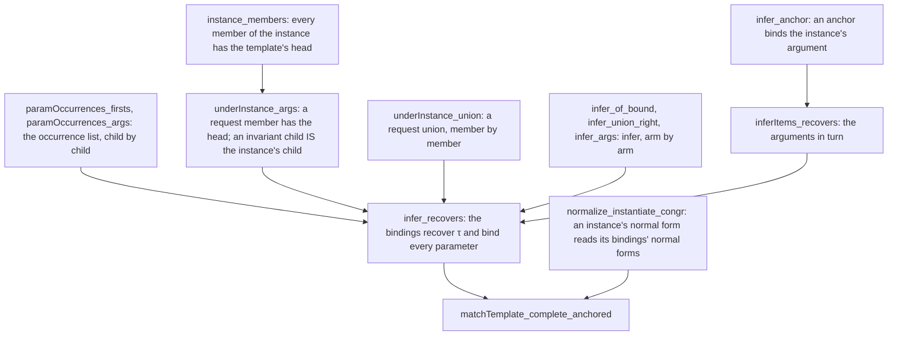

# 2026-10-04 seat T4 receipt: the row match on anchored templates, proved

Status: receipt (history, not authority). Branch `seat/t4`, worktree
`/Users/pooks/Dev/lean4-effect4-t4`, base `5949fe4b`. Brief: the coordinator's seat T4 brief
(decisions rows 203 and 213).

**The one thing to know before merging:** the planned goal `Ty.matchTemplate_complete_anchored`
(`src/Effect4/Laws/Program/Template.lean`) is a theorem now, proved as stated, at
`[propext, Quot.sound]`. `Ty.infer`, `Ty.matchTemplate` and the statement are unchanged, and the
proof's 49 new declarations all land in `Template.lean`.

## Base and head

| Item | Commit |
| --- | --- |
| Base | `5949fe4b` |
| The proof, in place of the goal | `ebf69996` |
| `make gen-semantics` | `efe0778d` (the gated head) |
| This receipt (force-added) | the commit after `efe0778d`; it adds this file only |

Nothing is pushed. `docs/core/decisions.md` and `lakefile.toml` are untouched.

## Changed files

`git diff --numstat 5949fe4b..efe0778d`: two files, 1083 insertions and 25 deletions.

| File | Lines | What changed |
| --- | --- | --- |
| `src/Effect4/Laws/Program/Template.lean` | +1075 −20 | The goal is a theorem, with `@[semantics "subtyping-algebra" (requirement := R4)]` kept. Before it: 45 new theorems and 4 new definitions. The module and section docstrings no longer call it a planned goal. |
| `generated/semantics.md` | +8 −5 | `template-match-anchored` moves from wanted to proved. R4 lists no next goal and stays open. |
| `docs/research/2026-10-04-seat-T4-receipt.md` | new | This receipt. |

## The proof

The brief expected an induction on the template. `Ty.infer`'s union arm recurses on the request
with the template fixed, so the walk is an induction on the request's size (`Ty.infer_recovers`).
The diagram shows which lemma each step reads.



1. **The invariant.** `Ty.Recovers τ σ` holds when every binding of `σ` is the normal form of
   `τ`'s binding of that parameter. The empty bindings recover every `τ` (`Ty.recovers_nil`).
2. **The request.** `Ty.UnderInstance τ t r` holds the theorem's request: normal, `bottomFree`,
   below the normal form of `t`'s instance at `τ`. Below an invariant handle the walk meets a
   second kind of request: its members are members of the instance's normal form.
3. **The descent** (`Ty.underInstance_args`). Take a head that is not a parameter, a union or a
   nominal reference. A request member under its instance has that head. A covariant child stays
   under its child's instance. An invariant child is below and above its child's instance, both
   normal, so `sub_antisymm_normal` makes it that instance in normal form.
4. **The anchor** (`Ty.infer_anchor`). At a parameter met as an invariant handle's argument, the
   request is exactly the parameter's instance in normal form. `infer` binds it there, or keeps an
   earlier binding, which the invariant makes the same type.
5. **The walk** (`Ty.infer_recovers`, `Ty.inferItems_recovers`). A template whose parameters are
   all bound binds nothing (`Ty.infer_of_bound`). Otherwise `anchored` makes the template a head
   the walk descends through. A request union is read member by member (`Ty.infer_union_right`). A
   request member is read argument by argument (`Ty.infer_args`), each argument's occurrence
   block in turn (`Ty.paramOccurrences_args`). An unseen parameter's first block is an anchor, by
   `anchoredFrom`.
6. **The premise `bottomFree`.** It excludes the one request shape that skips an anchor: a `never`
   where the template descends. Below an invariant handle the request is made of the instance's
   own members, and these are not `never` where the template has a head (`Ty.instance_members`).
7. **The guard.** The walk binds every parameter of the template to the normal form of `τ`'s
   binding. An instance's normal form reads only its bindings' normal forms
   (`Ty.normalize_instantiate_congr`). So the match's instance has the normal form of `τ`'s, and
   the guard is the premise `hτ`.

The proof establishes more than the statement exposes: the match's bindings recover `τ` at every
parameter of the template. No declaration reads that stronger form yet.

## Commands and results

Every Lean command ran through `/Users/pooks/Dev/lean4-effect4/scratch/lean-slot.sh`, which bounds
`LEAN_NUM_THREADS` at 2.

| Command | Result |
| --- | --- |
| `lake build` (once, at the base) | `Build completed successfully (903 jobs).` |
| `lake build Effect4.Laws.Program.Template` | `✔ [272/272] Built Effect4.Laws.Program.Template (9.7s)` |
| `lake build Effect4.Laws.Program.Template Effect4.Laws.Program.Typed Effect4.Laws.Program.Progress Effect4.Laws.Program.Signature` | `Build completed successfully (423 jobs).` |
| `lake build Effect4.Laws` | `Build completed successfully (631 jobs).` |
| `make build` (the full build, with `Test.All`'s gates) | `Build completed successfully (903 jobs).`, exit 0 |
| `lake env lean -DwarningAsError=true Test/All.lean` | exit 0; the three gate lines below |
| `make check-proof-style` | exit 0: `proof style: 1917 recorded uses and 60 recorded unread commands in 1178 entries` |
| `lake env lean` on a probe of `#print axioms` for the 50 changed declarations | exit 0; below |
| `lake env lean -DwarningAsError=true` on the controls (§Evidence) | exit 0 |
| `make gen-semantics` | exit 0; the diff of `generated/semantics.md` is committed in `efe0778d` |

The gate lines of `Test/All.lean`:

```
Effect4 library-root gate: 162 API/utility modules, 275 Laws-only modules; every library source is reachable; Effect4 never reaches Laws
Effect4 module and axiom gate: checked 664 modules and 81464 declarations; phases (ms): sources and closure 10, library roots 169, declarations 1948, resolution 506, axioms 13221, exemptions 244; semantic/test axioms are [propext, Quot.sound]; exact implementation boundary (17 module(s), 23 declaration(s)) additionally allows Classical.choice
Effect4 goal gate: 13 planned goal(s), each a theorem whose body is `sorry` outside the Effect4 root; 7 declaration(s) rest on goals; no other declaration reaches sorryAx
```

The goal count moved from 14 (seat T3a's receipt) to 13. The 13 are the `proof_goal`
declarations of `Test/Audit` (`grep -rnE "^proof_goal |\] proof_goal " Test`: 13 lines; under
`src` the pattern finds one docstring line and no declaration). Seven declarations rest on goals,
as at the base, so none rested on this goal.

## Axiom output

`#print axioms` of the 50 changed declarations, in `Effect4.Program.Ty`: 27 print
`[propext, Quot.sound]`, 18 print `[propext]` and 5 print no axiom. None reaches
`Classical.choice` or `sorryAx`.

```
[propext, Quot.sound]  matchTemplate_complete_anchored infer_recovers inferItems_recovers
  infer_anchor Recovers recovers_nil infer_args inferFields_eq_items infer_union_right
  infer_bound_mono infer_of_bound underInstance_args underInstance_union underInstance_self
  UnderInstance templateAdmissible_args args_co_or_inv bottomFree_args sub_of_mem_factors
  normal_union_inv normalize_instantiate_congr instance_members args_zip_of_map
  paramOccurrences_firsts lookup_of_mem_nodup flatMap_congr anchoredFrom_unflagged
[propext]  anchoredFrom_append mem_zip_map_self mem_zip_middle eq_of_mem_zip_map
  varsOfFields_eq_flatMap varsOfItems_eq_flatMap varsOf_of_lookup paramOccurrences_record
  paramOccurrences_tuple paramOccurrences_app paramOccurrences_firsts_ofMembers anchorsArgs
  paramOccurrences_args anchorsArgs_inv members_of_mem_factors bottomFree_record bottomFree_tuple
  bottomFree_app
no axiom  var_or_ne anchorOcc_firsts childOcc childOcc_of_ne_var canon_map_payload
```

## Evidence

| Claim | Evidence |
| --- | --- |
| `Ty.matchTemplate_complete_anchored` holds for every template, request and bindings its premises admit | proved (`src/Effect4/Laws/Program/Template.lean`), resting on no goal (the goal gate above) |
| The 49 new declarations | proved, each at `[propext, Quot.sound]` or a subset |
| The premise `anchored` is needed: at `[A, Ref<A>]` and `[number, Ref<number \| string>]` every other premise holds and the match refuses | tested, finite: the first control below |
| The premise `bottomFree` is needed: at `neverR` the match refuses | tested, finite: `neverR` (`Test/Program/TypeAlgebraContract.lean`), repeated below |
| The theorem applies at `Ref.set`'s template and a union-typed value, every premise decided by the kernel | tested, finite: the last control below |

The controls ran in the seat's scratchpad and are not tracked. The source, whole:

```lean
import Effect4.Laws.Program.Template
open Effect4.Program
namespace T4Controls

def covT : Ty := .prod (.var 0) (.refOf (.var 0))   -- `[A, Ref<A>]`: not anchored
def ns : Ty := (Ty.union .nat .string).normalize
def covR : Ty := .prod .nat (.refOf ns)              -- `[number, Ref<number | string>]`
#guard covT.normalize == covT && covT.templateAdmissible && !covT.anchored
#guard covR.normalize == covR && covR.bottomFree
#guard Ty.sub covR.normalize (covT.instantiate [(0, ns)]).normalize
#guard Ty.matchTemplate [] covT covR = none

def setT : Ty := .prod (.refOf (.var 0)) (.var 0)
def neverR : Ty := .union (.prod .never (.lit "a")) (.prod (.refOf .string) (.lit "b"))
#guard setT.anchored && !neverR.bottomFree
#guard Ty.sub neverR.normalize (setT.instantiate [(0, .string)]).normalize
#guard Ty.matchTemplate [] setT neverR.normalize = none

def setR : Ty := (Ty.prod (.refOf .string) (.union (.lit "a") (.lit "b"))).normalize
example : ∃ σ, Ty.matchTemplate [] setT setR = some σ :=
  Ty.matchTemplate_complete_anchored (τ := [(0, .string)])
    (.prod (.refOf (.var 0)) (.var 0) rfl rfl) (by decide +kernel) (by decide +kernel)
    (Ty.normal_normalize _) (by decide +kernel) (by decide +kernel)
#guard Ty.matchTemplate [] setT setR = some [(0, .string)]

end T4Controls
```

No evidence here is host-only. The controls are finite probes and establish nothing beyond their
inputs.

## Landed theorems and their placement

The theorem:

- Concept: `subtyping-algebra` (`docs/core/semantics.md`); property: the row match's completeness
  on anchored templates, the half the guard's soundness (`Ty.matchTemplate_sound`) leaves open.
- Question: registry claim `template-match-anchored` (role decidability), whose pointer is this
  theorem; consumer: the claim and R4's row of `generated/semantics.md`.
- Reach: the judgment is the checker's row match `Ty.matchTemplate [] t r` (seed `[]`, no join).
  The observation is that the match answers `some`. The fragment is a normal, admissible, anchored
  template and a normal, `bottomFree` request below some instance, both sides normalized. Rows 42,
  55, 203 and 213 bound it, with the register line `E4-CHECK-CE-018`.
- Does not establish:
  - a match where a parameter first occurs covariantly, under a union template or under a nominal
    reference;
  - a match for a request with `never` outside an invariant handle's argument (`neverR`);
  - anything about the atoms' joining rule (`join := true`);
  - that `rowTy` accepts, since formation runs after the match (`checkRow_formation_iff`);
  - any typing of a program, a run or a host reply.
- Unlocks: R4, the rows as templates. The corollary concerns a row whose normalized request
  template is admissible and anchored. Its request's normal form is `bottomFree` and below some
  instance. With `checkRow_request_iff`, `checkRow` does not refuse that request with
  `requestNotSubtype` (reading: no theorem states this corollary).

The 49 new declarations are steps of the claim `template-match-anchored`, and each docstring
names the one that reads it. None is a claim of its own in the semantics registry.

| Declarations | Step | Read by |
| --- | --- | --- |
| `Recovers`, `recovers_nil`, `infer_anchor`, `inferItems_recovers`, `infer_recovers` | the walk and its invariant | the theorem |
| `normalize_instantiate_congr` | an instance's normal form reads only its bindings' normal forms | the theorem |
| `UnderInstance`, `underInstance_self`, `underInstance_union`, `underInstance_args` | the request under the instance, and its head | `infer_recovers` |
| `instance_members`, `args_zip_of_map`, `canon_map_payload` | what the instance's normal form is made of | `underInstance_args`, `infer_recovers` |
| `normal_union_inv`, `sub_of_mem_factors`, `members_of_mem_factors`, `bottomFree_args`, `bottomFree_record`, `bottomFree_tuple`, `bottomFree_app`, `args_co_or_inv`, `templateAdmissible_args` | the request's and the template's children | `underInstance_args`, `underInstance_union`, `infer_recovers` |
| `infer_of_bound`, `infer_bound_mono`, `infer_union_right`, `infer_args`, `inferFields_eq_items` | `infer`, read arm by arm at the checker's rule | the walk |
| `paramOccurrences_firsts`, `paramOccurrences_firsts_ofMembers`, `paramOccurrences_record`, `paramOccurrences_tuple`, `paramOccurrences_app`, `anchorOcc_firsts`, `paramOccurrences_args`, `anchorsArgs`, `childOcc`, `anchorsArgs_inv`, `childOcc_of_ne_var` | the occurrence list names the parameters, child by child | the walk |
| `anchoredFrom_append`, `anchoredFrom_unflagged`, `varsOfFields_eq_flatMap`, `varsOfItems_eq_flatMap`, `varsOf_of_lookup` | `anchoredFrom` and `varsOf`, read in parts | the walk, `infer_of_bound`, `normalize_instantiate_congr` |
| `flatMap_congr`, `mem_zip_map_self`, `mem_zip_middle`, `eq_of_mem_zip_map`, `lookup_of_mem_nodup`, `var_or_ne` | list facts | the steps above |

Three of them are shapes the coordinator may want to know by name:

- `Ty.anchorsArgs` is a new one-level classifier on `Ty` in the law graph. It lists its positive
  arms (`refOf`, `deferredOf`) and closes with `| _ => false`, as row 56 asks. The case-site
  policy's marker depends on the `Effect4` root's trace only, so `make check-cases` does not read
  this module (reading, `Makefile`). It was not run.
- The list facts live in the `Ty` namespace. They could move to a shared list module if a second
  consumer appears.
- `Ty.infer_args` takes its case list from `sameHead` (`fun_cases`), and `Ty.infer_of_bound` from
  `infer` (`infer.induct_unfolding`). Their identical arms share one proof each through the
  multi-tag `case` form.

## Open obligations

- Four tracked texts outside this brief still describe the theorem as a planned goal or the goal
  as open. Each is the coordinator's to change:
  - `docs/core/semantics.md`, the `template-match-anchored` item: "It is a planned goal
    (`Ty.matchTemplate_complete_anchored`, …), tested on a finite pool". Proposed text: "It is
    proved (`Ty.matchTemplate_complete_anchored`, `src/Effect4/Laws/Program/Template.lean`)."
  - `docs/core/decisions.md`, row 213's status: "the goal is open". Proposed: the row below.
  - `Test/Program/TypeAlgebraContract.lean`, the docstring above `setT`: "the planned goal
    `Ty.matchTemplate_complete_anchored`". Proposed: "the theorem".
  - `Test/Counterexamples/REGISTER.md`, `E4-CHECK-CE-018`'s repair column: "is the planned goal
    `Ty.matchTemplate_complete_anchored`, tested on a finite pool". Proposed: "is proved".
- The `anchored` control above has no tracked fixture. A `#guard` beside `neverR` in
  `Test/Program/TypeAlgebraContract.lean` would keep it red in the battery.
- R4 stays open on its own parts (seat T3b's binder terms and the read-modify-write rows, seat T5's
  faces). This slice closes no other part.
- If seat T3b edits `Template.lean`, the module docstring is the one region both may touch. The
  proof itself sits after `NativeOp.row_wellScoped`.

## Proposed decisions rows (proposals only)

| Proposal | Text |
| --- | --- |
| T4-a | Row 213's status: "the goal is proved: `Ty.matchTemplate_complete_anchored` (seat T4, `ebf69996`), as stated, at `[propext, Quot.sound]`". |
