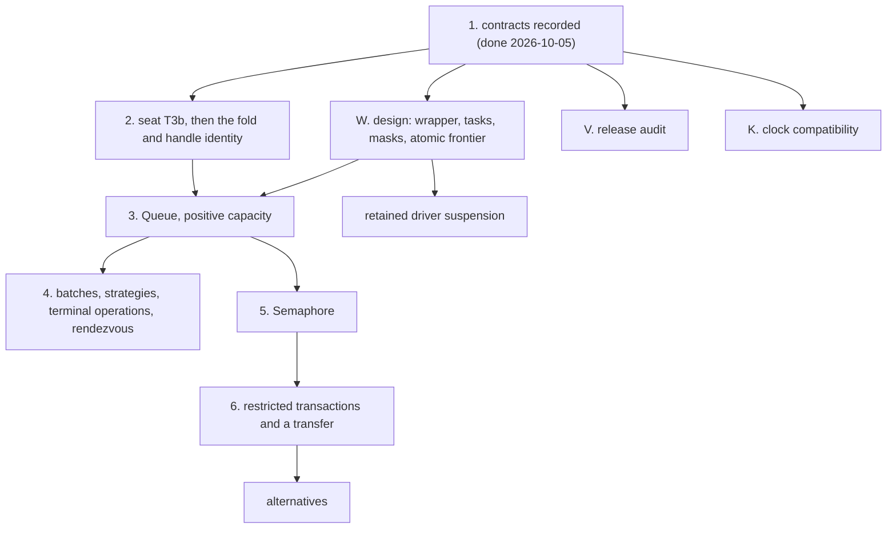

# 2026-10-05 the foundation contracts: rulings, obligations and order

Status: research note (history, not authority). Base: `0741ab17` (`refactor/phase1-phase3`).

**The one thing to know first.** The owner ruled the foundations of the composed modules on
2026-10-05. The register holds the rulings (decisions rows 214 to 234). This note consolidates
what the rulings owe: one table of obligations, the acceptance cases, and the order of slices with
an owner for each. No obligation here is a planned goal yet, because no definition exists to
state it over. Each is an open part of its requirement row in the semantics registry
(`tools/Tools/SemanticsRegistry.lean`).

## Question

Which obligations do the rulings of 2026-10-05 create, where is each placed, and in which order
does the work run?

## What was read or run

| Item | How |
| --- | --- |
| Codex's packet, in full (`docs/research/2026-10-05-codex-foundation-packet/`): the selections, the audit, the review, the four literature notes, the task review | read |
| The cancellation probe, written again (`docs/research/2026-10-05-claude-lead/queue-probes/cancel-return.ts`) on rc.112, 4.0.1 and Effect 3.22.2, with bun 1.4.2 | tested: five controls on each build; they agree with Codex's |
| The opposing-ticket cycle and the abandoned ticket, in `docs/research/2026-10-05-claude-lead/tx-probes/TxModel.lean` | tested: `opposingTickets`, `jointTickets`, `abandonedTicket` |
| The 19 declarations of the tree that the audit names | tested (a search): each exists at its path |
| Codex's other probes, its 22 model checks, and the literature | read; not run again |
| Any Lean file of the tree, any proof | not written |

## Findings

### F1. The rulings, by row

| Row | The ruling in one line |
| --- | --- |
| 214 to 218, 130 | The derived forms plan's seven recommendations |
| 219 | The Queue serves in strict request order, and a message is consumed at the taker's atomic step |
| 220 | The Queue's signal is posted, for the default Effect 4 profile; a `Deferred` stays inline |
| 221 | One shared waiting wrapper, with a checked body profile; each module owns its enrolment |
| 222 | When cancellation wins before consumption, nothing is consumed; a commit stays after it; four observations |
| 223 | The atomic body is a restricted fragment of `Eff`, with flat nesting |
| 224 | An alternative falls back on retry only, as Harris et al. define it |
| 225 | Posted work is an `Eff` body with explicit task metadata; it is not a child fork |
| 226 | An embedded budget first; a retained driver suspension before any resumable ownership |
| 227 | `restore` names its mask's saved incoming state |
| 228 | Seat T3b, then the list fold with two binders |
| 229 | Same-kind handles compare by identity |
| 230 | A module's profile defines its public behaviour before it hides private state |
| 231 | The clock counts nanoseconds inside; every millisecond input keeps its meaning |
| 232 | The release is audited before the pin moves |
| 233 | The order of the slices |
| 234 | The contract of a retained behaviour is designed now; its value form waits |

One ruling differs from the coordinator's lean. Row 220 selects the posted signal, which keeps
Effect 4's answers on probes P5 to P7. The inline signal stays a possible second profile.

### F2. The obligations, consolidated

Codex's six reports propose 24 names. Several state one property twice. The table merges them
into 18 obligations and one exclusion. Each name is a proposal: the slice that owns an
obligation registers its claim and states its goal.

| Obligation | Concept; requirement | What it says | Consumer; what it waits on | Rows | Absorbs |
| --- | --- | --- | --- | --- | --- |
| `fold-typed-atomic-update` | `store-typing`; R4 | The fold with two binders is typed, scoped and total. `Ref.modify` with it stays one operation that answers `B` and stores `A` | The Queue's service pass; seat T3b | 228 | the review's "typed fold" |
| `handle-identity-laws` | `store-typing`; R4 | Same-kind handles compare by identity. Membership in a list of handles, fresh allocation and world extension have laws | The Queue's withdrawal by identity; the fold | 229 | — |
| `scoped-body-substitution-boundary` | `residual-program-typing`; R4 | The code after a scope runs only after the scope. Substitution neither captures it nor copies it into a child body | The first new scoped constructor: the mask or a posted body | 225, 227 | — |
| `saved-mask-restoration` | `scope-lifetime-finalization`; R11 | `restore` reinstates its mask's saved state on every exit, and is the identity under a masked caller. Cleanup is installed before an interruption can see an acquisition | `Semaphore`'s protected permit; the binder's signature | 227 | `mask_restore_activation` |
| `waiting-request-obligation-preserved` | `reactive-scheduling`; R11, serving R10 and R12 | A selected request's notification stays in store debt, queued commands, dispatcher work or the receiver's continuation until discharged. An old token is inert after rearming | The waiting wrapper; the delivery profile | 221, 222 | `wait_cancel_arbitration` |
| `wait-registration-no-gap` | `reactive-scheduling`; R12 | The decision to wait and the registration are one transition. So each eligible waiter is retrying or owns a notification | The wrapper and the Queue's quiet-state law | 221, 223 | `wait_registration_no_gap`, `tx_retry_no_lost_wake` |
| `embedded-budget-sufficient` | `reactive-scheduling`; R12 | An admitted finite body, embedded in an existing state, finishes within a proved budget that covers registration, cleanup and delivery. The delivery includes the receiver continuations that a dispatch reaches, or the profile restricts them (Codex's review of the waiting design) | The first Queue operation; `straight_sufficient` covers a fresh run only | 84, 226 | half of `attempt_budget_or_resume` |
| `driver-continuation-split` | `reactive-scheduling`; R12 | Continuing a retained suspension with budgets `n` and `k` equals one run with `n + k`. No command is lost, repeated or reordered | Incremental sessions; the public frontier's meaning | 226 | the other half of `attempt_budget_or_resume` |
| `driver-suspension-keeps-typed` | `reactive-scheduling`; R12 | The retained commands stay typed (`QueueOk`, `ConfigTyped`) | The same | 226 | — |
| `posted-body-entry-typed` | `residual-program-typing`; R7 | A checked `Eff` body supplied at a posting site stays typed, with its entry and its environment, under world extension | `SnapshotTyped` and `EditTask` | 225 | `postedBody_entry_typed` |
| `posted-task-decision-preserves` | `reactive-scheduling`; R12 | A posted task keeps the typed state: the execution identity, the owner, the receiver's token, and a stale delivery | `edit_task`, `driveState_lift` | 225 | `postedTask_decision_preserves` |
| `posted-wake-profile-agrees` | `translation-simulation`; R10 | One producer's posted delivery agrees with its module expansion: owner, priority, token, capture time, coalescing, cancellation | The Queue's producer first; `TaskMeans`, `book_fireState` | 220, 225 | `posted_task_lifetime_agrees`, `posted_producer_step_agrees`, `postedWake_profile_agrees` |
| `posted-wake-debt-progress` | `reactive-scheduling`; R12 | An owed wake is delivered under explicit premises: body progress, fuel or a suspension, fair decisions | The first producer's progress clause | 220, 225 | `postedWake_debt_progress` |
| `queue-expansion-agrees` | `translation-simulation`; R10 | The Queue's expansion agrees with its clients on the Queue's profile | The Queue's first slice; rows 219 to 222 as its contract | 79, 230 | — |
| `atomic-attempt-isolation` | `store-typing` and `reactive-scheduling`; R4 | An admitted body's ordered reads and writes, the state that a failure or a retry restores, and no other fiber's step inside | The transaction's attempt; the body profile's grammar | 80, 223 | `admittedAttempt_single_owner`, `tx_body_access_frame` |
| `atomic-attempt-agreement` | `translation-simulation`; R10 | The restricted transaction profile agrees with the named release | The first transaction slice; isolation and the budget | 80, 84, 223 | `tx_profile_refines_snapshot` |
| `tx-choice-rollback-union` | `translation-simulation`; R10 | The left branch's writes go, the enclosing writes stay, and a double retry waits on both branches | A take from either of two queues | 224 | `tx_choice_rollback_union` |
| `clock-unit-compatibility` | `translation-simulation`; R13 | Every recorded millisecond input keeps its meaning after the unit moves | The timer and session migration; the conversion policy | 83, 231 | `clock_unit_compatibility` |
| Excluded: fair composition of tickets enrolled apart | — | The opposing-ticket cycle stays a refused case until an enrolment protocol resolves it | The atomic transfer | 223 | the review's "shared fair queue composition" |

- **A module's request progress is a separate claim** (R12). Dispatcher service gives no such
  progress (`flush_fair`, `src/Effect4/Laws/Machine/Scheduling.lean`); the ticket cycle shows why.
- **Placement differs from the packet at one point.** The packet places the clock under R10. This
  table places it under R13, because the property is about recorded inputs.
- **What exists to build on** (each name checked by a search):
  - `driveState_add` (`src/Effect4/Laws/Machine/Approximation.lean`) and `driveState_lift`
    (`src/Effect4/Laws/Machine/Lift.lean`);
  - `QueueOk`, `ConfigTyped`, `SnapshotTyped`, `EditTask` and `edit_task`
    (`src/Effect4/Laws/Program/Typed/Assembly.lean`);
  - `TaskMeans` and `book_fireState` (`src/Effect4/Laws/Machine/Book.lean`);
  - `evaluatePrim_async_parks` and `drive_resume_wrong_token`
    (`src/Effect4/Laws/Machine/Clauses.lean`);
  - `Projects` and `Refines` (`src/Effect4/Laws/Machine/Refinement.lean`).

### F3. The acceptance cases

Each slice's contract packet holds its cases as executable falsifiers (`Test/contracts/`).

| Slice | Cases, each with its positive control |
| --- | --- |
| The waiting wrapper | A notification before the await. A cancellation after the selection and before the delivery. A late delivery with an old token after rearming |
| The Queue | Cancellation before and after consumption, with the four observations apart. A wake that arrives before the await. Probes P1 to P7 as the version controls |
| Posted delivery | A receiver that changes the resource during a live wake traversal. A Latch batch that a later waiter joins |
| Work limits | A cut inside the commit, inside the cleanup and inside the delivery, each beside a larger uninterrupted run |
| The mask | Nested masks. A caller that is already masked. A child that exits before its parent |
| Alternatives | Left writes abandoned. Enclosing writes kept. A wake through either dependency when both branches retry |
| Composed queues | The opposing-ticket cycle, as an excluded case |

### F4. The order, with an owner for each slice

| Slice | Owner | State |
| --- | --- | --- |
| 1. Contracts recorded | the coordinator | Done: rows 214 to 234, the registry's open parts, this note. Owed: the Queue's whole transition contract as a packet in `Test/contracts/` |
| 2a. The binder terms of the eight rows | seat T3b, its existing assignment | Slices A to D are on its branch; E and F remain |
| 2b. The fold, handle identity, nested handles | a new seat, after T3b merges | Needs its design note first (the groundwork plan, F4) |
| W. The design of waiting, tasks, masks and the atomic frontier | the coordinator, with Codex's review | One design note; due before slice 3 |
| 3. The Queue's first path | a new seat, after 2b and W | make, offer, take, poll, size, cancellation, one posted producer, the public observation |
| 4. Batches, strategies, terminal operations, rendezvous | seats, one per slice | Against slice 3's contract |
| 5. Semaphore | a new seat | Lands the mask with its protected permit |
| 6. Restricted transactions, a transfer, then alternatives | later | After 5 |
| K. Clock compatibility | a separate seat, beside 2 | Before any timed API |
| V. The release audit | a separate seat or the coordinator, beside 2 | Before the pin moves |

A slice stops when its selected observation fails or a frozen statement needs an amendment (row
233).

### F5. Upstream candidates, kept by version

None is reported. Reporting is the owner's decision.

| Candidate | Effect 3.22.2 | rc.112 | 4.0.0 and 4.0.1 | Note |
| --- | --- | --- | --- | --- |
| P1. A later taker receives each message while an earlier taker waits | no | yes | yes | a finite bypass, not a proof of starvation |
| P6 and P7. A sliding queue discards, and a dropping queue refuses, while a taker waits | no | yes | yes | follows from the posted wake; depends on a yield |
| C5. The test clock's sleeps below 244 ns at a realistic time | not run | yes | yes | deadlines kept as floating-point milliseconds |
| P2, P3, P4, TX1, TX2 | — | yes | repaired | history of the pin; for the audit |

## Proposals (not rulings)

1. **The Queue's contract packet next.** Write the whole transition contract into
   `Test/contracts/`, from `QueueModel.lean` and rows 219 to 222, before the design note W.
2. **One design note for W.** It covers the wrapper, the task metadata, the mask and the atomic
   body's profile, each with its boundary. Codex reviews it before slice 3.
3. **Register each claim in its own slice.** The table's names are proposals until then.

## What this does not establish

- No obligation is stated in Lean, and none is proved.
- The rulings rest on finite runs, finite models, source reading and literature.
- The merge of Codex's 24 names into 18 is the coordinator's reading. A slice may split one again.
- The owners of F4 are a plan. No seat beyond T3b has a brief.
