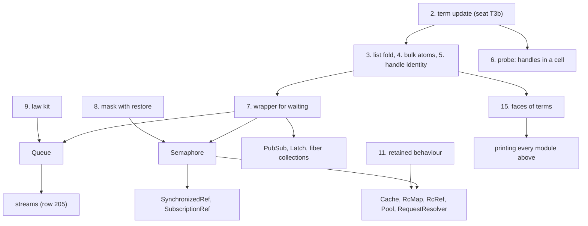

# 2026-10-05 groundwork for the composed modules: the base abstractions first

Status: research note (history, not authority). Base: `50700443` (`refactor/phase1-phase3`).

**The one thing to know first.** The owner's direction of 2026-10-05 is to lay the groundwork
before any module. No module should send the work back for an atom, a table or a language
feature. This note lists every base abstraction that Effect's stateful modules need from this
tree. It says where each stands, and which questions to resolve before development starts. Nine
are missing. The three largest are a list fold in terms, a mask that restores the caller's
interruptibility, and the kit for a module's law. Nothing here is a ruling: Codex reviews it,
and the owner rules.

## Question

Which base abstractions do the stateful modules need, and which exist? In which order do the
missing ones land, so that no module adds a language feature later?

## What was read or run

| Item | How |
| --- | --- |
| The stateful-API catalogue, §2 and §3 (`docs/research/2026-09-19-stateful-api-catalogue.md`): 20 module families and a basis of six items | read; its rc.112 line citations were not checked again |
| The queues review of today (`docs/research/2026-10-05-claude-lead/queues-review.md`) and its probes | read; tested |
| The term language and its atoms (`src/Effect4/Machine/Term.lean`); the program syntax (`src/Effect4/Program/Eff.lean`) | read |
| `uninterruptibleMask` in `vendor/effect-4.0.0-rc.112/src/`, by file | tested (a search) |
| A cell that holds a list of handles, searched in `Test/` and `src/Effect4/Laws/` | tested (a search): none found |
| Decisions rows 43, 79, 81, 82, 109, 216; DI-11; the state plan (`docs/research/2026-10-04-claude-lead/state-any-type-plan.md`) | read |
| Any design of an item below | not written |

## Findings

### F1. The base abstractions and where each stands

| # | Abstraction | State today | Recommended form | Question to resolve |
| --- | --- | --- | --- | --- |
| 1 | A cell and a deferred at any type | Landed (seat T3a) | — | — |
| 2 | An atomic update that takes a binder term | In flight: seat T3b has four of six slices on its branch | As seat T3b's approved design | Resume now, or after the questions below |
| 3 | A list fold in terms | Missing. A term has no loop and no binder | One term constructor: a list, a start value, and a body that binds the accumulator and the element. Total. Prints as `reduce` | The binder convention; whether a counted loop is also needed |
| 4 | Bulk list atoms | Missing. The list atoms are `listNil`, `listCons`, `listGet`, `listLength`, `listAppend` | `listTake` and `listDrop`, each total. Every other list function is a builder over the fold | Which builders ship with the fold |
| 5 | The identity of a handle inside a term | Missing. `eq` compares numbers and strings only | Equality of two handles of one kind. Never deep equality of messages | Extend `eq`, or give each registration a number |
| 6 | Handles inside a cell's value, typed | Believed landed with T3a. No test holds a list of handles in a cell | A finite probe: a cell with a list of `Deferred`s builds, types and runs | — |
| 7 | The wrapper for an operation that waits | Missing | One derived form over `Deferred`, `onExit` and `uninterruptible`, with one law (the queues review, F6) | — |
| 8 | A mask that restores the caller's interruptibility | Missing. Row 216 defers it | A mask construct and a `restore` construct that names its mask | The first-order form of `restore`; whether row 216's timing changes |
| 9 | The kit for a module's law | Missing. `Profile` and `Agrees` are text only (row 79, R79.5) | Abstract operations for the client, their expansion, the profile as data, the simulation with stutter steps, the quiet-state lemma | The client's alphabet: an operation type beside the native one, or rows of an application signature |
| 10 | A posted wake for programs | In the machine (`WakeMode.scheduled`, `src/Effect4/Machine/Wake.lean`); no program-visible row | None. Each module's answers are fixed at its atomic steps, and the schedule difference is signed once | Confirm the stance, or add one row |
| 11 | Retained behaviour: a program kept in a value and run later | Missing. R7 and row 82 are open | A separate design | Design it now, or after the first modules |
| 12 | A watcher fiber for another fiber's exit | Composed from fork and await | A detached fork pinned to the structure's scope | A finite probe that it lands where rc.112's observer lands |
| 13 | The race that takes the first exit | Missing | A derived form over `raceAll` | Check it against the truth harness first |
| 14 | Numbers | Open (row 109) | As row 109 rules | — |
| 15 | The faces of terms: binder terms, the fold, type arguments | Slice T5 of the state plan | Extend T5 to the fold | — |
| 16 | The pin | rc.112; npm's latest is 4.0.1 | An audit of what changed in the proved runtime, then a decision | Audit now or later |

### F2. Which module needs which abstraction

The table reads the catalogue's §2. A dot means the module needs the item.

| Module | 2 term update | 3 fold | 5 identity | 7 wrapper | 8 mask | 11 retained behaviour | Other |
| --- | --- | --- | --- | --- | --- | --- | --- |
| `Queue` | • | • | • | • | `into` only | | |
| `Latch` | • | | • | • | | | Posts its wake in rc.112 |
| `Semaphore` | • | • | • | • | • | | Posts its sweep in rc.112 |
| `PartitionedSemaphore` | • | • | • | • | • | | Map atoms |
| `PubSub` | • | • | • | • | | | Map atoms; a scope per subscription; a Latch |
| `SynchronizedRef` | • | | | | • | | `Semaphore` |
| `SubscriptionRef` | • | | | | • | | `Semaphore`, `PubSub` |
| `FiberHandle`, `FiberSet`, `FiberMap` | • | • | • | | • | | Item 12; map atoms |
| `Pool` | • | • | • | • | • | • | Scopes, `Semaphore`, sleep |
| `Cache`, `ScopedCache` | • | • | | | • | • | Map atoms; the clock; item 12 |
| `RcMap`, `RcRef` | • | | | | • | • | Scopes; sleep; a fork with a context |
| `Request`, `RequestResolver` | • | • | | • | | • | A detached fork |
| `Schedule` | | | | | | | Items 13 and 14; a pure step as data |
| Streams | • | • | • | • | • | | `Queue`; row 205 |

- **The mask is not rare.** 14 source files of rc.112 use `uninterruptibleMask` (a search). They
  include `Semaphore.ts`, whose `withPermits` restores the caller's state around the wait and
  around the body (reading).
- **The fold covers each scan the catalogue names.** Each of these is one pass over a list with
  a running value:
  - `Semaphore`'s sweep, and `Pool`'s wake of `n` waiters;
  - the queue's acceptance of pending offers;
  - `PubSub`'s loop over subscribers;
  - the cache's eviction, and a removal by identity.
- **Retained behaviour splits the modules in two.** Six need a program kept in a value. The
  waiting modules and the fiber collections do not.

### F3. The order

The diagram shows what each item waits on. It shows the plan's order and proves nothing.

- Items 3, 4, 5 and 8 change the language. Each starts as its own design note (`AGENTS.md`,
  "Working").
- Item 9 is proof infrastructure only. It can be designed beside the fold.
- The pure queue of the queues review needs none of them. It is a Lean model with its laws.

### F4. What the fold's design must show

The fold's design note is accepted when it writes each step below as one term and evaluates it:

1. the queue serves the takers that wait, after a batch offer;
2. the queue accepts pending offers, after a batch take;
3. `Semaphore` grants permits to waiters in order while permits remain;
4. `PubSub` hands one message to every subscriber;
5. a removal of one waiter by its handle's identity;
6. the oldest `k` entries leave a cache.

The same note states the typing rule, the scope rule, weakening and evaluation. It also states
the laws on handles, the wire entry (DI-47), and the printed and read forms.

## Proposals (not rulings): the questions to resolve before development

1. **The stance on schedules.** A derived module's law is stated on answers fixed at atomic
   steps. No program-visible posted wake is added, and no Latch store. One register entry signs
   the schedule difference for every derived module.
2. **The fold.** One constructor, with `listTake` and `listDrop` as atoms and every other list
   function as a builder. Confirm, or ask for a counted loop too.
3. **Identity.** Extend `eq` to two handles of one kind. The alternative is a registration
   number in each module's state.
4. **The mask with restore.** Design it now as groundwork. This changes row 216's timing, not
   its content.
5. **The law kit's client alphabet** (item 9).
6. **Retained behaviour.** Design it after the first waiting modules, because none of them
   needs it. Confirm, or pull it forward.
7. **The pin.** Audit the changes between rc.112 and 4.0.1 in the files the proofs transcribe.
   `Ref.ts` and `Semaphore.ts` did not change; `internal/effect.ts` did.
8. **Seat T3b.** Its remaining slices do not depend on questions 1 to 7. Resume it on the
   owner's word.
9. **The queue's own questions** are in the queues review's proposals 2 to 6.

## What this does not establish

- F2 rests on the catalogue of 2026-09-19 (reading). Its rc.112 citations were not checked again,
  and the changes of 4.0.0 and 4.0.1 were read for `Queue.ts` only.
- No item has a design. Each count of modules is a reading of the catalogue's table.
- That the fold covers every module's pure step is a reading of six cases. F4 makes it a test.
- Item 6 is believed landed. The probe is not written.
