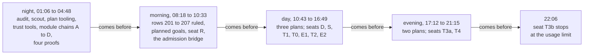

# 2026-10-05 review: what the session of 2026-10-04 landed

Status: research note (history, not authority). Base: `4520f3a3` (`refactor/phase1-phase3`).

**The one thing to know first.** The session of 2026-10-04 landed 143 commits, from `faad3e9e` to
`4520f3a3`. The library and the whole battery built, with the three gates, after the last merge
(tested, `make status`). No `make check` sweep ran in the main checkout on the merged tree. Each
seat ran the gates that its receipt names, on its own branch, before its merge. Seat T3b stopped at
the account's usage limit. Four of its six slices are committed on `seat/t3b`, and none is merged.
The coordinator made some rulings without the owner. F4 lists them, and marks the ones that change
what a program does.

## Question

The owner asked on 2026-10-05 for a deep review of the last long sessions. This note answers four
questions:

1. What landed, in plain words?
2. How was each part checked?
3. Which decisions did the coordinator make without the owner?
4. What is unfinished?

## What was read or run

| Item | How |
| --- | --- |
| The session's transcript (2026-10-04, 00:41 to 22:06 local time) and seat T3b's transcript | read |
| `git log faad3e9e..4520f3a3`, `git diff --shortstat`, the remote branch's reflog | tested |
| `make status` at `4520f3a3` | tested |
| The twelve receipts of 2026-10-04: `docs/research/2026-10-04-seat-*-receipt.md` and `docs/research/2026-10-04-claude-lead/night-receipt.md` | read |
| Decisions rows 200 to 213 (`docs/core/decisions.md`) | read |
| The plan section of `generated/semantics.md`, and its claims that are not proved | read |
| Seventeen named declarations, searched under `src/` | tested (a search, no build) |
| Each seat worktree: its branch, unmerged commits, uncommitted files and size | tested |
| Any Lean build, any gate, any generator | not run |

## Findings

### F1. The size of the landing

Every count below comes from `git` at `4520f3a3` (tested).

| Measure | Value |
| --- | --- |
| Commits | 143, of which 16 are merges |
| Files changed | 545 |
| Lines | 39,492 added and 9,507 deleted |
| Seats merged | M, R, D, S, T1, T0, E1, T2, E2, T3a and T4 |
| Pushed | 2026-10-05 07:17: `origin/refactor/phase1-phase3` equals `4520f3a3` |

### F2. The order of the landings

The diagram shows the order of the work by local time. It claims nothing about what depends on
what.

### F3. What each landing does

#### F3.1 Planning in Lean

- **Before.** The ledger held no goal, and no tool recorded an edge between goals
  (`docs/research/2026-10-04-proof-graph-audit/audit.md`: reading).
- **Now.** One command declares a planned goal: `proof_goal G : P` (`tools/ProofGraph/Goal.lean`).
  The goal is a theorem whose body is `sorry`, and later proofs use it as a theorem.
- **Status.** A node's status is read from its proof: goal, modulo or proved
  (`tools/ProofGraph/Plan.lean`). `#plan_status` prints it in the editor.
- **Sketches.** `proof_sketch` turns the holes of a proof script into goals
  (`tools/ProofGraph/Sketch.lean`).
- **The report.** `generated/semantics.md` has a plan section with the thirteen requirement rows
  and a section for the acceptance programs.
- **A trust rule changed.** `AGENTS.md`'s rule against `sorry` has one exception now: the body of a
  planned goal (rows 203 and 207, both ruled by the owner).
- **Replaced inside the session.** The night built a first design: ledger goals, registered
  reductions, `#obligation_close` and `#extract_obligations`. Row 203 replaced it at 08:52, and
  those commands are deleted.
- **Evidence.** The goal gate of `Test/All.lean` counts 13 planned goals, each a fixture of
  `Test/Audit` (seat T4's receipt: tested). A search finds no `proof_goal` under `src/` (tested).
- **Not established.** Every requirement row reads open, and the report names no next goal. The
  open work sits in each row's list of open parts, written as prose, not as goals.

#### F3.2 Trust tools and housekeeping

| Tool | What it does | Where |
| --- | --- | --- |
| `make check-kernel` | Replays every compiled declaration through the kernel, in one environment | `tools/Drivers/KernelReplay.lean` |
| The proof-style ratchet | Refuses a new `simp_all`, `first`, `try`, or `simp` without `only`, under `src/Effect4` | `Test/Audit/ProofStyle.lean` |
| `make bank-census` | Lists each aesop bank's rules and the clauses that name the bank | `src/Effect4/Laws/Auto/BankCensus.lean` |
| `make profile-module` | Prints one module's profiler times and aesop statistics | `Makefile` |
| One population filter | The census, the report and the architecture map count the same declarations | `ProofGraph.isAuxiliary` (`tools/ProofGraph/Population.lean`) |
| The axiom gate | Refuses a module root | `Test/Audit/AxiomGate.lean` |
| Four empty aesop banks | Deleted: `Inversion`, `Reader`, `Rows`, `TyOrder` | row 65 |
| Reference projects | 17 outside projects pinned for reading; only the manifest is tracked | `vendor/refs/MANIFEST.tsv` |
| The proof graph view | The architecture map draws the plan in three drawings | `.lake/gen/architecture-map.html`, a build artifact |

#### F3.3 The module system (seat M; rows 200 and 202)

- **Before.** No core file used Lean's module system.
- **Now.** 116 core modules outside `Laws` are modules. Of these, 96 reach no package and 20 reach
  only `hash`. The package `hash` is converted, pushed on its branch `module-system` and pinned at
  `ab7eda4`.
- **The exception.** Seven modules stay non-module. As modules they lose the compiler's
  specializations, and the generated OCaml grows (row 202, option (a), ruled by the owner).
- **Evidence.** Seat M measured 30,133 authored names before and after the conversion: each is
  present, and none changed kind (tested). `lake build Test` passed on the merge `cb8f510a` with
  911 jobs (tested, the night receipt).

#### F3.4 Four proofs that the coordinator landed at night

| Theorem | What it says | Its reach |
| --- | --- | --- |
| `fairTape_unarmed` (`src/Effect4/Laws/Machine/Scheduling.lean`) | A fair finite tape that suffices leaves nothing armed at its live end | The finite end only (R12, part a) |
| `build_total` (`src/Effect4/Laws/Program/BuildTotal.lean`) | A well-typed layer builds | The structural `build`, not the machine's build (R5) |
| `meaning_typed_app`, `run_typed_app`, `meaningB_typed_app` (`src/Effect4/Laws/Program/SoundAnySignature.lean`) | The meaning, the run and the loop meaning are typed at an application's signature | The `Straight` and `Looped` fragments (R1) |
| Nineteen `_typed` lemmas (`src/Effect4/Laws/Codegen/Forms.lean`) | Each shared form's expansion is well typed | Typing only; no form has a behaviour law (R10) |

The battery was red at `faad3e9e` in four modules, after the data wave. Commit `bf60f896` repaired
it.

#### F3.5 The frontier names armed work (seat R; row 201, option (b), ruled by the owner)

- **Before.** A live run stopped with an empty list of reasons while work was armed
  (`E4-SCHED-CE-021`).
- **Now.** Armed work makes the frontier name `.awaitDecision` (`frontierReasons`,
  `src/Effect4/Api/Frontier.lean`). In the host protocol, armed work with no runnable fiber reads
  `parked`.
- **Proved.** `frontier_empty_iff_deadlocked` (`src/Effect4/Laws/Api/Frontier.lean`): a live,
  unfinished machine names no reason exactly when it is deadlocked.
- **A ruled law changed.** DI-68's tape law now reads "idle or an armed owner"
  (`observe_idle_tape_iff`, the same file).
- **Not established.** That the named decision steps the machine. The claim `scheduler-progress`
  stays absent, and infinite tapes stay outside (R12, part c).

#### F3.6 Admission at the application's signature (seats P and S; row 21, ruled by the owner)

- **Before.** Program admission read the built-in signature only. `E4-TYPED-CE-041` showed that
  admission skipped conditions the typed state needs.
- **Now.** `SigApp` and `admitSig` sit in the core (`src/Effect4/Program/SigApp.lean`). Program
  admission runs at the application's signature and checks that signature.
- **Proved.** `lawfulSig_of_admitted`, `reachable_typed_admitted` and `m7_admitted`
  (`src/Effect4/Laws/Program/Typed/AdmittedSource.lean`), each with no extra premise.
- **One departure from the brief.** Admission still refuses a table integer as `uninhabited at`.
  DI-67, row 149 and a frozen contract fix that wording.
- **Not established.** Steps 3 to 6 of the slice plan. `Author.build` still admits with no declared
  service, and code generation still reads the built-in signature.

#### F3.7 The acceptance programs (seat D; row 206, ruled by the owner)

Five rc.112 programs are tracked tests under `Test/Dogfood/`. Each battery pins how far its
program gets. A slice that moves the program turns a pin red, so the move is visible.

| Program | Stage today (`Test/Dogfood/README.md`) |
| --- | --- |
| p1, the HTTP cache | Admitted; runs; answers the body text where rc.112 answers `42`; prints; does not read back |
| p2, the handler over layers | Admitted in a bounded form; runs to rc.112's three answers; prints and reads back |
| p3, the worker queue | Admitted with the queue as two host rows; answers `[3, 5]` where rc.112 answers its log; prints and reads back |
| p4, the rate limiter | Admitted over three number cells; runs to rc.112's `[3, 2, 3]`; prints and reads back |
| p5, the ledger service | No admitted program |

A stage is one scripted run on one decision tape: a finite probe, not a theorem.

#### F3.8 State at any type (seats T0, T1, T2, T3a, T4; rows 42, 43 and 208 to 213)

| Seat | Before | Now | Main names |
| --- | --- | --- | --- |
| T0 | The scope check ignored an operation's own data | The scope check reads that data through a class | `ScopedOp` (`src/Effect4/Program/ScopedOp.lean`); `Eff.perform_scoped_iff` (`src/Effect4/Laws/Program/Authoring.lean`) |
| T1 | The straight theorems assumed that every cell holds a number | They hold over the typed world's table of cells; `HeapNat` is deleted | `Typed.CellsTyped`, `Typed.CellImplements` (`src/Effect4/Laws/Program/Typed/Adequacy.lean`) |
| T2 | The store ran five named number functions | The store runs a binder term inside one store step | `refStep` (`src/Effect4/Machine/Stores.lean`); `kernel_term_agrees` (`src/Effect4/Laws/Program/Progress.lean`) |
| T3a | The public `Ref` and `Deferred` rows were fixed at `number` | The rows are templates, so a cell or a deferred holds any admitted type; `Deferred.make` carries its type arguments | `NativeOp.deferredMakeOf` (`src/Effect4/Program/Native.lean`); `syncRow_typed` (`src/Effect4/Laws/Program/Typed/Denotation.lean`) |
| T4 | The row match's completeness was a planned goal | It is proved as stated | `Ty.matchTemplate_complete_anchored` (`src/Effect4/Laws/Program/Template.lean`) |

- **Still number-only.** The eight read-modify-write rows, `Ref.update`, `Ref.modify` and their
  kin, carry a function name. Seat T3b gives them terms (F7).
- **The faces.** They print `Deferred.make` only at `(number, number)`. They refuse every other
  instance by name until slice T5 (row 212).
- **Not established.** Concurrency: one store step is atomic in the model only.

#### F3.9 Error payloads (seats E1 and E2; row 120, ruled by the owner)

- **Before.** A program failed only with a number, a string, a tag or a pair of strings.
- **Now, the carrier (E1).** A program fails with a tagged record that holds no handle
  (`Err.payload` and `Payload`, `src/Effect4/Machine/Alphabets.lean`). The error codec is an exact
  embedding with no normaliser (`decodeErr_exact`, `src/Effect4/Laws/Schema/Codec.lean`: proved).
- **Now, the face (E2).** A payload type prints as one `Data.TaggedError` class, and a
  construction prints as `new Tag({ … })`. The reader reads the classes back
  (`readClassDecl_exact`, `src/Effect4/Laws/Codegen/Classes.lean`, and `admitModule_classDecls`,
  `src/Effect4/Laws/Codegen/Admit.lean`: proved).
- **The compiler.** tsgo 7.0.0-dev.20260629.1 accepts the printed forms and refuses the red twin
  (seat E2's receipt: tested).
- **Still refused.** A signed number field (row 121). `catchTag`'s narrowing of the error column
  (row 130). A branch whose two arms fail with different classes (TS2375; the derived forms plan,
  question 7).

#### F3.10 The plans

Each plan is a tracked note under `docs/research/2026-10-04-claude-lead/`.

| Plan | State |
| --- | --- |
| `sigapp-slice-plan.md` | Steps 0 to 2 landed; steps 3 to 6 open |
| `state-any-type-plan.md` | T0, T1, T2, T3a and T4 landed; T3b in flight; T5 and T6 open |
| `error-payloads-plan.md` | E1 and E2 landed |
| `derived-forms-plan.md` | Nothing landed; seven questions for the owner |
| `queues-plan.md` | Nothing landed; four questions for the owner |

### F4. Decisions that the coordinator made without the owner

The owner ruled rows 21, 120, 155 (a), 183 and 200 to 209 on 2026-10-04 (the register: reading).
The coordinator made the calls below. Each is written in the register, a plan or a design note.

| Call | Where it is written | Does it change what a program does? |
| --- | --- | --- |
| Row 200's name test changed at night, from equal counts to "every authored name is present" | row 200 | No |
| A read-modify-write row whose term uses a number primitive is a frontier on a cell that holds no number (seat T2, ruling D1). `incr` stops there, and `noChange` still answers (`refModify_bool_frontier` and `refModifySome_bool_answer`, `Test/Program/ProtocolPosts.lean`: tested) | row 43 | **Yes.** Before T2 each function name answered such a value unchanged |
| An operation that gains fields retires at its wire tag, and a new constructor is appended | row 210 | The wire: tag 13 retired, tag 23 appended |
| A deferred's error column is formed only in the error alphabet | row 211 | **Yes.** Formation refuses any other column |
| `Deferred.make` prints only at `(number, number)` until T5; a parameter inside an operation's type arguments types at `never` | row 212 | **Yes**, at the faces |
| The row match compares both sides normalized; its completeness theorem carries `Ty.bottomFree` | row 213 | It accepts more requests, never fewer |
| A host error class with fields beyond `message` is a defect at the adapter, no longer a pair (E2-A) | `error-payloads-plan.md` | **Yes**, at the host adapter; no truth program observes it |
| Seat-level design rulings: T1's D1 to D8, T2's D1 to D10, T3a's D1 to D11 | each seat's design note | Covered by the rows above |
| Seat T3b's D1 to D13, not merged. D5 gives two function names new images. D8 makes p4 measure rc.112's one-cell program, which drops its `printed` and `readBack` until T5 | `docs/research/2026-10-04-seat-T3b-design.md` | **Yes**, once merged |
| The queues plan's four calls: capacity as `option nat`; `bounded(0)` refused by name; handle kind byte 6 released; census rows deferred | `queues-plan.md` §3 | Not landed |

### F5. How the merged tree was checked

- **The build.** `make status` reports the battery as built at 2026-10-04 20:37 and up to date
  (tested). That build runs the three gates of `Test/All.lean`: the library-root gate, the module
  and axiom gate, and the goal gate.
- **The gate's reach.** Seat T4's receipt quotes the axiom gate at 664 modules and 81,464
  declarations, at `[propext, Quot.sound]` (tested by the seat, on its head).
- **The sweep.** `make status` lists every `make check` lane as stale or never run, except `tsgo`.
  It lists seven generated groups as stale, and it finds no committed generated file that differs.
- **The seats.** Each seat ran gates on its own head before its merge. Seat T3a ran the widest
  set: the build, the generators, `check-cases`, `check-ocaml`, `check-truth`, `check-ts-reader`,
  the corpus and the conservativity check. So those lanes passed on a seat's head, not on the
  merged head.
- **This review's search.** Seventeen named declarations exist under `src/`, and `HeapNat` is
  absent (tested). The search does not show what a declaration states.

### F6. Red checks that the receipts report

| Check | State | Reported by |
| --- | --- | --- |
| `make check-target` | Fails at the assignability lane: `generated/assignability.tsv` differs. The file dates from 2026-09-19 | seats T3a and E2 |
| `make check-tsdiag` | Fails; red before seat E2 started | seat E2 |
| `lake build Effect4Gen` | 20 guard snippet modules do not build; red at the seat's base too | seat T2 |
| The mirror census (`tools/Conform/Cli/Audit.lean`) | Exit 2: 4 counterexamples and 3 unresolved of 276 subjects, the same at the seat's base | seat T2 |
| The OCaml cross face | Reports `pAcquire` and `pProvide` as differing; reported, not gated | seats R, T2 and T3a |
| `make status`, the plan line | Reads "no rows". `plan_rows` (`scripts/status.py`) expects four columns, and the table has five since row 207 | this review (tested) |

The session repaired two earlier red checks: C1 of `gen-check.sh` (`c58bcc43`) and control G1 of
the conservativity self-test (`2f3e31ad`). This review re-measured only the last row of the table.

Codex's monitor kept three more findings that it could not send. They sit in
`/private/tmp/codex-effect4-overnight-monitor/pending-guidance.txt`. This review read them and
checked none of them, except the wording of row 43 above.

| Finding | Codex's evidence |
| --- | --- |
| The conservativity check's count clause accepts the deletion of a corpus row that the policy names as a verdict move | `t3a-c3-missing-verdict-probe.json`, an isolated run of the clause |
| A record update of a payload class instance can drop the unchanged `message` field in the printed TypeScript; no battery reaches that route (seat E2's item E2-D) | `payload-record-update-probe.json`, a run on the pinned runtime |
| C1 of `gen-check.sh` misses two spellings of a fiber-list write | `gen-check-c1-probe.py`, a scan |

### F7. Unfinished work

Seat T3b gives the eight read-modify-write rows their binder terms. Its design has six slices.

| Slice | What it does | State on `seat/t3b` |
| --- | --- | --- |
| A | `NativeOp.syncOpOf` takes the point's environment | committed, `e757a2f4` |
| B | Weakening maps an operation's term (`ScopedOp.mapTerm`) | committed, `c7afee00` |
| C | The checker types an operation's binder term (`Signature.termOf`) | committed, `5abdb76f` |
| D | The faces see an operation's level (`Signature.opAtLevel`) | committed, `15ee58c8` |
| E | The cutover: the eight rows carry terms, `FnName` leaves the program, every generator runs | not started; the seat was reading for it when it stopped |
| F | p3, p4, the semantics registry, the documents and the receipt | not started |

- The worktree `/Users/pooks/Dev/lean4-effect4-t3b` is clean. Slices A to D change no behaviour
  (the design note's merge plan: reading). The seat built them narrowly, and no one has reviewed
  them.
- The design note and its probes were ignored files of that worktree only. On 2026-10-05 this
  review copied them to `docs/research/2026-10-04-seat-T3b-design.md` and
  `docs/research/2026-10-04-seat-T3b/`. Neither is tracked yet.

The other open work:

- steps 3 to 6 of the slice plan for program admission at the application's signature;
- the state plan's T5 (the faces) and T6 (the acceptance programs);
- the derived forms and the queues, which have plans only;
- two small items from seat E2: refuse four payload field names that shadow methods, and measure
  a record update of a class instance;
- the semantics registry's claims that are not proved: `store-safety`, `scheduler-progress` and
  `fair-scheduling` are absent, `bind-closed` is refuted, and `host-progress` is assumed.

### F8. Disk and worktrees

- The data volume has 11 GiB free of 460 GiB (`df`: tested).
- Eleven merged seat worktrees hold about 20 GB. Each is clean, and none has an unmerged commit
  (tested).
- Lake's artifact cache holds 15.9 GB, and no build directory uses 9.4 GB of it (`make status`).

| Worktree | Size | Ignored files that a removal deletes |
| --- | --- | --- |
| `lean4-effect4-sigapp` | 1.8 GB | build output only |
| `lean4-effect4-dogfood` | 1.3 GB | build output only |
| `lean4-effect4-modules` | 2.1 GB | build output only |
| `lean4-effect4-r12b` | 2.1 GB | build output only |
| `lean4-effect4-e1` | 2.0 GB | `harness/truth/session/.work/` |
| `lean4-effect4-e2` | 1.9 GB | `harness/truth/corpus-check/` |
| `lean4-effect4-t0` | 1.7 GB | build output only |
| `lean4-effect4-t1` | 1.4 GB | `docs/research/2026-10-04-seat-T1/T1Proto.lean` |
| `lean4-effect4-t2` | 2.1 GB | build output only |
| `lean4-effect4-t3a` | 2.0 GB | build output only |
| `lean4-effect4-t4` | 1.5 GB | build output only |

The session asked to remove only the first four. The other seven merged later.

## Proposals (not rulings)

1. Run one sweep on the merged head before more code lands: `make check`, then `make check-gen`.
   Nothing is running now, and seat T3b's cutover regenerates every face.
2. Repair `plan_rows` in `scripts/status.py`, so `make status` reports the requirement rows.
3. Decide `generated/assignability.tsv`: promote it with `make gen-assignability`, or repair its
   lane.
4. Remove the eleven merged worktrees, and run `lake cache clean`. The branches stay in git.
5. Resume seat T3b at slice E with a new seat on `seat/t3b`, after the sweep.
6. Confirm or reverse the calls of F4 that change what a program does.

## What this does not establish

- No build and no gate ran for this review. That the battery is green rests on `make status`
  reading its build marker.
- A receipt is its seat's own report. This review read each receipt and reran none of its
  commands.
- The search of F5 shows that a declaration exists. It does not show what the declaration states.
- The red checks of F6 may have moved since their receipts.
- Seat T3b's four commits were built by the seat alone, on its branch.
- No open planned goal does not mean the semantics is finished. The thirteen requirement rows all
  read open.
