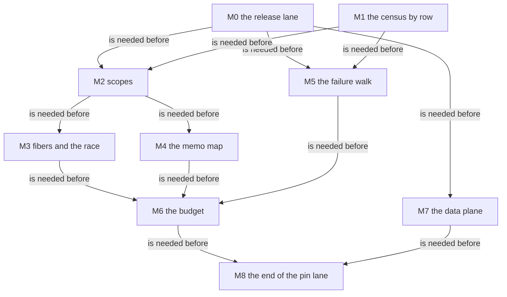

# 2026-10-05 the migration plan: the pin to 4.0.1 in increments

Status: research note (history, not authority). Base: `6d16d5a2` (`refactor/phase1-phase3`).
A plan for review. No file of the tree changed.

**Read with its answers (2026-10-05).** The owner accepted the mechanics and set their priority
(F8; decisions row 253). Four parts of the text below are answered and stand as history:

- the head's request for one download, and F6's items 1 and 2 (rows 249 and 250);
- F2's line "the release's driver is not installed": the driver is installed, and F7 reads it;
- M0 in F3 and F4: it landed with seat M0 (`ba0b6d38`);
- F4's "two seats, two queues": F8 replaces it.

**The one thing to know first.** Decisions row 248 rules that the pin moves to 4.0.1 in
increments, and that development does not pause. This plan says how. Each area of the machine
is cut over in place to the release's rule. Until the last area moves, the truth lane runs both
builds, and one ledger says which build each program must agree with. Each census row names its
build. The first slice changes no Lean file: it is the release's truth lane and that ledger.
It needs one word from the owner, for one download.

## Question

How does the pin move slice by slice while every gate stays meaningful, and in what order?

## What was read or run

| Item | How |
| --- | --- |
| The release audit, `docs/research/2026-10-05-seat-A401/audit.md`, and its receipt | read |
| The audit's truth run on both builds, `docs/research/2026-10-05-seat-A401/out/truth-401/summary.tsv` | read: 39 programs |
| `scripts/lib/truth_host.py` (`PINNED`, `select`) | read |
| `scripts/generate-effect-runtime-census.sh`: its version test, its file digests and its row anchors | read: the head |
| The truth, corpus and census targets of the `Makefile` | read |
| The files that seat T3b's branch changes | measured: 98, by `git diff --name-only` against the merge base |
| Any script, any Lean file | not written; nothing was run |

## Findings

### F1. Where the pin stands in the tree

| Place | What holds the version | Who reads it |
| --- | --- | --- |
| The vendored sources | `vendor/effect-4.0.0-rc.112/src`, and beside it `vendor/effect-4.0.1/src` since the audit | every citation; the census generator |
| The installed packages | `ts/eff/package.json`: `effect`, the SQLite driver and the compiler | `truth_host.py`, which refuses any install that is not the pin |
| The runtime census | the generator's expected version, its file digests and each row's span digest | `make check-census` and the coverage join |
| The target profile | two entry points, `effect/unstable/sql` and `effect/unstable/persistence`, and the `Config` constructor names | the printed modules and the harness prelude |
| The citations | 2980 rows that cite a file of the pin (the audit's F2) | readers, and the coverage join through the census |

### F2. Two ways to move

| | A: new definitions beside the old, one switch at the end | B: each area cut over in place |
| --- | --- | --- |
| The machine during the move | the pin's, whole | mixed: each rule cites the build it transcribes |
| When the release first checks a migrated rule | at the switch | in its own slice |
| The last step | every caller, the census and the harness at once | the profile's two entry points, and the pin lane's end |
| Definitions kept twice | every changed rule, until the switch | none |

**B is proposed.** A ends in one large switch, which row 248 rules out. A also keeps each
changed rule twice, against the owner's rule to replace in place. B needs three instruments, so
that a mixed machine is checked honestly:

1. **Two truth lanes and one ledger.** The host phase runs on rc.112 and on 4.0.1. The ledger
   gives each program its expected agreement: both builds, the pin only, or the release only.
   The gate is the ledger. A slice turns its programs toward the release.
2. **A build on each census row.** The generator reads a row from the vendored tree that the
   row names. A row moves with a reading, and never by a relabel (row 232).
3. **The profile's two entry points by build,** until the pin lane ends.

The audit's run gives the ledger of today:

| Programs | Agreement today |
| --- | --- |
| 30 | both builds: verdict and exit |
| 1, `pInterruptEscape` | the release only: the tree's signed divergence is the release's rule there |
| 3, `pProvideMerge`, `pProvideTwice`, `pMergeAll` | the pin only, on the schedule: the release forks once less |
| 5, the programs that reach the SQLite driver | the pin only for now: the release's driver is not installed |

A mixed machine is still one semantics, and it is ours. A claim of agreement with a host names
its build, and the ledger is where it does.

Three points of acceptance come from Codex's proof scouting of 2026-10-05
(`docs/research/2026-10-05-codex-foundation-packet/implementation-audit/proof-scouting/migration.md`):

- **The ledger keeps each observation apart:** the exit, the schedule and the synchronous exit
  have a cell each, for each build. A known difference of the schedule excuses no difference of
  the exit. A run that did not happen is its own value, and it is not a disagreement.
- **The census row's build reaches the witness join.** `Test/Audit/RuntimeCoverage.lean` joins
  a row to its theorems by identity and kind today. The join takes the build too, so a row of
  the release is never paired with evidence that is still attributed to the pin. One theorem
  may witness a row on both builds.
- **An impact query runs before the first semantic slice.** `ProofGraph.reachedAxiomsMany`
  (`tools/ProofGraph/Axioms.lean`) takes the slice's changed declarations as its stop leaves,
  with a fresh memo for each environment and stop set. Its roots are the semantics registry's witnesses,
  the requirements' top nodes, the placed goals and the census witnesses of the area. It
  answers which claims reach a changed declaration, which the audit's direct join left open.
  Reach is no proof that a claim keeps its meaning.

### F3. The slices and their order

| Slice | The audit's | What moves | What it turns |
| --- | --- | --- | --- |
| M0. The release lane | its F12 | The second host run, the ledger, the profile's entry points by build. No Lean file | The gate reads the ledger |
| M1. The census by row, and the impact query | part of S8 | A build column that reaches the witness join. The 83 rows whose span is equal move by digest. The 42 rows whose sentence holds move with a reading. The query of F2 | 125 of 137 rows |
| M2. Scopes | S3 | The parent pointer, the `Empty` reset, the uninterruptible `Scope.close` | The three schedule programs; four registry claims; two census rows |
| M3. Fibers and the race | S4 | The child's parent pointer, the race's clean-up at its exit, the interruptible await of children, the merged cancel failure | Three census rows |
| M4. The memo map | S6 | The entry's shape and the synchronous registration | Two census rows; the sixteen layer rows' witnesses |
| M5. The failure walk | S2 | The interrupt reasons added when no handler is skipped. `U-01` ends as a divergence | Two census rows; the divergence's register row |
| M6. The budget and the new primitives | S5 | `succeedWith`, three new tags, the yield test at an iteration only | Two census rows; every agreement that counts operations |
| M7. The data plane | S7 | The `Union` node's options, the `Config` evaluation, two provider corners | The Schema census; the Config contract |
| M8. The end of the pin lane | S1 and the rest of S8 | The profile at one build, the harness's version test, the host loop's census row, the citations that still name the pin | The ledger has one build, with its three observations apart |

- **Scopes come before fibers and the memo map,** as the audit orders them.
- **The budget is late.** It moves every count of operations at once, so it follows the areas
  whose own steps change.
- **The citations that miss in the pin are repaired with their area,** against the release. The
  audit's separate lane S0 would repair them against rc.112 first, and each would then move
  again.

### F4. Beside the foundation slices

- **Two seats, two queues.** One seat takes the foundation slices in row 233's order: the fold,
  the mask, the Queue's first path. The other takes the migration's slices in F3's order. Row
  237's limit of two stands.
- **M0 can start now.** It writes scripts, the harness's runner files and the `Makefile`. Seat
  T3b's branch changes 98 files, and of the harness it changes `harness/truth/Truth.lean` only.
  M0's committed results are written again after T3b's merge, because T3b changes printed
  programs.
- **No foundation slice waits for a migration slice.** The mask's source is equal text in both
  builds. The Queue's contract follows the release already.
- **A foundation slice that counts operations names its build** (Codex's review of the mask).
  Before M6 that build is the pin.

### F5. What each migration slice hands back

1. The rule, transcribed from `vendor/effect-4.0.1/src`, with each citation by declaration and
   path.
2. The census rows of its area at the release, each with its reading.
3. The ledger lines that it turns, with the two host runs.
4. The claims that it proves again, each placed as the audit's F11 lists them.
5. Each divergence that it ends or opens, as a row of the upstream backlog.

A slice stops when a program leaves the ledger's expectation for a reason outside its area.

### F6. What needs the owner's word

**Answered on 2026-10-05** (decisions rows 249 and 250). The driver is downloaded, and
`Scope.close` on a forked scope keeps `void`. The driver brought one finding, which F7 states.
Item 3 can still wait for M8.

1. **One download.** The release's truth lane needs `@effect/sql-sqlite-bun@4.0.1` from the npm
   registry. The pin's copy is 484 KB installed. `effect@4.0.1` itself is installed on this
   machine already, and its bytes equal the vendored tree. Until the word is given, M0 leaves
   the five SQL programs at the pin only.
2. **`U-02` on a forked scope.** The release keeps the defect, and a forked scope with one
   finalizer now shows it too. The tree's disposition answers `void` at `Scope.close`. The
   plan keeps that disposition for the new case, and M2 needs it confirmed.
3. **The pin's vendored tree after M8.** It stays for the history of the citations, or it goes.
   This can wait for M8.

### F7. The driver, once installed (2026-10-05)

The release's driver changes one type. The pin types `SqliteClient.make` as
`Effect<SqliteClient, never, …>`. The release types it `Effect<SqliteClient, SqlError, …>`, and
fails with `SqlError` when the database cannot be opened or configured (read in the file
`SqliteClient.ts` of each driver's sources).

- The row `sqliteOpen` (`src/Effect4/Program/Packages/SqliteBun.lean`) has the error column
  `never`, and the prelude's `Sql.open` does not project an error.
- With the driver present, four of the five SQL modules fail the release's type check:
  `pSqlite`, `pSqlFail`, `pSqlCatch` and `pSqlExit`. `pSqlOrDie` passes it, because its layer
  turns the failure into a defect. So the release lane does not pass on the tracked install
  `ts/release` (tested, tsgo 7.0.0-dev.20260629.1;
  `docs/research/2026-10-05-claude-lead/release-driver/tsgo-4.0.1-with-driver.txt`). The first
  record of this finding said five.
- The move belongs to M7, the data plane: the row's error column, the prelude's projection at
  `Sql.open`, and the five ledger lines.
- The release audit did not read the driver. This is the first difference found in it.

### F8. The owner's word on the mechanics (2026-10-05)

The owner accepted the mechanics of F2 and set their priority (decisions row 253).

- **The mechanics stand.** Each area is cut over in place. The two lanes, the ledger and a build
  on each census row keep a mixed machine checked.
- **The migration follows the features.** A cut-over runs when a feature, a semantics or a proof
  needs the release's rule. No slice exists only to reach agreement with 4.0.1.
- **Agreement with one build is no goal by itself.** The goals are coherent APIs, the proof
  infrastructure and the semantics of behaviour.
- **A cut-over changes nothing that needs no change.**
- **A release case that no slice takes is deferred,** with the evidence of its build and its
  reason. A deferral is neither a divergence nor an agreement.
- **An intentional deviation is decided on its merits,** in a decisions row of its own.

What this changes in the plan:

| Part of the plan | Before | Now |
| --- | --- | --- |
| The order of F3 | the order in which a migration seat works | the order of the dependencies: a slice still needs the slices that F3's diagram puts before it |
| F4, "two seats, two queues" | one seat for the foundation slices, one for the migration | no seat is reserved for the migration (the coordinator's reading) |
| M1, the census by row and the impact query | next, held for the owner's reading | runs with the first cut-over that needs it |
| The driver's type (F7) | a slice of M7, next in its turn | deferred: the five ledger lines hold the reason, and `sqliteOpen` keeps the pin's `never` |

No feature of the foundation order needs a cut-over today. F4's third point still holds: the
mask's source is equal text in both builds, and the Queue's contract follows the release.

Codex reviewed the mechanics the same day
(`docs/research/2026-10-05-codex-foundation-packet/implementation-audit/open-questions-review/migration/review.md`).
Three of its points bind the first cut-over, whenever a feature calls for one:

- **One acceptance rule for both truth lanes.** The pinned lane still refuses every
  disagreement but the exact case of `U-01` (`harness/truth/run-truth.ts`,
  `scripts/check-truth.py`). The first slice that changes the machine's semantics separates
  collecting a host observation from accepting it, and reuses the ledger's judge for both
  builds. This is seat M0's recorded open obligation.
- **M1 comes before a change of the machine's semantics.** A census row's build must reach the
  witness join, and the impact query runs on the slice's changed declarations.
- **A mixed machine names its own revision.** A program that joins a migrated rule and one that
  is not migrated may agree with neither build on one observation. That is allowed only as an
  exact expectation with its owner and its reason.

Its recommendation for the driver, when a feature needs SQLite on the release: one whole
adapter slice. It moves the row's error column, the printed type, the projection of the error,
the recorded reply and the admission of a replay together. It states who closes the minted
scope when opening fails. It keeps a defect, an interruption and a typed failure apart. This is
a recommendation, and no row rules it.

## Proposals (not rulings)

1. **Each area is cut over in place** (B of F2). Its instruments are the two lanes with their
   ledger, the build on each census row, and the profile's entry points by build.
2. **The order is F3's.** M0 and M1 first, then scopes, fibers, the memo map, the failure walk,
   the budget, the data plane, and the end of the pin lane.
3. **The migration has its own seat,** beside the foundation seat. M0 starts now.
4. **The citations that miss in the pin are repaired with their area,** not in a lane of their
   own.
5. **`U-01` ends as a divergence in M5,** and its backlog row then says that the release
   repairs it. `U-02` stays signed.

## What this does not establish

- No slice is sized. The audit counts 287 declarations with a changed citation, and its join
  to the claims is direct only.
- The ledger of F2 is the audit's one run of 39 programs, on a copy outside the repository. The
  corpus lane was not run on the release.
- Nothing shows that a mixed machine keeps every proved claim between two slices. Each slice
  owes the claims of its own area, and the gates of F2 check programs, not proofs.
- The order of F3 follows the audit's dependencies. A dependency that the audit's direct join
  missed can change it.
- The release's SQLite driver was read at one function, `SqliteClient.make` (F7). The rest of it was
  not read.
- Source reading, a finite comparison and a Lean proof establish three different things. This plan
  holds the first two only.
