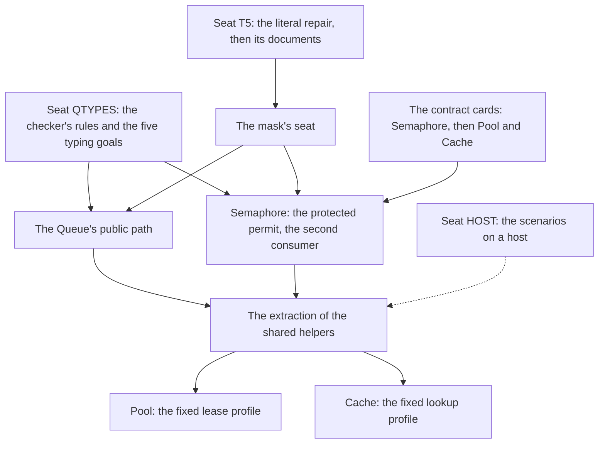

# 2026-10-05 the module procedure: from the Queue to a factory of composed modules

Status: a plan (history, not authority). The coordinator wrote it on the owner's direction.
Codex relayed that direction in three messages, which the owner pasted into the coordinator's
session. Each is filed with its packet under
`docs/research/2026-10-05-codex-foundation-packet/implementation-audit/`: `decision-probes/`,
`next-proof-review/` and `module-factory-review/`.

## What changes

1. **Breadth.** The Queue is the first worked example. The preparation of Semaphore, Pool and
   Cache does not wait for the Queue's later extensions.
2. **One procedure.** Every composed module follows the same steps, and the repeated parts are
   generated or applied, not written again.
3. **One plan.** The requirements R1 to R13 stay on the plan. A module slice adds to them. It
   does not replace them, and it closes none of them by association.
4. **Fewer questions.** A routine choice inside a settled policy proceeds through its
   acceptance. A question for the owner is a change of meaning, of the supported domain or of
   a representation.

What does not change: the order of implementation that decisions row 233 rules, each seat's
ownership, and the parked work. The profiles below are proposals until the owner rules them.

## The procedure

| Step | What is made | Who | The mechanical part |
| --- | --- | --- | --- |
| 1 | The contract card: the template below | the coordinator, or a design seat | none: it is the one semantic input |
| 2 | The independent model, its invariant, the encoding and the public goal, each named before a helper | the module's seat | each goal is a `proof_goal` with its placement |
| 3 | One admitted program, built with the existing builders | the module's seat | `Api.Author.build` retains the admission; no second certificate |
| 4 | The shared laws applied: scope, typing, folds, the store, allocation and frames | the module's seat | generated scope laws; the checker's introduction rules; `step_updates`, `step_keeps_cell`; `indexed_ref_step_preserves` |
| 5 | The remaining obligations, each with its premises and its exclusions | the module's seat | `proof_sketch`, `proof_goal` and `#plan_status` print them |
| 6 | The faces and the engine's fixtures | the module's seat | the printer and the readers; the generated group `fixtures`, one folder and one writer for a lane |
| 7 | The controls: one inhabited case, and a fault for each promised property | the module's seat | the truth lane and the compiler client for the target |
| 8 | The receipt, with the requirements' accounting below | the module's seat | `generated/semantics.md` gives the rows |
| 9 | The extraction, after a second module uses a helper | the coordinator | move the helper, migrate both callers, retire the copy, in one change |

A step that needs a new builder, a new law or a new generator names its second consumer first.
One consumer keeps a helper local.

## The contract card

One card for each module, in `docs/research/<date>-claude-lead/module-cards/<name>.md`. The
Queue's contract packet is its model (`Test/contracts/queue.contract.md`).

1. **The source.** The pinned files and the functions read, cited by name and path.
2. **The operations and the first profile.** What the profile admits, and each exclusion by
   name. An exclusion is not the module's whole surface.
3. **The state.** The cells, their owner, the hidden identities and the initial value.
4. **The mandatory questions.** The atomic boundaries; where a wait registers; the commit
   point; the windows of cancellation; how a notification selects its receiver; ownership;
   the cleanup after a failure.
5. **The representation and the context.** Key equality, the order of iteration, the captured
   services, an entry's lifetime, handles, and the domains of numbers and of time.
6. **The public observation.** What a client can see, and what stays hidden.
7. **The reused pieces and the gaps.** Each gap names the second consumer that justifies it.
8. **The placed goals.** Each with its concept, its requirement and its consumer.
9. **One inhabited case and its faults.** The fault must fail the promised property, not
   typing alone.
10. **The questions for the owner.** Only a choice of meaning, of domain or of representation.

## What the waiting policies must keep apart

| Module | What stays explicit |
| --- | --- |
| Queue | strict order; consumption at the taker's step; ordered notifications; cancellation before and after the commit |
| Semaphore | a live scan of the waiters; eligibility checked again against the free permits; a later smaller request may proceed |
| Pool | a counted selection of waiters inside the posted task, then delivery to that list; a lease's return is not the resource's destruction |
| Cache | one shared lookup; the last waiter's leaving cancels it; a stale cleanup must not delete a replacement; recency is an explicit order |

One wake-all helper proves none of these. A shared waiting law takes the policy as a parameter
and requires the policy's own laws. It is extracted when two selection proofs share one
statement.

## What is mechanical, and what comes next

| Output | Today | Next |
| --- | --- | --- |
| Authoring lifts, rows, forms and their scope laws | generated (`tools/Effect4Gen`) | builders that mint the current value's name, with `Ref.modifyWith` wrappers: the coordinator, after seat T5 |
| A record's field views | written by hand for the Queue's three records (`Reading.lean`, `Typing.lean`) | generated from one field declaration, when Semaphore's cell is the second consumer |
| A step's typing | proved by hand for two statements; five are planned goals | seat QTYPES's introduction rules; a concrete program uses the checker's own answer (row 257) |
| The store connection of a step | `step_updates`, `step_keeps_cell`, in the Queue's folder | moved lower when Semaphore uses them |
| The engine's fixtures | the generated group `fixtures` | a new lane is a folder and a writer: no edit of the graph |
| The target check | the truth lane; hand copies of printed steps in a control file | printed module programs in the truth corpus, after the literal repair |
| A receipt's accounting of the requirements | read by hand from `generated/semantics.md` | a filter of the report by a slice's modules, when a second seat needs it |

## The requirements' accounting in a receipt

Each receipt gives three lists, taken from `generated/semantics.md` and from `#plan_status`.

1. The existing claims and requirement rows that the slice advances, with each node's status.
2. The goals and premises that its theorems still rest on.
3. The older open parts of the same requirements that it leaves untouched.

No receipt keeps a second list of statuses. A conditional theorem keeps each premise that it
does not meet. A concrete typing certificate or one module's step theorem closes no requirement.

## The order and the owners

- The cards start now. Semaphore's is first, because it is the next implementation.
- Semaphore's profile needs the mask's contract and one declared delivery profile.
- Pool and Cache test the card's template and the shared interface before either is built.
- At each choice of the next slice the coordinator compares a module slice with a proof of the
  older plan: a requirement with no module consumer stays a candidate.

## Not in this plan

- A second program representation, a second registry or a second list of statuses.
- A generic container, a scheduler rewrite or a proof of fairness.
- A profile ruled by this note: each card puts its choices to the owner once.
