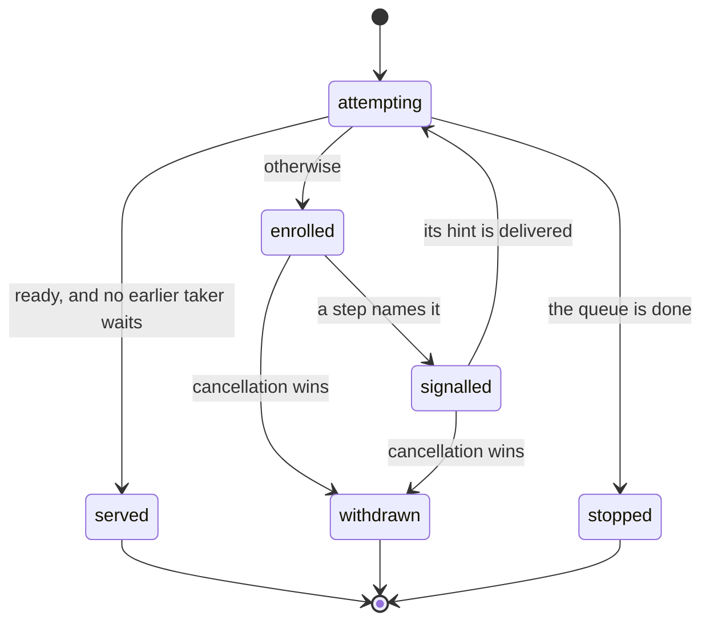
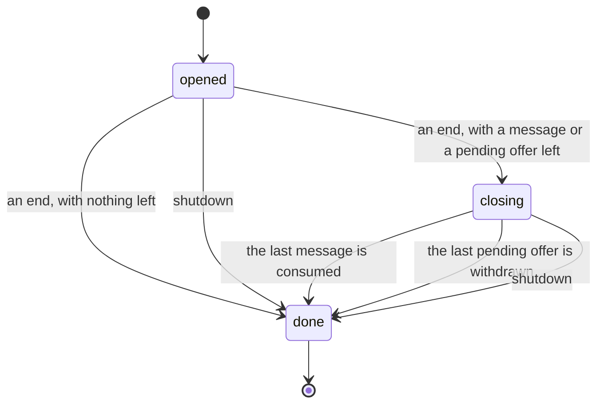

# 2026-10-05 the Queue's transition contract

Status: research note (history, not authority). Base: `4f69ff59` (`refactor/phase1-phase3`).
A contract for review. No file of the tree changed.

**Ruled 2026-10-05.** The owner ratified proposals 1 to 4 in session, as recommended. They are
decisions rows 240 to 243. Proposal 5's candidates are listed in `docs/UPSTREAM-BACKLOG.md`,
and none is reported. Proposal 6 stays with the first Queue slice.

**Corrected 2026-10-05, after Codex's review** of this note at its first commit
(`docs/research/2026-10-05-codex-foundation-packet/implementation-audit/full-queue-review/recommendations.md`).
The review keeps the four rulings and finds five faults, all repaired here:

- the model gave an unbounded queue a room of one million, so a larger batch waited and a
  larger buffer was not cleared whole;
- F8 inferred an offer's acceptance from its missing entry, which `shutdown` refutes;
- the reason given for refusing `dropping` at capacity zero was wrong (proposal 2);
- the native `poll` was not run, and `clear` at a rendezvous was described as buffered
  messages only;
- the exploration could not see a signal lost at an end.

**The one thing to know first.** Decisions row 233 asks for the Queue's whole transition
contract before the first Queue slice. This note states it, under rows 219 to 222, 235 and 238:
one cell, and one pure step for each operation of the release's API. Its executable form is
`QueueContract.lean` beside it: 51 guard checks, of which 43 are named traces, six are bounded
explorations and two are red controls. Eight points differ from the native 4.0.1 queue on
purpose, and each is measured on rc.112 and 4.0.1. Three points were new choices for the owner
(proposals 1 to 3, now rows 240 to 242).

## Question

What does each operation of the Queue do under the rulings, and where does the contract differ
from the release?

## What was read or run

| Item | How |
| --- | --- |
| The released 4.0.1 `Queue.ts`, every operation, comments removed (549 code lines), from the installed package of the earlier probes | read |
| `count.ts` of the same package, for the bounds' normal form | read |
| `docs/research/2026-10-05-claude-lead/queue-contract/QueueContract.lean` | tested: 51 guard checks hold, and the run exits 0; both red controls fail as they must |
| `docs/research/2026-10-05-claude-lead/queue-contract/native-differences.ts` on rc.112 and 4.0.1, with bun 1.4.2; each output sits beside it | tested: ten runs on each build |
| Codex's review packet, `docs/research/2026-10-05-codex-foundation-packet/implementation-audit/full-queue-review/`: its three reviews, its native controls on both builds and its Python mirror | read; its controls were not rerun here |
| Decisions rows 219 to 222, 233, 235 and 238; the waiting design (`docs/research/2026-10-05-claude-lead/waiting-design.md`) | read |
| Any Lean file of the tree, any proof | not written |

## Findings

### F1. The state

The queue is one cell. Its value holds:

| Field | Meaning |
| --- | --- |
| `messages` | The buffer, oldest first |
| `capacity` | A natural number, or none for an unbounded queue |
| `strategy` | `suspend`, `dropping` or `sliding` |
| `takers` | The consuming requests that wait, in arrival order, each with its identity and bounds |
| `peekers` | The requests that wait to read the message in front |
| `offers` | The pending offers, in arrival order, each with the messages not yet accepted |
| `awaiters` | The requests that wait for the queue's end |
| `phase` | `opened`, `closing` with an end, or `done` with an end |

An end is the clean end, a failure with its cause, or an interrupt.

A configuration is formed when its capacity is positive or absent. Capacity zero is formed for
`suspend` only (F4).

### F2. The operations

Each step answers a new state, a reply, and the signals to post.

| Operation of the release | Step | Reply | Waits? |
| --- | --- | --- | --- |
| `take`, `takeN`, `takeBetween`, `takeAll` | `take`, by its bounds | messages; or the queue's end | yes, as a taker |
| `poll` | `poll` | one message or none | never |
| `clear` | `clear` | every buffered message; at a rendezvous, the one message that a take would receive; or the end of a failed queue | never |
| `peek` | `peek` | the message in front, which stays; or the queue's end | yes, as a peeker |
| `offer` | `offer` | accepted or refused | under `suspend`, when no room is left |
| `offerAll` | `offerAll` | the messages that were not accepted | under `suspend`, with its rest |
| `end`, `fail`, `failCause`, `interrupt` | `close`, by its end | whether this call ended the queue | never |
| `shutdown` | `shutdown` | whether this call shut it down | never |
| `await` | `awaitQ` | the queue's end | yes, as an awaiter |
| `size`, `isFull` | read the cell | a number, a Boolean | never |

- `collect` is a loop of `takeAll` to the queue's end, and `into` is a mask around `close`. Both
  are derived forms over this table.
- **Refused by name:** `flush`, which runs the native wake pass at once, and the `Unsafe`
  family, which are host functions. The contract has no pass to flush.
- **A bound** is a natural number. A take with a bound of zero answers the empty batch, after
  the test for a done queue, as the release does.

### F3. The rules that every step keeps

**Order (row 219).**

- A take consumes only when it is ready and no earlier taker waits.
- A take is ready when the buffer holds its minimum. A capacity caps the minimum, and a closing
  queue serves any message (the release's `canTake`).
- `poll` and `clear` never wait, and they pass no waiting taker (row 242). Their empty answer
  says that this call may consume nothing. It does not say that the buffer is empty.
- A `clear` that consumes may leave messages behind: pending offers refill the room that it
  frees, in the same step (`clearRefills`).
- `peek` consumes nothing, so it holds no turn.
- A consuming step takes a prefix of the buffer, and an accepted message joins the end. So the
  messages leave in the order of their acceptance.

**Commit points.**

- A message is consumed in the step of the request that receives it. A signal reserves nothing.
- An offer is accepted in arrival order, by the step that frees room. That step decides the
  offerer's answer.
- So the two kinds of signal differ. A taker's signal says: run your step again. An offerer's
  signal carries its answer, and the offerer runs no second step.
- An offer's acceptance and its answer are two events (row 240). The acceptance is committed by
  the accepting step. The answer is delivered later by the posted helper, which carries it.
  Nothing reads the answer from a later state of the queue.
- A batch is accepted as a prefix, message by message as room frees. It is not accepted whole
  or not at all.

**After every consuming step,** three things happen in this order:

1. pending offers enter the freed room;
2. a closing queue with nothing left becomes done;
3. the requests that became ready are named.

**Withdrawals.**

- A taker that leaves frees its turn, and the next taker is named when it is ready.
- A pending offer that leaves takes its unaccepted messages with it, in every phase but the
  last. What was already accepted of a batch stays (`batchPrefixStays`).
- A withdrawal after the accepting step finds no entry and changes nothing. The message stays
  accepted, and the offerer may exit interrupted before it reads its answer
  (`offerWithdrawnAfterAccept`).
- A missing entry alone does not say that an offer was accepted. `shutdown` also removes the
  entry, and it answers `false` (`offerRemovedByShutdown`).
- A closing queue that a withdrawal leaves empty becomes done.

A taker's request moves through these states:

`served` is the only state that consumes. A request that is `signalled` holds nothing: its next
attempt may enrol it again.

### F4. Capacity zero

For `suspend`, capacity zero is a rendezvous:

- an offer stays pending until a taker's step takes its message;
- that step takes one message of the first pending offer, and it answers the offerer when its
  offer is spent;
- either party may leave before that step, and nothing was done (`rendezvousWithdrawals`);
- nothing is ever buffered;
- `poll` and `clear` take what a take would, one message of the first pending offer, when no
  taker waits (`nonblockingAtRendezvous`). The native queue does the same (D9).

`sliding` at capacity zero is refused (row 219). The native queue stores one message there, and
a waiting taker is not woken (D5). `dropping` at capacity zero is refused too (proposal 2, row
241).

### F5. The ends

- A closing queue accepts no new offer. Its pending offers still enter as room frees, and its
  takers drain it.
- `shutdown` drops the buffer and answers each pending offer with what was not accepted. An
  open queue then ends with an interrupt; a closing queue keeps its end.
- A done queue holds nothing and nobody. A take or a peek answers its end, `poll` answers none,
  and `size` answers zero. `clear` answers the empty list after a clean end, and the end
  otherwise.
- **Every request that an end removes is named by that step.** A taker and a peeker are told to
  run again, and they then read the end. An offerer receives its answer. An awaiter receives
  the end. This holds for `shutdown`, for the last consuming step of a closing queue, and for
  the withdrawal that empties one.

### F6. The model's evidence

`QueueContract.lean` has the steps of F2 as pure functions. Its 43 named traces:

| Group | Controls |
| --- | --- |
| The order | `strictOrder` (P1), `noReservation`, `headBatchBlocks`, `keepsMinimum` (P2), `zeroBounds`, `pollRules`, `clearRules`, `peekRules` |
| Offers | `offersInOrder`, `offerAllSuspend`, and one control each for a batch under `dropping`, a batch under `sliding`, a batch on a closed queue, an empty batch, and a single offer under each of the two strategies |
| The ends | `closingServes` (P3), `withdrawnOffer` (P4), `failThenDrain`, `closedTwice`, `shutdownAnswers`, and the await of a done queue |
| Capacity zero | `rendezvousOfferFirst`, `rendezvousTakerFirst`, `rendezvousWithdrawals`, and the four formation tests |
| No limit on an unbounded queue | `unboundedBatch` and `unboundedClear`, Codex's two witnesses at 1,000,001 messages |
| Acceptance and answer | `offerWithdrawnBeforeAccept`, `offerWithdrawnAfterAccept`, `offerRemovedByShutdown`, `batchPrefixStays`, `batchAnswered` |
| What an empty answer means | `emptyAnswerNotEmptyBuffer`, `clearRefills`, `nonblockingAtRendezvous` |
| The signals of an end | `shutdownNamesWaiters`, `shutdownNamesEveryone`, `shutdownKeepsEnd`, `drainNamesEveryone`, `closingRendezvousEmptied` |

The exploration runs every sequence of at most five operations from a list. It covers `suspend`
at four capacities, and `dropping` and `sliding` at two each.

| List | Operations | Runs on each configuration |
| --- | --- | --- |
| The first | eleven: two takes, `poll`, `peek`, an offer, a batch offer, `clear`, an end, `shutdown`, and the withdrawals of a take and of the batch | 177,156 |
| The second | thirteen: it adds `await`, the withdrawals of a peek, an await and the single offer, and an end by failure; it has no `poll` and no `clear` | 402,234 |

Both lists fix the identities, the values and the bounds. Three properties of the state hold
after each step:

- `within`: a bounded queue never exceeds its capacity;
- `tidy`: a done queue holds nothing and nobody, a closing queue holds something, and a pending
  offer means no room;
- `quiet`: the oldest taker, when it is ready, was signalled, and so was each peeker when a
  message is in front.

One property of the step holds:

- `accounted`: every request that the step removes is named in the step's signals, unless it is
  the step's own request.

Two red controls show what each property sees:

- **A closing queue names nobody,** as rc.112 did. `quiet` fails: a ready taker was not named.
- **A shutdown names nobody.** The three properties of the state still hold on every run, and
  only `accounted` fails. So `quiet` is not the obligation to deliver an end's signals (Codex's
  review). `accounted` is that obligation, on the model's side.

### F7. Where the contract differs from the native queue

Each row is a finite run of `native-differences.ts`, or of the earlier probes.

| Point | rc.112 | 4.0.1 | The contract | Why |
| --- | --- | --- | --- | --- |
| P1. A later taker receives a message while an earlier one waits | yes | yes | no | row 219 |
| A batch at the head with too few messages; a smaller take arrives | the smaller take is served | the same | it waits | row 219 |
| D6. A take of three waits with one message; `clear` runs | `[1]` | `[1]` | `[]` | row 242: a request that never waits passes no taker |
| D8. The same state; `poll` runs | `some(1)`, and the taker still waits | the same | none | row 242 |
| D1. An offerer waits; one fiber runs take, take, poll with no yield | `[1, 2, some(3)]` | the same | `[1, 2, none]` | every signal is posted (proposal 1); the native take resumes the offerer inside itself |
| D2. Capacity zero; a taker waits; an offer arrives | the offer answers at once | the same | the offer waits for the taker's step | F4: no reservation |
| D3. Capacity zero; a taker waits; a batch of two is offered; the taker is interrupted | one message is buffered | the same | nothing is buffered | F4; natively a waiting taker counts as room |
| D7. Capacity zero; a peek waits; a message is offered | the message is buffered, and the offer answers | the same | the peek reads the pending offer, which stays pending | F4 |
| D5. `sliding` at capacity zero; a taker waits; a message is offered | the message is stored, and the taker still waits | the same | not formed | row 219 |
| D4. `dropping` at capacity zero; a taker waits; a message is offered | refused | the taker receives it before the offer answers | not formed | row 241 |

Two more runs agree with the contract on both builds:

| Point | rc.112 and 4.0.1 | The contract |
| --- | --- | --- |
| D9. Capacity zero; an offer waits; `clear` runs | `[1]`, and the offerer is answered | the same (`nonblockingAtRendezvous`) |
| D10. Capacity two; a batch of four; one take; the producer is interrupted; `clear` runs | `[2, 3]` | the same (`batchPrefixStays`) |

- **D4 is one more change between the pin and the release.** On 4.0.1 the log reads: before the
  offer, the taker received 2, the offer answered true. So that run reserves nothing.
- **The native zero-capacity queue differs by operation,** and D4 does not describe its whole
  API. Codex's controls add three cases:
  - on both builds a `dropping` batch buffers a message beside a cancelled taker;
  - on 4.0.1 a waiting peek makes a single `dropping` offer succeed, and the message stays
    buffered;
  - on both builds a `sliding` batch at capacity zero leaves nothing buffered.
- **D5 is a candidate for upstream, and it is narrow.** A single offer to a `sliding` queue of
  capacity zero leaves a taker parked beside a stored message, on both builds. At capacity one
  the taker receives the message. On 4.0.1 a `flush` then delivers the parked message (Codex's
  controls). D3 and D7 show a queue of capacity zero that buffers a message.

### F8. What the wrapper adds

The steps are pure, and the waiting design gives the wrapper around them. The wrapper has the
mask and its `restore`, the request's identity and its hint, and the posted signal of row 238.
It also has row 222's four observations. Two points follow from this contract:

- **A taker loops; an offerer does not.** A taker awaits its hint and runs `take` again. An
  offerer awaits its hint and reads its answer there.
- **An offerer's cleanup is `withdrawOffer`,** and it removes only what is still pending. An
  entry that is already gone has a decided answer: accepted by a freeing step, or refused by
  `shutdown`. The helper carries that answer. An accepted message stays accepted (row 222's
  rule, for an offer), whether or not the offerer reads its answer.
- **A signal that an end emits is owed like any other.** The wrapper posts each one, and the
  obligation to deliver it does not end when the queue forgets the request.

### F9. The obligations that this contract states

| Property | Its obligation | Where it is checked now |
| --- | --- | --- |
| The steps of F2, as the abstract queue: total steps, no limit on an unbounded queue, an exact `clear` | `queue-expansion-agrees` (the clients' side) | the model |
| `quiet`: no ready request waits unsignalled | `wait-registration-no-gap`, for the Queue | the exploration, with its first red control |
| `accounted`: every request that a step removes has its signal | `wait-registration-no-gap`, for the ends | the exploration, with its second red control |
| Each decided answer of an offer is kept until its receiver has it, or until cancellation makes it irrelevant | `waiting-request-obligation-preserved` | the acceptance traces of the model; the wrapper's side is owed |
| `within` and `tidy` | invariants of the abstract queue | the exploration |
| The order of F3, and messages in the order of acceptance | laws of the abstract queue | the controls; by construction of the consuming step |
| A batch is accepted as a prefix; a withdrawal removes the pending suffix; `shutdown` answers with the suffix | laws of the abstract queue, for the batch slice | `batchPrefixStays`, `batchAnswered`, `shutdownAnswers` |
| `poll` and `clear` under row 242; the refused names of row 243 | `queue-expansion-agrees`, and profile support for the refusals | `pollRules`, `clearRules`, `emptyAnswerNotEmptyBuffer` |
| Each difference of F7 | signed in the Queue's profile (row 230) | the native probes |

None is a planned goal yet. The first Queue slice states each one over its definitions. Codex's
review places the same four refinements, with their premises and exclusions.

The first Queue slice owes these runs, beyond the four of the waiting design:

- an offer cancelled before its acceptance, and one cancelled after it and before its answer;
- an offer whose entry `shutdown` removes;
- each end's signals, delivered through the wrapper.

## Proposals, and what the owner ruled

1. **Every signal of the Queue is posted, the offerer's too.** Row 220 says posted. The native
   queue resumes a waiting offerer inside the take that frees room (D1). Posting keeps the
   signalling fiber free of the receiver's code. The cost is the difference of D1.
   **Ruled: row 240.**
2. **`dropping` at capacity zero is not formed.** The release hands the message to a waiting
   taker, and the pin refuses it (D4). **Ruled: row 241.** The reason first given here was
   wrong: it called the hand-over a reservation. On 4.0.1 the taker consumes before the offer
   answers, so nothing is reserved. The reason that stands has two parts. An offer that never
   waits must answer in its own step. This contract commits a consumption only in the taker's
   later step. So a useful `dropping` at capacity zero needs a commitment protocol of its own.
3. **`clear` and `poll` pass no waiting taker,** as row 219 says of a request that never waits.
   The native `clear` and the native `poll` both pass (D6, D8). **Ruled: row 242.**
4. **`flush` and the `Unsafe` family are refused by name.** **Ruled: row 243.** The refused
   names are `flush`, `flushUnsafe`, `offerUnsafe`, `offerAllUnsafe`, `takeUnsafe`,
   `failCauseUnsafe`, `endUnsafe`, `shutdownUnsafe`, `sizeUnsafe` and `isFullUnsafe`.
5. **Upstream candidates,** for the owner to decide: D5, and the buffered message at capacity
   zero (D3, D7). They are listed in `docs/UPSTREAM-BACKLOG.md`, and none is reported.
6. **This note becomes the packet in `Test/contracts/`** with the first Queue slice, and the
   model's steps become the pure queue in Lean. This stays a proposal until that slice.

## What this does not establish

- The model is a finite probe outside the tree. Its exploration is bounded at five operations
  from two fixed lists, with fixed identities, values and bounds. It has no fibers, no wrapper,
  no interruption and no delivery.
- `accounted` says that a step emits each signal. It does not say that the wrapper delivers
  one.
- Each native row is one finite run on one schedule with bun 1.4.2.
- The contract's own answer on D1 is a reading of the steps. No composite with a suspended
  offerer was run.
- That the messages leave in the order of acceptance is argued from the consuming step. No
  control checks it over a long run.
- The release's `Queue.ts` was read from the installed package, whose bytes equal the vendored
  `vendor/effect-4.0.1/src/Queue.ts` (the audit of seat A401). This note cites no line of it;
  the packet of the first Queue slice does (row 236).
- No Lean of the tree was written, and no proof.
