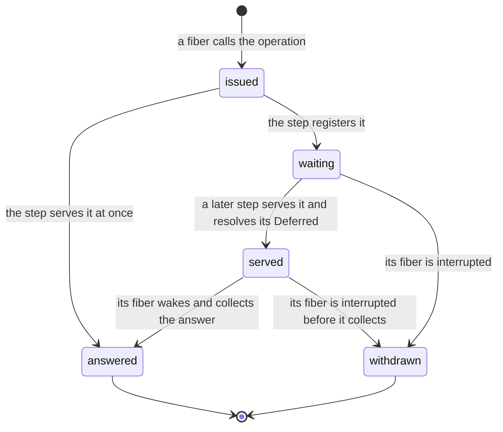

# 2026-10-05 queues: the full review

Status: research note (history, not authority). Base: `4520f3a3` (`refactor/phase1-phase3`).

**The one thing to know first.** Five results change the queues plan.

1. `Deferred` is needed, and it is enough. No explicit Latch is needed: a Latch is derived from one
   cell and `Deferred`.
2. The pinned `Queue` (rc.112) has three defects. Runs on the pin show each one, and the released
   4.0.0 repairs each one.
3. A fourth behaviour is in rc.112 and in 4.0.0, and not in Effect 3.22.2. A taker that waits
   first receives nothing, while a later taker receives every message.
4. So rc.112's source is not a fit reference for the queue. The proposal is one small abstract
   queue that serves its waiters in arrival order, as Effect 3 serves takers.
5. The full API needs list operations that the term language lacks. The plan counted two atoms;
   the batch operations need more, or need rounds.

This note supersedes the recommendations of the queues plan
(`docs/research/2026-10-04-claude-lead/queues-plan.md` §3). Nothing here is a ruling.

## Question

The owner asked four things on 2026-10-05:

1. Does the queue need `Deferred`, an explicit Latch, or neither?
2. Is there a cleaner design than a copy of the TypeScript, and is a divergence justified?
3. What is the full extent of the work, batch operations included?
4. Which faults or regressions of Effect does the reading surface?

## What was read or run

| Item | How |
| --- | --- |
| `vendor/effect-4.0.0-rc.112/src/Queue.ts`, every operation; `Deferred.ts`, `doneUnsafe`; `internal/effect.ts`, the `Latch` class and `callback`; `PubSub.ts`, `pollForItem` | read |
| The same `Queue.ts` in the released 4.0.0, from bun's package cache, compared with the pin | read; tested (a diff of the code lines) |
| `docs/research/2026-10-05-claude-lead/queue-probes/queue-faults.ts` on rc.112, on 4.0.0, on 4.0.1 and on Effect 3.22.2, with bun 1.4.2; each output sits beside it | tested |
| `src/Effect4/Machine/Wake.lean`, `src/Effect4/Machine/Fibers.lean`, `src/Effect4/Machine/Term.lean`, `src/Effect4/Program/Eff.lean` | read |
| Codex's survey, `queue-questions-survey-2026-10-05.md`, and its model `queue-offerer-repoll-probe.py`, in `/private/tmp/codex-effect4-overnight-monitor/` | read |
| The observation packet §2.5 (`docs/research/2026-09-20-open-design-issues-order-and-observation-packet.md`); decisions rows 79, 81, 204, 205 and 216; DI-11 | read |
| The source tree of 4.0.0 against the pin, file by file | tested (a diff) |
| npm's latest version of `effect` | read: 4.0.1. Downloaded on the owner's word; its `Queue.ts` equals 4.0.0's byte for byte (tested) |
| Any Lean file, any proof | not written |

## Findings

### F1. `Deferred`, Latch, and what waiting needs

- **What rc.112's Latch is.** A flag, a list of waiters and a pending batch (`Latch`,
  `vendor/effect-4.0.0-rc.112/src/internal/effect.ts`: reading). `await` answers at once when the
  flag is open, and registers otherwise. `open` and `release` post one task that wakes the batch.
- **A Latch is derived.** One cell holds the flag and the current `Deferred`. `await` reads the
  cell and awaits that `Deferred`. `open` sets the flag and resolves it. `release` swaps in a new
  `Deferred` and resolves the old one. Each is one atomic update and one resolution.
- **The one difference.** rc.112's Latch posts its wake as a task. A `Deferred` wakes its waiters
  inside the resolving step. F5 shows that the recommended queue never depends on that
  difference for its answers.
- **`Deferred` is the one cell that blocks.** A program holds it as first-order data. The machine
  already gives it a waiter list with a cancel rule (`WakeList.cancel`,
  `src/Effect4/Machine/Wake.lean`) and typed-state clauses.
- **Effect's own practice.** rc.112's `PubSub` parks each waiter on its own `Deferred` and removes
  it on interrupt (`pollForItem`, `vendor/effect-4.0.0-rc.112/src/PubSub.ts`: reading).
- **The machine's posted wake stays internal.** `WakeMode.scheduled` and `Task.wake`
  (`src/Effect4/Machine/Fibers.lean`) exist, and no program-visible row reaches them. The queue
  does not need them.

So the answer to question 1: keep `Deferred`, add no Latch. A Latch module lands later as a
derived module, when a program calls it. The corpus has 3 such uses (the queues plan §1).

### F2. The probes: the pin, the release and Effect 3

Each row is one finite run with bun 1.4.2. The probe file states each schedule.

| Probe | What a documented, fair queue answers | Effect 3.22.2 | rc.112, the pin | 4.0.0 and 4.0.1 |
| --- | --- | --- | --- | --- |
| P1. A parks first on an empty queue. B then takes in a loop. Six messages arrive | A receives the first message | A 1, B 5 | **A 0, B 6** | **A 0, B 6** |
| P2. `takeBetween(3, 5)` parks; messages arrive one at a time | it waits for three | waits; then `[1, 2, 3]` | **`[1]` after the first** | waits; then `[1, 2, 3]` |
| P3. One message is buffered; `takeBetween(3, 5)` parks; the queue ends | the taker receives what is left | not run | **the taker stays parked** | `[1]` |
| P4. A full queue; an offer of `b` parks; the queue ends; the offerer is interrupted | `b` is withdrawn | not run | **a later take receives `b`** | the take fails with `Done` |

- **P2, P3 and P4 are defects of the pin.** Each contradicts rc.112's own documentation or leaves
  a fiber parked for ever. 4.0.0 changed the code at each point (F4).
- **The reading found P2 first.** rc.112's `takeBetween` retries with a minimum of 1 after its
  first wait. The run then showed it.
- **P1 is a change from Effect 3.** Effect 3.22.2 serves the taker that waited first. Every
  Effect 4 build lets a running taker receive a message offered while another taker was parked.
  With this schedule the first taker never receives one. 4.0.1 is the latest release on npm.
- **A correction.** The first run of these probes loaded 4.0.0 from bun's cache, not the pin. The
  probe now takes its package directory from `EFFECT_DIR` and prints the version it loaded.

### F3. How far the release is from the pin

The pin is `4.0.0-rc.112`. bun's cache on this machine holds the released 4.0.0, and npm lists
4.0.1 as the latest. The counts below compare 4.0.0 with the pin by code lines, comments removed
(tested).

| File | Code lines removed | Code lines added |
| --- | --- | --- |
| `internal/effect.ts` | 463 | 681 |
| `Queue.ts` | 140 | 127 |
| `Stream.ts` | 185 | 330 |
| `Channel.ts` | 54 | 132 |
| `PubSub.ts` | 37 | 81 |
| `Effect.ts` | 75 | 75 |
| `internal/core.ts` | 23 | 41 |
| `Fiber.ts` | 8 | 16 |
| `Deferred.ts` | 6 | 6 |
| `Ref.ts`, `Semaphore.ts` | 0 | 0 |

In all, 126 of the pin's 452 source files differ, and 4.0.0 adds 36 files. The estate's proofs
transcribe rc.112. Whether to move the pin is a separate decision (proposal 8).

### F4. What the pinned `Queue` does, and what 4.0.0 changed

The pin's queue is one mutable object: a message list, a capacity, a strategy, and a state
`Open`, `Closing` or `Done`. The open state holds three sets: takers, pending offers and awaiters
(`vendor/effect-4.0.0-rc.112/src/Queue.ts`: reading).

| Part | rc.112 | 4.0.0 |
| --- | --- | --- |
| A taker that finds too few messages | Registers a bare callback, then retries when woken | Registers a callback with a readiness test, and tests it once more as it registers |
| The wake of takers | `offer` posts one task on the dispatcher stored at `make`; the task wakes takers in order while messages remain | The same task skips each taker that is not ready |
| `takeBetween` after a wait | Retries with a minimum of 1 | Retries with its own minimum |
| A pending offer | Its entry holds its messages; the take that frees room moves them in and resumes the offerer | The same |
| The queue starts closing | Wakes no taker | Posts the wake of takers |
| A pending offerer is interrupted | Its entry is removed only when the queue is open | Removed while open or closing; a drained closing queue is then finished |
| `shutdown` on a done queue | Answers `true` | Answers `false` |
| A queue of capacity zero | A special case that sets the capacity to 1 and back | A helper that takes one message from the first pending offer |

Two waiting protocols live in this one module:

- **Offerers are served in order.** The step that frees room accepts the pending messages in
  arrival order, inside that step. A later offer cannot overtake (Codex's model, and the source:
  reading).
- **Takers wake and retry.** The wake is posted, and any running fiber may take the message
  before the woken taker runs. P1 measures the result.

### F5. What the formal reading shows

1. **The order of takers is a choice, and Effect 4 changed it.** Effect 3 hands each message to
   the taker that waited longest. Effect 4 wakes a taker and lets it race.
2. **Wake-and-retry makes an answer depend on the schedule.** Which taker receives a message is
   decided after the offer, by which fiber runs first. Under service in order it is decided
   inside the atomic step. Then the time of the wake changes no answer of the queue.
3. **Wake-and-retry cannot keep a batch minimum and also protect the batch taker.** rc.112
   dropped the minimum (P2). 4.0.0 keeps it and lets smaller takers overtake.
4. **The check and the registration must be one step.** rc.112 makes them two. 4.0.0 tests
   readiness once more as it registers. One atomic update makes the question go away.
5. **Closing must wake the takers that wait** (P3).
6. **A withdrawn request must leave the queue in every phase** (P4).
7. **A waiting taker is a free slot.** Then capacity zero needs no special case.

Points 4 to 7 are the three defects and one special case of F2 and F4. Each follows from one
rule: every transition of the queue is one atomic step on one state.

### F6. The proposed design: one cell, one pure step, service in arrival order

The design keeps DI-11: the queue is a composite program over `Ref` and `Deferred`, and no
machine store is added.

- **One cell.** A `Ref` holds one record with these parts:
  - the buffered messages;
  - the requests that wait;
  - the answers of served requests that are not collected yet;
  - the capacity, the strategy and the phase (open, closing or done).
- **One pure step.** Each operation is one `Ref.modify`. Its term takes the state and the
  request. It answers the new state, the reply to the caller, and the `Deferred`s to resolve.
- **Service in arrival order.** A step that adds messages serves the takers that wait, oldest
  first. A step that frees room accepts the offers that wait, oldest first. A new request never
  overtakes a waiting one.
- **A `Deferred` carries no data.** It tells its fiber to look at the cell. Every message stays
  in the cell until its fiber collects it.
- **One wrapper for every operation that waits.** It allocates the `Deferred`, runs the step,
  resolves the answered `Deferred`s, awaits, then collects. It has no retry loop.

The diagram shows the life of one request. It shows states and transitions; it proves nothing.

A served request that is withdrawn returns its messages to the front of the buffer. The same
step then serves the next waiter.

This is a known design, not a new one:

- Effect 3 serves takers this way (P1), and Effect 4 serves offerers this way (F4).
- It is the monitor in which a signal hands the condition to the waiter (Hoare, 1974,
  *Monitors: An Operating System Structuring Concept*; by name). Wake-and-retry is the other
  monitor, in which a signal is a hint (Lampson and Redell, 1980, *Experience with Processes and
  Monitors in Mesa*; by name).

### F7. The full API on this design

| Operation | What its one step does | Waits | Against the pin and 4.0.0 |
| --- | --- | --- | --- |
| `make`, `bounded`, `unbounded`, `dropping`, `sliding` | Allocates the cell with its capacity and strategy | no | The same |
| `offer` | Serves the first waiting taker, or buffers the message. On a full queue: answers `false` (dropping), drops the oldest message (sliding), or registers the offer with its message (suspend) | suspend only | The same answers |
| `offerAll` | Accepts the prefix that fits and registers the rest as one request, so a batch stays together | suspend only | The same answers |
| `take` | Answers the oldest free message, or registers behind the takers that wait | yes | Effect 3's order; Effect 4 lets a running taker overtake |
| `takeBetween`, `takeN`, `takeAll` | Answers at its turn, when its minimum is free; takes up to its maximum | yes | The minimum is kept, as 4.0.0; proposal 4 rules the turn order |
| `poll` | Answers the oldest free message, or `none` | no | Sees only messages that no waiting taker is owed |
| `peek` | Answers the oldest message and leaves it; waits at its turn | yes | The same contract |
| `clear` | Removes every free message, then accepts the offers that wait | no | The same contract |
| `size`, `isFull`, `isEmpty` | Reads the count of free messages | no | Counts free messages only |
| `fail`, `failCause`, `end`, `interrupt` | Records the exit. An empty queue is done at once. Otherwise it is closing, and each waiting taker is served from what is left | no | As 4.0.0 |
| `shutdown` | Drops the buffer, marks the queue done and answers every waiter | no | As 4.0.0 |
| `await` | Registers until the queue is done | yes | The same |
| The interruption of a waiter | Withdraws its request in every phase | — | As 4.0.0 |
| `into`, `collect` | Derived from the operations above | — | `into` needs the mask that restores the caller's state (row 216) |

A message is free when no waiting taker is owed it. Capacity counts free messages. A waiting
taker therefore counts as one free slot, and `bounded(0)` works with no special case.

### F8. The term language has no iteration

A binder term is built from variables, literals, atoms, records and tuples. The list atoms are
`listNil`, `listCons`, `listGet`, `listLength` and `listAppend` (`NativeAtom`,
`src/Effect4/Machine/Term.lean`: reading). No term loops.

Some steps of F7 act on several list elements at once:

- `offerAll` may serve several takers.
- A batch take or `clear` may accept several pending offers.
- A withdrawal removes one request from the middle of a list.

Three routes are open.

| Route | What it adds | Cost |
| --- | --- | --- |
| (a) Bulk atoms and rounds | `listTake`, `listDrop` and a removal by a `Deferred`'s identity. A step serves one waiter; the wrapper repeats the step while more can be served | Three or four total atoms. One more invariant: no fiber is inside a round when the machine is quiet |
| (b) A list fold in terms | One term constructor whose body binds the accumulator and the element | A change to the term language: scope, typing, evaluation, the faces. Every step is then one term with no rounds |
| (c) One atom per queue step | The step function as a native atom | The TypeScript body of each atom is written by hand and only tested |

Route (a) builds on what exists. Route (b) is the general tool, and `Semaphore` and `PubSub`
need the same kind of scan. Route (c) moves the queue's logic out of the verified language, so
this note rejects it.

### F9. Who may write the cell

A queue typed as `Ref<{…}>` accepts any well-typed write. A program can store more messages than
the capacity, or erase the takers that wait. The law therefore covers only a client that uses
the cell through the queue's operations. Codex's survey reports the same gap.

The proposal: state the law for a client written against abstract queue operations, then expand
those operations. `Eff` is already generic in its operations, and forms already have expansions
that read back. No nominal type and no store is needed. The comparison hides the queue's cell
and its `Deferred`s, because the machine's observation holds every store (`Obs`,
`src/Effect4/Laws/Machine/Behaviour.lean`).

### F10. Interruption

| Where the interrupt lands | What the cleanup does | Why no message is lost |
| --- | --- | --- |
| Before the request's step | Nothing: the cell holds no such request | The withdrawal of an unknown `Deferred` changes nothing |
| While the request waits | Removes the request | No message was owed to it |
| After it is served, before its fiber collects | Returns its messages to the front; the step serves the next waiter | The order of delivered messages is kept |
| Between a step and its resolutions | Cannot land: the pair runs under `uninterruptible` | A budget cut only delays the resolutions |
| After the fiber collects | The operation has returned | The interrupt belongs to the caller, as in rc.112 |

- The cleanup is installed before the request's step, with `onExit`. So no window is open between
  the registration and the cleanup.
- The wait itself runs at the caller's own interruptibility. So the queue's operations need no
  mask that restores the caller's state. `into` does (row 216).
- An offer whose messages were accepted stays accepted when its fiber is interrupted.

These are design claims (reading). The design phase tests each window with a finite run that
interrupts at every step boundary.

### F11. The law and its reference

- **The reference is the pure step.** It is a transition system over the record of F6. Its laws
  are pure. They cover order, loss, duplication, capacity, each batch minimum, the drain of a
  closing queue and a withdrawn answer's return.
- **The composite's law is a simulation.** A client over the composite behaves as the same
  client over the abstract queue. The observation is the answer of each request. One
  `Ref.modify` maps to one abstract step, and every other step maps to none.
- **The profile** follows the observation packet §2.5. It hides the private cell and
  `Deferred`s, and its direction is "included". It promises no progress beyond the quiet-state
  property below.
- **Progress, as far as it is provable now.** At a deadlocked machine no taker waits while a free
  message exists, and no offer waits while room exists. This reads on
  `frontier_empty_iff_deadlocked` (`src/Effect4/Laws/Api/Frontier.lean`). Fairness on infinite
  tapes stays open (R12, part c).
- **Against Effect.** The four probes are the controls, with the answer each version gives. The
  37 `Queue` documentation examples under `harness/streams/` are the wider finite check, once the
  composite prints (slice T5).

### F12. The obligations

Each name is a proposal. None is declared.

| Property | Concept, requirement | Consumer | Does not establish |
| --- | --- | --- | --- |
| The pure queue's laws: order, no loss, no duplication, capacity, batch minimum, drain, withdrawal | `translation-simulation`, R10 | Every client proof; the simulation below | Anything about the machine |
| `queueStep_agrees`: each step term evaluates to the pure step | `translation-simulation`, R10 | The simulation | Typing; interruption |
| `queueState_typed`: the cell's type is formed, and each operation is well typed at any element type | `store-typing`, R4 and R10 | M5 and M6 applied to the expansion | The queue's invariant: a type does not carry it |
| `queueWaiter_cleanup`: a withdrawn request leaves the cell, and a served answer returns | `scope-lifetime-finalization`, R10 and R11 | Every operation that waits; p3's interrupts | Liveness |
| `queueExpansion_refines`: the simulation of F11 | `translation-simulation`, R10 | The named `Agrees` claim (row 79); streams | Equal schedules with Effect; fairness |
| The quiet-state property of F11 | `reactive-scheduling`, R12 | The frontier classification | Progress on infinite tapes |
| The laws of the new list atoms | `store-typing`, R4 | The step terms | — |

### F13. Costs and limits

- One `Deferred` is allocated for each request that waits. The native engine never reclaims it.
- Each step copies the message list. Measure before changing the representation.
- Under strict arrival order a batch taker at the head blocks the takers behind it (proposal 4).
- The acceptance program p3 must not promise the worker that receives each job (Codex's survey).

## Proposals (not rulings)

1. **No Latch primitive.** Close row 81 for queues. A Latch module is a derived module, later.
2. **Serve waiters in arrival order.** Sign it as a divergence from Effect 4's order of takers,
   with P1 as its control. The alternative is Effect 4's wake-and-retry, which keeps P1's
   behaviour and the retry loop.
3. **Follow 4.0.0, not the pin, at P2, P3 and P4.** Register each as a counterexample of the
   pin's `Queue`.
4. **The turn order of batch takers.** Strict arrival order is the simplest law. 4.0.0 serves
   the first ready taker and may pass a larger one. Recommended: strict order.
5. **Iteration.** Route (a) for the queue. Decide route (b) before `Semaphore` and `PubSub`.
6. **The law's clients.** State the law over abstract queue operations and their expansion.
7. **Upstream.** Record P1 in `docs/UPSTREAM-BACKLOG.md` as a candidate. A parked taker can be
   starved in 4.0.1, and Effect 3 does not do this. Reporting is the owner's decision.
8. **The pin.** Open a decision on moving the pin from rc.112 to the release. First audit what
   F3's changes touch in the proved runtime.
9. **The slices, re-cut.**
   1. The pure queue and its laws in Lean. It needs nothing from T3b and can start now.
   2. The list atoms, after T3b merges.
   3. The wrapper, `offer`, `take`, `poll`, `size`, and p3.
   4. The batch operations, the three strategies and capacity zero.
   5. `end`, `fail`, `shutdown`, `await`, and row 205's named connection.
   6. The faces after T5, and the documentation examples as the finite check.

## What this does not establish

- Each probe is one finite run on one schedule with bun 1.4.2. None is a proof, and none says
  what the maintainers intend.
- Effect 3's source was not read here. Its row of F2 rests on the run alone.
- The design of F6 to F10 is a proposal. No Lean was written, and the step function is not
  written out.
- That service in order makes each answer independent of the wake's time is an argument from
  reading. The simulation of F11 is its proof, and it is not written.
- The count of atoms in F8 is an estimate from the operations of F7.
