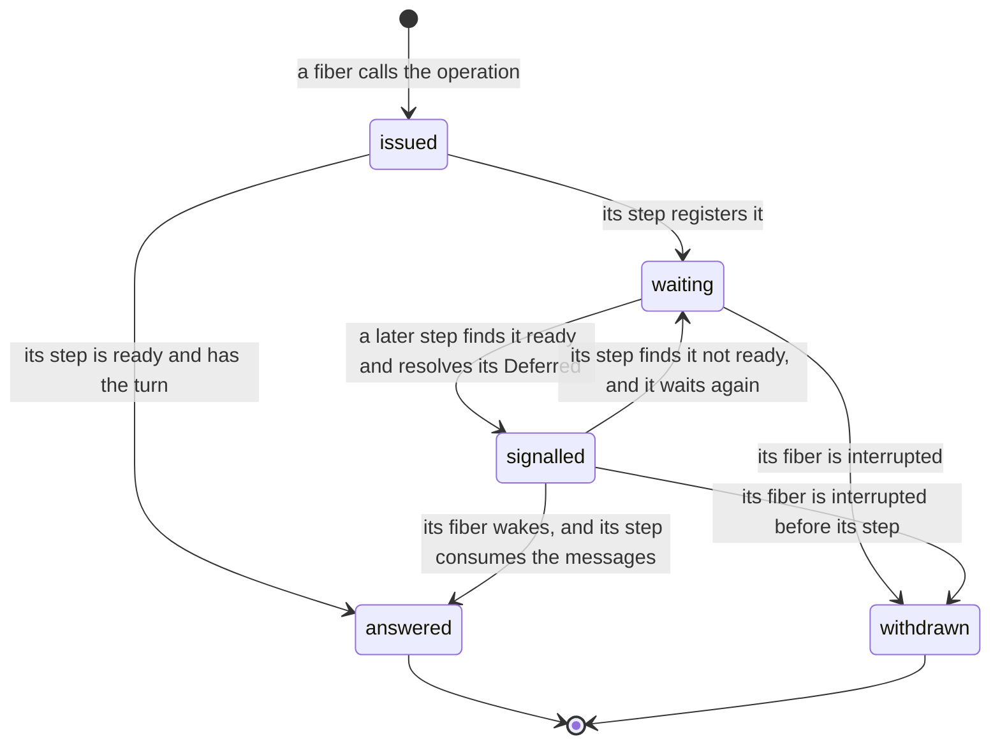

# 2026-10-05 queues: the full review

Status: research note (history, not authority). Base: `4520f3a3` (`refactor/phase1-phase3`).

**The one thing to know first.** Five results change the queues plan.

1. The queue needs `Deferred`, the blocking cell this tree already has, and no Latch.
2. The pinned `Queue` (rc.112) has three defects. Runs on the pin show each one, and the released
   4.0.0 repairs each one.
3. A fourth behaviour is in every Effect 4 build, and not in Effect 3.22.2. In the finite runs a
   later taker receives each message while an earlier taker waits.
4. So rc.112's source is not a fit reference for the queue. The proposal is one small abstract
   queue: Effect 4's wake-and-retry with a turn check, each transition one atomic step.
5. The full API needs list operations that the term language lacks. The plan counted two atoms;
   the batch operations need more, or need rounds.

This note supersedes the recommendations of the queues plan
(`docs/research/2026-10-04-claude-lead/queues-plan.md` §3). Nothing here is a ruling.

The note was amended on 2026-10-05 after Codex's review. The section "What Codex's review
changed" lists the claims of the first draft that it refuted, and F5 to F13 state the corrected
contract.

Codex's third review, of the same day, narrowed the timing claim once more. Probes P5 to P7 of
F2 measure what it found. Proposal 10 states the choice that it leaves open.

## Question

The owner asked four things on 2026-10-05:

1. Does the queue need `Deferred`, an explicit Latch, or neither?
2. Is there a cleaner design than a copy of the TypeScript, and is a divergence justified?
3. What is the full extent of the work, batch operations included?
4. Which faults or regressions of Effect does the reading surface?

## What was read or run

| Item | How |
| --- | --- |
| `vendor/effect-4.0.0-rc.112/src/Queue.ts`, every operation; `Deferred.ts`, `doneUnsafe`; `internal/effect.ts`, the `Latch` class and `callback`; `PubSub.ts`, `pollForItem` | read |
| The same `Queue.ts` in the released 4.0.0, from bun's package cache, compared with the pin | read; tested (a diff of the code lines) |
| `docs/research/2026-10-05-claude-lead/queue-probes/queue-faults.ts` on rc.112, on 4.0.0, on 4.0.1 and on Effect 3.22.2, with bun 1.4.2; each output sits beside it | tested |
| `src/Effect4/Machine/Wake.lean`, `src/Effect4/Machine/Fibers.lean`, `src/Effect4/Machine/Term.lean`, `src/Effect4/Program/Eff.lean` | read |
| Codex's survey, `queue-questions-survey-2026-10-05.md`, and its model `queue-offerer-repoll-probe.py`, in `/private/tmp/codex-effect4-overnight-monitor/` | read |
| The observation packet §2.5 (`docs/research/2026-09-20-open-design-issues-order-and-observation-packet.md`); decisions rows 79, 81, 204 and 205; DI-11 | read |
| The source tree of 4.0.0 against the pin, file by file | tested (a diff) |
| npm's latest version of `effect` | read: 4.0.1. Downloaded on the owner's word; its `Queue.ts` equals 4.0.0's byte for byte (tested) |
| Codex's review of the first draft, `plan-review.md`, in `/private/tmp/codex-effect4-overnight-monitor/2026-10-05-deferred-latch-probes/`, and its follow-up on the amendment | read; each finding checked by reading; its model assertions were not run again |
| `docs/research/2026-10-05-claude-lead/queue-probes/QueueModel.lean`, a pure model of the corrected contract | tested: every control holds, and the bounded exploration passes |
| Codex's third review, `review.md`, in `/private/tmp/codex-effect4-overnight-monitor/2026-10-05-strict-timing-review/` | read; its two witnesses and its control are pinned in the model |
| `docs/research/2026-10-05-claude-lead/queue-probes/queue-timing.ts` on rc.112, on 4.0.0, on 4.0.1 and on Effect 3.22.2, with bun 1.4.2; each output sits beside it | tested |
| Any Lean file of the tree, any proof | not written |

## Findings

### F1. `Deferred`, Latch, and what waiting needs

- **What rc.112's Latch is.** A flag, a list of waiters and a pending batch (`Latch`,
  `vendor/effect-4.0.0-rc.112/src/internal/effect.ts`: reading). `await` answers at once when the
  flag is open, and registers otherwise. `open` and `release` post one task that wakes the batch.
- **A Latch is derived.** One cell holds the flag and the current `Deferred`. `await` reads the
  cell and awaits that `Deferred`. `open` sets the flag and resolves it. `release` swaps in a new
  `Deferred` and resolves the old one. Each is one atomic update and one resolution.
- **The one difference.** rc.112's Latch posts its wake as a task. A `Deferred` wakes its waiters
  inside the resolving step. Which of the two the queue's signal uses is a choice (F5.9,
  proposal 10).
- **`Deferred` is the blocking cell this tree chose.** A program holds it as first-order data. The machine
  already gives it a waiter list with a cancel rule (`WakeList.cancel`,
  `src/Effect4/Machine/Wake.lean`) and typed-state clauses.
- **Effect's own practice.** rc.112's `PubSub` parks each waiter on its own `Deferred` and removes
  it on interrupt (`pollForItem`, `vendor/effect-4.0.0-rc.112/src/PubSub.ts`: reading).
- **The machine's posted wake stays internal.** `WakeMode.scheduled` and `Task.wake`
  (`src/Effect4/Machine/Fibers.lean`) exist, and no program-visible row reaches them. Proposal 10
  says when the queue needs them.

So the answer to question 1: keep `Deferred`, and add no Latch for the queue. The derivation
above is a sketch. It does not discharge row 81, which asks what a Latch module owes on its
batch, its cancellation, its coalescing and its dispatcher. The corpus has 3 uses of Latch (the
queues plan §1).

### F2. The probes: the pin, the release and Effect 3

Each row is one finite run with bun 1.4.2. The probe file states each schedule.

| Probe | What a documented, fair queue answers | Effect 3.22.2 | rc.112, the pin | 4.0.0 and 4.0.1 |
| --- | --- | --- | --- | --- |
| P1. A parks first on an empty queue. B then takes in a loop. Six messages arrive | A receives the first message | A 1, B 5 | **A 0, B 6** | **A 0, B 6** |
| P2. `takeBetween(3, 5)` parks; messages arrive one at a time | it waits for three | waits; then `[1, 2, 3]` | **`[1]` after the first** | waits; then `[1, 2, 3]` |
| P3. One message is buffered; `takeBetween(3, 5)` parks; the queue ends | the taker receives what is left | not run | **the taker stays parked** | `[1]` |
| P4. A full queue; an offer of `b` parks; the queue ends; the offerer is interrupted | `b` is withdrawn | not run | **a later take receives `b`** | the take fails with `Done` |
| P5. A taker parks in `takeBetween(1, 2)`. One fiber offers `1`, then `2`, with no yield between | either batch | `[1]` | `[1, 2]` | `[1, 2]` |
| P6. A sliding queue of capacity one; a taker parks; one fiber offers `1`, then `2`, with no yield between | no message is lost while a taker waits | the taker receives `1`; `2` stays | **the taker receives `2`; `1` is discarded** | **the taker receives `2`; `1` is discarded** |
| P7. A dropping queue of capacity one; a taker parks; one fiber offers `1`, then `2`, with no yield between | both offers are accepted while a taker waits | both accepted | **the second offer answers `false`** | **the second offer answers `false`** |

- **P2, P3 and P4 are defects of the pin.** Each contradicts rc.112's own documentation or leaves
  a fiber parked for ever. 4.0.0 changed the code at each point (F4).
- **The reading found P2 first.** rc.112's `takeBetween` retries with a minimum of 1 after its
  first wait. The run then showed it.
- **P1 is a change from Effect 3.** Effect 3.22.2 serves the taker that waited first. Every
  Effect 4 build lets a running taker receive a message offered while another taker was parked.
  In six rounds the first taker receives none. 4.0.1 is the latest release on npm. Codex's own
  run of eight rounds shows the same, with a control. This is a finite bypass, not a proof of
  starvation.
- **P5 to P7 are a second change from Effect 3.** Effect 3.22.2 answers as a queue that hands
  the first message to the parked taker inside the offer (the runs; its source was not read).
  Every Effect 4 build posts the wake, so the second offer runs before the parked taker does. A sliding queue then discards a message, and a dropping queue
  refuses one, while a taker waits.
- **In Effect 4 these answers depend on a yield.** When the offering fiber yields between its two
  offers, every build answers as Effect 3 does. No Effect 3 answer changes with the yield.
- **A correction.** The first run of these probes loaded 4.0.0 from bun's cache, not the pin. The
  probe now takes its package directory from `EFFECT_DIR` and prints the version it loaded.

### F3. How far the release is from the pin

The pin is `4.0.0-rc.112`. bun's cache on this machine holds the released 4.0.0, and npm lists
4.0.1 as the latest. The counts below compare 4.0.0 with the pin by code lines, comments removed
(tested).

| File | Code lines removed | Code lines added |
| --- | --- | --- |
| `internal/effect.ts` | 463 | 681 |
| `Queue.ts` | 140 | 127 |
| `Stream.ts` | 185 | 330 |
| `Channel.ts` | 54 | 132 |
| `PubSub.ts` | 37 | 81 |
| `Effect.ts` | 75 | 75 |
| `internal/core.ts` | 23 | 41 |
| `Fiber.ts` | 8 | 16 |
| `Deferred.ts` | 6 | 6 |
| `Ref.ts`, `Semaphore.ts` | 0 | 0 |

In all, 126 of the pin's 452 source files differ, and 4.0.0 adds 36 files. The estate's proofs
transcribe rc.112. Whether to move the pin is a separate decision (proposal 8).

### F4. What the pinned `Queue` does, and what 4.0.0 changed

The pin's queue is one mutable object: a message list, a capacity, a strategy, and a state
`Open`, `Closing` or `Done`. The open state holds three sets: takers, pending offers and awaiters
(`vendor/effect-4.0.0-rc.112/src/Queue.ts`: reading).

| Part | rc.112 | 4.0.0 |
| --- | --- | --- |
| A taker that finds too few messages | Registers a bare callback, then retries when woken | Registers a callback with a readiness test, and tests it once more as it registers |
| The wake of takers | `offer` posts one task on the dispatcher stored at `make`; the task wakes takers in order while messages remain | The same task skips each taker that is not ready |
| `takeBetween` after a wait | Retries with a minimum of 1 | Retries with its own minimum |
| A pending offer | Its entry holds its messages; the take that frees room moves them in and resumes the offerer | The same |
| The queue starts closing | Wakes no taker | Posts the wake of takers |
| A pending offerer is interrupted | Its entry is removed only when the queue is open | Removed while open or closing; a drained closing queue is then finished |
| `shutdown` on a done queue | Answers `true` | Answers `false` |
| A queue of capacity zero | A special case that sets the capacity to 1 and back | A helper that takes one message from the first pending offer |

Two waiting protocols live in this one module:

- **Offerers are served in order.** The step that frees room accepts the pending messages in
  arrival order, inside that step. A later offer cannot overtake (Codex's model, and the source:
  reading).
- **Takers wake and retry.** The wake is posted, and any running fiber may take the message
  before the woken taker runs. P1 measures the result.

### F5. What the formal reading shows

1. **The order of takers is a choice, and Effect 4 changed it.** In the run of F2, Effect 3 hands
   the first message to the taker that waited longest. Effect 4 wakes a taker and lets it race.
2. **A turn check fixes who may consume. It does not fix what a retry returns.** A turn check
   inside the atomic step stops a take from passing an earlier request that is eligible. Under
   `strict` order the oldest waiting taker consumes next. Under either policy the time of a
   retry can still change an answer (Codex's third review). P5 to P7 show three: a batch's
   length, a sliding queue's value, and a dropping offer's answer.
3. **A batch minimum and the batch taker's turn can both be kept.** rc.112 dropped the minimum
   (P2). 4.0.1 keeps it and lets a new take pass. A retry that checks its turn and its minimum
   inside the atomic step keeps both (Codex's review).
4. **The check and the registration must be one step.** rc.112 makes them two. 4.0.1 tests
   readiness once more as it registers. One atomic update makes the question go away.
5. **Closing must wake the takers that wait** (P3).
6. **A withdrawn request must leave the queue in every phase** (P4).
7. **Capacity zero needs no special state.** The taker's step takes the message from the first
   pending offer, as 4.0.1 does.
8. **Consumption needs one irreversible point.** The proposal: the atomic step of the taker that
   receives the message. A request that is withdrawn then never held a message.
9. **The time of a retry is the delivery of its signal, and that is a choice.** A `Deferred`
   wakes its waiters inside the resolving step. The signalled request then runs its step before
   the signalling fiber's next step, which gives Effect 3's answers on P5 to P7. A posted signal
   runs it after the signalling fiber stops, which gives Effect 4's answers. The model's early
   and late retries are these two positions.

### F6. The proposed design: Effect 4's protocol with a turn check, in one cell

The design keeps DI-11: the queue is a composite program over `Ref` and `Deferred`, and no
machine store is added.

- **One cell.** A `Ref` holds one record with these parts:
  - the buffered messages;
  - the take requests that wait, in arrival order, each with its bounds;
  - the pending offers, in arrival order, each with its messages;
  - the awaiters, the capacity, the strategy and the phase (open, closing or done).
- **One pure step.** Each operation is one `Ref.modify`. Its term takes the state and the
  request. It answers the new state, the reply to the caller, and the requests to signal.
- **No reservation.** A message leaves the buffer only in the step of the taker that receives
  it.
- **A turn check.** A take succeeds only when it is ready and no earlier waiting taker blocks it.
  A new take registers behind the takers that wait.
- **Offers in order.** A pending offer keeps its messages. The step that frees room accepts them
  in arrival order, as rc.112 and 4.0.1 do.
- **A `Deferred` is a hint.** The signalled request runs its own step again. A request that must
  wait again takes a fresh `Deferred`.
- **One wrapper for every operation that waits.** It installs the cleanup, runs the step,
  resolves the signals the step answered, awaits, and runs the step again.

The diagram shows the life of one request. It shows states and transitions; it proves nothing.

This is Effect 4's own wake-and-retry (F4) with one added rule, the turn check. It is not the
signalling of Hoare's monitors: the signaller keeps running, and the woken request checks again
(Codex's review).

A pure Lean model states this contract and runs it:
`docs/research/2026-10-05-claude-lead/queue-probes/QueueModel.lean`, with its output beside it
(tested). It imports nothing from the tree.

- Each of Codex's countermodels is a control that holds on it.
- So are P1, P2 and P4, and Codex's contender for the order of offers.
- A bounded exploration runs every sequence of at most five operations from ten: 111,111 runs
  for each configuration. The 22 configurations are both turn policies with `suspend` and
  `dropping` at four capacities, and with `sliding` at three. Each run keeps two properties. A
  bounded queue never exceeds its capacity. A taker that is ready and has the turn was signalled.
- A red control drops the signal of a withdrawal, and the exploration then fails.
- A take with a zero bound answers the empty batch, as 4.0.1 does.
- Codex's timing traces are controls. On the first, the answers under `readyFirst` differ with
  the time of a retry. On `batchTiming`, `scalarTiming` and `droppingTiming` they differ under
  either policy. The early retry answers as Effect 3 does on P5 to P7, and the late retry as
  Effect 4 does.
- `batchBehindSingles` is the control for the turn policy. Under `readyFirst`, single takes keep
  a batch of two waiting after three messages. Under `strict` the batch is served at the second
  message. It is a finite run and no liveness theorem.

### F7. The full API on this design

| Operation | What its one step does | Waits | Against the pin and 4.0.1 |
| --- | --- | --- | --- |
| `make`, `bounded`, `unbounded`, `dropping`, `sliding` | Allocates the cell with its capacity and strategy | no | The same |
| `offer` | Buffers the message when room exists. On a full queue: answers `false` (dropping), drops the oldest message (sliding), or registers the offer with its message (suspend) | suspend only | The same answers |
| `offerAll` | Accepts the prefix that fits. Registers the rest as one request (suspend) or answers it as the remainder | suspend only | The same answers |
| `take` | Consumes the oldest message when it is ready and has the turn; otherwise registers behind the takers that wait | yes | 4.0.1 lets a new take pass a waiting one |
| `takeBetween`, `takeN`, `takeAll` | The same, with its minimum capped as 4.0.1 caps it; takes up to its maximum | yes | The minimum is kept, as 4.0.1 |
| `poll` | Consumes the oldest message, or answers `none`; never passes a taker that is ready | no | 4.0.1's `poll` may pass a waiting taker |
| `peek` | Answers the oldest message and leaves it; waits at its turn | yes | The same contract |
| `clear` | Removes every buffered message, then accepts the offers that wait | no | The same contract |
| `size`, `isFull`, `isEmpty` | Reads the count of buffered messages | no | The same |
| `fail`, `failCause`, `end`, `interrupt` | Records the exit. An empty queue is done at once. Otherwise it is closing: a taker then needs one message only | no | As 4.0.1 |
| `shutdown` | Drops the buffer, marks the queue done and signals every waiter | no | As 4.0.1 |
| `await` | Registers until the queue is done | yes | The same |
| The interruption of a waiter | Withdraws its request in every phase | — | As 4.0.1 |
| `into`, `collect` | Derived from the operations above | — | `into` needs the mask that restores the caller's state |

Capacity counts buffered messages. A capacity of zero works through the taker's step, which
takes from the first pending offer. The contract keeps `offerAll`'s returned remainder, and the
separate terminal answers of `poll`, `clear` and `take` (Codex's review).

### F8. The term language has no iteration

A binder term is built from variables, literals, atoms, records and tuples. The list atoms are
`listNil`, `listCons`, `listGet`, `listLength` and `listAppend` (`NativeAtom`,
`src/Effect4/Machine/Term.lean`: reading). No term loops.

Some steps of F7 act on several list elements at once:

- a batch offer may make several takers ready;
- a batch take or `clear` may accept several pending offers;
- a withdrawal removes one request from the middle of a list.

Three routes were open.

| Route | What it adds | Cost |
| --- | --- | --- |
| (a) Bulk atoms and rounds | `listTake`, `listDrop` and a removal by a `Deferred`'s identity. A step serves one waiter; the wrapper repeats the step | Each unfinished round needs an owner that finishes it (Codex's review) |
| (b) A list fold in terms | One term constructor whose body binds the accumulator and the element | A change to the term language: scope, typing, evaluation, the faces |
| (c) One atom per queue step | The step function as a native atom | The TypeScript body of each atom is written by hand and only tested |

The owner chose route (b) on 2026-10-05, in conversation: the fold, with bulk atoms where a named
consumer needs them. The groundwork plan carries it
(`docs/research/2026-10-05-claude-lead/groundwork-plan.md`). With the fold, one step computes the
whole service pass, and no round is needed. The list of requests to signal still needs an owner
(F10).

### F9. Who may write the cell

A queue typed as `Ref<{…}>` accepts any well-typed write. A program can store more messages than
the capacity, or erase the takers that wait. The law therefore covers only a client that uses
the cell through the queue's operations. Codex's survey reports the same gap.

The proposal: state the law for a client written against abstract queue operations, then expand
those operations. `Eff` is already generic in its operations, and forms already have expansions
that read back. No nominal type and no store is needed. The comparison hides the queue's cell
and its `Deferred`s, because the machine's observation holds every store (`Obs`,
`src/Effect4/Laws/Machine/Behaviour.lean`).

### F10. Interruption

| Where the interrupt lands | What happens | What holds |
| --- | --- | --- |
| Before the request's step | The cleanup finds no request | Nothing changes |
| While the request waits, signalled or not | The cleanup removes the request, and its step signals the next taker that is ready | The request held no message, so none is returned |
| Between a step and its signals | It cannot land: the pair runs under `uninterruptible`. Another fiber may still run in between | The signalling fiber owns the unfinished signals, and it stays runnable |
| After a take's step consumed a message, before the caller receives it | The message is consumed and not returned | rc.112 has the same boundary: its take removes the message before the fiber continues |
| After the caller receives the answer | — | The interrupt belongs to the caller |

- The cleanup is installed before the request's step, with `onExit`. So no window is open between
  the registration and the cleanup.
- The wait itself runs at the caller's own interruptibility. So the queue's operations need no
  mask that restores the caller's state. `into` does.
- An offer whose messages were accepted stays accepted when its fiber is interrupted.
- The fourth row is the contract's stated limit. The machine replaces a success by a pending
  interrupt when a mask is left (`ensure_setInterruptible_substitutes`,
  `src/Effect4/Machine/Frames.lean`: reading). A rule that returns the message breaks the order
  of successful takes (Codex's first countermodel).

These are design claims (reading), apart from the model's controls. The design phase tests each
window with a finite run that interrupts at every step boundary.

### F11. The law and its reference

- **The reference is the pure step.** It is a transition system over the record of F6, and the
  model of F6 is its first draft.
- **Conservation, with named discards.** Each accepted message is buffered, or was consumed by
  one take step, or was discarded by a named rule: dropping, sliding, `clear` or `shutdown`.
- **Order.** Take steps consume from the front of the buffer, so successful takes answer in the
  order of acceptance.
- **Eligibility.** A request is eligible by its phase, its bounds, the capacity and its turn. The
  minimum is capped as 4.0.1 caps it, and a closing queue serves a shorter batch.
- **The composite's law is a simulation.** A client over the composite behaves as the same
  client over the abstract queue. A call, an answer and a withdrawal each map to themselves.
  Only the wrapper's private steps map to none. The relation covers a request that waits, one
  that is signalled, and a signal that is not yet resolved.
- **The profile** is the queue's own (row 79): the private cell and `Deferred`s hidden, and the
  direction "included". No common profile is signed for every derived module.
- **Timing.** With no withdrawal, each answer is fixed by the order of the atomic steps. That
  order includes each retry step. So the time of a wake can change an answer under either
  policy: a batch's length, a sliding queue's value, a dropping offer's answer. Under
  `readyFirst` it can also change which request consumes. With a withdrawal it can change which
  request receives a message under either policy (Codex's reviews). The law names the position
  of each retry as a decision (row 79), or the signal's delivery fixes it (proposal 10).
- **Progress, as far as it is provable now.** At a quiet machine no eligible request waits
  without its signal. A head batch that needs three may wait with one message buffered.
  `frontier_empty_iff_deadlocked` (`src/Effect4/Laws/Api/Frontier.lean`) classifies the machine's
  work; it gives no readiness theorem for the queue. Fairness on infinite tapes stays open (R12,
  part c).
- **Against Effect.** The probes of F2 are the controls, with the answer each version gives. The
  37 `Queue` documentation examples under `harness/streams/` are the wider finite check, once the
  composite prints (slice T5).

### F12. The obligations

Each name is a proposal. None is declared. The first four rows follow Codex's review.

| Property | Concept, requirement | Consumer | Does not establish |
| --- | --- | --- | --- |
| Consumption, withdrawal and conservation, with the named discards | `translation-simulation`, R10; the cell's invariant serves R4 | The cleanup; the simulation | Liveness |
| Eligibility and the closing drain: no eligible request waits unsignalled at a quiet machine | `reactive-scheduling`, R10 and R12 | The frontier classification; streams | Fairness on infinite tapes |
| Ownership of signals: the cleanup is installed, the caller's interruptibility is kept, and every signal is resolved or handed on | `scope-lifetime-finalization`, R10 and R11 | Every wrapper that waits | That a whole run releases its resources |
| The fold's evaluation and typing, with two binders at any types | `store-typing` and `translation-simulation`, R4 and R10 | The queue's atomic step; seat T3b's operation terms | The queue's invariant: a type does not carry it |
| `queueStep_agrees`: each step term evaluates to the pure step | `translation-simulation`, R10 | The simulation | Typing; interruption |
| `queueState_typed`: the cell's type is formed, and each operation is well typed at any element type | `store-typing`, R4 and R10 | M5 and M6 applied to the expansion | The queue's invariant |
| `queueExpansion_refines`: the simulation of F11 | `translation-simulation`, R10, the queue's profile (row 79) | The named `Agrees` claim; p3; streams | Equal tapes with Effect; fairness |

### F13. Costs and limits

- One `Deferred` is allocated each time a request waits. The native engine never reclaims it.
- Each step copies the message list. Measure before changing the representation.
- The turn policy is a choice (proposal 4). Under `strict`, a batch taker at the head blocks the
  takers behind it. Under `readyFirst`, single takers may pass a batch taker that is not ready.
- The delivery of a signal is a choice (proposal 10). It decides the answers of P5 to P7.
- At capacity zero an offer waits until a taker's step takes its message. Effect accepts the
  offer at once when a taker waits.
- `sliding` at capacity zero stores one message in 4.0.1. The contract must refuse that
  configuration or define it. The model pins it and leaves it out of the exploration.
- The acceptance program p3 must not promise the worker that receives each job (Codex's survey).

## What Codex's review changed

Codex reviewed the first draft on 2026-10-05
(`/private/tmp/codex-effect4-overnight-monitor/2026-10-05-deferred-latch-probes/plan-review.md`).
The first draft served a taker by reserving a message for it, and returned the message when the
taker withdrew. This review checked each finding by reading, and the model above confirms the
replacement on each countermodel.

| The first draft's claim | Codex's countermodel | The replacement |
| --- | --- | --- |
| A withdrawn request's served answer returns to the front | T1 holds `a`, T2 holds `b`; T1 withdraws; T2 answers `b`; a new T3 answers `a` | No reservation; consumption at the taker's own step |
| A waiting taker counts as a free slot | Capacity one: reserve `a`, buffer `b`, withdraw the reservation: two messages | Capacity counts buffered messages |
| The terminal phases, with a served answer not collected | The queue is done, and a late withdrawal returns an answer into it | No such state: a closing queue stays closing while a message remains |
| Collecting an answer is returning it | An interrupt that is pending replaces the success when a mask is left | The stated limit of F10 |
| No taker waits while a message is free | A head batch needs three, and one message is buffered | Eligibility by phase, bounds, capacity and turn |
| Rounds, with no owner | The serving fiber stops between two rounds | The fold; an owner for the signal list |
| The time of the wake changes no answer; every other step maps to none | A withdrawal after a message was assigned | F11's timing and simulation clauses |

Codex's follow-up on the amendment
(`/private/tmp/codex-effect4-overnight-monitor/2026-10-05-queue-amendment-review/review.md`) made
three more corrections. Each is applied above and in the model:

- F5.2 claimed too much for `readyFirst`: eligibility can change before a retry.
- The model accepted zero bounds without the empty answer that 4.0.1 gives.
- The exploration covered `suspend` only, and `sliding` at capacity zero breaks the capacity
  bound.

Codex's third review
(`/private/tmp/codex-effect4-overnight-monitor/2026-10-05-strict-timing-review/review.md`) made
one more correction. It is applied above and in the model:

- The amendment said that `strict` order removes the time of a wake from every answer. It does
  not. `strict` fixes who may consume at its step. The batch's length, a sliding queue's value
  and a dropping offer's answer still depend on the time of the retry.
- So `strict` alone does not show that the queue can do without a posted wake. P5 to P7 measure
  the three cases on the four builds.

Claims that the review narrowed:

- `Deferred` is the blocking basis this tree chose. No theorem says it is the only possible one.
- The Latch sketch of F1 is a candidate. It does not discharge row 81's obligations.
- The first draft said wake-and-retry cannot keep a batch minimum. A turn check inside the step
  refutes that.
- The first draft called its design Hoare's signalling. It is not.
- P1 is a bypass in finite runs. It is not a proof of starvation.
- The first draft cited a decisions row 216. The register ends at row 213: the rulings of
  2026-10-05 on the derived forms plan are not written there yet.

## Proposals (not rulings)

1. **No Latch for the queue.** Row 81's Latch obligations are separate, and they stay open.
2. **The contract of F6.** Effect 4's wake-and-retry with a turn check, and consumption at the
   taker's own step. The turn check is the one divergence from 4.0.1. P1 is its control.
3. **Follow 4.0.1 at P2, P3 and P4.** They are defects of the pin, not of the latest release.
4. **The turn policy.** `strict`: the oldest waiting taker consumes next. Its cost: a batch at
   the head blocks the takers behind it, which 4.0.1 does not do. `readyFirst` is 4.0.1's order
   of service without the bypass. Its cost: single takes can keep a batch waiting
   (`batchBehindSingles`), and the time of a retry can change which request consumes. Neither
   policy removes the time of a retry from the answers. Recommended: `strict`, for its order
   law alone. The reason that the amendment gave for it was wrong (Codex's third review).
5. **Iteration.** The fold, as the owner chose. Bulk atoms only where a named consumer needs
   them.
6. **The law's clients.** State the law over abstract queue operations and their expansion.
7. **Upstream.** Record P1 in `docs/UPSTREAM-BACKLOG.md` as a candidate. Word it as a bypass seen
   in finite runs of 4.0.1, which Effect 3.22.2 does not show. Reporting is the owner's decision.
8. **The pin.** Open a decision on moving the pin from rc.112 to the release. First audit what
   F3's changes touch in the proved runtime.
9. **The order of work.**
   1. Fix the transition contract over the whole state: consumption, withdrawal, capacity, the
      terminal phases, eligibility and the ownership of signals. The model is its first draft.
   2. Design the fold with the queue's service pass as its named consumer.
   3. The pure queue and its laws in Lean, then the wrapper, `offer`, `take`, `poll`, `size`, p3.
   4. The batch operations, the three strategies and capacity zero.
   5. `end`, `fail`, `shutdown`, `await`, and row 205's named connection.
   6. The faces after T5, and the documentation examples as the finite check.

10. **The delivery of a signal.** Two deliveries exist in the machine (`WakeMode`,
    `src/Effect4/Machine/Wake.lean`), and programs reach only the first.
    - Inside the resolving step, as a `Deferred` does. The parked request runs its step before
      the signalling fiber's next step. This gives Effect 3's answers on P5 to P7, loses no
      message while a taker waits, and needs no new row.
    - Posted, as Effect 4 does. This gives Effect 4's answers on P5 to P7, and it needs a posted
      wake that programs can reach (row 81).

    Under either, the queue's profile names the position of each retry (row 79). Recommended:
    inside the resolving step, with the difference from Effect 4 signed in the queue's profile.
    The transactions note says why both deliveries belong in the groundwork
    (`docs/research/2026-10-05-claude-lead/transactions-and-clock.md`, F4).

## What this does not establish

- Each probe is one finite run on one schedule with bun 1.4.2. None is a proof, and none says
  what the maintainers intend.
- Effect 3's source was not read here. Its row of F2 rests on the run alone.
- The design of F6 to F11 is a proposal. No Lean of the tree was written.
- The model is a finite probe. Its exploration is bounded at five operations from ten, and it
  omits `offerAll`, `peek`, `clear` and the awaiters' registration. It records a signal as sent,
  and it does not model the wrapper or an interrupt inside the wrapper. It proves nothing.
- The timing clause of F11 is an argument from reading. The simulation is its proof, and it is
  not written.
- That a signal inside the resolving step gives Effect 3's answers rests on the model's early
  retry and on reading. No composite queue was built or run. An injected yield between a step
  and its signal would move the retry. The transactions note's atomic region is the answer to
  that, and it is not designed.
- Codex's 27 model assertions were read, not run again.
