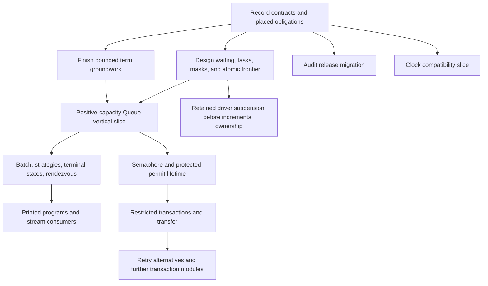

# Foundation decisions and implementation sequence

Owner acceptance: the owner asks to ratify the finished recommendations and send them to Claude.
This packet records those recommendations for the coordinator to enter into tracked authority before dispatch.
The scratch packet itself does not amend `docs/core/decisions.md`.

Proof role: design decisions, proposed obligations, and implementation gates.
Evidence status: current source inspection, primary literature, retained finite probes, and checked reference downloads.
Scope: Queue, shared waiting, task delivery, restricted transactions, mask restoration, and clock groundwork at `0741ab17`.

## Decision

Accept the shared direction and implement it in stages.
Use planned Queue, Semaphore, transactions, streams, Pool, and Cache as the design horizon.
An existing caller is not the only reason to settle a contract now.
A planned use must identify the operation, invariant, and later change that today's design avoids.

Keep one canonical `Eff` representation and the existing generic store model.
Share bodies and carefully stated laws.
Keep atomic execution, waiting-request lifetime, and notification delivery distinct.
Their common shape does not establish common cancellation, scheduling, or progress behavior.

## Selections for the coordinator to record

| Area | Accepted recommendation | Boundary |
| --- | --- | --- |
| Queue order | Strict request order, including nonblocking consumption; consume at the taker's atomic step | A head batch may block smaller requests. This is an explicit difference from 4.0.1. Retry timing remains observable. |
| Queue delivery | Posted delivery for the default Effect 4 profile | Ordinary Deferred remains inline. Keep each producer's live selection or captured selection, priority, and coalescing rules explicit. |
| Waiting wrapper | Shared attempt, registration, and retry infrastructure with module-owned enrollment and cancellation | Replace “any body” with a checked body profile and tracking of every dynamic cell access. A wake invites another attempt; it does not reserve a result. |
| Cancellation | When cancellation wins before consumption, withdraw the request. After consumption, keep the committed state even if the caller later receives interruption | Observe consumption separately from return. Do not promise that an interrupted take consumed nothing or that every committed result reaches caller code. |
| Atomic body | A restricted fragment of `Eff`: pure terms, existing-cell transactional reads/writes, success, failure, retry, and flat composition | Initially exclude allocation, arbitrary host effects, internal exception recovery, general loops, and unresolved or reentrant calls. Commit bookkeeping precedes receiver execution. |
| Alternatives | Retry-only fallback; discard left writes, retain enclosing writes, and combine dependencies when both branches retry | Failure propagates. This is the selected project contract; it is not the tested Effect 3 `orElse` or `orTry`. Implement after the first transaction path. |
| Generalized tasks | Existing `Eff` bodies with explicit task metadata | Dispatcher ownership, execution identity, lifetime ownership, captures, context, receiver token, and completion remain separate. Do not replace every posted callback with a child fork. |
| Work limits | A proved sufficient embedded budget for the initial finite atomic bodies; retain full driver suspension for incremental execution | A fresh command on a changed machine is not resumption. Design the suspension boundary now; implement it before any consumer promises resumable ownership. |
| Mask and restore | A lexical first-order reference to the associated mask's saved incoming state | Resolve the dynamic activation. Restore on every exit and reject escaping references initially. Do not encode restore as unconditional interruptible execution. |
| Term groundwork | Finish the existing bounded T3b assignment, then the two-binder pure list fold and required list atoms | The owner's ratification releases the recommended bounded continuation through the coordinator. Confirm its base and ownership before resuming; do not expand its assignment. |
| Handle identity | Same-kind Ref/Deferred identity comparison, with nested-handle membership and fresh allocation laws | No payload equality or raw registration-number substitute. Keep identity correspondence in the target relation. |
| Public behavior | Application-signature clients still expressed through `Eff`, related to each module expansion | Define public requests, commits, replies, interruption, and termination before hiding private stores or helper identities. |
| Time | Exact internal nanoseconds, explicit legacy conversion, distinct duration/wall/monotonic meanings | Keep existing millisecond programs and journals unchanged in meaning. Add public nanosecond readings only with the target numeric contract. |
| Runtime version | Audit affected rc.112 declarations against 4.0.1 now | Record the migration ruling and changed claims before moving the pin. Retain versioned evidence; do not relabel the old census. |

The cancellation selection follows the checked Effect behavior, with a more explicit observation.
It does not adopt Trio's stronger successful-return guarantee.
Applications needing acquisition plus protected use must keep that lifetime inside a bracketed operation.
Such a wrapper still needs its own cleanup and progress premises.

## What the literature changes

The references strengthen contracts; they do not replace the chosen target's semantics.

| Question | Primary evidence | Consequence for this design |
| --- | --- | --- |
| What should retry alternatives mean? | [Harris et al., corrected PPoPP paper](https://www.microsoft.com/en-us/research/wp-content/uploads/2005/01/2005-ppopp-composable.pdf), Figure 4 and §6.4 | The selected rollback and dependency rules have an established model. Keep their laws separate from ordinary failure. |
| What happens after a caught transaction failure? | The same paper's August 2006 correction, Appendix A; pinned GHC 9.12.2 `catchSTM` | Recovery needs a local rollback contract. Defer it from the first Effect-compatible profile; flat nesting does not settle it. |
| Are correct final results sufficient? | [Guerraoui and Kapałka, opacity](https://kapalka.eu/files/opacity-ppopp08.pdf), §5.2 | A consistent-view claim must observe intermediate reads, including aborted attempts. Keep endpoint agreement and attempt consistency separate. |
| What does restore restore? | [GHC 9.12.2 `mask`](https://downloads.haskell.org/ghc/9.12.2/docs/libraries/base-4.21.0.0-8bb5/Control-Exception.html#v:mask) | Use incoming-state restoration. The original asynchronous-exception paper's unconditional `unblock` is a different rule. |
| Can scheduling work be an ordinary child? | [Trio's pinned callback queue](https://github.com/python-trio/trio/blob/c49507856005763d9391c7044a7e0a7a5bd1548f/src/trio/_core/_entry_queue.py), compared with its nursery protocol | Shared code does not imply shared lifetime. Select execution and cancellation ownership explicitly. |
| What does cancellation guarantee? | [Trio's low-level wait protocol](https://trio.readthedocs.io/en/v0.30.0/reference-lowlevel.html#trio.lowlevel.wait_task_rescheduled), compared with the new Effect probes | The operation must arbitrate cleanup and completion. Do not borrow Trio's stronger return guarantee while implementing Effect masking. |
| Does notification mean the resource is acquired? | [POSIX Issue 8 condition waits](https://pubs.opengroup.org/onlinepubs/9799919799/functions/pthread_cond_clockwait.html) | Recheck the predicate and protect registration. These requirements do not supply FIFO or an Effect delivery policy. |
| Can scopes use the usual continuation traversal? | [Wu, Schrijvers and Hinze](https://people.cs.kuleuven.be/~tom.schrijvers/Research/papers/haskell2014.pdf), §§8–11; [Lindley et al.](https://www.cs.ox.ac.uk/people/samuel.staton/papers/esop2024.pdf), §2 | Distinguish scoped children from following code in the program syntax signature and generated substitutions. Keep them first-order data here. |
| Does a nanosecond integer make one universal clock? | [W3C High Resolution Time 2](https://www.w3.org/TR/2019/REC-hr-time-2-20191121/), §6; [POSIX clock_gettime](https://pubs.opengroup.org/onlinepubs/9799919799/functions/clock_gettime.html) | Separate unit, origin, wall adjustment, monotonicity, and resolution. Define conversion before changing stored commands. |

The [STM findings](literature/stm/contract-findings.md), [task contracts](literature/tasks/contracts.md), [scope review](literature/scopes/review.md), and [clock review](literature/clocks/review.md) retain exact sections and qualifications.
Their manifests retain downloaded papers, pinned implementation files, standards, hashes, and retrieval records.
Reference implementation files were read, not executed.

## Separate foundation obligation

The [foundation audit](foundation-audit.md) identifies five areas to strengthen.
Most are known contract or proof-connection gaps, rather than missing machine representations.

1. Retain commands and enclosing driver work across work limits when the public interface promises resumption.
2. Connect logical request identity, await token, notification ownership, cancellation, and rearming.
3. Define body restrictions and selective rollback before promising atomic attempts.
4. Expose caller-state restoration through the existing frame machinery.
5. Define the public observation before hiding implementation stores or helper fibers.

The audit checks existing contexts, guards, timers, generic stores, and finite dispatcher service laws.
It finds no reason to replace them.
Infinite fairness, finite-width storage, locking, and retained behavior execution remain separate developments.

Design retained behavior's entry, capture, invocation-context, and lifetime contract now for planned Cache, Pool, and callback-based modules.
Reserve those dependencies in the plan.
Defer the general value representation and evaluator until one of those operations supplies its exact contract.
This avoids both speculative implementation and a later incompatible interface.

## Implementation order and stop conditions

1. Record the selected contracts and place their open obligations through current `proof_goal` metadata.
   Specify the whole intended Queue transition contract, even where later slices own the implementation.
   Keep required parts without a goal visible.
2. Resume T3b only within its existing assignment, through the coordinator's worktree and base checks.
   Then implement fold, identity, and nested-handle cases with generated scoping, capture, typing, compilation, TypeScript printing, and exact program reading.
3. Implement one positive-capacity suspend Queue path: make, offer, take, poll, size, cancellation, and notification ownership.
   Include terminal-state invariants now even if public terminal APIs follow later.
   Use the existing pure atomic update rather than requiring a general transaction evaluator first.
   Include one producer-specific posted-delivery relation and the public observation.
4. Add batches, dropping/sliding, terminal APIs, and zero-capacity rendezvous against that contract.
   Refuse sliding-zero in the initial profile.
   Rendezvous needs its own two-party commit and withdrawal rules; an empty buffer plus retry is insufficient.
   Exercise printed acceptance cases and the named stream-end connection as their faces become available.
5. Implement Semaphore as the second shared-wrapper consumer, including saved masks and protected permit lifetime.
   Its live wake traversal must satisfy its own observation; Queue's result does not establish it.
6. Implement restricted transactions, then a concrete transfer and retry alternatives.
   Prove the embedded budget or retain every driver continuation before depending on single-owner execution across limits.
   Keep arbitrary fair composition of independently enrolled queue tickets outside this first profile.

Clock compatibility and the source-version audit can proceed beside term groundwork under separate owners.
The clock slice need not block untimed Queue or Semaphore.
General snapshot storage optimization, parallel transaction validation, and broad callback values are later implementation work.
Their required contracts remain visible now.

Stop a slice when its selected observation fails or a frozen statement needs amendment.
Do not weaken a property to close the slice without recording the owner's selected change.
A successful finite case does not close an open theorem.

## Proof and evidence gates

The companion reports give proposed claim names and all required placement fields.
Each names its semantic concept, required property, consumer, hypotheses, observation, exclusions, and immediate prerequisite.
The coordinator should consolidate duplicate proposals under the existing claims, rather than install one new framework per report.

Required acceptance cases include old-token delivery after rearming, cancellation before and after consumption, and a wake arriving before await.
Include a receiver that changes resources during a live wake traversal.
Include work limits inside commit, cleanup, and delivery, with a larger uninterrupted positive control.
For alternatives, include abandoned left writes, enclosing writes, and wake through either dependency when both branches retry.
For composed fair queues, retain the opposing-ticket cycle as an excluded case until an enrollment protocol resolves it.

The current finite model has 22 checked controls and witnesses.
Runtime probes compare installed rc.112 and 4.0.1 with Bun 1.4.2.
They cover inline reentry, nested rollback, caught retry, alias mutation, clock differences, and cancellation after consumption.
The inspected release behavior and literature justify the selected restrictions.
They do not establish Lean proofs, general fairness, or unrestricted Effect agreement.

The [detailed review](review.md) contains the option assessment and earlier witnesses.
This packet controls the final selections where the earlier assessment still describes a hold or an undecided choice.
The [receipt](receipt.json) and literature verification retain inputs, commands, results, source hashes, and limits.
All review writes stay outside active repositories.
