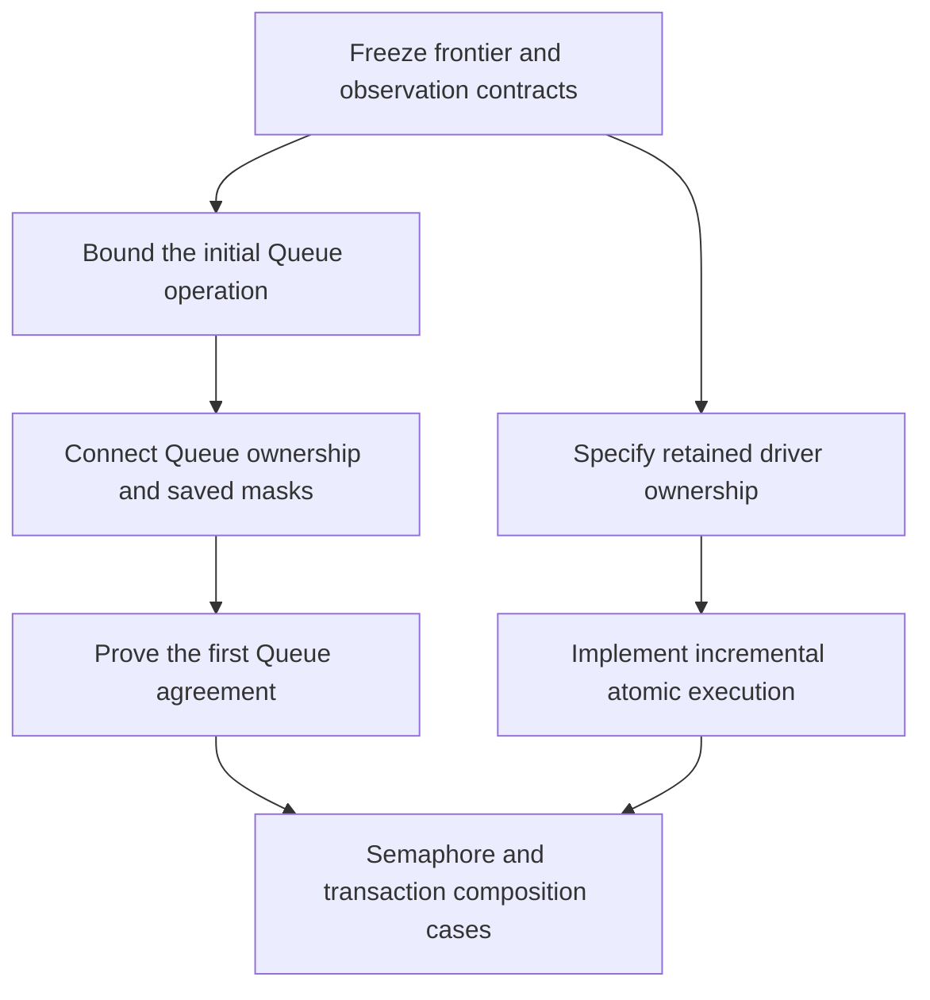

# Fiber and store foundations: bounded design audit

Incremental execution and generic atomic ownership need an explicit continuation contract across fuel boundaries.
They also need request ownership, saved-mask restoration, and a module observation contract.
These extend existing representations and laws. They do not justify another program representation or a general scheduler rewrite.
An initial Queue using a pure `Ref.modify` step may instead establish a sufficient-budget contract for its enclosing operation.
That route must include registration and notification work; the isolated pure update does not establish the wrapper's behavior.

Status: recommendations from source inspection; the parent reports owner acceptance of the recommendation package.
The coordinator still records tracked rulings and implementation order. This audit changes no repository file or Lean declaration.
The source reading ends at HEAD `0741ab17cc99d1c3944e1cf52e838b93bf5fec65`, measured at `2026-10-05 15:11:42 UTC`.
The companion receipt pins the reviewed files. Active work may change them afterward.

Completion criterion: each recommendation identifies its current or planned consumer, existing declarations, missing property, theory placement, prerequisites, and evidence limits.
Planned Queue, Semaphore, transaction, and stream operations define the design horizon alongside existing callers.
Freeze their contracts now. Land small foundation slices where those consumers give a concrete acceptance case.
Defer general implementation when its obligations exceed the first useful slice, rather than merely because a caller is not written yet.

## 1. Retain ownership of unfinished driver work

Classification: base contract gap, already recorded in `docs/core/machine-state.md` §5. Priority: before the shared wrapper and atomic region depend on resumption.

`driveState` in `src/Effect4/Machine/Fibers.lean` returns the machine and remaining `Cmd` values.
`fireStep` retains only the machine and whether that work settled.
`fireState` also removes the dispatcher's captured task list before processing it.
`stepDecisionState` and `HostSession.advance` do not retain the complete command and outer-driver remainder.
The session declaration lives in `src/Effect4/Api/HostSession.lean`.

The existing witness in `docs/research/2026-09-19-critique-response.md` §5 uses `succeed 42`.
Fuel one leaves the root running. A fresh evaluate with fuel 400 leaves it without an exit.
Continuing the saved command list produces 42.
That note records a checked machine probe; this audit reads its receipt without rerunning it.
This establishes the boundary of resumption claims, not a transaction failure: no transaction implementation exists here.

Recommendation: retain a suspension of the existing driver for incremental sessions.
It must retain commands, the remaining dispatcher tasks, the enclosing flush or clock phase, and any active atomic owner.
Zero fuel leaves that suspension unchanged.
Continuing with budgets `n` and `k` must match uninterrupted execution with `n + k`, under the same selected inputs.
No command may disappear, repeat, or move past another command because the budget ends.
Each accepted transition during an atomic attempt must respect its owner or satisfy an explicit noninterference condition.

Existing finite replay may instead restart from its original state with more fuel and the same decisions.
The owner must choose which public interface promises resumption. Reissuing a decision is insufficient.
An initial Queue need not implement general resumption first.
`SyncOp.refModify` and `refStep` in `src/Effect4/Machine/Stores.lean` provide its pure atomic update.
Its enclosing operation can use a proved budget bound that covers registration, cleanup, and selected notification delivery.
The contract must exclude cuts inside that operation instead of claiming that the projected frontier resumes it.
`straight_sufficient` in `src/Effect4/Laws/Program/RuntimeR.lean` concerns a fresh standalone run.
An embedded Queue wrapper still needs its own bound with its existing state, continuation, and pending work.

Reuse `driveState_add` in `src/Effect4/Laws/Machine/Approximation.lean` and `driveState_lift` in `src/Effect4/Laws/Machine/Lift.lean`.
Reuse `QueueOk` and `ConfigTyped` in `src/Effect4/Laws/Program/Typed/Assembly.lean` for the retained commands.
Their authority, ownership, key, and payload clauses already make unfinished work part of the proof state.

Placement: `reactive-scheduling`, preservation and simulation roles; extend the existing `drivestate-lift` consumer toward R11, R12, and R13.
Proposed registry claims: `driver-continuation-split` and `driver-suspension-keeps-typed`.
Place the public continuation obligation before proving it. Its statement must retain the chosen outer-driver data.
Prerequisite: settle the public frontier meaning and accepted inputs during suspension.
Reference: the existing approximation laws ground the budget equation; Lynch and Vaandrager ground the state relation between executions [L].

## 2. Connect registration, notification, cancellation, and rearming

Classification: proof connector gap. Priority: with the first waiting Queue operation, before reusing its wrapper.

`evaluatePrim` in `src/Effect4/Machine/Fibers.lean` already registers and parks on a fresh guard token.
Its immediate branch installs the answer instead.
Its parked branch installs `asyncFinalizer` when cancellation or a signal requires it.
`drainOwed` transfers immediate work to `Cmd.resume`, or posted work to an owner's dispatcher.
`Waiter`, `Owed`, `WakePhase`, and `WakeList` in `src/Effect4/Machine/Wake.lean` already represent notification stages.

`evaluatePrim_async_parks` and `drive_resume_wrong_token` in `src/Effect4/Laws/Machine/Clauses.lean` cover local behavior.
`completionStrong_await` in `src/Effect4/Laws/Program/Typed/Commands/Bookkeeping.lean` covers answer typing.
`QueueOk` covers queued command authority and freshness.
These are substantial foundations; their statements do not supply the proposed Queue wrapper's request-lifetime invariant.

The consumer is the wrapper in groundwork item 7 and transactions proposal 1.
It changes a logical request through registration, signal selection, delivery, retry, rearming, and cancellation.
Its invariant must distinguish the logical request identifier, the await guard token, and the wake batch phase.
They may share numeric representation while retaining different meanings.

Recommendation: prove where the outstanding notification lives at every transition.
After selection, it must remain in store debt, queued commands, dispatcher work, or the receiver's accepted continuation until discharged.
Cancellation removes or invalidates every obligation owned by that request and releases its queue ticket where the module requires it.
Rearming cannot let an old notification consume a new registration.
A late delivery with an old token must remain inert, including after a fuel cut.

Use three acceptance traces: notification before await; cancellation after selection but before delivery; delayed old delivery after rearming.
Each needs an ordinary successful delivery as its positive control.
These are required wrapper tests, not new counterexamples against the current machine.

Placement: `reactive-scheduling`, preservation role, serving R10–R12 through the existing waiter and command claims.
Proposed registry claim: `waiting-request-obligation-preserved`.
The module law consumes this invariant; do not create an unrelated scheduler framework.
Prerequisites: recommendation 1's budget contract or retained suspension, plus the chosen inline or posted delivery profile.
Reference: `lostWakeWhenSplit` and `noLostWake` in `tx-probes/TxModel.lean` supply bounded controls.
Harris et al. ground atomic wait registration and recorded read dependencies [H].

## 3. Define atomic program admission and dynamic accesses

Classification: missing admission contract, already open under decision row 80 and groundwork item 17.
Priority: design now; implement with its first consumer. A full transaction API can follow Queue and Semaphore.

`injectYield_prevented` in `src/Effect4/Laws/Machine/Clauses.lean` proves suppression of automatic yields only.
`drainOwed`, observer delivery, interrupt actions, and context changes in `src/Effect4/Machine/Fibers.lean` require separate treatment.
`Capture` in `src/Effect4/Machine/Stores.lean` also carries execution data; admitting retained calls requires checking their resolved bodies.

The consumer is the atomic step shared by the waiting wrapper and transaction proposal 2.
`TxM` in `docs/research/2026-10-05-claude-lead/tx-probes/TxModel.lean` is an unrestricted Lean function from `Acc`.
The finite model's `get`, `put`, `orElse`, and `attempt` exercise intended access discipline.
That function type alone does not prove every possible body depends only on its recorded reads.

Recommendation: admit a fragment of the existing `Eff`, with a compositional property over all executed operations and resolved calls.
Define ordered dynamic reads and writes, reads of earlier writes, nesting, and the exact state restored by failure or retry.
Separate transactional writes from ticket enrollment, cancellation records, allocation, and ordinary Ref writes.
An alternative discards its failed branch's writes and retains the surrounding writes and dependencies needed if both branches retry.
The wait decision and registration must form one admitted transition.
Do not replace dynamic dependencies with a static overestimate while claiming identical wake behavior.

The prior bounded ticket model supplies the decisive composition obligation.
Queue A contains 10 with tickets `[P,Q]`; queue B contains 20 with tickets `[Q,P]`.
P atomically takes A then B; Q atomically takes B then A. Both retry, despite available messages.
The generic quiet-state condition still holds.
This refutes an unrestricted progress claim for that candidate composition, not the production machine.
The companion model receipt retains positive controls and 22 checks; this audit does not rerun them.

Accept the shared waiting mechanism. Keep arbitrary composition of independently committed fair tickets outside the first accepted contract.
Also keep zero-capacity rendezvous outside plain buffer-read retry until its two-party commit and cancellation protocol is defined.

Placement: `store-typing` preservation plus `reactive-scheduling` ownership; the consuming agreement belongs to `translation-simulation`, R4 and R10.
Proposed registry claims: `atomic-attempt-isolation` and `atomic-attempt-agreement`.
Prerequisites: recommendations 1–2 and an explicit failure/retry profile under row 80.
Reference: Harris et al. ground retry, alternatives, rollback, and compositional transaction boundaries [H].
The existing STM scout §2.3 and machine-state §5 already distinguish dynamic access sets from static program admission.

## 4. Expose saved-mask restoration without replacing existing cleanup

Classification: missing program interface over existing machine behavior. Priority: before Semaphore's `withPermits` and the general waiting wrapper.

`Eff.uninterruptible` and `Eff.interruptible` exist in `src/Effect4/Program/Eff.lean`.
`WithFiberAction.setInterruptible` in `src/Effect4/Machine/Fibers.lean` uses the existing restoring frame behavior.
`EffThunk.acquireMasked` and `releaseMasked` in `src/Effect4/Program/Compile.lean` already protect specialized resource paths.
The missing interface is a lexical restore of the caller's prior setting inside a masked region.

The reference is `uninterruptibleMask` in `vendor/effect-4.0.0-rc.112/src/internal/effect.ts`.
It supplies identity as restore when the caller is already masked.
Therefore wrapping every restored body in `Eff.interruptible` does not implement that reference.

Recommendation: add the smallest first-order scoped form that carries this saved setting through the existing frame discipline.
State what restores the setting on success, failure, interruption, and nested entry.
Install cleanup before interruption can observe an acquired resource or committed registration.
Do not release an atomic owner's authority until its required cleanup finishes, including across budget cuts.

Placement: `scope-lifetime-finalization`, preservation and adequacy roles, serving R11; typing connects to R4.
Proposed registry claim: `saved-mask-restoration`; the wrapper consumes it alongside cleanup-before-resume.
Reuse the existing scope close laws and the `ConfigTyped` frame clauses.
Prerequisites: a frozen restore policy, plus recommendation 1 for resumable cleanup.
Reference: the pinned Effect declaration defines the required behavior; Marlow et al. explain protected installation and scoped exception cleanup [M].
The Haskell paper's interruptible-operation policy is not automatically Effect4's policy.

## 5. State the module observation before hiding implementation work

Classification: proof connector gap and profile decision, already open under R8, R10, row 79, and DI-89.
Priority: with the first Queue agreement statement, before claiming agreement under `Agrees profile module expansion` for helper fibers or different wake rules.

`Obs` in `src/Effect4/Laws/Machine/Behaviour.lean` contains every fiber exit and the full concrete `Stores` value.
`Projects` and `Refines` in `src/Effect4/Laws/Machine/Refinement.lean` connect corresponding store operations and answers.
They do not automatically hide private queue cells, rename helper fibers, or match several implementation steps to one abstract operation.

The consumer is `Agrees profile module expansion`, planned by groundwork item 9.
First choose Queue invocation, response, cancellation, message, and termination observations.
Name which private cells and helper identities are hidden, and relate exposed handles consistently through future requests and answers.
Supply initialization and internal-step obligations for that relation.
Keep finite safety, scheduler service, starvation freedom, and termination as separate claims.

`flush_fair` and `fairTape_unarmed` in `src/Effect4/Laws/Machine/Scheduling.lean` already cover finite dispatcher service under explicit hypotheses.
They do not establish that every waiting queue request eventually succeeds.
The ticket cycle in recommendation 3 shows why dispatch fairness alone cannot provide that property.

Placement: `translation-simulation`, simulation role, consuming R8 and R10; any request progress claim belongs separately to `reactive-scheduling`, R12.
Proposed registry claim: `queue-expansion-agrees`, beneath the existing R10 obligation.
Prerequisites: the module profile, request ownership, and either sufficient budgets or retained suspensions.
Declare the relation between implementation steps and observed operations.
Reference: Lynch and Vaandrager ground relations that match internal and external steps [L].
Start with one Queue connector. Generalize only after another consumer needs the same statement.

## Already modeled, or deliberately later

| Area | Checked basis and recommendation |
| --- | --- |
| Token identities | `Waiter.token`, `WakePhase`, guard checks, and `QueueOk.keys` already exist. Distinct wrapper types can prevent confusion; finite-width overflow belongs to the backend relation. |
| Context and retained behavior | `Context` in `src/Effect4/Machine/ContextMap.lean` and `Capture` in `src/Effect4/Machine/Stores.lean` already carry services and invocation state. Keep reusable behavior resolution under R7. Do not promote all of `Capture` into a reusable value. |
| Time | `TimerStore`, `sleep`, `fireNext`, and `clockStep` in `src/Effect4/Machine/Timer.lean` already model explicit clock input and deadline waking. Resolution and wall versus monotonic readings remain row 83 profile choices. Nanoseconds do not create a missing scheduler abstraction. |
| Physical snapshots | The reference store is an immutable Lean value. Mutable payload aliasing, integer overflow, locking, and validation belong to each concrete storage/backend refinement. Selective transaction rollback remains recommendation 3. |
| Infinite fairness | R12 already leaves infinite liveness and internal stability open. Define the first module's fairness assumptions now; do not block finite Queue safety on a universal fairness development. |

## Order and acceptance

The order concerns dependent contracts and proofs. Independent term and generic-cell groundwork can continue.
No new probe changes the recommendations; the retained countermodels already distinguish the competing contracts.
The proposed semantics registry identifiers name future placements. This audit adds no semantics registry claim or theorem.

## Primary references read

- [H: Harris, Marlow, Peyton Jones, and Herlihy, Composable Memory Transactions](https://www.microsoft.com/en-us/research/wp-content/uploads/2005/01/2005-ppopp-composable.pdf).
- [M: Marlow, Peyton Jones, Moran, and Reppy, 2001, Asynchronous Exceptions in Haskell](https://www.microsoft.com/en-us/research/wp-content/uploads/2016/07/asynch-exns.pdf).
- [L: Lynch and Vaandrager, 1995, Forward and Backward Simulations I: Untimed Systems](https://ir.cwi.nl/pub/1393/1393D.pdf).

These papers supply reference concepts, not proofs about this repository.
H is the retained post-publication version dated August 18, 2006, including Appendix A's revised exception semantics.
`literature/stm/downloads.json` records its source and hash; the existing STM review identifies the relevant rules.
L is the CWI final version of the 1995 article. `literature/refinement/downloads.json` records its source, hash, and text extraction.
