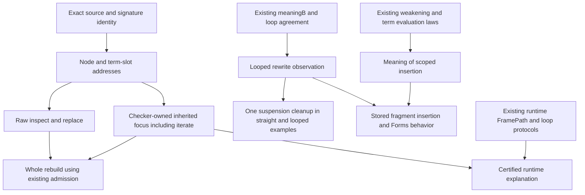

# Loop-capable inspection, editing and composition

This report proposes APIs over the existing program. It adds no program language or execution engine.
The first semantic manipulation contract covers straight programs and loops together.
The runtime frame relation supplies proof reuse. It does not supply an editable source context.

Evidence status: committed-source audit and isolated finite Python controls.
Proposed declarations below are uncompiled. No new Lean theorem or project acceptance is claimed.

The frozen commit is `4b57609c03ad0a38fd81cfc2c09ea5731dfe7ff0` in `/Users/pooks/Dev/lean4-effect4`.
The checkout is clean at the initial snapshot. `manifest.json` records 58 committed sources and their identities.
This report extends the earlier `tree-control-review/typing` packet. Its straight-only rewrite recommendation is superseded here.

## 1. The useful separation

A coherent API can expose three kinds of context without identifying them.

| Context | Existing owner | Required data or evidence | What it answers |
| --- | --- | --- | --- |
| Lexical source context | `Program/Checker.lean`, `Program/Typing/Rules.lean` | Exact program and signature; source address; inherited type environment; term argument mode; generator state where relevant | Which variables exist here, and which type the checker computes |
| Runtime continuation context | `Laws/Program/Typed/Contracts.lean`, `Typed/Scheduler.lean`, `Typed/Residual.lean` | Source, world, machine relations, typed cursor or captures, frame path | Which typed result a suspended continuation accepts and produces |
| Guarantee context | Existing semantics registry and proof plan | Exact theorem, premises, fragment, observation and dependency status | Which claim applies, and which hypotheses remain unprovided |

A lexical focus is not a suspended activation. A runtime source projection is not a source-editing lens.
A theorem found by name is not an instantiated certificate for the selected program or run.

The common public owner remains `Effect4.Api`. Core data and computations remain below it in `Program`.
The law graph remains separate. `Effect4` must not import `Effect4.Laws` to expose these capabilities.

## 2. What is already present

The source tree already supplies most of the low-level pieces.

| Capability | Declaration and owner | Exact reach |
| --- | --- | --- |
| Read or replace a stored node | `Node.at_`, `Node.replaceAt`, `Program/Refs.lean` | Seven source sorts; same-sort replacement; missing paths and wrong sorts refuse |
| Structural edit laws | Replacement laws in `Laws/Program/References.lean` | Readback, restoration, self replacement, overwrite and disjoint sibling paths; no behavior claim |
| Scope at a child | `Node.scopedAt_child`, `Program/Scoped.lean` | Generated binder depth; this does not compute inherited variable types |
| Whole checked program | `TypedProgram`, `checkTypedProgram`, `Program/CheckedTyping.lean` | Computed type indexed by the exact program and signature |
| Executable admission | `AdmittedProgram`, `Program/Admission.lean` | Whole typing plus signature, formation and current execution-profile checks |
| Rebuild an authored program | `Built.rebuild`, `Api/Author.lean` | Same table and row names; whole admission of the candidate; a new type is allowed |
| Rebuild laws | `rebuild_spec`, `rebuild_admitted`, `rebuild_self`, `Laws/Program/Author.lean` | Exact candidate and retained host declarations; no behavior or path-transport claim |
| Loop authoring | `LoopSpec`, `iterateWith`, `forRange`, `foldRange`, `repeatWhile`, `Program/Authoring/Loops.lean` | Minted cursor and answer binders; one stored `Eff.iterate` form |
| Source weakening | `Eff.weaken`, `check_weaken`, `effTy_weaken`, `Program/Typing.lean` | Inserting one unused type slot preserves the checker's success projection under `Signature.WeakenNatural` |
| Form insertion | `Forms.insert`, `Codegen/Forms.lean`; `effTy_insert`, `Laws/Codegen/Forms.lean` | Repeated weakening under an explicitly described insertion; no form behavior law |
| Term weakening meaning | `evalTerm_weaken`, `Laws/Program/Typed/ListFold.lean` | The shifted term reads the same values after an inserted value slot |
| Straight composition | `StraightEq`, `StraightEq.run_agrees`, `Laws/Program/MeaningEq.lean` | Equal exit and complete stores; separate sufficient machine budgets |
| Loop meaning | `Looped`, `denoteB`, `meaningB`, `Laws/Program/DenoteB.lean` | A finite semantic budget, optional exit and complete stores, including unfinished stores |
| Loop execution connector | `Agreement.loopAgreement`, `Laws/Program/Agreement/Loop.lean` | A finished bounded meaning implies matching ordinary runs past some fuel bound |
| Loop algebra | `iter_uniform`, `iter_congr`, `Laws/Program/Iter.lean`; `Conv` laws, `IterLimit.lean` | Step agreement and cursor maps at each budget; separate convergence laws |
| Typed continuation paths | `FramePath`, `StackAccepts`, `Laws/Program/Typed/Contracts.lean` | Append, split and pointwise map of typed frame relations |
| Source-derived loop frame | `LoopChecked`, `LoopFrameTyped`, `loopProtocol_of_frameTyped`, `Typed/Commands/Clauses/Loop.lean` | Cursor, environment, body, step, result and later-world obligations |

`Src` and `TermSrc` are authoring functions. They elaborate to first-order stored syntax.
Adding callbacks to that authoring layer does not license storing those callbacks in `Eff`.

## 3. Minimal public contracts

These are proposed interface shapes, not implementation-ready Lean declarations.
They describe required inputs, outputs, refusals and laws before choosing final names.

### 3.1 Bind each address to its typing input

A focus must identify both the source and the signature used to type it.
For current `Built`, the signature is the row table with empty service declarations.
`Api.bytesOf` identifies the program bytes; those bytes alone do not identify its typing input.

A process-local document revision can identify an immutable `Built` value.
A durable identifier must bind the program and its signature through an exact comparison or a stated trusted digest boundary.
A caller-supplied string called a version is not a proof of that identity.
The public protocol should state how it validates this binding.

Use a separate address family over existing syntax:

- a `Node` address is the existing path;
- a term address names its containing node, its term slot and its nested term path;
- a cause-contained term retains a separate cause path;
- an operation's binder term names its operation slot and the binder's context.

The slot is necessary. `iterate` stores initial, test, step and result terms at the same parent node.
Its body alone occupies child zero. A plain `List Nat` cannot distinguish those four terms.
Existing `TermRefusal` carriers already separate term and cause paths.
Reuse their addressing conventions. Do not reinterpret a term index as a node-child index.

A passive slot alphabet is an index into existing constructors. It is not a second AST.
Derive selectors from existing signatures where those signatures describe the slots.
Keep actual typing transitions in the checker owner; `binders.json` describes depths, not all typing rules.

### 3.2 Inspect raw syntax, then attach the checked view

A raw inspector can immediately cover every existing `Node` sort through `Node.at_`.
It returns the selected syntax and its source address. It makes no typing claim.

A checked focus needs these fields:

| Field | Why it is needed |
| --- | --- |
| Immutable source/signature identity | A certificate for another program or table is inapplicable |
| Original source address | Editing must target stored syntax |
| Selected original syntax | Enables review and stale-selection checking |
| Inherited `TyEnv` | Root typing under `[]` does not type every child under `[]` |
| Judgment kind | An effect, layer, statement state and term do not all have an `EffTy` |
| Term mode when applicable | `argTy` carries the constant-generic flag; plain `termTy` loses that distinction |
| Computed local type or state | Use existing `Ty`, `EffTy`, `LayerTy` or `GenTy`, rather than strings |
| Reference-origin information when applicable | An expanded occurrence and its source definition are different addresses |
| Evidence tied to the root | A successful check under an invented environment is insufficient |

The first checked inspector follows supported source routes in admitted reference-free programs.
It follows effect-to-effect children, including `catchIf`, host performs and nested `iterate`.
This covers Routing and nested loops from the first release. The `Looped` restriction belongs only to the semantic rewrite.
The raw inspector and edit/rebuild path can already support larger programs.
A checked-focus refusal must distinguish an unsupported focus route from a source typing refusal.
It must not say a valid scheduled program is ill-typed because its view is not implemented yet.

A general inspector can later extend the judgment sum to the seven source families.
Statement focus must retain `inLoop`, `afterRet` and its accumulated state.
Layer checks restart at the closed environment. A single environment-depth counter cannot reconstruct those facts.

The computation should share the checker's successful descent or expose a checker-owned view.
It should not copy the typing rules into an editor module.
A soundness connector must show that each displayed local judgment comes from the supplied whole-program certificate.
For a loop, `Checker.inv_iterate` already exposes the required successful checks.

A proof-carrying Lean result can index the view by its exact input.
A serialized view can carry data and claim identifiers. It does not serialize a proof by printing the theorem's name.

### 3.3 Replace and rebuild

The minimal edit operation is:

```text
replace(document revision, source address, replacement)
  -> replacement refusal
   | admission refusal
   | new Built value with a new revision
```

For a node, use `Node.replaceAt`, then `Built.rebuild` on the resulting whole program.
For a term, use the slot selector and generated term reconstruction, then the same whole rebuild.
Do not add a local acceptance algorithm that bypasses whole formation, reference validation or profile checks.

The result should state these facts:

- the selected syntax is replaced at the stated address;
- the row table and row names are retained;
- the returned program is admitted under that table;
- its computed type is displayed, including a change from the prior type;
- the old run remains a run of the old program.

Preserving the previous result type can be an explicit extra check.
It must name whether it requires exact `EffTy` equality or a specified normalized/subtyping relation.
The existing rebuild operation permits the new type to differ.

An edit invalidates cached descendant focuses and cached inherited contexts.
Readback laws do not relocate variables, layer references, memo identities or suspended captures.
A sibling path can remain a valid structural path while its typing context changes through a changed earlier result.
Therefore a successful path lookup alone cannot renew a typed-focus certificate.

Do not transplant an old machine state into the new source version.
That requires a separate state/capture relation. Offline editing does not need to solve it first.

### 3.4 Compose source fragments with explicit input movement

For new source code, reuse minted `Src`/`TermSrc` builders and `LoopSpec`.
A callback receives the intended cursor or answer term. It need not guess a textual binder name.

For stored syntax, retain the fragment's declared input environment.
Describe insertion or renaming explicitly. Never infer input identity from equal types.
The smallest useful stored-fragment operation inserts one unused slot through existing `Eff.weaken`.
Its typing law already exists under `Signature.WeakenNatural`.
The native signature supplies that premise through `nativeSignature_weakenNatural`.

Two existing form cases demonstrate why this distinction is public API information:

- `andThenEffect` inserts the unused first answer into an independent effect argument;
- `andThenContinuation` expects an argument already authored under that answer.

They must not become one ambiguous raw-fragment operation.
If a public multi-slot insertion helper is needed, move the existing `Forms.insert` to a lower `Program` owner.
Keep `Forms` as its consumer. Do not duplicate the algorithm or import target code into common authoring.

A first stored-fragment contract can support order-preserving insertion only.
Arbitrary permutation, substitution and capture transport require stronger laws and are not implied by weakening.

## 4. Loops are part of every phase

The checker already distinguishes the loop roles precisely.
Let `Γ` be the outer type environment. Let `C` be the declared cursor type, or the initial term's inferred type.
Let the body type be `⟨B, E, R⟩`.

| Slot | Inherited environment | Check | Contribution |
| --- | --- | --- | --- |
| Initial | `Γ` | Inferred `C₀`, with `C₀ ≤ C` after normalization | Establishes the first cursor |
| Test | `Γ ++ [C]` | Boolean | Selects continue or finish |
| Body | `Γ ++ [C]` | `⟨B, E, R⟩` | Produces the answer for the step; contributes errors and requirements |
| Step | `Γ ++ [C, B]` | Inferred `C₁`, with `C₁ ≤ C` after normalization | Produces the next cursor |
| Result | `Γ ++ [C]` | Inferred `D` | Produces the final answer |
| Whole iterate | `Γ` | `⟨D, E, R⟩` | Retains the body's error and requirement columns |

These are `Checker.check`'s iterate rule and `Checker.inv_iterate` in `Laws/Program/Typing/CheckInversion.lean`.
They are not additional rules proposed by this report.

Replacing the body can change `B`. The step then needs rechecking even if the loop's final answer type remains `D`.
Changing `C` rechecks initial, test, body, step and result.
A cursor and body answer can have equal types and different values. Their slot identities still matter.

Term focus also retains the `argTy` mode.
A constant-generic argument can retain a string singleton where ordinary term inference widens it.
The same syntax under the same `Γ` can therefore have a different inferred result under another argument mode.

Term folds are a separate nested binding example.
Their body receives the accumulator and element after the outer environment.
Use the existing fold rules and `evalTerm_weaken`; do not infer these bindings from the surrounding effect loop.

### A shared semantic observation

Use `meaningB` as the common observation for straight and loop-bearing rewrite laws.
`Looped.of_straight` and `Agreement.meaningB_straight` already embed the straight fragment into it.

The smallest strong relation for budget-transparent rewrites has this proposed shape:

```lean
-- UNCOMPILED proposal over existing types and semantics.
structure LoopedEq (left right : NativeEff) : Prop where
  left_looped : Looped left = true
  right_looped : Looped right = true
  same : ∀ k env stores,
    meaningB k left env stores = meaningB k right env stores
```

Its observation includes optional exit and complete stores at every semantic budget.
This includes stores retained at an unfinished loop. It does not equate machine fuel with semantic rounds.
`denoteB` gives each nested loop the supplied budget; it does not spend one shared global fuel counter.

The first consumer should remove administrative suspensions inside a real authored program containing a loop.
Its positive straight case uses the same pass and relation.
A loop-body rewrite must retain cursor, test, step and result behavior at the same semantic budget.
Use the existing fold connectors and `iter_congr` rather than a second recursion engine.

For a cursor representation change, reuse `iter_uniform`.
Its premise relates the entire one-step program through the cursor map, including the stop/continue distinction.
Matching only the test predicate or the final answer does not meet that premise.

Do not require this strong relation of every later optimization.
Two loops can finish with identical exits and stores at different round counts.
For such a transformation, explicitly choose `Conv` or a budget correspondence.
`IterLimit` already separates convergence laws from finite approximants.

### What reaches the frame machine

`Agreement.loopAgreement` consumes a finished bounded meaning from empty inputs and empty stores.
It yields matching exit and complete stores at all sufficiently large machine fuels.
Thus a proposed `LoopedEq` runtime connector can have this shape:

```text
LoopedEq a b
and meaningB k a [] Stores.empty = (some exit, stores)
  imply there exist bounds A and B such that
  every run of a above A and every run of b above B finish with that exit and those stores.
```

This reuses the existing loop agreement twice.
It does not prove that either program terminates for every input.
It does not compare same-fuel frontiers, traces, scheduling, host replies or target execution.
It does not transfer a partly executed loop to rewritten syntax.

`Looped` includes the existing synchronous clauses and nested iterate forms.
It excludes fork, wait, generator, mask, scope, service and layer execution forms named by its definition.
A source-linear Queue call may still contain those excluded operations.
Such a wrapper cannot enter this relation merely because the surface code looks sequential.

## 5. What FramePath can and cannot contribute

`StackAccepts` composes typed frame relations through an existential intermediate `EffTy`.
`FramePath` factors out append, split and pointwise mapping for that proof pattern.
`HostStack` and `PositionStack` already use it.
This is a concrete reusable typed-path structure, with actual consumers.
No additional category framework is needed for the proposed source API.

Its limits matter:

- `FramePath` fixes vertices to `EffTy` and labels to reference `ScopeFrame`;
- reference frames include Lean continuation functions;
- the relation lives in `Prop` and does not compute unique intermediate types;
- its edge relation includes semantic obligations, not just a syntax-parent relation.

Consequently, it cannot be copied into canonical program content or exposed as a durable source zipper.
A display may project certified runtime data and explain a witnessed frame type.
It may not claim that every frame has one uniquely inferred type.

`FrameAccepts` checks continuations at every later world allowed by `leHost`.
Checking only the current world can be vacuous before a handle is allocated.
A later invocation may then supply a value the unchecked continuation mishandles.
The finite probe retains that distinction with a positive continuation control.

`HostEdge` additionally carries race, registration and token correlation with the concrete machine.
`positionStack_of_host` deliberately forgets that correlation.
The converse is not provided. A position-only report cannot reconstruct the host-stack certificate.

For loops, reuse `LoopChecked` and `LoopFrameTyped` as law-side consumers of a checked source view.
`LoopFrameTyped` requires source reference validity, matching service declarations, `EnvTyped` values and `Fits` for the cursor.
`LoopProtocol` uses a greatest invariant, so it permits endless but type-safe loops.
`Conv` describes finishing finite approximants. These are different contracts, not competing semantics.

A runtime focus needs source identity, activation identity, the point's captured environment and the applicable world.
The source address alone cannot distinguish repeated iterations or concurrent visits.
Live inspection should retain the relevant token or generation when the runtime protocol uses one.

## 6. References, original syntax and identity

Whole-program typing validates references and checks the expanded program.
The stored program retains its references. Runtime layer identity is not replaced by an expanded syntax tree.
`typeOfProgram_expandRefs` and the completed reference proofs establish the existing whole-program relation.
They do not supply a universal per-occurrence editor-origin map.

A checked focus in original syntax must account for `Eff.expandIn root subterm` where reference expansion is required.
A raw target path and an expanded occurrence are not interchangeable.
A single layer definition can occur through more than one reference site.

The eventual origin view should retain at least:

- the original reference site;
- the target definition path;
- the selected relative path inside that target;
- the source/signature version to which those paths belong.

Nested references can require an origin chain. This is derived provenance, not a new program representation.
The first reference-free source focus need not solve it before delivering useful editing.
General raw inspection and whole-program rebuild remain available meanwhile.

Editing a shared definition changes all its uses.
Replacing one reference occurrence with a copy can change sharing and memo identity.
Whole admission can accept that change without proving it behavior-preserving.
A UI should state whether an edit targets the definition or one use.

## 7. Small proof additions with real consumers

All new IDs in this section are proposals. Register the exact statement before proof work.
Use the existing semantics registry, `proof_goal`, plan status and requirement open parts.
Do not create another proof ledger or count authored dependency edges as kernel evidence.

### P1. Checked source focus, including loops

1. Concept: `residual-program-typing`; required property: successful checker evidence supports the local judgment it displays.
2. Question and role: proposed `checked-focus-context`, compatibility/inversion. Existing consumers are `rebuild-admission` and source-derived `denote-typed` evidence.
3. Reach: exact source/signature, an inherited route, selected sort and argument mode. First typed routes follow effect-to-effect edges, with ordinary term slots and nested terms, in admitted reference-free programs. They include Routing and nested `iterate`; non-effect families refuse opaquely.
4. Nonclaims: no membership of runtime values, principal runtime frame type, reference-origin map, progress or behavior preservation.
5. Unlock and consumer: an editor can show cursor/body/step types before editing; `LoopChecked` becomes a law-side connector. Serves R1, R8 and R10.

Reuse `Checker.inv_iterate`, other checker inversions and generated scope information.
The computational owner is `Program/Checker` or a lower companion that shares its successful descent.
The API facade must not duplicate the rules.
The law must connect the displayed environment to the root derivation, not just rerun a checker under an arbitrary environment.

Required control: a loop with equal cursor and body-answer types but distinct values.
A mistaken role swap must fail the expected-context control even if local typing succeeds.
Another control changes the body answer type and verifies that the step is rechecked.

### P2. A reviewable edit over existing admission

1. Concept: `residual-program-typing`; property: whole admission after an exact structural edit.
2. Question and role: existing `rebuild-admission`, compatibility. New wrapper laws are helpers, not another acceptance claim.
3. Reach: existing `Built`, valid same-sort source edit, exact candidate, unchanged row table and row names.
4. Nonclaims: no preserved behavior, type, variable meaning, reference identity or suspended state unless separately required.
5. Unlock and consumer: public inspect/edit/rebuild for straight, looped and larger admitted programs. Serves R1, R3, R8 and R10.

Reuse `Node.replaceAt` laws and `rebuild_spec`/`rebuild_admitted`.
This is the smallest immediately useful API slice.
A type-preserving edit is an additional explicit policy over the successful result.

Required controls: stale version refusal, missing address, wrong sort, malformed record metadata and a valid type-changing edit.
The type-changing edit must be accepted by ordinary rebuild and refused only by the explicitly type-preserving variant.

### P3. One semantic rewrite shared by straight programs and loops

1. Concept: `translation-simulation`; property: equal named observations under a compositional rewrite.
2. Question and role: proposed `looped-composition-agreement`, simulation, extending the existing `straight-composition-agreement` and consuming `loop-agreement`.
3. Reach: `NativeEff` in `Looped`; every semantic budget, value environment and store; machine connector requires a finished bounded meaning.
4. Nonclaims: no termination, same-fuel machine frontier, scheduler, host-table, trace, target or live-edit relation.
5. Unlock and consumer: one suspension-removal pass over an authored straight example and a nested-loop example. Serves R8 and R10.

Reuse the generated `denoteB` fold connector, `iter_congr`, `Looped.of_straight` and `meaningB_straight`.
Keep this relation in Laws. A transformation's core function remains a fold over `Eff`.
Do not open an unrestricted monad-law campaign.

Required controls: a loop that fails after changing a store; an unfinished loop retaining a changed store; nested loops.
A deliberately changed loop round count may preserve its final result but must fail the same-budget relation.

### P4. Meaning of scoped insertion

1. Concept: `translation-simulation`, serving composition; the typing half remains the existing `residual-program-typing` weakening property.
2. Question and role: helper for proposed `looped-composition-agreement` and the existing Forms consumers, not a standalone unused claim.
3. Reach: insertion at the boundary between `pre` and `post`; shifted native operation binder terms; `Looped` program; every semantic budget and store.
4. Nonclaims: no arbitrary permutation, substitution, capture identity, service rebinding or suspended invocation transport.
5. Unlock and consumer: public stored-fragment insertion and behavioral laws for `Forms.insert` consumers. Serves R8 and R10.

The proposed semantic shape is:

```lean
-- UNCOMPILED proposal; namespace and final binder types remain to be fixed.
(h : Looped e = true) ->
meaningB k (e.weaken pre.length) (pre ++ inserted :: post) stores =
  meaningB k e (pre ++ post) stores
```

The typing law separately requires `Signature.WeakenNatural`.
Reuse `evalTerm_weaken`, `check_weaken`, `effTy_weaken` and `iter_uniform` or `iter_congr`.
Operation terms make raw operation syntax differ after weakening.
Prove equality after the existing interpretation; do not demand equality of captured operation syntax.

Required control: a stored greeting fragment expecting `[name]`, inserted under `[traceId, name]`, with both entries typed as strings.
Raw insertion can remain well-typed while reading the trace identifier. Correct weakening must retain the name.
The loop version inserts an outer slot and shifts both cursor and body-answer positions.

### Deferred: runtime rebasing and arbitrary captures

R7 already lists `resolve_typed` and `posted-body-entry-typed` as open parts.
They require a fixed capture layout, entry identity, invocation context and world-extension contract.
They are the proper location for transporting a saved invocation to another representation.
They are not prerequisites for an offline edit followed by a fresh run.
Do not use `FramePath.map` to conceal a missing capture or machine-correlation proof.

## 8. Dependency order and requirement coverage



The edit lane and semantic rewrite lane can proceed independently.
Both include loops from their first meaningful consumer.
The runtime explanation lane remains read-only until a separate state-transport contract exists.

| Requirement | Relationship to this work |
| --- | --- |
| R1 | Bind every focus to the exact signature. Current `Built` still uses empty service declarations; do not erase that cut. |
| R2 | A new view should preserve old checker outputs. It does not close conservative-extension gaps for host/world projections. |
| R3 | Reuse `Ty` and all existing value/type formation owners. An editor view is not a new schema language. |
| R4 | Runtime value displays need existing `Fits` and world evidence. Source typing alone supplies no live cell membership. |
| R5 | Definition/use distinction must preserve explicit layer identity. Syntax copying is not a layer-build simulation. |
| R6 | No host reply-admission or table-aware runtime equivalence is added by these source APIs. |
| R7 | Capture and invocation transport remains separate. Versioned offline edits do not rebase retained code. |
| R8 | Exact syntax editing and named-observation rewrites are the central contributions. |
| R9 | Preserve the computed requirement row; a locally typed open subtree is not a closed runnable program. |
| R10 | Scoped insertion and one loop-capable rewrite provide concrete composition consumers. Public scheduled module laws remain open. |
| R11 | Complete-store equality retains failure/finalization state within the named fragment; it does not prove whole-run cleanup counts. |
| R12 | A semantic-budget frontier remains unfinished. No loop termination, scheduler fairness or driver suspension theorem is inferred. |
| R13 | Editing creates a new source version. Branching one journal remains tied to its original program and recorded inputs. |

## 9. Data types, schema and target interoperation

The focus output should expose existing `Ty` and effect columns as structured data.
It should separately show formation, typing and the named target profile's support where those checks exist.
Do not turn one Boolean called valid into seven judgments.

A typed subtree need not be readable by the TypeScript face or admitted by the JSON codec.
A printed schema description need not retain original source spelling, optional-property provenance or reference occurrence identity.
Therefore schema/codec views are derived panels. They are not the program editor's identity or editable source of truth.

A serialized edit request should carry existing program or term syntax through an exact admitted reader.
It should not accept a display string merely because it resembles a type or a term.
Use the existing target readability and read/write laws as separate evidence.
The source transformation theorem does not imply target execution agreement.

## 10. Discriminating evidence retained here

`probe.py` is an isolated finite Python model. It imports no project module.
`probe-results.json` records 18 passing positive and negative controls.
They test the proposed contract boundaries, not the Lean implementation.

| Control pair | Finding |
| --- | --- |
| Raw bind reassociation / suspension | Absolute variables make raw reassociation change the answer; administrative suspension is a suitable first rewrite |
| Same-typed fragment input / shifted insertion | Successful typechecking cannot discover intended input identity |
| Loop roles / shifted outer slot | Cursor and answer remain distinct even when their types agree |
| Plain node path / tagged term slot | One loop node contains four separately editable pure terms |
| Equal final loop results / intermediate budgets | Equal finished exits and stores do not imply equal unfinished stores or completion status |
| Suspension cleanup over bounded loops | A budget-transparent transformation has a useful common straight/loop control |
| Current-world continuation / later-world continuation | Present-world checking can hide a later allocation failure |
| Program identity / program-plus-signature identity | The table belongs in the typing input's identity |
| Target definition / reference occurrence | A shared definition alone does not identify the selected expanded occurrence |

No control proves a general law. The proposed Lean obligations remain open until stated and checked in the existing graph.

## 11. Recommended first landing packet

Land one public inspect/replace/rebuild operation and one small loop-aware semantic consumer.
Keep them independently reviewable.

The editing packet needs exact source/signature identity, node/term-slot selection, structured refusal and whole rebuild.
Its checked view initially explains loop cursor, body, step and result contexts through existing checker rules.
Its examples must include a loop-body edit that changes the step's required input type.

The semantic packet defines the named `meaningB` relation and proves one suspension cleanup through it.
Use the same pass in a straight example and a loop with an observable store update.
Connect finished bounded meanings to runs through existing `loopAgreement`.

Then add scoped stored-fragment insertion with its semantic connector when the first fragment-reuse consumer lands.
Defer general substitution, runtime rebasing, an editable expanded tree and another generic category library.
These do not have to block the useful source API.

## Addendum: the inspection domain is route-based

The initial inference restricted checked inspection to `Looped`. That was too narrow for the named Routing consumer.
`Routing.request` uses host operations and `catchIf`, which `Looped` excludes.
Inspection uses typing, not synchronous evaluation, so those exclusions do not belong to its contract.

The revised first domain is admitted reference-free programs and supported effect-to-effect source routes.
A route may select an ordinary term slot and descend through its nested term children.
Crossing into generator statements, action terms or layer terms returns a view refusal.
The selected effect node itself can still be displayed and typed before such a boundary.
See `../next-slices/focus/brief.md` for the exact domain, term-slot exclusions and proof contracts.

The rewrite remains restricted to `Looped` and compares the same semantic budget.
No prior finite control changes. `prior-looped-focus` retains the original report, contracts and receipt.
