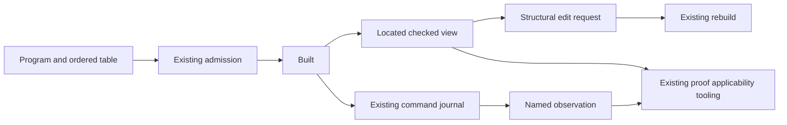

# Checked capability transport research

**Role:** design research. **Evidence:** frozen source inspection and primary literature. **Scope:** main `4b57609c03ad0a38fd81cfc2c09ea5731dfe7ff0`.

All proposed APIs and propositions below are uncompiled. No repository edit, compiler, runtime, generator, installation or build ran.

## Recommendation

Expose checked operations over the data the project already owns. Start with loading a program bundle, inspecting a checked occurrence and checking an edit.
Follow with replay-prefix observations and proof applicability through existing tooling.
Do not add another program representation, a generic field-update language, a runtime proof object or another evidence ledger.

The current boundary already provides canonical program bytes, command bytes, checked sessions, replay laws and generated observation codecs.
The missing connection is an exact relationship between a requested operation and its program, table, local context, observation and proof premises.

Two distinctions matter immediately:

- `RunnerBytes.observeBytes` serializes `HostProtocol.State`. It does **not** serialize the larger `Run.Observation`.
- Raw OCaml `api_replay` returns a machine inspection. It does **not** reconstruct the `HostSession` pending, consumed and retired ledger.

An external consumer can request these checked operations from a Lean host before it owns a local checker.
A received proof name or a successful decode does not authorize a stronger claim.

## What already crosses a boundary

| Data or API | Existing owner | What its result establishes | Limit |
| --- | --- | --- | --- |
| Raw `Eff NativeOp`, `Ty`, terms, rows | `Store/Domain/Derived/Program.lean`, `ProgramWire.lean` | Exact canonical storage image | Decoding does not establish program admission |
| Schema representation | `Schema/Representation.lean`, `Store/Domain/Derived/Schema.lean` | First-order schema data and exact storage image | Revival, target support and value admission are separate |
| Checked JSON values | `Schema/Codec.lean`, `Laws/Schema/Codec.lean` | Checked encode/decode laws on their admitted domain | Handles and unsupported type forms remain refused |
| Application program | `Api/Built.lean`, `Api/Author.lean` | Exact program and table, with an admission certificate | The public certificate uses `SigApp ⟨table, []⟩` |
| Commands and phases | `Api/RunnerBytes.lean`, `Api/RunnerDerived.lean` | Canonical command/verdict bytes and row replay | An unreadable byte row is not a decoded command |
| Session state | `Api/HostSession.lean` | Header, identity, receipt, application and retirement state | Receipt alone is not application |
| Public run observation | `Run.lean`, `Api/RunnerDerived.lean` | Outcome, exit, requests, ledger summaries, reasons and fibers | It omits full stores and traces |
| Millisecond clock values | `Data/ClockMillis.lean`, `Store/Domain/Clock.lean` | Canonical decimal string image | This is not a new nanosecond or host-number policy |
| Theorem references | `tools/ProofGraph/Proof.lean` | Tool-side proposition, universe and axiom validation | `Expr` is tooling data, never program syntax |
| Evidence reports | `tools/Conform/Core/Report.lean`, `tools/Tools/Semantics.lean` | Existing structured observations, inputs, status and dependencies | Metadata associations are not measured proof dependencies |

`Canonical` supplies `ofVal_toVal`, `ofVal_exact` and `fits` in `Store/Domain/Canonical.lean`.
Its byte retraction, `Canonical.decode_encode`, assumes well-formed framing lengths below `2^64`.
`Canonical.decode_exact` recovers the exact bytes and well-formedness after a successful decode.
`Canonical.encode_injective` assumes well-formedness on both inputs.
`Canonical.digest_congr` proves only that equal data has equal digests. No converse assumes collision freedom.

Use this class for new finite request and response records.
Generate their `ShapeDoc` and codecs through the current owner when implementation is authorized.
The bounded source search did not locate direct canonical instances for `Node`, `GenTy`, `LayerTy`, `StmtTy`, `Api.Budget` or `Run.Work`.
Those wrappers need generated instances only if the chosen external operation exposes them.
Do not create a second wire algebra to describe these records.
JSON may remain a display or tooling transport projection. It needs a named normalization law before it becomes an exact interchange claim.

`Schema.decode_of_encode` gives value retraction.
`Schema.encode_of_decode` gives exactness modulo `Codec.normJ`, which accounts for object-entry order.
`Schema.encode_sub` additionally requires `Codec.Compatible`; subtyping alone does not establish one JSON layout.
These laws do not justify erasing tagged union selection or reviving a handle from a number.

## Minimal transport contracts

The companion `envelopes.txt` gives proposed field lists. These describe finite data, not a second program syntax.

### 1. A program bundle and its local checked result

A bundle contains the existing raw program, the ordered row table and optional row-name metadata.
It also names its envelope format, wire schema and semantic implementation profile.
The initial service accepts exactly the signature admitted by current `Built`: `⟨table, []⟩`.
It must refuse an unsupported service-declaration extension, rather than silently ignoring it.

The row table is semantic input. `NativeOp.external i` selects its position.
Therefore `Built.bytes`, which contains the program alone, is insufficient as a bundle identity.
Row names remain metadata for named operations; a display-name change does not by itself change the program meaning.
A request that resolves a row by name nevertheless binds the name map it used.

Loading decodes the exact carriers, checks the requested schema/profile, then invokes the existing admission path.
The success response returns a host-owned checked handle and the computed `EffTy`, not a serialized `Prop` or a trusted Boolean.
The host can also return canonical bytes for independent loading by another implementation.
That implementation must perform its own admission or rely explicitly on this host's checked operation.

`AdmittedProgram` in `Program/Admission.lean` includes the typed program, table and program integer scans, signature admission, formation and inferred column checks.
Preserve those checks as one admission path.
The bundle loader must not replace them with a generic schema validation.

Version fields distinguish three changes: the transport envelope, the syntax/codec signature and the named semantic profile.
A build revision is provenance for the latter, not a proof that two different revisions agree.
Stable tags already belong to `tools/Effect4Gen/wire-tags.json`.
For example, typed `Deferred.make` uses an appended tag and the former tag is retired.
Constructor position is not an adequate compatibility rule.

### 2. A versioned selection

A selection names an exact bundle and a path under a named path scheme.
Initially it selects only the seven structural sorts already addressed by `Node.at_` and `Node.replaceAt`.
It carries the expected selected node, or an identifier resolved to exact canonical node bytes.
The host compares that value before applying an edit.
A digest may accelerate lookup; the specification still requires exact identity or an explicitly assumed collision-free resolver.

The current path counts node children only. It does not count a term, a type annotation or an operation argument as a node child.
An `iterate` body is a node child; its cursor type and term fields are not.
A later term-field selection needs a distinct tagged selector generated from the signature.
Do not reinterpret an existing list of indices to address both kinds of fields.

This first API can expose read-only selection without a new proof.
`replaceAt_spec`, `replaceAt_self`, `replaceAt_overwrite` and `at_replaceAt_disjoint` in `Laws/Program/References.lean` provide the structural reuse route.
They establish structural results under their premises. They do not preserve scope, type or behavior.

### 3. A located checked context

This is the highest-value missing connector.
The root certificate proves the whole checked program has its computed type.
Existing local `HasTy` judgments describe local typing, but the public API does not yet compute a reusable path-indexed context view.

A result must record its syntax sort, local typing mode, environment and the matching type result.
It cannot assign `EffTy` to every node.
Effects use `EffTy`; layers use `LayerTy`; generator statements use `StmtTy`/`GenTy` and binder information.
`checkStmt` also depends on `inLoop`.
An individual return result can retain a located refusal until the statement sequence checks it in its proper position.
Expose only a context certified by the complete checker derivation, not an unchecked intermediate summary.

The context must distinguish an original source occurrence from an occurrence after reference expansion.
`TypedProgram` obtains its typing evidence through checked reference expansion.
A source path is not automatically the corresponding expanded path, especially when one referenced value occurs more than once.
The first implementation may refuse this view for reference-bearing selections, or add the exact occurrence connector.
It must name that restriction.

Binder details are semantic input: bind continuations, operation-carried current values, two fold binders, loop cursor/body results and closed layers.
A view generated by the existing binder signature can expose those details without introducing another checker.
The soundness statement connects its result to the existing local judgment at that environment.
The erasure statement says the view leaves the source, annotations and binder levels unchanged.

This same computed result can serve the Routing Boolean-select printer, `inspectAt` and an editor's expected-type display.
The printer should consume the checker's joined branch type rather than infer the target type from one branch.
The view's typing theorem does not by itself prove target checking or source/target behavior agreement.
Those remain separate R8 consumers.

### 4. A checked edit

An edit contains a base selection and an existing replacement `Node NativeOp` of the expected sort.
It first checks the base and selected value, then calls structural replacement, then `Built.rebuild` on the entire candidate.
The result retains the current table and declared row names.
A successful rebuild may compute a different root type.

The refusal is a finite sum: unsupported version/profile, stale base, missing path, wrong sort, unreadable payload or existing located `BuildRefusal`.
The first five belong to this operation's transport/structural boundary.
The last reuses the actual admission refusal rather than translating it into an unstructured string.
No refusal changes the held program.

Moving a subtree is a different operation from replacing it with data already scoped for the target context.
A move must provide a checked relocation or refuse.
Raw de Bruijn terms pasted under a different binder can change meaning while retaining the same apparent type.
Do not claim arbitrary `TermSrc` closure stability from the minted authoring helpers.

A further rewrite mode may demand a named relation, such as `StraightEq` over all relevant environments and stores.
That is an optional additional acceptance condition after admission, not a new meaning of `rebuild`.
The host should return the old and new program plus the particular checked relation application.
It must not infer a semantic rewrite certificate from equal root types.

### 5. A replay prefix and its observation

Use the existing `List Command` journal, not a second event log.
A prefix request binds the admitted bundle, session name/profile, full `Api.Budget` and the command prefix.
The budget includes both compilation and running resources.
If a saved checkpoint is used as a cache, its validation target is replay from those original inputs.

`Run.step` records attempted decoded commands and their phases, including refusals and frontiers.
Dropping a refused row changes the journal and invalidates exact reconstruction.
Malformed byte rows belong to `RunnerBytes.replayRows`' separate verdict boundary; do not silently insert them into `List Command`.
A protocol can preserve their transport transcript separately, without calling it the run's semantic journal.

`Run.play_append` proves exact prefix composition.
`Run.journal_replays` proves reconstruction for `Run.Reached`, with the same built program, name, budget and profile.
`Run.drive_eq_play` connects a reactor's returned command list to the resulting run.
None of these laws calls the original host or proves the truth of a recorded host answer.

Offer named observations with their existing concrete payloads:

- `session-state`: `HostProtocol.State`, exactly the existing `RunnerBytes.observeBytes` result.
- `run-observation`: `Run.Observation`, using its existing canonical instance.
- `machine-inspection`: the existing inspection and an explicitly selected machine projection.
- `terminal-exit-stores`: exit and full stores, only when the named completed-fragment contract applies.

The first two are distinct schemas, not alternate names for one result.
The run observation does not contain every store or trace field.
A clock or scheduler view may use `Run.Work`, but an exact codec for that additional record needs its own generated instance.
An empty work view does not prove completion or deadlock without the named frontier theorem's premises.

Host comparisons retain their evidence provenance.
A field computed from Lean replay is not a directly measured TypeScript field.
A profile may relate them, but its statement must name the relation and its hypotheses.
Do not fill OCaml's absent session ledger with Lean data and label the combined record independently measured.

### 6. Proof applicability

Expose a host-validated request for an existing claim and exact subjects.
Its parameters are finite data specific to that claim: artifact references, a path, a profile or a completed observation.
Do not accept arbitrary serialized `Expr`, a proposition string or a client-supplied `proved` bit.

An adapter reconstructs the expected proposition from these inputs inside the trusted tooling environment.
It validates the theorem with existing `ProofRef.validate`, then checks the application and its premises.
`ProofRef.validate` checks theorem existence, closed syntax, universe parameters, definitional equality and transitive axioms.
A matching universal theorem still needs its application arguments and premises.

The response uses existing `Conform` evidence/outcome/obligation reporting and existing `Plan` goal/modulo/proved status.
It names which premises are discharged and which remain open.
A theorem proved modulo a goal cannot close the application merely because its exported placement names the desired requirement.
Authored placement, measured proof dependencies and the check's target proposition remain separate fields.

The first practical consumer is a host operation that explains whether the selected rewrite or observation law applies.
There is no need for a public generic theorem execution service.
A proofgraph report is a presentation of the current environment, not an independently trusted proof certificate.

## Straight and looped programs share the boundary, not every theorem

Use one input bundle, selection mechanism and named-observation protocol for both fragments.
The proof applicability result identifies the fragment and exact law.

`Looped.of_straight` and `meaningB_straight` connect straight programs to the budgeted meaning.
`LoopAgreement` says that a completed budgeted meaning has the same exit and stores at sufficiently large machine fuel.
`Agreement.loopAgreement` supplies that theorem when `Looped e = true`.
It does not show that every loop terminates, or that equal fuel gives equal intermediate states.
A `none` budgeted result is unfinished work with retained stores, not a program error.

Therefore the first common comparison is a completed exit-and-stores observation.
An all-environment/all-store rewrite theorem and the root machine agreement remain separate claims.
A future prefix relation must explicitly relate budgets and live frontiers; completion agreement does not supply it.

Sequential source use of Queue or Pool does not put its expansion inside `Straight` or `Looped`.
Their internal waits, forks, masks and host interactions need the existing R10–R12 module profiles and obligations.
This protocol should display that refusal of a theorem application rather than pick a weaker observation silently.

For clocks, reuse `ClockMillis` and its canonical decimal-string encoding.
`Api.TestClock.adjust` is a recorded millisecond advancement decision.
`TestClock.synthesize` covers literal sleeps in sequence; concurrent or computed-duration cases need explicit decisions.
The proposed transport does not ratify nanosecond readings, bigint target support or a scheduler-resumption law.

## Organization and target adapters

Keep small passive request/response records beside the existing public API when they acquire callers.
Keep their semantic carriers in current Program, Store and Schema owners.
Generate codecs through the existing generated groups; put laws in `Effect4.Laws` with their placed consumers.
Keep proof reconstruction, kernel reflection and rich reports in `tools/ProofGraph` and `tools/Conform`.
The `Effect4` root must not import that tooling or the law graph.

`Tools.HostProtocol` can project the finite schema for external clients.
`Tools.ProgramStructure` already selects and checks the ground program family before generation.
`Drivers.TsGen` and OCaml's generated wire modules should consume those descriptions rather than manually copying another model.
A transport facade can begin as a small driver around existing APIs, with generated schemas and one request per capability.
No current ruling requires an LSP server, MCP server or daemon implementation.

The TypeScript carrier maps naturals to numbers and checks safe integers on wire output.
The OCaml framing kernel has its own signed-integer range.
Canonical Lean bytes are exact on their domain; those target adapters have bounded representable domains.
They must refuse unsupported values rather than narrow them silently.
Targets also need independent parity controls and later agreement proofs; generated shape alone proves neither.

Generated OCaml `api_replay` accepts program, run fuel, decision tape, answers, row table and compilation fuel.
The smaller `api_engine_inst` wrappers currently fix an empty table and reuse budget defaults.
A nonempty-table consumer should use a narrowly checked adapter to the general entry point.
This is the same existing machine route, not a second interpreter or a session-lifecycle implementation.

## Required placements and landing order

`obligations.json` gives full proposed properties, premises, exclusions, consumers, controls and prerequisites.
No proposed name is an existing theorem or a new ratified registry entry.

1. **Located checked view.** Reuse the checker and local judgments, then serve Routing printing and inspection. This is the first semantic connector.
2. **Checked selection and edit facade.** Wrap existing structural laws and rebuild admission, with exact base checking and located refusals.
3. **Replay-prefix access.** Expose existing journal laws and named observations, retaining all inputs and evidence provenance.
4. **Narrow proof-applicability adapters.** Begin with the actual fragment/typing/rewrite consumers above, using the existing proof report.

The finite bundle codec can accompany the first external caller.
It does not justify a broad framework before that caller exists.
Some API work is packaging existing theorems; do not create duplicate planned goals for those statements.

| Requirement | Boundary retained by this plan |
| --- | --- |
| R1 | Admission uses the exact application signature; current public service-declaration gap stays visible |
| R2 | New syntax/codec versions do not imply conservative extension; the existing relation and proofs still govern |
| R3 | `Ty`, schema, normalization and codec admission remain distinct |
| R4 | Local environment and world premises survive typed views; handles are not reconstructed from raw identifiers |
| R5 | Ordered service/row identity and context validation are recorded inputs, not incidental names |
| R6 | Host receipt, application and answer admission remain separate from replay |
| R7 | Retained code and capture transport are not smuggled into a byte envelope as host closures |
| R8 | Each face and rewrite names its profile, observation and exact relation |
| R9 | A local edit certificate does not close whole-machine safety |
| R10 | Queue, Semaphore, Pool and Cache keep their separate expansion-agreement obligations |
| R11 | A replay prefix or terminal result does not prove all resources were released |
| R12 | Frontiers and budgets remain explicit; no liveness follows from finite replay |
| R13 | Program, table, session, budget and complete command prefix determine the reconstruction claim |

## Literature and its limits

Foster et al. distinguish lens round trips from totality, with definedness premises for partial lenses.
Their version-counter example also shows that round trips need not imply repeated-update absorption.
This supports a narrow structural edit API, with admission and meaning laws stated separately.
A computed type view has no automatic put-back operation.
Source: [Combinators for Bidirectional Tree Transformations](https://www.cis.upenn.edu/~bcpierce/papers/lenses-toplas-final.pdf), §§3.1–3.4.

Hazelnut's action-sensibility theorem preserves typing under its editing judgments; synthesized types may change.
Its movement theorem preserves the erased expression, while its calculus explicitly includes typed holes.
The useful adaptation is to separate selecting from editing, and to expose the exact local checking mode.
It does not transfer a typed-hole editor or its metatheorems to `Eff`.
Source: [Hazelnut](https://arxiv.org/pdf/1607.04180), §3.3.1, Theorems 1–3.

LSP distinguishes a versioned text edit from successive change events.
Its `ContentModified` guidance does not permit rejecting every request merely because another edit is pending.
Use a dedicated semantic stale-base result for this protocol, with the exact requested artifact identity.
Text-document versions are client coordination metadata, not program or theorem identities.
Source: [LSP 3.17 metamodel](https://microsoft.github.io/language-server-protocol/specifications/lsp/3.17/metaModel/metaModel.json), `VersionedTextDocumentIdentifier`, `TextDocumentEdit`, `DidChangeTextDocumentParams` and `staleRequestSupport`.

Bidirectional Type Slicing is a research preprint with a richer syntax and hole-based precision relation.
Its useful direction is an explanation containing only the context needed for a local type judgment.
Do not promise a globally smallest explanation: its general minimum-size problem is hard, discussed in §10.
An initial `whyThisType` response can provide the actual checker premises without a minimization claim.
Source: [Bidirectional Type Slicing](https://arxiv.org/abs/2607.12197).

## Verification and limits

`source-manifest.json` retains the exact committed bytes used here.
`verification.json` records 126 source and packet checks. All pass.
`committed-verification.json` independently compares all 79 snapshots with the frozen Git revision. All match.
`controls.md` separates proposed acceptance controls from checks performed in this research.
No proposed type, codec, local-view theorem, protocol handler or target adapter was compiled or exercised.
Existing theorem statements were inspected; their proofs were not independently rebuilt.
The parent owns further review, authority and any implementation allocation.
