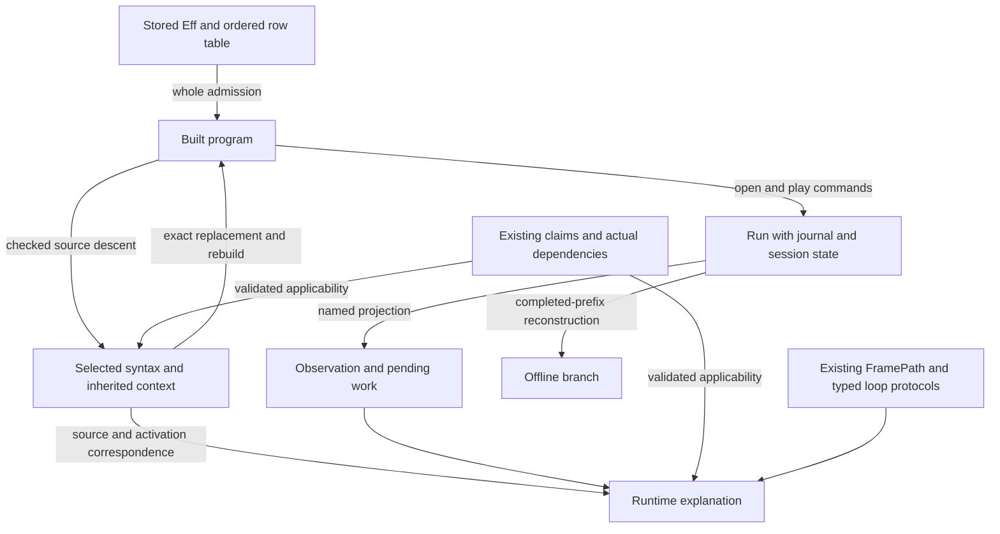

# Coherent program capabilities and their proof data

## Recommendation

Expose one family of capabilities through `Effect4.Api`: inspect, explain, edit, compose, observe and replay.
Keep `Eff` as the stored program and `Run` as the session owner.
Use the existing type checker, folds, codecs, continuation relations and proof graph underneath that surface.

The first useful connection is between a selected program location, its inherited checking context and its eventual execution explanation.
That connection needs explicit data and small connecting laws.
It does not require a new program representation or a general graph framework.

Straight programs and loops share every proposed public workflow.
Their semantic guarantees retain the fragment and observation that justify them.
An asynchronous loop also uses the existing scheduled machine relations.
It does not enter the synchronous `Looped` theorem merely because its source contains a loop.

This packet prioritizes proposed obligations and API contracts.
It does not install those APIs, prove their laws or change the central registry.
The coordinator can place each selected statement through the existing registry and `proof_goal` machinery.

## Evidence and finishing criteria

The source freeze is `4b57609c03ad0a38fd81cfc2c09ea5731dfe7ff0`.
LIFT source at `b88ff25d` is inspected separately, without accepting its later integration.
Three research agents cover authoring, execution and interoperation.
The parent verifies their frozen sources and reruns the independent finite models.

Finishing criteria are concrete user stories, data contracts, source owners, placed obligation proposals and checked evidence.
The literature collection must retain original PDFs, source identities and checked visual locators.
The full R1–R13 requirement block must remain visible.
No implementation seat, build or active source edit belongs to this research task.
The owner separately authorizes the bounded paper additions under `vendor/papers/program-graphs/`.

## Three first consumers

### Explain and edit a loop

A user selects the step of a loop and asks which values it can read.
The view shows the outer inputs, cursor and body answer as distinct slots.
It shows the local type and the whole program's answer, error and requirement columns.

An edit rebuilds the whole program through existing admission.
Changing the body answer rechecks the step even when the final answer type stays unchanged.
Changing a same-typed variable can remain admitted while changing behavior.
The interface reports that distinction.

The first semantic transformation removes administrative suspensions in a straight example and a nested-loop example.
Its proposed observation compares bounded meaning, including stores retained at an unfinished loop.
The execution connection uses the existing finished-loop theorem and separate sufficient machine budgets.

### Explain waiting and explore a recorded branch

A user selects a waiting worker in a recorded Queue or Semaphore scenario.
The view links its source point, current registration, pending replies, timer and completed journal prefix.
It distinguishes receipt from application and notification from resumed execution.

The user can reconstruct a completed prefix and explore alternative recorded commands offline.
That operation does not clone external resources or resume a lost driver continuation.
An edited source starts a new admitted program unless a separate state-transport relation exists.

This consumer should use the actual public Queue and protected Semaphore operations as they become accepted.
It should include repeated waits inside a loop and a straight control case.
The active implementation seats retain their existing ownership.

### Explain a target type disagreement

Routing already provides a concrete consumer for local checked types.
Its Boolean-select printing needs the type computed by the actual branch join.
A shared checker-derived context can serve both that printer and a visual explanation.

The first explanation highlights contributing syntax in the unchanged program.
It does not claim Type Slicing's minimality theorem or introduce holes into executable syntax.
The target reader still needs its own exact image and refusal laws.

## Keep the views connected and distinct

Source paths, reference origins, runtime occurrences, causal edges and proof dependencies are different relations.
The API should name each relation instead of putting unlabeled edges into one graph.
Shared selection and identity fields connect the views.

## Prioritized slices

These priorities are recommendations for coordinator allocation.
They do not suspend current work or authorize duplicate implementation.

| Priority | Deliverable | Existing consumer and reuse | Required proof work |
| --- | --- | --- | --- |
| 1A | Exact selection, same-sort edit and whole rebuild | Existing `Node.replaceAt` and `Built.rebuild`; external editor | Thin composition of existing replacement and admission laws. No new acceptance judgment. |
| 1B | Checker-derived local context, including loop slots | Routing printing and source inspection; existing checker inversions | Connect computed inherited contexts to the actual root derivation. Prove erasure and each supported descent. |
| 2 | One rewrite shared by straight programs and loops | Administrative suspension cleanup; existing `meaningB`, folds and `iter_congr` | All-budget equality of the named bounded observation. Reuse `loopAgreement` for finished execution. |
| 2 | Completed-prefix inspection and offline branches | Existing `Run.play_append`, `journal_replays` and CUTS | Validate selection and expose the already proved relations. Move Test-owned reusable declarations only for an actual library consumer. |
| 3 | Explicit clock planning and clock-unit compatibility | Existing commands, `ClockMillis`, timer selection and row 231 | Keep the accepted unit conversion lane. Add a snapshot-bound plan over current commands without promising completion. |
| 3 | Scoped stored-fragment insertion | Existing weakening, `Forms.insert` and loop authoring | Connect shifted syntax to equal bounded meaning under matching environment insertion. |
| 4 | Claim-specific proof applicability | Existing Plan, `ProofRef` and Conform | Reconstruct the exact proposition and check supplied premises. Keep missing premises and transitive goals visible. |
| Later | Dynamic causal views and live state transport | Recorded waiting/protected-operation consumers | First define event granularity, source/activation correspondence and owned continuation state. |

Slices 1A and 1B can proceed independently.
The synchronous rewrite and recorded-session lanes also have independent prerequisites.
Do not make every future capability wait for a universal graph theorem.

## Data required by each obligation

An obligation should determine its input record before a proof begins.
These records contain existing syntax or derived views, not another program language.

| Obligation | Data that must travel with the request | Required hypotheses | Observation and exclusions |
| --- | --- | --- | --- |
| Checked focus | Exact program and ordered table, schema/profile, source address, selected sort, term slot, argument mode | Root certificate and the correct inherited route; reference-origin witness or explicit initial restriction | Exact selected syntax and local judgment. No arbitrary invented environment or unique runtime frame type. |
| Checked edit | Exact old bundle, expected old node, same-sort replacement | Fresh selection, valid address and whole candidate admission | Candidate, table, names and new type. No behavior guarantee. |
| Loop rewrite | Both programs, fragment evidence, semantic budget, value environment and full stores | Both programs lie in `Looped`; all-budget relation for the chosen pass | Optional exit and all stores, including unfinished stores. No same-fuel scheduler trace claim. |
| Scoped insertion | Input environment split, inserted slots, shifted existing syntax | Existing weakening premise; matching value insertion; interpreted operation-term relation | Same bounded meaning. No arbitrary substitution or live capture transport. |
| Prefix reconstruction | Program/table, both budgets, session identity, profile, full command prefix and phases | Existing reached-run premise when reconstructing a supplied run; exact CUTS lookup when selecting a decision | Full Run equality or its explicitly named machine projection. Stopped commands remain separate. |
| Runtime continuation view | Source revision, runtime occurrence, world, captured values, current registration and typed frame evidence | Existing later-world and race/token correlation premises | A witnessed typed continuation view. No permission to resume a stale registration. |
| Clock conversion | Clock kind, unit, origin, exact value, timer guards, deadlines and active target | Chosen old/new profile and numeric domain; explicit millisecond embedding | Corresponding old-profile times and selected timer order. Delivery and sufficient budget remain separate. |
| Clock plan | Exact snapshot, policy, command, delta, both budgets and intended observation | Current plan inputs; stale plans refuse | A proposed existing command and its reason. No fairness or automatic quiescence theorem. |
| Causal view | Actual event occurrences and justified edge kinds | Defined granularity; evidence for each communication or store edge | A derived dependency relation. Journal order and timestamps alone do not supply it. |
| Proof application | Claim, exact subjects, theorem environment, universes, finite adapter parameters and premises | Reconstructed expected proposition, checked application and permitted dependencies | Existing proof status plus outstanding premises. A theorem name is not a certificate. |

The detailed contracts retain exact declarations and source paths in the three subreports.

## Module and schema organization

The public facade remains `src/Effect4/Api.lean` with focused companions below `Api` when a consumer needs them.
Existing `Program` owners retain source selection, reconstruction, checking and authoring computations.
The runtime remains under `Run`, `HostSession` and `Machine`.
The corresponding laws remain under `Laws`.
Proof discovery and application validation remain under `tools/ProofGraph` and the existing report tooling.

Do not import Laws into the executable core to display a guarantee.
Expose first-order data and a reference to separately checked evidence.
Reuse existing `Ty`, `EffTy`, `Node`, row tables, commands, observations and refusals.
Generate exact codecs for new finite wrapper records only when a real boundary consumes them.

Current `Built` admits the signature `⟨table, []⟩`.
The declared-service extension remains its existing open API work.
Program bytes alone do not identify an ordered operation table or its typing result.
A durable selection must resolve to the exact bundle, or state its trusted digest boundary explicitly.

`RunnerBytes.observeBytes` exposes `HostProtocol.State`.
It does not expose the larger `Run.Observation` under another name.
`Run.Observation` already has a canonical codec but omits full stores and traces.
Raw OCaml replay also omits the `HostSession` ledger.
Every external operation should fix one payload schema and one named observation.

The existing seven judgments remain separate: formation, canonical form, membership, inhabitance, profile support, codec admission and reply admission.
Decoding a carrier does not establish program admission or a host reply's applicability.

## Clock and event-order conclusions

The current millisecond model can already support an honest external clock planner.
That planner proposes existing advance and flush commands against a specific run snapshot.
It must inspect current work after each command.

The syntax sleep collector sees a loop body once.
It cannot predict how many times the loop registers a sleep.
The retained independent model demonstrates three visits to `sleep(5)` with wakes at 5, 10 and 15.
One explicit advance to 15 can include newly registered sleeps before its target.
The positive straight case and branch controls are retained alongside it.
These are finite model observations, not Lean or Effect execution results.

Wall time, monotonic time, virtual time and logical event order need distinct meanings.
A nanosecond-valued clock does not guarantee nanosecond timer precision.
The accepted nanosecond compatibility slice must preserve old millisecond inputs explicitly.
The model, live Clock and stock TestClock differ in cancellation and wake behavior.
Their names cannot substitute for a stated agreement profile.

The first causal diagram should show only edges justified by recorded evidence.
It may show journal order separately, without claiming that every ordered pair is causally dependent.
Shared-store and inline receiver behavior need their own event definitions.
Proving independent-event reordering is later work with a concrete consumer.

## Literature and visual semantics

The owner-requested originals live in [the project paper collection](/Users/pooks/Dev/lean4-effect4/vendor/papers/program-graphs/README.md).
The collection provides checked page and figure locators, source URLs, versions and hashes.
It includes Type Slicing, Lamport, Zippers, Hazelnut, Binding Universe, Tree Transformations, Interaction Trees, Choice Trees and Translation Validators.

Three visual patterns are immediately useful as design references:

1. Selected syntax beside the context explaining its type.
2. Source structure beside repeated runtime occurrences and separately labeled causal edges.
3. A proposed transformation beside its admission result and named behavior relation.

These are design applications of the literature, not imported Effect4 theorems.
Minimal slicing, arbitrary bidirectional updates and unrestricted equation transport require additional premises.

## Requirement coverage and retained limits

[requirements.md](requirements.md) maps this work to every existing requirement.
[requirements-source.txt](requirements-source.txt) retains the full frozen titles and open parts.
No old part is deleted or closed by these proposals.

Actual program admission, the historical Queue typing and agreement proofs, reference expansion and CUTS remain closed with their exact premises.
R6's executable-reply connection, R7's retained-entry contracts and R9's stated M7 domain remain separate.
General public-operation agreement, cleanup completion, embedded budgets, full driver suspension and liveness remain visible under their existing requirements.
The active LIFT and SEMW results need their normal integration acceptance, not a new competing proof effort.

## Detailed packets

- [Authoring and typed contexts](authoring/report.md), with [concrete contracts](authoring/contracts.md).
- [Execution, continuation and clocks](execution/report.md), with [data proposals](execution/api-data-proposal.json).
- [Schema and interoperation](interop/report.md), with [wire envelopes](interop/envelopes.txt) and [placed proposals](interop/obligations.json).
- [Parent verification](parent-verification.json) and [receipt](receipt.json).
