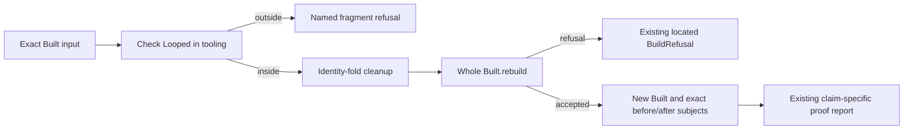

# Proposed suspension-cleanup slice

**Role:** slice brief for later allocation. **Evidence:** source inspection and a finite Python mirror.
**Scope:** `c22f908def0c2a881ae46040d0dbaaaa57991352`.
**Status:** proposed and uncompiled. No repository edit, Lean command, compiler, build, generator or target runtime ran.
No implementation ownership changes in this packet.

## The result

Add one data transformation that removes `Eff.suspend` nodes through the existing identity fold.
Prove one bounded-meaning law covering straight programs and nested loops together.
Exercise it through whole-program rebuilding and the existing finished-run agreement.
Do not add a rewrite language, another denotation or a scheduler optimization.

The smallest definition changes one algebra field:

```lean
-- PROPOSED; UNCOMPILED
-- Imports Effect4.Program.Fold, without importing Laws.
def stripSuspendsAlg (Op : Type) : EffAlgebra Op (EffSelfCarrier Op) :=
  { EffAlgebra.id Op with eff_suspend := fun body => body }

def stripSuspends {Op : Type} (e : Eff Op) : Eff Op :=
  cata_eff (stripSuspendsAlg Op) e
```

`cata_eff` carries every nonrecursive field unchanged.
In particular, it retains operation-carried terms, loop annotations, cursor terms and binder indices.
It traverses the seven existing structural sorts; it does not traverse or rewrite `Term` syntax.
The function is raw syntax manipulation. Its advertised behavioral guarantee requires `Looped`.

The first consumer cleans an explicitly selected synchronous example and calls `Built.rebuild` on the resulting whole program.
Its response distinguishes admission from the specific behavior law.
An edited program does not reuse source paths or resume an old live machine.

## Placement before proof work

**Concept:** `translation-simulation`; required property: an admitted transformation agrees on its named observation.
**Requirement:** R8.
**Proposed claim:** `looped-suspension-cleanup`, role `simulation`.
It extends the use of existing `straight-composition-agreement` and consumes existing `loop-agreement`.
The coordinator records the proposed claim or a narrower helper placement before any theorem work.

**Observation:** `meaningB k e env stores`, including `Option ExitV` and the complete `Stores`.
**Fragment:** `Looped`, which includes `Straight` and nested synchronous `iterate`.
**Hypotheses:** exact same semantic budget, environment, initial stores and raw nonrecursive fields.
**Consumer:** checked source-cleanup preview; a straight failure/cleanup example and nested-loop example.
**Exclusions:** scheduling traces, target execution, automatic yields, host calls, resource-release completion, liveness and arbitrary asynchronous loops.
**Spine:** a named transformation connection under R8; it does not close M6/M7 or module expansion agreement.

The structural fragment helpers belong to `initial-algebras-folds` and serve this same claim.
The rebuild helper uses existing `rebuild-admission`, under `residual-program-typing`; do not create a duplicate admission theorem.
The exact candidate signatures are retained in `statements.lean.txt`.

## Required laws

1. `Looped (stripSuspends e) = Looped e` and the corresponding `Straight` equality.
2. On `Looped e = true`, every `k`, environment and initial store have equal `meaningB` results before and after.
3. A straight input yields `StraightEq (stripSuspends e) e` as a corollary.
4. If the original bounded meaning finishes, the original and rewritten roots have equal exits and stores at sufficient machine fuels.

The fourth law retains separate before/after fuel bounds.
Its initial machine consumer uses the empty table, empty value environment and empty stores of `LoopAgreement`.
A nonempty `Built.table` needs a table-irrelevance connector before this particular machine theorem describes its `Built` run.
`NativeOp.external` has kind `program`, so an external operation is outside `Looped` even if some actual row could run synchronously.

Do not introduce a general `LoopedEq` record for this first transformation.
An explicit theorem is enough for the current consumer.
A future second transformation can justify extracting a shared relation from the actual repeated uses.

## Existing proof route

`Laws/Program/Folds/Looped.lean` already generates `Looped.alg` and `Looped.eq_cata`.
`Laws/Program/Folds/Straight.lean` does the same for `Straight`.
`Laws/Program/Folds/Denote.lean` already generates `denoteB.alg`, `denoteB.hom`, `denoteB.eq_cata` and the agreement measures' algebras.
Use these owners and `hom_eq_cata_eff` rather than adding a second evaluator or a pairwise fold-agreement induction.

There is an important carrier detail.
`denoteB`'s fallback passes the original node to `leafB`.
`FoldOf` pairs raw syntax into a carrier when a constructor arm uses its child's value.
Therefore the proof must inspect the actual generated algebra type before choosing its carrier arguments.
The source reading predicts a paired carrier; no Lean inspection ran in this research.

For that paired carrier, retain the **original** node in the syntax component.
Put the post-cleanup meaning only in the observation component:

```text
candidate observer at e = (e, fun env => denoteB k (stripSuspends e) env)
existing observer at e  = (e, fun env => denoteB k e env)
```

Both can target the existing `denoteB.alg`.
Do not put the cleaned node in the first component and attempt to prove the raw trees equal.
Use generated uniqueness and project the meaning component.
At excluded constructors, unfold their `leafB`/`Straight` equations only to show the unchanged outside-fragment fallback.
The public law still requires `Looped`, so fallback equality cannot certify unsupported programs.

At the loop arm, initial/test/step/result terms stay identical.
The body hypothesis quantifies **every environment** at the same fixed `k`.
It therefore applies to `env ++ [cursor]` in every round, including nested loops.
Use `iter_congr` from `Laws/Program/Iter.lean` for equal `iterateStep` functions.
No induction on a second machine-fuel parameter is needed for this semantic law.

Bind, handlers and finalizers require equality under their actual extended environments.
Use the existing `thenB` equations and equality of continuations.
An unfinished body remains unfinished; it neither executes the rest nor runs its finalizer.
A completed failure keeps its stores before the finalizer executes.
If a finalizer is unfinished, the outer program stays unfinished with the finalizer's writes.

The strongest useful helper compares `denoteB` programs before interpretation.
Applying `runP` gives the complete-store observation directly.
Use `meaningB_straight` and the fragment helpers for the `StraightEq` corollary.
Use `loopAgreement` twice for the completed machine result.
Do not reprove its scheduler/local-machine connection.

## Type checking and API wiring

The initial wrapper performs these operations:



`Looped` currently lives in the Laws graph.
A core API file must not import it.
Keep the initial checked wrapper in a tooling or Test consumer that already imports the law graph.
The raw transformation can live in core, just as existing `TestClock` transformations use the identity fold.
Do not move fragment ownership merely to display a certificate.

`Built.rebuild` supplies the new admission certificate and computed type under the original table and row names.
`Authoring.rebuild_spec` and `rebuild_admitted` already state the needed admission behavior.
The first wrapper may retain rebuild refusal; it does not promise that cleanup can never fail admission.
A later total convenience operation needs the admission-transport proof its contract claims.

If a same-type theorem is included, state it through `HasTy` or the success projection.
Reuse `HasTy.suspend`, `inv_suspend`, `effTy_sound`, `effTy_complete` and `check_toOption_eq_effTy`.
Do **not** state equality of full checker results.
Removing a suspension removes a path component in a located refusal.
For an unbound variable under `suspend`, the old refused path is `[0]` and the new one is `[]`.
The candidate must report its own freshly computed location.

This pass moves no binder and rewrites no operation term.
It does not justify arbitrary subtree insertion or movement.
The finalizer control must account for the exit value bound before its body.
A reused loop term that expects its cursor at slot zero needs the correct slot under that extra binder.

## Proposed files and imports

These are proposed paths, not an allocation or permission to edit.
The coordinator owns root anchors and registry joins.

| Proposed file | Direct owner/imports | Purpose |
| --- | --- | --- |
| `src/Effect4/Program/SuspensionCleanup.lean` | `Effect4.Program.Fold` | The one-field algebra and its raw transformation |
| `src/Effect4/Laws/Program/SuspensionCleanup.lean` | core cleanup; existing Folds/Denote, Folds/Looped, MeaningEq, Agreement/Loop | Placed fragment, meaning and completed-run laws |
| `Test/Program/SuspensionCleanupContract.lean` | cleanup laws; current MeaningEqContract, DenoteBContract and LoopSoundContract | Real consumer, deliberate failures and axiom receipt |

Prefer extending the current `MeaningEqContract` if the coordinator considers that the clearer single battery owner.
Do not create both an old and a new version of the same acceptance case.
The current `MeaningEqContract.original` already writes 7, fails and finalizes to 8 under two suspension wrappers.
Reuse it rather than inventing another straight cleanup example.
Reuse `pLoopNested`, `pIterateRef`, `pLoopCaught` and the correctly scoped `pLoopFinalizer` for the loop controls.
Wrap their actual bodies with suspensions where the test must show an internal edit.
A root-only wrapper would not exercise nested transformation.

## Adversarial controls

The required Lean controls are proposed, not run:

- Original straight failure/cleanup and cleaned output both retain failure and the final cell value 8.
- The existing reference-writing loop stays unfinished at a small semantic budget with its updated store intact.
- Nested loops preserve outer values, cursor slots and the body-answer slot.
- A loop inside an onExit finalizer preserves the additional exit binder.
- A completed failure retains state for the finalizer; an unfinished body does not execute the finalizer.
- An unfinished finalizer retains its writes and stays unfinished.
- The positive completed run uses separate sufficient machine fuels.
- `sleep`, external rows, masks, forked bodies and other excluded heads fail the fragment check.
- Refusal-path expectations change after removal of a suspension.
- A deliberate budget-charging suspension mutant, state-reset mutant and binder-shift mutant fail their exact intended controls.

Do not infer same-fuel machine agreement.
`depthB (.suspend b) = depthB b + 1` and `boundB k (.suspend b) = boundB k b + 1` already expose changed sufficient bounds.
A zero semantic budget returns unfinished before a loop's first test.
A false first test completes with one semantic round.
That unfinished approximant is not a claim about the machine's frontier at a particular fuel.
Only a completed semantic meaning feeds `loopAgreement`.

## Research evidence

The isolated Python mirror covers one integer cell and the selected constructor equations.
It is not Lean, Effect, machine execution, a target result or a proof over `Stores`.
The completed run reports 126 cleanup comparisons, ten named boundary controls, five refused mutants and one diagnostic-path control.
The first attempt exposed a wrongly scoped scratch finalizer fixture; `initial-probe-correction.md` records the repair.
The repaired positive and unshifted negative remain in the final controls.

`model-controls-output.json` retains exact finite results.
`source-manifest.json` identifies the frozen source.
`parent-review.md` separately reviews the parent's current synthesis.

## Acceptance after future allocation

1. Inspect the generated `denoteB.alg/hom/eq_cata` types in the authorized Lean slot.
2. Place the frozen claim and helper consumers before proving them.
3. Build only the changed modules and their direct consumers, under the existing thread bound.
4. Run the focused positive/refusal battery and print the new theorem axioms.
5. Verify the transformation through the actual Built consumer, retaining old/new subject identities and its report.
6. Report no goal dependencies for the completed claim, no new axiom beyond the ceiling, and every remaining target/scheduling boundary.

No full sweep, generator run, target compiler or new runtime comparison is necessary for a Lean-only first slice unless the final changes reach those owners.
The coordinator assigns any branch, build slot, root imports and registry edits.
