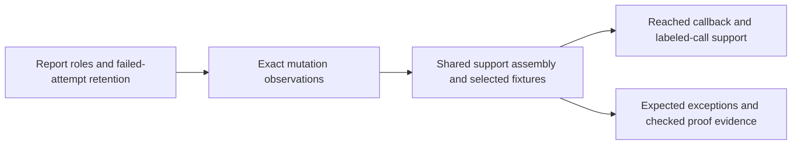

# Conformance API review

Use the existing Conform APIs more fully before adding another compiler framework.
The report format, application evaluator, proof validator, and native compiler checkpoint already provide the main structure.

Evidence status: source review and isolated Python checks.
Scope: main `182312f30194f0beefa7a6273eb1144aa834c0f0`.
The monitor runs no Lean build, OCaml compiler, generator, or runtime fixture.
The Python compiler-step probes replace subprocess outcomes with explicit fixtures.
They test runner decisions, not native execution.

## What already works

`Report.complete` requires exactly one result for every planned structural identity (`tools/Conform/Core/Report.lean`).
`Evidence` separates tested, reproduced, stamped, assumed, and proved claims (`tools/Conform/Core/Evidence.lean`).
`Report.withObligations` retains registered open obligations (`tools/Conform/Core/Obligation.lean`).
`Conform.ProofRef.validate` delegates to the shared proof graph (`tools/Conform/Core/Proof.lean`).
That validator checks theorem kind, the frozen proposition, universes, and reached axioms.

`Target.evalT`, `applyT`, and `applyNamed` already interpret named functions, closures, partial applications, and surplus arguments.
Their source is `tools/Conform/Lcnf/SemanticsTarget.lean`.
The builtin refactor needs no second general function evaluator.

The normalization checkpoint compares compiled Lean answers, source interpretation, target interpretation, and actual emitted OCaml execution.
Its producers are `Normalization.main` and `step_compiler` (`tools/Conform/Effect4/Normalization.lean`, `scripts/check-conform.py`).
The runner snapshots source and compiled-input hashes before and after execution.
The positive native checkpoint compares exact output.
These are useful finite checks, not a proof of the lowering route.

## Recommended bounded changes

| Priority | Change | Concrete reason | Small acceptance check |
| --- | --- | --- | --- |
| Now | Declare expected file roles in `fresh_run` | A required report can omit its format and become an unchecked artifact | One valid report plus a second missing-format report must refuse; two valid reports pass |
| Now | Retain unsuccessful attempts before validation | Incomplete failed runs lose their scratch artifacts; ordinary mismatch omits `actual.txt` | A failing producer retains command, full outputs, artifacts, and validation error without publishing success |
| Now | Name the expected mutation failure | Any unrelated `FAIL` marker currently satisfies the native negative check | Wrong fixture, wrong exit, missing failure, and unrelated exception refuse; intended counterexample passes |
| Current builtin slice | Reuse evidence and application APIs | Parallel evidence labels and duplicate application semantics add unnecessary work | Control references resolve to tested receipts; proved rows pass the existing theorem validator |
| As fixtures arrive | Add expected target exceptions and explicit lane selection | `TCase` expects only values; target exceptions always become counterexamples | Expected exception matches; wrong exception, timeout, and unsupported evaluator case remain distinct |
| Next small extension | Add the reached callback and labeled-call fragment | Existing rows emit list callbacks and `Option.value ~default`, which the target reader cannot fully exercise | Actual emitted syntax agrees with compiled Lean and OCaml on ordered, asymmetric, exceptional, and partial cases |

The actual Python probes retain each input and positive control under `core/` and `runner/`.
Parent verification reruns the validator and runner probes.
Their machine-readable results state the measured assertion counts.

## Bind reports to the request

`validate` already accepts `expected_ids`, `expected_pins`, and `expected_inputs` (`scripts/lib/conform_report.py`).
Production callers do not supply them.
A producer can shorten both its plan and results while remaining internally consistent.
The explicit expected-identity argument detects that change in the retained probe.

Pass these expectations from the requested fixture selection where available.
Do not derive expectations by copying the returned report.
Use one named selection with declared source, target, and host participation.
Target-only fixtures remain explicit when the source interpreter cannot represent their application shape.
Their expected answer still comes from compiled Lean wrappers.
Do not create a second hand-maintained fixture list.

Declare report files separately from raw artifacts in the existing profile record.
Validate the declared schema and tool identity for each report.
Preserve the current output hashes and source-freshness checks.
The compiler step separately validates two reports before native execution.
That limits current exposure but does not repair the generic `fresh_run` boundary.
The probes do not show an existing successful native observation was wrong.

## Reuse evidence without importing tools into the emitter

Builtin rows may retain source references, named controls, domain restrictions, and proof-claim references.
Keep these references separate from measured evidence status.
An inspected source claim is an assumption until a named check or theorem supports it.
A control name alone is not a test result.
The proposed `inspected/control/proved` field must not become a second evidence ranking.

Map metadata into existing Conform evidence at the tool boundary.
Keep the OCaml emitter independent of Conform.
Construct a proved report row only after `ProofRef.validate` checks the expected row-specific proposition.
Checking that an arbitrary theorem exists is insufficient.
The JSON validator checks proof-shaped metadata, not Lean proofs.
No current compiler producer claims a proved result through this gap.

`require_closed` only checks the obligations actually supplied.
A future certificate consumer must supply its expected obligation kinds and subjects.
Do not treat arbitrary dependency display strings as measured proof dependencies.
This stronger certificate contract can wait for its first consumer.

## Extend the smallest actual semantic fragment

The coordinator already plans shared support assembly and mutation checks after UI70.
Retain that adoption rather than reopening it.
The target evaluator and printed module should consume the same structural support definitions.
Their independent primitive meanings remain separate.

`LcnfMl.ofExpr` refuses every labeled application (`tools/Conform/Effect4/LcnfMl.lean`).
The current builtin table emits `Option.value ~default`.
An exact adapter for that emitted shape is smaller than general OCaml label semantics.
It must retain the admitted evaluation behavior and refuse other label shapes.

The target primitive table lacks list and option callback operations already emitted by the translator.
Use `applyT` for callback application, capture, exceptions, and fuel propagation.
Add the smallest operations reached by the selected support bodies first.
Start with the membership path and its asymmetric comparator control.
Then cover the selected list fold, map, or filter consumers.

Introduce a small expected-outcome type when a fixture needs deliberate exceptions.
Keep values and target exceptions separate from unsupported forms and fuel exhaustion.
Never make low fuel an expected semantic success.
Classify unsupported checks as unresolved, using structured reasons when needed.
The current broad `stuck` classification fails closed but loses this distinction.

## Proof scouting placement

| Proposed obligation | Concept and placement | Consumer | Hypotheses and observation | Exclusions and prerequisite |
| --- | --- | --- | --- | --- |
| Support body agreement | `translation-simulation`, R8 typed-lowering open part | Builtin support interpreter and compiler checkpoint | Admitted syntax, disjoint globals, named numeric/string profile, sufficient separate fuel; equal value or named target exception | No compiler/runtime proof; shared structural support assembly first |
| Callback application agreement | `translation-simulation`, R8 | Membership and selected fold/map/filter rows | Related callback inputs, captured environments, result relation, order and short-circuit premises | No arbitrary host closure or general OCaml claim; one callback consumer first |
| Exact labeled-call adaptation | `translation-simulation`, R8 | Emitted `Option.value ~default` | Exact label layout, admitted arguments, defined evaluation observation | No general optional-argument semantics; freeze the emitted shape first |
| Checked proof evidence construction | Existing proof-graph proposition and axiom validation | First proved Conform row for this work | Exact proposition, universes, declaration kind, reached axioms | Metadata does not prove semantics; reconstruct the expected claim first |

These are proposed placements and proof routes, not newly proved lemmas.
Keep initial tool-facing fixtures in the existing Test/Conform direction.
Do not make the core Effect4 root import Conform.

## Landing order

The coordinator owns the compiler slice and schedules checks with active seats.
The monitor edits no repository files and dispatches no implementation seat.
Update `tools/Conform/README.md` to describe actual proof-validator consumers.
Its statement that model and normalization reports use checked proof evidence overstates current producer usage.
Document explicit fixture participation and failed-attempt receipts with the corresponding changes.
Keep wider interpreter work and a general certificate API outside this bounded cleanup.
