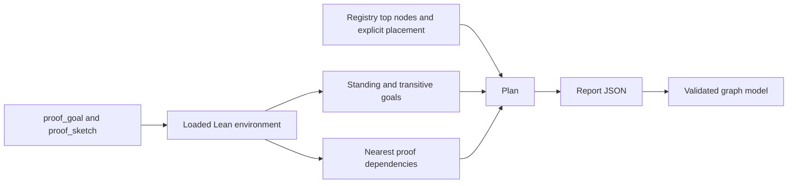

# Preserve placed obligations in the proof graph

Frozen source: `818a73ce6d3f65a328829b1280440e06c70f4afc`.
Role: source audit and proposed tool repair.
Evidence: retained report, actual extracted JavaScript, positive controls and a rejected mutant.
Status: scratch patch tested; nothing is applied or landed in the repository.

The useful independent slice is two files in the graph viewer and its existing checker.
It needs no Lean change, new declaration, registry claim, compiler run or report schema.

## Finding

`Tools.Semantics.planJson` retains each plan node's explicit concept and requirement in `placement`.
The separate population list covers the registry's concept-named modules and excludes planned goals.
`ProofGraphView.js` ignores the plan node's placement.
It chooses a claim's concept or the population entry, then assigns no concept.

The retained report has 204 nodes.
The actual view model loses the explicit concept of 27 nodes: ten goals, four modulo theorems and thirteen proved theorems.
All 27 appear under “no concept” in the overview.
The concepts diagram also excludes edges when either endpoint has no concept.
The nodes remain present; their proof status and requirement membership are not erased.

Concrete examples include `Test.Dogfood.Scenario.Workers.releases_once`, placed at scope-lifetime-finalization and R11.
`Test.Dogfood.Scenario.Timeout.stale_never_applies` is placed at host-session-protocol and R6.
Both have a placement in JSON and no concept in the current view model.
The affected proved declarations include `Effect4.Machine.FnName.image_agrees`.
This finding is a presentation defect, not kernel unsoundness or a false proof-status result.

## Proposed narrow repair

`placement.patch` changes only:

- `tools/Tools/ProofGraphView.js`;
- `scripts/check-proofgraph-input.mjs`.

The concept lookup keeps the existing named-claim precedence.
It then reads the plan node's explicit placement, before the inherited population fallback.
A node with no placement from any source still has no concept.
No authored placement is converted into a proof dependency.

The validator checks the newly consumed placement field.
Null is valid; a present placement must name a known concept and either a known requirement or null.
Missing placement, malformed placement and unknown references refuse before rendering.
The checker extracts the actual model between two markers, as it already extracts the validator.
It tests the existing claim precedence, explicit placement, inherited placement and absence of placement.

The patch restores 27 newly missing placements in this artifact.
The new checker checks all 60 explicit non-claim placements, including 33 that the old fallback already displayed correctly.
These are different counts.

## Reproduction and controls

`commands.json` retains executable paths, arguments, working directories and exit results.
`outputs/` retains stdout and stderr.
The JavaScript engine is Node v22.23.2.
No browser dependencies, network request or D3 rendering run is needed for these model checks.

| Check | Observed result |
| --- | --- |
| Frozen current viewer and retained JSON | Validator accepts; model loses 27 placements; the targeted probe exits 1. |
| Scratch candidate and the same JSON | No placements lost; targeted probe exits 0. |
| Existing checker plus new controls | Existing malformed-data controls pass; 60 placements and four fallback controls pass; four placement refusals pass. |
| Mutant removing only the new placement fallback | Checker exits 1 and names `FnName.image_agrees` and its lost `translation-simulation` placement. |
| Patch preflight against frozen source | `git apply --check` exits 0 in the scratch snapshot. |

The unknown-nearest-reference positive control remains refused in both versions.
The candidate also refuses an unknown concept and an unknown requirement in a placement.
The probe checks every node's status, `restsOn` and measured nearest edges against the input.
They remain unchanged.
An initial harness extraction omitted the outer `plan` binding; it failed before testing the model.
That harness error was corrected and all reported results were rerun.
It is recorded in `outputs/extraction-diagnostic.txt`, not counted as a product failure.

## Report identity

The artifact is copied from `.lake/gen/semantics-report/semantics.json`.
Its SHA-256 is `a5142a0fda1fcef3354f63d6184ce53251262b648945e815b9ca61487b781654`.
It declares schema 6, `make gen-semantics`, Lean v4.33.1 and thirteen loaded roots.
Its recorded modification time is 2026-10-06 10:33:03 UTC.
The adjacent Markdown is byte-identical to `generated/semantics.md` at the frozen commit.
This review does not rerun the producer or treat a timestamp as proof of freshness.
The packet classifies the JSON as a retained generated artifact.
`artifact-provenance.json` retains its identity and declarations.

## Exact proof-tool route reviewed

`proof_goal` adds a theorem and checks its body is bare non-synthetic sorry before tagging it.
`proof_sketch` closes residual propositions over local hypotheses and tags the parts.
It refuses universe-polymorphic statements by design; this patch does not change that domain.
`ProofRef.validate` retains the actual proposition and universe parameters, then checks the theorem and axiom ceiling.
The report's witnesses inspect the loaded theorem's own proposition.
Report display text is not a portable proof certificate or an independent contract comparison.

`reachedWithGoals` treats tagged goals as leaves and separates their names from actual axioms.
`standing` distinguishes goal, modulo and proved from those measured dependencies.
`buildPlan` refuses missing or non-theorem roots, disallowed axioms and an exhausted dependency walk.
The earlier exhaustion repair stays intact and is not reproposed here.

`walkWithin` begins at the selected proof and stops when it reaches another plan node.
It walks intervening declaration types and values within the named scopes.
Its counts and nearest edges are measured over that selected declaration graph.
They do not prove a semantic implication merely because two nodes share a concept.
Registry top nodes and requirement placement select membership; those selections are authored.
A requirement's membership edges and a theorem's measured nearest edges remain different sources of evidence.

`buildReport` creates a fresh axiom memo for its loaded environment.
That report uses the same goal-stop predicate for its witness and plan walks.
The axiom gate also keeps its goal-aware memo separate from its ordinary axiom census.
No live cross-environment cache reuse was established in these callers.
Make's semantics inputs include ProofGraph sources, registry sources, law traces and named acceptance-root traces.
This inspection does not rerun freshness or the whole-library axiom gate.

`requirements-inventory.json` retains every R1–R13 entry and every open part from the artifact.
All thirteen are open in that artifact.
A requirement needs empty open parts and proved selected nodes to become proved.
The repair leaves those requirements, next goals and all open parts unchanged.

## Why this helps REFS and PUB

Their new tagged goals can enter the existing plan without becoming separate named claims first.
The view must display that explicit placement immediately, including goals outside the population's module list.
The repair uses the report field that already carries this information.
No parallel obligation registry, new status vocabulary or framework is needed.

Suggested owner: a coordinator-assigned independent graph-view slice.
Allowlist: the two files above, with the scratch controls retained for review.
Immediate acceptance: the existing checker against the retained or freshly produced report, plus the exact omission mutant.
A later coordinator-generated architecture page can confirm the visual presentation.
This packet does not claim browser-render acceptance, new Lean proofs, closed R1–R13 obligations or runtime agreement.
