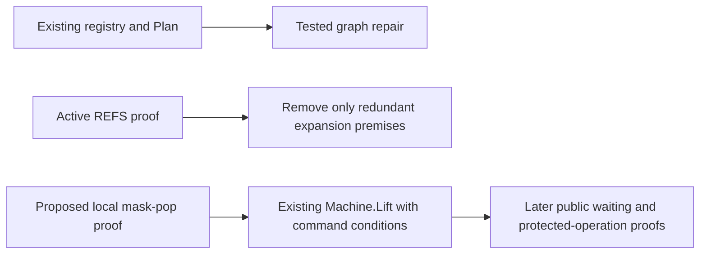

# Proof support ahead of implementation

The owner requests deeper proof support and continued proof-graph review.
Prepare the next reusable proof slice while reviewing the current seats' actual dependencies and evidence.
Keep all R1–R13 obligations visible through the existing registry and generated Plan.

This packet freezes main `818a73ce` unless a component names a later source cut.
It contains a tested graph repair and proposed semantic proof work.
It contains no new Lean-checked theorem.

## Immediate repair

The graph viewer drops explicit concept placement for 27 nodes in the retained 204-node report.
Those nodes include ten planned goals, four modulo parents, and thirteen proved declarations.
The source JSON retains their placement.

The two-file scratch patch restores the existing data and extends the existing input checker.
Parent controls reproduce the omission, verify the repair, and reject the exact omission mutant.
The repair leaves proof status, measured dependency edges, and requirement open parts unchanged.

See [graph review](graph/review.md), [patch](graph/placement.patch), and [parent controls](parent-graph-controls.json).
Coordinator Message 120 receives this repair through ordinary queued Send.
The coordinator applies both files unchanged and retains passing checks plus the intended mutant refusal.
The inspected closing commit does not yet contain the repair.
Repository integration and the later visual check belong to the coordinator until an independent scope is allocated.

## Next proof slice

Prepare `saved-mask-pop-discipline` for R11's existing `saved-mask-restoration` obligation.
Prove the local relation through the actual `FrameFiber.popFrom` and `getCont` functions.
Reuse the existing hook, pushed-frame, carried-cause, and continuation lemmas.
Then connect that result to `Machine.frameExitState`.

The candidate fixes a base bit and requires a valid chain of restoring frames.
Its internal helper also requires the detached scratch stack to be empty.
These premises must remain explicit when the declarations are elaborated.

Queue waiting and Semaphore protected operations are the named consumers.
The local proof does not close arbitrary-body restoration, notification delivery, cleanup completion, or a sufficient execution budget.
The later run proof must instantiate `Machine.Lift` and retain pending-command conditions.
An arbitrary `exitDone` command can clear a constructed stack before restoration; reachable command sequencing therefore matters.

See [semantic review](semantic/report.md) and [proposed statements](semantic/candidate.md).
The proposal uses disjoint Laws/Test files and needs coordinator placement, branch allocation, import anchors, and a free build slot.

## Support the active reference proof

REFS already owns complete expansion at the existing bound.
Its active scratch proof now includes the subtree, substitution, path-shift, and original-site rank route.
Do not assign those same lemmas to another seat.

Rank copied occurrences through their original source sites.
Current copied paths and current occurrence counts do not provide the required decreasing measure.
Keep the actual well-formedness premise and the exact `refSites.length + 1` bound.
Review final statements, allowed axioms, and consumer changes before reporting acceptance.
An intermediate prototype or one successful axiom query does not accept the complete source file.

See [REFS evidence](refs/review.md) for the final frozen evidence and reusable-helper assessment.

## Continuous proof-graph review

Each check starts with Claude's current coordinator, seat assignments, briefs, commits, and saved results.
Inspect the next one or two obligations before their implementation needs them.
Propose the smallest connecting lemma with an existing named consumer.

For each proposed theorem, record its concept, claim, consumer, hypotheses, observation, exclusions, and immediate prerequisite.
Keep the original proposition when changing a planned goal into a proof.
Check implicit parameters, universes, definitions, transitive goals, and axiom dependencies.
Distinguish an authored association from a measured proof dependency.

Read all requirement `openParts`, including parts with no theorem yet.
Use the existing Plan, status commands, dependency walkers, and axiom gate.
Do not introduce a second status ledger or infer requirement completion from an empty goal list.
Keep retained reports labelled by their inputs and producer evidence.
A timestamp alone does not establish freshness.

Reproduce reporting defects with the actual extracted checker and an intended failure control.
Prepare a small patch before asking for a landing allocation.
Follow each advisory through consumption, repair, retained acceptance, and merged-source comparison.
Do not repeat a repaired finding or assign work that an active seat already owns.

## R1–R13 coverage

This table maps the proposed work to the existing requirements.
It does not replace the registry or assign new proof status.
The complete retained entries remain in [the generated inventory](graph/requirements-inventory.json).

| Requirement | Current support and boundary |
| --- | --- |
| R1 | Preserve declared-service authoring, Built, session, Run, and face obligations. Actual admission is already closed. |
| R2 | Preserve C1–C8 and their remaining host, world, TypedProg, and per-form conditions. |
| R3 | Preserve data-language, error-payload, recursive-type, equality, and readable-domain work. |
| R4 | Reuse existing state and Queue typing proofs. Keep public-run accounting, target handle identity, and atomic-body conditions open. |
| R5 | Review REFS' exact expansion theorem and consumers. Runtime layer refinement and bridge validation remain separate. |
| R6 | Keep receipt, application, host meaning, world extension, and retirement obligations. Parked work stays parked. |
| R7 | Preserve resolved-entry typing, captures, context, lifetime, and posted-body typing for Pool and Cache. |
| R8 | Preserve target profiles, lowering, identities, readable domains, and equal-observation boundaries. Finite host checks remain finite. |
| R9 | Preserve M7's fragment premises and the remaining missing-service frame transport. |
| R10 | PUB owns local wrapper construction and attempt laws. Queue/Semaphore run agreement and posted wake agreement remain separate. |
| R11 | Prepare mask-pop discipline next. Whole-run restoration and cleanup multiplicity still need their run connections. |
| R12 | Preserve notification debt, registration, retained driver continuation, budgets, and separately conditioned progress. |
| R13 | Reuse journal replay. Keep recorded load inputs, service signature, clock units, and exact prefix boundaries explicit. |

These arrows describe proposed dependency order.
Only the existing Plan's proof inspection establishes actual declaration dependencies.

## Completion conditions for this support pass

Retain the source cuts, proposed statements, concrete patch, positive controls, intended failures, and evidence limits.
Verify parent source comparisons and independent checker results.
Deliver new actionable support once through the coordinator and record its consumption.
Update the existing monitor with this forward proof-support priority.
Do not call an uncompiled candidate proved or a queued repair landed.

## Closing evidence

Parent verification passes 143 source, artifact, transcript, and declaration-anchor comparisons.
Parent executes only the isolated JavaScript graph checks and their intended failures.
No monitor Lean, compiler, host runtime, build, generator, installation, repository edit, or implementation dispatch occurs.

Messages 118 and 120 are consumed during the coordinator's active turn.
The coordinator also reads this report and the proposed mask statements and adversarial review.
The existing thirty-minute monitor now includes the deeper proof-support procedure and these receipt checks.

The direct implementation-scope question remains unanswered in Codex.
Until it is answered, the monitor retains its earlier repository-edit and build restrictions.
Scratch preparation and authorized advisory delivery continue without waiting for that answer.
