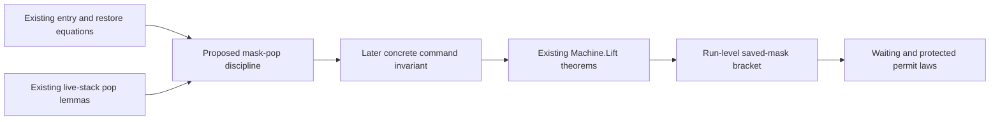

# Reusable semantic support after the public Queue slice

Recommend one independent proof slice: preserve the saved-mask stack discipline through the actual frame pop.
It supports the masked-caller branch that Waiting and Semaphore need, without touching their operations.
The concrete proposed statements, controls and ownership are in `candidate.md`.
They are not Lean-checked and are not placed repository goals yet.

This review freezes main `818a73ce` and the observed clean PUB base `b199c15f`.
PUB's brief is present; its new Waiting/Ops source and design note are absent at this source cut.
The reviewed consumers are its exact brief, existing Queue fixtures, and the existing store/mask laws.
No implementation, build, runtime or generator command runs in this review.

## What already connects

| Existing owner | Exact connection | Limit that the next proof must retain |
| --- | --- | --- |
| `Modules.step_updates`, `Laws/Modules/Store.lean` | A term reading `[reply,next]` gives one atomic `Ref.modify` update and reply | Requires the current cell and the term's `Reads`; says nothing about scheduling |
| `Modules.step_keeps_cell`, same file | Typed captured environment, cell membership and typed step yield reply and next-cell membership | Keeps the signature's native-atom premise and the actual evaluation equation |
| `Modules.cell_read`, same file | `Ref.get` reads the cell and keeps the store | Use for size; no artificial update for uniformity |
| `Queue.Model.queue_steps_agree`, `Laws/Modules/Queue/Steps.lean` | Six step terms match the first-profile abstract transition | Request premise, injective table, encoding and ordered notifications remain explicit |
| `Queue.Model.Notified`, `Laws/Modules/Queue/Relation.lean` | Every emitted signal is represented, in order | A later helper using an old hint is outside the cell-only relation |
| `Typed.saved_mask_restoration`, `Laws/Program/Typed/Mask.lean` | Entry, restored-site and restoring-frame boundary equations | Does not establish an arbitrary body's completed-region bracket |
| `Run.play_append`, `Run.journal_replays`, `Laws/Run.lean` | Rows compose; a reached run replays with its complete session and journal | Same program, name, profile and budgets; no live-host repetition |
| `Scenario.tape_replays`, `Test/Dogfood/Scenario.lean` | Journal controls and reply applications produce the raw machine on the recorded decision tape | Requires no unread suffix; gives machine equality, not raw reconstruction of the session ledger |
| `Machine.driveState_add`, `Laws/Machine/Approximation.lean` | Split a command budget while retaining the machine and remaining commands | Does not retain a dispatcher snapshot or an enclosing clock/flush continuation |
| `Machine.Lift.driveState_lift`, `stepDecisionState_lift`, `replayEval_lift` | Lift local invariants through commands, decisions and admitted replay | Requires the concrete command, pending-task and edit premises; these are not automatically discharged |

PUB already owns the remaining composition of step reading, typing and minted captures at the wrapper's exact scope.
Do not start a duplicate attempt-law slice.

## Why the mask pop is the first useful missing connection

The registry names the run-level half of `saved-mask-restoration` as open in R11.
PUB explicitly excludes that proof while using its finite masked-caller control.
The MASK receipt names the same gap and its Waiting/Semaphore consumers.

`Program.MaskInv`, in `Laws/Program/Means.lean`, cannot close it unchanged.
Its empty-stack case accepts either flag, and its restore case forgets the incoming flag.
It supplies the finalizer-mask condition for the existing reference relation, not a fixed-base mask bracket.
Preserve that predicate and its consumers.

The missing local theorem can read existing frame data:

- each restoring frame saves the opposite of the current bit;
- the relation continues below that frame with its saved bit;
- an empty stack fixes the bit to one recorded base.

Two states with the same base and the same stack then have the same bit.
The nontrivial step is preservation by `FrameFiber.getCont`.
Its walk can mask a finalizer, push a new restoring frame, and visit that new frame before the older tail.
The existing `ensure_stack_cases` and `popFrom_asyncFinalizer_pops_its_push` already describe that mechanism.
The proof should follow `popFrom_interruptedCause`'s induction structure, not create a second frame walker.

The slice ends at a proved local pop relation and its `frameExitState` adapter.
It does not claim the whole-run bracket.
The latter must still establish each fiber's base, preserve the relation through all reachable commands, and connect the region's exit to its continuation.

The arrows after the proposed pop theorem are proof work still owed, not measured proof dependencies.

## Audit of the filed mask invariant candidate

`MaskStackProbe`, in the frozen research probe, has useful finite evidence and explicit limits.

- `statesOf` replays a fixed tape at command budgets, plus a large-budget endpoint.
  These samples do not expose every intermediate entry or stack-pop state.
- `basesOf` deliberately removes exited fibers.
  Therefore `baseConstant` supplies no completed-exit evidence.
- `covered` compares the two final sampled observations.
  It does not certify exhaustive transition coverage or all tapes.
- `allOf` checks alternation in the sampled fibers. It is not a reachability or invariant theorem.
- The saved output reports success for its named samples. This review reads that output and does not rerun it.

The prose's bracket conclusion needs the same fiber identity, a common base and a common saved-stack observation.
Do not turn it into a law about arbitrary fiber states sharing only a stack.
The two empty stacks with opposite bits show why the base premise is needed.

## A decisive trap for the later machine lift

A machine-only predicate cannot simply be required to survive every arbitrary `Cmd`.
`Cmd.exitDone` invokes `RunFiber.cleared`, which clears the stack without changing its bit.

Consider a constructed live fiber with bit `false` and stack `[Prim.setInterruptible true]`.
It satisfies the candidate relation at base `true`.
Applying an arbitrary `exitDone` leaves a false bit and empty stack, which violates that relation.
This is source reduction on a constructed command/state pair, not an executed counterexample or a reachable-run bug.

The actual driver owes a command invariant ensuring that finish and clear occur after the appropriate exit path.
Use the existing `StepKeeps`/`Guarded` interface to carry that premise.
Do not remove the command condition or hide all exited states and then claim a completed-exit bracket.
`Machine.frameExitState` already preserves the real pop state before `Cmd.finish`; the proposed adapter reaches that exact seam.

## Why not start a journal or budget framework

The command split theorem already exists as `driveState_add`.
The missing outer continuation is real: `fireState` drains the dispatcher snapshot, and `fireStep` returns only its machine and completion bit.
An unfinished command suffix and unvisited drained tasks are not a resumable value at that boundary.
A second fire cannot inherit the command split theorem merely because its endpoint machine is available.

Likewise, `stepDecisionState_stable` proves stability after a decision has sufficient fuel.
It neither computes a sufficient budget nor proves partial-run resumption.
The Queue's signal count does not bound an inline receiver's continuation.
PUB's growing-continuation controls are correctly finite measurements, with no bound claimed.

A journal-cut lemma is a smaller future convenience, but is not the first semantic blocker here.
`tapeFrom` leaves a frontier row unread even when applying that row already changed the machine before stopping.
A prefix theorem would concern the state before that row, unless it also retains the partial command execution.
It must not identify that prefix with the machine after the incomplete row.
Reusing the current tape proof remains preferable to another replay engine.

## Scope and next acceptance

The proposed independent files are new Laws/Test files for mask discipline.
They do not overlap PUB's Waiting/Ops files or REFS.
The coordinator must allocate the branch, build slot, root anchors and registry placement before implementation.
No such allocation is inferred here.

Acceptance must check exact propositions and transitive axioms, including pending-cause and finalizer-push controls.
A short proof using existing equations is preferred to another traversal or a rewritten runtime.
The whole-run relation remains an explicit next obligation after this local proof.

The requirement structure stays intact:

- R11 owns this preservation helper and the later bracket.
- R10 owns Waiting/Queue and Semaphore expansion agreement.
- R4 still owns typed state; a flag relation supplies no membership theorem.
- R8 still owns each face and engine observation; this proof supplies no target agreement.
- R12 still owns notification debt, frontiers, driver continuation and progress conditions.
- R13 retains journal replay and its exact recorded inputs.
- R1, R2, R3, R5, R6, R7 and R9 retain their current claims and open parts.

No registry status changes in this review. No new abstract Queue fact, generic fairness theory or compiler proof is proposed.
