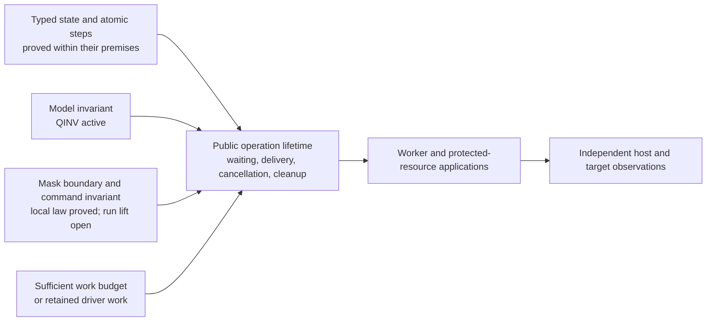

# Dogfood review: what composes, and what still costs work

The core has a coherent model and substantial proofs within named domains.
The next bottleneck is connecting local state laws to the lifetime of a scheduled operation.
The examples also expose smaller authoring and proof-interface problems.
None of this review supports replacing the type universe or adding a second program representation.

This review freezes main at `00b160d2`.
CUTS at `34db84f5` is a separately reviewed, unmerged seat result.
It uses source inspection and retained results, with a small Python binding model.
It runs no Lean, compiler, host runtime, build, generator, or installation.
The detailed [evidence](evidence/review.md), [types](types/review.md), and [theory](theory/review.md) reports retain sources and limits.

**What we learned.** The infrastructure now supports more than the original examples actually use.
Typed record state, atomic updates, binder-term printing, explicit Deferred types, and the retry cursor's reading are working connections.
The old rate-limiter race remains a useful wrong program beside the single-cell atomic version.
Queue, Semaphore, and Pool reuse the same reading, typing, fold, and store rules for their step proofs.
Pool's five agreement statements are unchanged from their planned goals and are merged.

The four larger scenarios retain ten unproved properties: one Workers, two Routing, four Atomic, and three Timeout.
Their assembled claims honestly depend on those goals.
Passing scripts and target comparisons do not prove those general properties.

| Scenario | Useful learning | What the current example does not exercise |
| --- | --- | --- |
| Workers | Receiving a reply differs from applying it; call identity and cleanup identity matter | Its queue is still a host row, not the new Queue implementation |
| Routing | A broad pair-shaped error can impersonate a business tag; the exact declared union refuses it | The original layered, code-valued repository service |
| Atomic | Whole-record updates remove the split-read/write race; failure after a commit does not undo it | A transaction across both cells, or a cleanup invocation replayed under one registration |
| Timeout | Receipt, timeout, reply application, retirement, and cleanup are separate events | A timer firing within a masked region; independent host readings for every timer identity |

Atomic makes two sequential commits: it charges the window, then deposits into the account.
The example's ordinary failure follows both commits.
Cancellation between them is a useful next observation; it must not be mislabeled rollback or a failed transaction theorem.
First establish an actual interruption checkpoint between them, or label the example as an explicitly instrumented variant.
Atomic's current explicit yield occurs before admission, not between the commits.

CUTS proves useful journal-prefix connections and a fresh-open view theorem in its seat.
It reuses the existing replay theorem rather than repeating its induction.
It stops before the unread row, which may itself partly execute.
These laws do not retain an interrupted driver's pending work.

**The immediate type and API friction is concrete.**

1. `Workers.note`, `Atomic.note`, and `Timeout.note` contain the same fixed-binder update.
   The existing `Ref.updateWith` supplies the hygienic form they should share.
   A caller variable named `xs` can collide in the generic old helper.
   Current closed scenarios are not claimed faulty.
   Four finite name-resolution controls distinguish that collision and retain positive controls.
   They are a Python mirror, not a Lean counterexample.
2. The three scenarios import `P3WorkerQueue.ascribe` to initialize typed empty log cells.
   Bare empty lists infer `never`, which is unsuitable for later writes through an invariant reference.
   Share the existing checked record-and-field helper with typing and reading lemmas.
   This needs no weakening of reference invariance and does not implement the separate `Ref.make<A>` feature.
3. `TypesEach` and `Kept` require one type under both literal modes.
   Consequently, some accepted string-literal callers fall outside the general Queue and Pool theorem premises.
   This is a proof-interface gap, not evidence that strings are unsupported.
   Use explicit ascription or an occurrence-specific transport lemma while preserving literal tags.
4. A term retaining its type does not establish that it retains its meaning under new bindings.
   Keep `Captured` distinct from `CapturedTy`.
   Prefer the existing minted builders and compositional capture laws over arbitrary environment-inspecting authoring functions.
5. Routing's exact error-domain example should become the positive application contract.
   Preserve the broad row as its explicit wrong-domain control.
   A handler cannot infer infrastructure provenance from an arbitrary string carrying a business tag.
   Its Lean admission controls exist, but the exact printed twin still has two retained tsgo 7 errors.
   `Keyed.keptOut` therefore excludes `routing/exact-escape` from host execution.
   Complete that target typing connection before calling this an accepted target example.
   The retained diagnostics concern branch error unions; silently widening all string tags would lose the useful domain distinction.
   The raw printer lacks the checked local branch types, so a fix needs type transport and a validated reading of its emitted form.

`Api.Built` already retains the exact admission certificate.
`lawfulSig_of_admitted` closes the historical admission gap.
Neither another certificate wrapper nor another checker is indicated.

**The deeper composition boundary has three parts.**

First, the operation needs a relation spanning its complete lifetime.
A Queue signal can invite a retry or deliver an answer whose commitment already occurred.
Its obligation moves through the cell, pending commands, a dispatcher, and an accepted receiver continuation.
The relation must account for fresh hints, cancellation, typed handles, and world growth throughout those steps.
The atomic-step theorem ends before that relation.
Reuse `Queue.Ops` and `Machine.Lift`; QINV already owns the model-side preservation work.

Second, protected acquisition needs an enclosing interruption boundary through cleanup registration.
The current waiting helper's own mask ends before a caller installs its protected body's cleanup.
Row 275 already identifies a form taking the caller's restore function.
Semaphore's protected permit and Pool's `use` are its consumers.
The local mask-chain proof is landed; its run lift and the enclosing region law remain separate.
For LIFT, the proposed exact clearing connector must serve both `Cmd.finish` and `Cmd.exitDone`.
Preserve a pending clear's premise across observer work using the existing `Guarded` interface.
The [candidate](../heartbeats/2026-10-06T140639Z/next/candidate.lean.txt) remains uncompiled.

Third, the budget assumption must compose with receiver work.
Queue trace 7 shows that a helper's required budget grows with the continuation it resumes.
At one unit less, later flushes do not recover the lost work.
This is an explicitly excluded internal cut in the current contract, not a newly discovered wrapper regression.
The existing choice is a proved sufficient budget for the admitted operation.
General suspension later needs retained commands, tasks, phase ownership, and its own split-run law.
Journal prefixes alone cannot supply it.

**There is real theoretical substance here, with specific unfinished connections.**

The first-order `Eff`, typed worlds, generic stores, constructor-driven folds, admission, and M5–M7 form a coherent core.
M7's current public theorem has an empty host table, closed requirements, and an answer-free tape.
Its conclusions concern typed stored values and exits, and absence of a stuck machine; they do not promise termination.
The more general typed-replay theorem retains its `AdmittedTape` premise.
Connecting executable host admission to that premise and table-aware execution remains R6 work.
Program admission itself is already closed.

There are also two deliberate limits on generic composition laws.
Raw program reassociation can change absolute variable positions; `composeAt` needs scope-correct laws at a named meaning.
Separately, concrete `TypedProg` is not closed under unrestricted bind because closing markers carry nonlocal exits.
`Test/Program/TypedProgBindRed.lean` proves that refusal and retains a positive `seq_typed` example.
Use the existing construct-specific sequencing and handler rules.
Do not promise unrestricted monad rewrites from the generic protocol's laws.
These are known design constraints, not new failures of the application builders.

The material unanswered questions are precise:

- For stored behavior, what fixes its entry, captured values, service context, identity, and lifetime at later invocation?
  Cache lookups and Ledger listeners supply concrete R7 consumers.
- Which public observations permit hiding helper fibers and private cells while retaining commitments and cleanup obligations?
  Equal root answers alone cannot justify that abstraction.
- What concrete caller domain admits a compositional work bound, and what information must a later resumable driver retain?
- Which ownership invariant proves cleanup at most once per registration and completed cleanup in close order?
  A duplicated log write is not evidence of a duplicated finalizer invocation.
- How do admitted host replies and external handles reach the general typed execution relation?
  Preserve receive/apply separation, call-site types, tokens, and world correspondence.
- What exact numeric and identity profile supports a verified target connection?
  Current finite compiler/host/engine checks remain useful evidence, not that theorem.

The first module policies and commit/cancellation choices are already ruled.
They need implementation and proofs, not repeated owner confirmation.
Transactions, unrestricted suspension, retained code values, and lowering retain their separately governed design scope.
No parked work is resumed by this review.

**The next dogfood slice should exercise the missing connection, not merely add more programs.**

Move the two-worker scenario onto the real public Queue first.
Retain worker identities, failure after commitment, reply/cleanup observations, and before/after-cancellation controls.
Keep the existing host-queue scenario as the host-protocol control.
Then add a protected permit or Pool lease around the same worker body when that public operation lands.
This makes the second module test the shared waiting and mask machinery.
The proof obligation is the public request lifecycle, under explicit budget and mask premises.
It does not include fairness or starvation freedom.

Add two narrowly chosen cuts to existing scenarios: cancellation between Atomic's two commits and timeout during a masked region.
Treat the first as a checkpoint investigation until a reachable scheduler cut is established.
Observe each commit, continuation entry, cleanup invocation, and retained obligation separately.
Use actual registration identities for the eventual exactly-once control.
Do not replace that control with a second cleanup-log write.

Concurrently, consolidate the log helper and typed initialization helper.
Those are small consumer-driven improvements using existing APIs.
Keep the retained-behavior design tied to the first real Cache or Ledger caller, rather than another generic framework.

The complete R1–R13 crosswalk and unchanged open-parts lists are in [the theory review](theory/review.md).
This report proposes priorities; it does not create a competing status ledger or close any requirement.

**Verification.** The parent checks frozen source identities, retained artifact identities, the three identical log bodies, and ten scenario goals.
It also checks four finite binding-model cases.
All 255 comparisons pass at the recorded snapshot.
The separate heartbeat verifies 226 source/result identities for Pool, CUTS, and QINV.
Later active QINV scratch edits are excluded from the earlier checked result.
No repository is edited, and no project execution is rerun.
