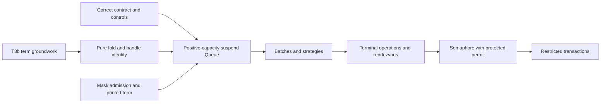

# Queue contract review

Keep the selected policies. Correct the model's artificial limit and the offer cancellation statements before promoting this contract into implementation.

Proof role: contract review and proposed obligations.
Evidence status: source inspection, finite Python checks, and finite installed-runtime controls.
Scope: model at `a3954d03`, rechecked unchanged at `e7bdbba8` before delivery.
No active repository, branch, build, or dependency changes come from this review.

The live coordinator shows the owner's approval of all three choices.
Rows 240–243 record that approval at `e7bdbba8`.
These recommendations keep those choices and identify corrections within them.

## The choices

| Choice | Recommendation | Required meaning |
| --- | --- | --- |
| Post offer-side signals | Keep | The freeing step commits acceptance and captures the answer. The helper delivers that answer later. |
| Refuse dropping at zero | Keep for this profile | A useful nonblocking hand-over requires a separate commitment protocol from the selected later taker step. |
| `poll` and `clear` pass no waiting taker | Keep | An empty reply means this caller cannot consume under the order policy. It does not imply an empty buffer. |
| Refuse `flush` and named `Unsafe` calls | Keep | `flush` exposes another delivery timing policy. The host-function calls lie outside the selected application surface. |

The `dropping(0)` rationale needs correction.
Native 4.0.1 can run the taker to consumption before its single offer returns.
That run does not reserve a message for later consumption.
Java's zero-storage `SynchronousQueue` also permits a nonblocking hand-over to a waiting receiver.
This alternative establishes no agreement with Effect.
See [the reference and native controls](capacity/review.md).

## Corrections before the Queue slice

### 1. Remove the artificial unbounded limit

`room` returns `1000000` for an unbounded queue in `QueueContract.lean` beside the reviewed contract.
`clear` calls `pull` with that same number.
The written domain contains no such limit.

The retained Python mirror starts from the empty unbounded queue.
An `offerAll` of 1,000,001 messages buffers one million and leaves one pending.
It returns `wait`, although `room` still reports one million.
The model's own `tidy` property is false there.
At exactly one million messages, the positive control passes.

A separate reachable sequence accepts one million messages, then one ordinary offer.
`clear` returns only one million messages and leaves one behind.
The earlier bounded search uses much smaller fixed inputs, so its success does not address this case.

Represent unbounded room explicitly, or derive the work bound from the finite input being processed.
For buffered `clear`, use the actual buffer length.
Do not amend the public meaning of unbounded to accommodate the probe's sentinel.
These are source-supported Python counterexamples, not newly executed Lean counterexamples.

### 2. Separate offer acceptance from reply delivery

`acceptLoop` in `QueueContract.lean` accepts pending messages before emitting the offerer's answer.
Waiting-design F5 still says cancellation before the posted hint makes the offer's message absent.
That condition is insufficient after the accepting step.

| Reachable sequence at capacity one | Required result |
| --- | --- |
| Buffer `[1]`; offer `2` waits; withdraw it; take `1` | `2` never enters the queue. |
| Buffer `[1]`; offer `2` waits; take `1`; cancel before the posted reply | `2` remains accepted. The offerer may exit interrupted. |
| Same accepting step, without cancellation | The helper delivers the captured success. |
| Buffer `[1]`; offer `2` waits; shutdown | The entry disappears, but the captured answer is false. |

The shutdown sequence also refutes F8's inference from an absent pending entry to acceptance.
Replace it with a rule about removing only a still-pending remainder.
Absence alone does not identify an offer's outcome.
For batches, acceptance commits a prefix, and withdrawal removes only the unaccepted suffix.
The helper must carry the decided answer; it must not reconstruct that answer from later state.

The [delivery review](delivery/review.md) retains the exact regression sequences and native batch controls.
Those native controls test prefix acceptance, not the proposed posted wrapper.

### 3. Make the nonblocking results explicit

The new native `poll` controls bypass an earlier waiting batch on both versions.
They extend the existing `clear` comparison and should join row 242's signed differences.
With an earlier taker, the selected `poll` and `clear` return empty while size can remain positive.
An eligible `clear` can also free room that pending offers immediately refill.
Therefore a successful `clear` does not promise an empty queue afterward.

At capacity zero, the model's `clear` consumes one pending rendezvous message when no earlier taker waits.
Its current description says only that it returns buffered messages.
The installed release also consumes one pending offer in its empty-buffer `takeAllUnsafe` branch.
Retain the current behavior and describe that exception explicitly, unless the coordinator requests a different contract.

### 4. Check terminal outputs separately

The current terminal functions do emit signals.
However, the search's `quiet` property cannot detect lost terminal signals after the queue erases its waiting lists.
A mirror control removes every shutdown signal and still passes `within`, `tidy`, and `quiet`.
This is a test limitation, not evidence of a lost signal in the current implementation.

Add output controls for waiting takers, peekers, awaiters, and pending single or batch offerers at shutdown and final drain.
Then connect those outputs to outstanding notification ownership in the wrapper.
Keep the current search's finite scope explicit.
Its source contains 28 pre-exploration guard commands, three exploration guards, and one red-control guard.
Calling these 32 guard checks is more precise than calling them 32 named operation controls.

## Runtime findings and their limits

The [capacity controls](capacity/review.md) reproduce sliding-zero single-offer behavior on rc.112 and 4.0.1.
An accepted message remains beside a parked taker after the finite settling sequence.
On 4.0.1, `flush` then delivers that message.
The capacity-one single-offer control delivers normally.
The sliding-zero batch control instead leaves no buffered message.
These results narrow the upstream candidate to an operation-specific notification and capacity boundary.

Dropping-zero behavior also differs by operation.
On both versions, a batch offer can buffer a message before its wake, and cancellation can leave that message available.
On 4.0.1, a waiting peeker can make a single dropping offer succeed while the message stays buffered.
Do not generalize the successful single-taker hand-over to the entire native API.

Source and compiled-distribution runs agree in every retained native case.
The receipts identify Bun 1.4.2, both package versions, exact imported files, hashes, commands, and positive controls.
The [official 4.0.1 release](https://github.com/Effect-TS/effect/releases/tag/effect@4.0.1) is verified.
The current npm latest tag could not be refreshed in this session.
No claim here establishes that no newer release exists, or that these finite schedules prove starvation.
No upstream report is sent.

## Placed obligations and order

All rows below are proposed refinements of existing claim placements, not proved results.

| Existing claim and concept | Required property and consumer | Hypotheses and observations | Exclusions and immediate prerequisite |
| --- | --- | --- | --- |
| `queue-expansion-agrees`, translation-simulation, R10 | Total pure transitions implement unbounded acceptance and exact `clear`; Queue application-signature clients consume the result | Formed reachable states, fresh identities, finite input lists; observe replies, accepted prefixes, residual state, signals | No native equality on signed differences or liveness; remove sentinel before promoting the model |
| `waiting-request-obligation-preserved`, reactive-scheduling, R10–R12 | Keep each decided offer outcome until delivered or made irrelevant by cancellation; the posted wrapper consumes it | Correct incoming mask, captured reply, unique request and current hint; observe acceptance, operation exit, caller entry, fiber exit separately | Cancellation does not undo acceptance; notification safety is not delivery progress; correct F5/F8 first |
| `wait-registration-no-gap`, reactive-scheduling, R10–R12 | Every removed terminal waiter has the required terminal output or a represented outstanding notification | Reachable phase transition, request kinds, pending suffixes; observe emitted outputs and wrapper-owned notifications | `quiet` alone is insufficient, no fairness claim; add terminal-output controls before the wrapper connector |
| `queue-expansion-agrees`, translation-simulation, R10; profile support separately | Strict nonblocking calls and explicit refused names match the selected application surface | Rows 240–243, formed states, earlier takers; observe replies, sizes, and located refusal paths | Empty reply does not imply empty state; no blanket native API agreement; record the signed poll difference and capacity-zero clear meaning |

The implementation order remains row 233's order.
The mask's second design note remains a prerequisite under row 239.

The first Queue slice includes terminal-state invariants and the notification connector even while later slices add public operations.
Acceptance before and after cancellation belongs in that first slice.
Batches then add prefix and suffix laws.
No general scheduler rewrite or implementation of every zero-capacity strategy is required by these findings.

## Receipt

`receipt.json` records reviewed hashes, current heads, source/distribution comparisons, and advisory delivery status.
`model/results.json` records fifteen mirror assertions and their witnesses.
`capacity/` and `delivery/` retain all native probes and outputs.
The prior 1,417,248-prefix exploration is inspected through its source and saved output; it is not rerun here.
No mirror agreement theorem, wrapper proof, whole-runtime agreement, or Lean build is claimed.
