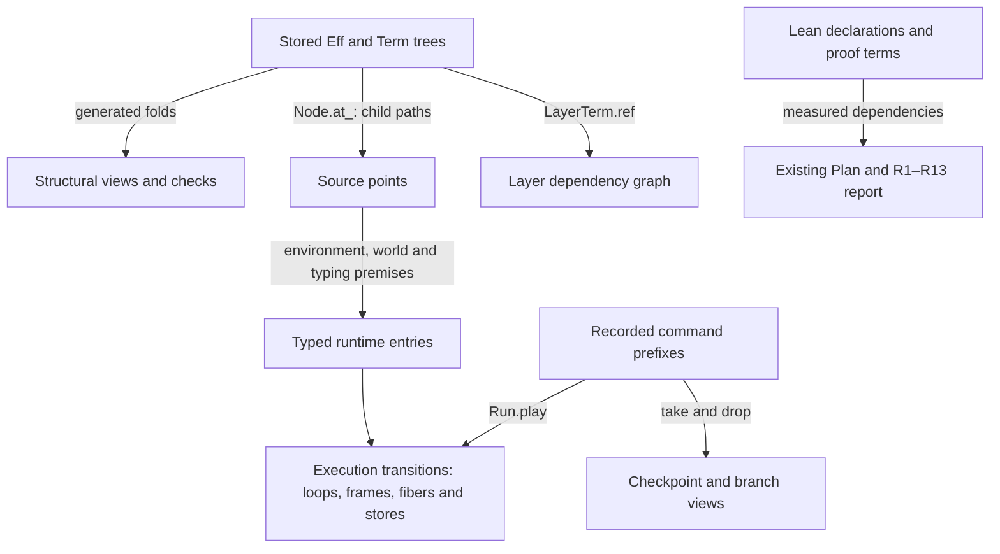

# Graphs, trees and the next module APIs

## Recommendation

The useful next work connects existing representations and laws. It does not require a new graph-based program language.
The current code already has structural folds, source addresses, typed captures, reachable-state proofs and exact journal replay.
Three concrete additions can make those foundations easier to use:

1. Complete the connection between well-formed layer references and bounded reference expansion.
2. Expose journal prefixes and unread suffixes through existing replay laws.
3. Give contract cards precise activation, lease and entry identities, with observations that retain unfinished cleanup.

Keep the ongoing checker rules and minted builders on their existing path.
Prepare Semaphore, Pool and Cache independently of the optional structural proof slice.
Their API laws must keep their different selection and lifetime policies.

Role: research and proposed obligations.
Evidence: source review, primary literature and finite Python controls.
Source cut: `cbd2ec5793006fd1279121c5104bfdbdc065ea40`.
The live contract card and procedure are separate snapshots.
No new Lean theorem is claimed. No repository edit, build, generator, compiler or host run occurred.

## 1. The actual representation

Compilation still addresses the stored tree. `Point.path` selects a node through `Node.at_`.
Continuation names retain points, environments and execution data. The compiler does not flatten `Eff` into an instruction array.



These views answer different questions.
Child edges explain structural induction. Reference edges explain shared definitions. Runtime edges explain possible transitions.
History prefixes explain replay. Proof edges explain which declarations a theorem uses.
A property transfers between views only through a named connection.

The existing `PointTyped`, `LayerPointTyped`, generator `PosOk` and world laws already provide substantial typing structure.
A valid address alone does not establish a typed environment, a fresh allocation or a valid saved context.
The existing `genProtocol` proof does not establish progress or termination.
An acyclic source tree can describe repeated execution at one source point.

The detailed declaration map is in [the structure review](structure/report.md).

## 2. A worthwhile foundational slice: reference expansion

`typeOfProgram` separately checks reference well-formedness and the absence of references after expansion.
`checkTypedProgram_of_hasTy` and `typeOfProgram_expandRefs` carry the second property as a separate premise.
A proposed theorem connects the two:

```text
root.layerRefsWF = true
  implies root.expandRefs.refSites [] = []
```

Use the finite dependency graph of reference occurrences in the original root.
Each dependency leads to an earlier original occurrence. Copied occurrences retain that origin in the proof.
Bound the dependency depth, then connect it to the implementation's existing reference-count bound.
Do not use the changing number of expanded occurrences as the decreasing measure.
One retained finite control changes that count from 6 to 9 before reaching 0.
Do not claim that lexicographic order on all finite paths is well founded.

This slice serves R5 and R8 through shared-layer admission and reading.
Place it under `initial-algebras-folds`, with proposed claim `reference-expansion-complete` and the two named admission consumers.
Keep the executable check initially. Add the easier admission interface through a proved corollary.
No execution rewrite follows: reference resolution preserves memo identity, while expansion copies syntax for checking.

One small helper has real callers: general path concatenation in the existing structural law owner.
Use it in the current typing and generator path lemmas, preserving their statements where useful.
The report gives the exact proposed equations, hypotheses, controls and landing criteria.

## 3. Replay as a useful data API

`Run.play_append` already splits a command list anywhere.
`journal_replays` reconstructs every reached Run from its recorded commands and original inputs.
These support a read-only `atPrefix n` view and branching with a different explicit suffix.
The journal itself supplies the history; no second tree representation is needed.
Refused commands remain recorded, so they do not invalidate the prefix law.

A small `play_journal` helper would make the exact history correspondence convenient.
For a reached Run, replaying the suffix after a prefix gives the original full Run.
Machine states can merge or repeat even when the full recorded histories remain different.

The more useful missing connection serves an existing consumer: `Scenario.tapeFrom` and `Lowered.shown`.
Prove the exact consumed prefix and unread suffix, then reuse `tape_replays` at that cut.
A stopped command may already have changed the machine.
The extracted prefix describes the state before that command; it is not the command's post-frontier checkpoint.
Full driver suspension still needs the retained dispatcher, clock and command context owned by row 226.

Place the cut laws under `translation-simulation`, serving existing `run-tape-replay`, R8 and R13.
The observation is the consumed prefix, unread suffix and corresponding machine view, with fixed inputs and budgets.
It excludes session-ledger equality with raw replay and resumption inside an interrupted driver operation.

Two later research candidates reuse existing R6 laws:

- Lift accepted, distinct-key receipt commutation through fixed Runner prefixes and suffixes.
- Prove exact retirement partition and same-state retirement idempotence for the existing timeout and worker goals.

Receipt order is distinct from application order. Shared stores, allocation counters and adaptive selectors can make applications order-sensitive.
These R6 candidates do not authorize resuming parked work or claim that retirement completes physical cleanup.
Their full placements and counterexamples are in [the replay review](replay/report.md).

## 4. Help the contract cards land

The current Semaphore card now distinguishes its three wake profiles.
The source's live scan can run a resumed waiter between visits.
A fold over one atomic snapshot cannot inherit that behavior without a specific connection.
The profile choice remains an owner decision; this report approves none of the alternatives.

The first `withPermits count body` API can be an ordinary builder with its body supplied at authoring time.
Reuse minted binders, exact body typing and the existing interpreter.
Do not require a general retained-callback representation to land that API.
Move reading and store helpers only when the second module actually calls them.
Keep declared Deferred answer types explicit in any shared identity relation.

One small card clarification supports its new cleanup law.
Its public observation should name each protected activation and distinguish commit, body exit, release commit and cleanup completion.
Derive that view from actual program state and recorded events.
It can be a proof or scenario observation; no extra public logging API is required.
A final count cannot distinguish one completed release from a lost or duplicated obligation.

Use these identity distinctions in the next cards:

| Card | API distinction | Required observation and control |
| --- | --- | --- |
| Semaphore | Protected activation versus waiter hint | Each activation's permits and unfinished cleanup; reject a finished-cleanup report at a frontier |
| Pool | Lease versus resource | Return each lease at most once; distinguish return from destruction of the resource |
| Cache | Key versus current entry identity | Old lookup cleanup cannot remove a replacement entry at the same key |

The Pool and Cache details come from the pinned source, not a new runtime experiment.
They should enter their cards before a model or goal is frozen.
Retained behavior needs its own R7 contract when a module first needs it.
That contract names entry identity, captured values, invocation services, lifetime and world transport.
Neither a layer reference nor the existing acquire/release-specific capture predicate supplies it automatically.

## 5. What the book and literature add

The supplied book is **Types for Proofs and Programs**, TYPES 2003, LNCS 3085.
It is a proceedings volume, not Pierce's *Types and Programming Languages*.
The earlier project review read Adams, Ballarin and Wiedijk.
This pass inspects additional chapters on indexed trees, induction, coinduction and concurrent traces.
Exact chapter locators and read depth are recorded in the literature report.
Read [the six literature connections](literature/report.md) and [the chapter reading record](literature/contents-and-read-status.json).

Gambino and Hyland's indexed-tree construction suggests deriving more binding-aware proof interfaces from the existing signatures.
The local adaptation is a proof view over existing syntax, not a migration to a second intrinsically typed IR.
Brady, McBride and McKinna's treatment of indices supports keeping evidence separate from stored execution data.
Erasing evidence still needs the chapter's hypotheses; a proof annotation is not automatically runtime-irrelevant.

[Lynch and Vaandrager](https://ir.cwi.nl/pub/1393) distinguish simulation over states from its lifting over histories.
[Interaction Trees](https://arxiv.org/pdf/1906.00046) demonstrates compositional proofs after relating introduced private state.
[Choice Trees](https://arxiv.org/pdf/2211.06863) explicitly limits some scheduling equations when other threads are present.
These support the current direction: prove shared construction laws, then discharge each module's state and scheduling relation.
They do not make a composed module's public law automatic.

The source-specific applications and exclusions are in [the literature addendum](literature-addendum.md).

## 6. Keep the whole requirement plan

This table records relevance, not a second status ledger.
Use current `Tools.Semantics.requirements`, its `openParts`, and actual Plan dependencies for status.

| Requirement | This investigation's relevance | Older boundary retained |
| --- | --- | --- |
| R1 | Typed entry and capture interfaces retain the application signature | Declared services must reach authoring, sessions and faces |
| R2 | Structural changes need the existing conservative-extension relation | Host-row meaning and world back conditions do not follow from paths |
| R3 | Indexed folds can reuse the existing Ty and Term signatures | Recursive types, payload and codec domains remain separate |
| R4 | Existing checker rules and exact body evidence support module construction | Membership, allocation and compatible world extension remain required |
| R5 | Reference expansion completeness simplifies shared-layer admission | Memo identity and machine layer-building agreement remain separate |
| R6 | Receipt context and retirement research support existing lifecycle goals | Parked host relation and reply/application obligations stay parked |
| R7 | Pool and Cache expose entry/capture/context/lifetime contracts | A valid source address is not a retained-behavior theorem |
| R8 | Path laws, reference reading and replay cuts have named consumers | Target, numeric and host observations remain bounded by their profiles |
| R9 | Reuse existing initialization and transition preservation | M7's actual fragment is unchanged |
| R10 | Ordinary builders and shared laws support a second module | Each public expansion needs its own profile and state relation |
| R11 | Activation and lease identity make cleanup laws observable | Completed cleanup differs from pending cleanup at a frontier |
| R12 | Replay cuts retain unfinished work explicitly | Infinite fairness, divergence and full driver suspension remain open |
| R13 | Existing journal laws support prefix and branch views | Missing load inputs, services, clock conversion and host effects remain separate |

Formation, canonical form, membership, inhabitance, profile support, codec admission and reply admission remain distinct.
The actual admission bridge is already closed; `Author.build` retains its evidence.
Do not reopen an old `AdmissionGap` or create another certificate owner.
M5 initialization, M6 transition preservation and M7's fragment remain the governing proof spine.

## 7. A small reporting repair, separate from the semantic work

The proof graph's private dependency walk can return partial nearest edges after its fixed budget expires.
The renderer and axiom collector already expose exhaustion; this walk should do the same.
Eight reduced-budget Python controls demonstrate the branch with positive controls.
They do not establish that today's report is truncated.
Standing and `restsOn` use the separate axiom collector, so this finding concerns nearest edges and brought-in counts.
The exact source, correction and row 203 placement are in [the reporting review](proof-graph/review.md).

## 8. Landing order and finishing criteria

1. Continue the current seats and their accepted scope.
2. Clarify the card observations and upcoming Pool/Cache identities through the coordinator.
3. Land the next public module path using actual typing evidence and its chosen delivery profile.
4. Take reference expansion as an independent foundational slice when a seat is available.
5. Add replay-prefix conveniences with the existing scenario/replay consumer.
6. Extract shared proof interfaces only as both real consumers adopt them.

Each proof slice keeps its statement, named consumer, hypotheses, observation and exclusions.
Acceptance requires the actual Lean result, axiom dependencies and consumption by that caller.
Finite models validate a proposed direction; they do not satisfy those finishing criteria.
The research packet's finishing criteria are source verification, retained controls, primary-source locators and an actionable coordinator note.
