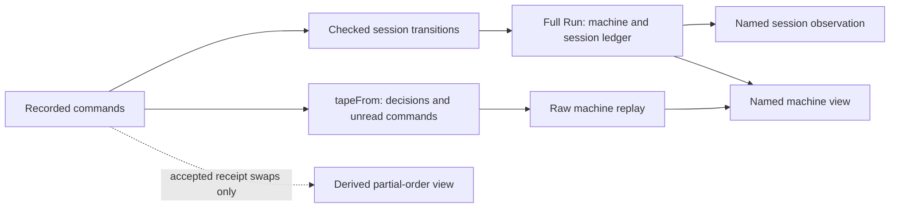

# Replay, cuts, and independent receipts

## Recommendation

Use the existing journal as the execution record.
Treat a dependency graph as a view justified by named laws.
Three small proof connections offer useful next work.
They need no alternate engine, command alphabet, or stored program representation.

1. Connect a journal's successfully read prefix to its machine tape, including the unread suffix.
2. Lift independent receipt commutation into whole journal contexts, preserving the original journal as evidence.
3. Prove exact retirement accounting and idempotence before using retirement as a cleanup graph edge.

**Role:** research and proposed proof placement.
**Evidence:** source inspection and finite Python list controls.
**Scope:** committed main `cbd2ec5793006fd1279121c5104bfdbdc065ea40`.
The live Semaphore card and module procedure are separate, uncommitted snapshots.
All proposed statements below are uncompiled.
No Lean, generator, compiler, build, target runtime, or host run was started.

## Existing foundations: reuse these

| Current owner | Exact result | Limit |
| --- | --- | --- |
| `Effect4.Run.play_append`, `src/Effect4/Laws/Run.lean` | `s.play (a ++ b) = (s.play a).play b` | This acts on complete Run values, including the journal and phases. |
| `Effect4.Run.journal_replays`, same path | `Reached s` implies opening the same built program, name, budgets and profile, then replaying its journal, equals `s`. | It requires reachability; arbitrary constructed records need not match their journals. |
| `Effect4.Run.drive_eq_play`, same path | The host driver's result equals playing the commands that driver recorded. | Replay calls no host; it does not prove durable external side effects exactly once. |
| `Effect4.Api.Runner.replay_append`, `replay_unique`, `src/Effect4/Laws/Api/Runner.lean` | Journals compose as a unique action generated by command steps. | Different command words can reach the same runner. |
| `replayRows_append`, `replayRows_eq_replay`, `src/Effect4/Laws/Api/RunnerBytes.lean` | Byte rows compose and replay as their decoded commands. | The latter requires `rows.mapM commandOf = some commands`; encoding also requires value `WF`. |
| `Effect4.Machine.replayEval_append`, `src/Effect4/Laws/Machine/Approximation.lean` | Raw decision tapes compose through `ReplayResult.thenReplay`. | A fuel frontier absorbs the suffix. It is not an ordinary checkpoint. |
| `driveState_add`, same path | Running command fuel `a+b` equals running `a`, retaining commands, then `b`. | It retains the inner command loop, not the full enclosing dispatcher or clock continuation. |
| `Effect4.Api.HostSession.reply_commute`, `src/Effect4/Laws/Api/HostSession.lean` | Accepted receipts for different keys commute as complete sessions. | Applications are deliberately outside this theorem. |
| `Test.Dogfood.Scenario.tape_replays`, `Test/Dogfood/Scenario.lean` | A fully read journal's machine equals raw replay of its extracted decisions. | It excludes an unread frontier row, session ledgers, and lowered-runtime agreement. |
| `guardState_reachable`, `src/Effect4/Laws/Program/Guard/Decision.lean` | Existing raw-prefix reachability establishes the guard invariant. | This is not the host-session ledger invariant or a typed reply theorem. |

Checkpoint composition itself therefore needs no new framework.
The missing work is connecting particular views and consumers to those laws.



## 1. A journal cut that keeps its unread work

**Concept:** `translation-simulation`.
**Placement:** helpers of existing claim `run-tape-replay`, serving R8 and R13.
**Consumer:** `Lowered.shown` and its per-position comparisons in `Test/Dogfood/Scenario/Tape.lean`.
**Owner:** the existing `Scenario.tapeFrom` and `tape_replays` owner.
Its proposed move into the law graph is already recorded; this proposal does not create a second copy.

`tapeFrom` stops before the first frontier row or decision that raw replay cannot read past.
It returns positions and the remaining command suffix.
The current theorem covers only the case where that suffix is empty.
`Lowered.shown` separately checks raw replay at every position.

Proposed first connector, with ordinary pair projections omitted for readability:

```text
if tapeFrom s a = (pa, [])
then tapeFrom s (a ++ b) =
     let (pb, left) := tapeFrom (s.play a) b
     (pa ++ pb, left)

if tapeFrom s a = (pa, left) and left is nonempty
then tapeFrom s (a ++ b) = (pa, left ++ b)
```

The useful consequence is an exact cut:

```text
tapeFrom s rows = (positions, left)
  implies exists done,
    rows = done ++ left
    and tapeFrom s done = (positions, [])
    and (s.play done).machine = replayMachine(decisions positions, s.machine)
```

The last conjunct reuses `tape_replays`; it is not another interpreter proof.
The four existing equations `tapeFrom_frontier`, `tapeFrom_skip`, `tapeFrom_take`, and `tapeFrom_stop` supply the induction cases.
`Run.play_append` carries the exact run across the cut.
`replayEval_append` supplies raw-tape composition with its fuel distinction intact.
A per-position corollary can then justify the complete list of machine views that `Lowered.shown` compares.

**Hypotheses:** fixed initial Run, built program, table, compile budget and command budget; cuts defined by the actual `tapeFrom` result.
**Observation:** exact consumed prefix, unread suffix, and machine equality before the stopped row.
**Exclusions:** the machine after executing the stopped row, session-ledger equality with raw replay, and resumption inside a driver operation.
**Prerequisite:** none beyond the existing helper relocation or its current test owner.

A frontier row may have changed the machine partially.
The extracted prefix describes the state before that row, so it must not masquerade as its post-frontier checkpoint.
Row 226 still owns full driver suspension and retained dispatcher/clock work.

**Controls:** empty prefix, receipt-only prefix, fully read split, and a stopped row followed by additional commands.
Keep the existing `naive_append_fails` control in `Test/Machine/Runtime/TapeAction.lean`.
It already proves that forgetting the fuel-frontier distinction breaks naive composition.
No new broad tape framework is needed.

**Landing and card impact:** module-procedure steps 6 and 7 can expose which prefix each lowered fixture actually establishes.
For Semaphore's protected operation, a stopped cleanup row leaves release debt pending.
It does not become a completed release because a shorter prefix replayed successfully.

## 2. Independent receipt swaps, with a fixed continuation

**Concept:** `host-session-protocol`.
**Placement:** helper of existing claim `reply-commute`, serving R6 and R13.
**Consumer:** the two-worker keyed scenario, its receipt-order controls, and future Cache shared-lookup receipts.
**Owner:** `Laws/Api/HostSession.lean` and `Laws/Api/Runner.lean`.

Let `p0` be the runner reached by a fixed prefix.
Suppose both replies submit successfully there, and their keys differ.
The proposed contextual law is:

```text
replay p (prefix ++ [submit a, submit b] ++ suffix)
  = replay p (prefix ++ [submit b, submit a] ++ suffix)
```

Here equality is the Runner result and the ordered phase list.
A Runner has no journal field, so the two original command words remain separate evidence.
Each receipt produces the same `preflight` phase in either order.
`submit_conditions`, `readReply_store_other`, `storeReply_keys`, and `preflight_pending` establish continued acceptance.
`reply_commute` establishes the common session.
`replay_append` then carries any fixed command suffix from that identical runner.

**Hypotheses:** the same runner, budgets and fixed prefix/suffix; different keys; both submissions accepted at the prefix endpoint.
**Observation:** full final Runner and phases, hence every subsequent observation of that fixed command suffix.
**Exclusions:** equality of Run journals, receipt-history order, arbitrary applications, call binding, adaptive script selectors, and host execution order.
**Prerequisite:** one small successful-submit preservation helper if its proof is not reused directly from `reply_commute`.

The API impact is useful but narrow.
A dependency view can leave these receipt pairs unordered while retaining causal edges into their applications.
Repeated adjacent swaps can justify a whole receipt-block permutation after the pairwise law exists.
The actual journal should stay intact, including its order and refused commands.

Do not silently lift this to `Scenario.Move` scripts.
`Move.rows` is state dependent, and selectors can consult journal-derived held calls.
`Run.Rows.receive` can introduce a `bind`, whose `nextCall` counter orders accepted calls.
The first proof should therefore use explicit recorded `.submit` commands after calls are bound.
A later move-level law must prove that its selectors and generated rows remain unchanged.

**Controls:** two accepted distinct-key receipts in both orders; a fixed application suffix; a duplicate key refusal.
Use different payloads for the same-key red control.
Different fibers alone do not justify application reordering: their continuations can share a Ref, append logs, allocate identities, or alter scheduling.

**Landing and card impact:** retain one causal edge from acquisition commit to body entry and another from body exit to cleanup.
Semaphore, Pool and Cache cannot erase those edges merely because requests have different keys.
Cache receipts can be reordered only under this receipt law; completing lookups can change eviction and recency order.

## 3. A retirement cut with explicit accounting

**Concept:** `host-session-protocol`.
**Placement:** helpers of the existing scenario `control_retires` clause and `Timeout.stale_never_applies` goal, serving R6.
**Consumer:** workers cancellation, timeout retry, and the host cleanup driver's retained payloads.
**Owner:** the existing `HostSession.retire` function and session laws.

`control_retires` already proves that surviving guards retain their calls and removed guards retain their pending payloads in retirement.
It does not yet supply a complete partition theorem or a same-state idempotence law.
Those are useful local steps before reasoning over a causal history.

Proposed exact statement shapes:

```text
retire (retire s) = retire s

(retire s).active = filter guardPresent s.active

(retire s).retired = s.retired ++
  map (bound -> (bound, readReply s.pending bound.key))
      (filter guardAbsent s.active)
```

The partition is over bound-call records, retaining list order and payloads.
The current function definition supplies the exact relation.
No uniqueness or reachability premise is needed for this local identity.
A later claim that every request retires once across changing machines needs more.

**Hypotheses:** the same machine and its `requestOf` results for repeated retirement.
**Observation:** exact active, pending and retired records; no silent loss of accepted payloads.
**Exclusions:** physical resource release, a key never becoming live again, at-most-once host work, and whole-run cleanup.
**Prerequisite:** ordinary list filter/map lemmas only for the local laws.
The whole-history consequence needs a reached-session invariant and historical fresh-key transport.
Reuse `Run.Reached`, `Guard.Reachable`, `guardState_reachable`, `GuardState.requestsBelow`, and the existing `ReservedKeys` interface where their premises apply.
Do not infer the needed history property from guard freshness at one current state.

**Controls:** live-only, dead-only and mixed calls; dead calls both with and without pending replies; repeated retirement.
A mutant that leaves dead bindings active must duplicate retirement on repetition and fail.
The finite controls below exercise those list operations, not a reachable Lean execution.

**Landing and card impact:** a retired host association is a cleanup obligation, not evidence that Semaphore permits or Pool resources were released.
The new card's protected-activation law and the R6 host lifecycle remain separate consumers.

## Live contract-card follow-up

The inspected working tree has one Semaphore card.
The STATE file explicitly says Pool and Cache cards are not written.
The revised Semaphore card remains a proposal; this review ratifies no wake profile.
Its inline-walk and bounded-cleanup corrections are already present and are not new findings here.

A small observation clarification would make the card easier to implement and test.
Section 8 requires release debt to remain observable until cleanup completes.
Section 6 lists commit/withdraw, release count, and body entry/exit/release, but does not name a debt field or activation key.
Name the protected activation and distinguish its commit, body exit, release commit, and cleanup completion.
Then state which existing program state and recorded events determine that observation.
This can be scenario evidence or a proof relation; it need not add public runtime logging.
A final permit count alone cannot witness exactly-once release or retained cleanup debt.

For the forthcoming cards:

| Card/API | Identity and observation needed | Source reason | Procedure step |
| --- | --- | --- | --- |
| Semaphore `withPermits` | Protected activation identity, count, permit commit, body exit, release commitment, pending cleanup | The live card's section 8 counts activations and distinguishes incomplete cleanup | Card sections 6 and 8, then placed goals and controls |
| Pool `get` and return | Lease identity separately from resource identity; reference-count decrement separately from resource destruction | `leaseItemBookkeeping`, `leaseItem`, `releaseItem`, and `invalidatePoolItem` in pinned `Pool.ts` | Card state/observation, then the protected-body law's second consumer |
| Cache `get` and cancellation | Cache key separately from entry identity; current-entry ownership, waiter count and lookup exit | `EntryImpl.await` and the interrupted lookup observer in pinned `Cache.ts`; removal checks `current.value === entry` | Card state/observation, then old-cleanup/replacement control |

A returned Pool lease may make an item available without running its finalizer.
Two leases can share the same resource, so resource identity alone cannot count lease return once.
A Cache key can name a replacement entry while an earlier lookup is ending.
A dependency graph keyed only by the string key would merge those lifetimes incorrectly.
These are source-backed card requirements, not runtime findings or new implementation requests.

## History trees and checkpoint views

Successful journal histories need no new stored tree type.
For fixed built program, run name, profile and budgets, use existing command-list prefixes as nodes.
`Run.play_append` maps prefix extension to Run execution.
`journal_replays` recovers every reached Run from its recorded path.

A small convenience lemma appears useful:

```text
(s.play rows).journal = s.journal ++ rows
```

It follows from `step_journal` and list induction.
It implies that `s.play a = s.play b` forces `a = b`, by equality of journals and append cancellation.
No corresponding named helper was found in the reviewed Run laws.
This is a helper of the existing R13 journal claim, not a new major theorem program.

A read-only checkpoint view can therefore use:

```text
atPrefix(s, n) := (Run.open s.built s.id s.budget s.profile).play (s.journal.take n)
```

For reached `s`, replaying its remaining `drop n` suffix returns exactly `s`.
Reuse `List.take_append_drop`, `Run.play_append`, and `journal_replays`.
A UI can branch from that prefix by supplying a different explicit suffix to the same interpreter.
It must retain which history produced each result.
No new execution representation or host replay service follows from this view.

The total Run step records refused commands and frontier phases too.
Thus prefix composition and history reconstruction require no successful-command premise.
Distinct command histories remain distinct full Runs because the journal is a field.
Their Runner, session or machine projections can still reconverge.
A reached machine-state graph therefore is not a forest merely because histories form a tree.

The parent identified a literature route that restricts forward simulations out of forests.
That is a research lead, not a transferred theorem about this project.
Instantiation still needs its exact transition relation, reachability domain and chosen observation.
The existing exact Run reconstruction is stronger and simpler for the checkpoint consumer.
General host or compiler simulation remains separate.

A checkpoint after a frontier command preserves the observed Run as data.
It does not recover the unrecorded enclosing dispatcher continuation.
Reissuing that command or changing its budget is not justified as resumption by a journal prefix law.
The full suspension remains row 226's open prerequisite.

## Limits on graph reasoning

- **A fork tree is not a complete dependency graph.** Shared cells, joins, timers, scopes, notification ownership, and receipts cross parent-child edges.
- **A cut needs a sufficient state.** Equal `Run.observe` values do not establish equal future runs; that observation omits private cells and code.
- **Trace equality is weaker still.** Existing `E4-BEH-CE-001` has equal traces but incompatible store observations.
- **Private cells need a relation.** Hiding a cell requires a non-escape and simulation argument over nested handles, captures, queued work, and host boundaries.
- **Renaming is not free.** Fiber IDs, guard tokens, call IDs, typed handles and allocation counters have distinct roles. No general runtime renaming law was found.
- **Presentation labels may be renamed independently.** Keep their map to the canonical recorded identities; that does not transform the machine.
- **Use existing simulation machinery.** `Projects`, `Refines`, and `projects_compose` in `Laws/Machine/Refinement.lean` retain the invariant and exact answer boundary.
- **Do not collapse judgments.** Codec admission of journal bytes, program admission, reply admission, value membership, and profile support remain separate premises.
- **Keep the whole requirements plan.** These helpers advance R6/R8/R13 and serve R11/R12 consumers. They do not close R1–R13 or their older open parts.

## Verification and retained evidence

`source-hashes.json` records 28 frozen source files and the two live card/plan snapshots.
Source declarations were inspected; their Lean proofs and axiom reports were not rerun.

`probe.py` contains direct finite Python mirrors of `storeReply` and `retire` list operations.
It performs 73 checks: six distinct-key permutations, a same-key counterexample, an overwrite mutant, 64 retirement cases, and a retirement mutant.
All checks confirm their expected result.
The cases are raw constructed lists, not asserted reachable session states.
There is no second engine or journal in this probe.

```sh
python3 /private/tmp/codex-effect4-overnight-monitor/2026-10-06-graph-tree-research/replay/probe.py
```

The existing Lean counterexamples `naive_append_fails` and `frontier_projection_false` were read, not executed again.
They already reject two broad graph-cut and trace claims; duplicating those tests would add little.
