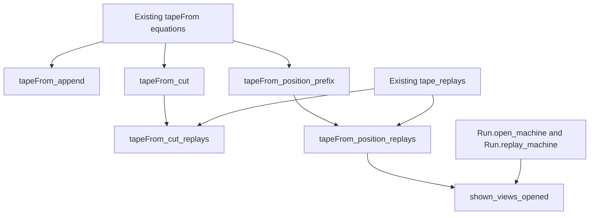

# CUTS reuse scout

The brief is ready for a small proof slice at frozen main `601ed7c5`.
This scout adds one structural helper and clarifies the displayed-view consumer.
It changes none of the four assigned statements.
All sketches remain uncompiled. The monitor runs no project command.

## Reuse and decomposition

`candidate.md` retains the four frozen signatures and gives the proposed helper's exact shape.
The helper finds the journal prefix ending at one recorded position.
Its result includes exact full-run equality and exact tape-prefix equality.
That lets the existing `tape_replays` theorem supply all machine, reply, fuel, and table reasoning.
Do not duplicate `applyReply_applied_machine`, `step_takes_decision`, or `Run.replayFrom_cons` in the new position proof.

The needed induction is structural over the journal, generalizing the initial run.
Take its cases from `tapeFrom` itself:

| Existing equation | Prefix witness and proof step |
| --- | --- |
| `tapeFrom_frontier` | No position exists; the completed cut is empty. |
| `tapeFrom_stop` | The same; retain the stopping row in the unread suffix. |
| `tapeFrom_skip` | Prepend the skipped command to the recursive journal prefix. The position index does not change. |
| `tapeFrom_take`, index zero | Choose the singleton journal prefix. Its run is exactly the stored `after`. |
| `tapeFrom_take`, successor index | Prepend the command to the recursive prefix and decrement the position index. |

`Run.play_cons` supplies the full-run equalities.
`List.take` and list-index equations supply the tape-prefix equalities.
The cut theorem uses the same structural cases, including trailing skipped rows.
Those trailing rows explain why selecting the last recorded position alone cannot prove the cut theorem.

`tapeFrom_append` also stays structural.
The two stopping cases append the new suffix to unread rows without playing it.
In the continuing cases, use `Run.play_cons` and `Run.play_append` to align the recursive starting run.
All four statements accept arbitrary runs and journals. They need no `Reached`, typing, or closed-requirements premise.

## Fresh-open display connector

`Lowered.shown` starts its raw replay with `Api.replay`, which loads a fresh machine.
Its tape starts at `l.opened`, while its rows come from the script's whole recorded journal.
The first consumer must therefore construct `l.opened` as `Run.open built id budget profile`.
An arbitrary progressed run would replay old journal rows from an already progressed machine.
Its initial displayed view would also differ from the fresh raw replay's initial view.

At index zero, use `Run.replay_machine`, `Run.machineOf_nil`, and `Run.open_machine`.
At index `i + 1`, use `tapeFrom_position_replays`, then the same fresh-load connector.
Map `machineViewOf` over the machine equality.
Use list-index extensionality to assemble the existing `raw.map (·.2)` and `views` lists.
This last step needs only list length, map, range, and take facts; it needs no new tape induction.

The exact consumer is proposed `shown_views_opened` in `candidate.md`.
It proves view equality even when a later row remains unread.
The consumer does not prove `Shown.agrees` without an empty-remainder premise.
It says nothing about `observedTableDifference`, which deliberately compares against a different table.

## Placement and limits

| Item | Placement |
| --- | --- |
| Concept and required property | `translation-simulation`: journal decisions reproduce the recorded machine observation. |
| Claim and role | The brief's R13 connector beside `journal_replays`, serving R8's replay view and existing `tape_replays`. The new helper serves `tapeFrom_position_replays`. |
| Reach | Arbitrary runs for the four journal laws; a fresh `Run.open` for the display connector; the original table and both budgets stay fixed. |
| Exclusions | No state after a stopping command; no equal session ledger; no generated-engine theorem; no retained driver, session ownership, liveness, or sufficient embedded budget. |
| Consumer | `Lowered.shown` in `Test/Dogfood/Scenario/Tape.lean`; its fixture views and later driver laws. No new representation or registry ledger is needed. |

The existing machine view includes the root exit, cells, awaits, armed owners, runnable fibers, and timers.
It does not include the session's reply receipts, consumed calls, or retired calls.

## Discriminating controls and trust

Keep the brief's stopped-row and frontier controls.
Add no broad scenario campaign.
A small mixed journal should contain an inert receipt row, a taken decision, and a later stopped row.
Its completed position must match the raw prefix, while `Shown.agrees` remains false because rows remain unread.
A red prefix omitting the inert command should fail the helper's full-run equality, even if its machine is equal.
A progressed `opened` run is the red control for dropping the consumer's fresh-open restriction.
These are proposed controls, not executed results.

Prove list equalities directly. Do not decide equality of `Position`, which stores a full `Run`.
Split the empty-list test structurally and keep `simp only` lists explicit.
No classical selection is needed: the journal induction constructs every existential witness.
Keep the Boolean `Shown.agrees` corollary separate to expose any equality-instance axiom dependency.
Check the new helper, four laws, and consumer with `#print axioms` and `#plan_status` after implementation.
The required ceiling remains `propext` and `Quot.sound`.
