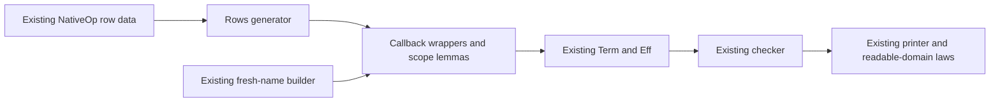

# Macro proof-contract scout

Snapshot: `33a1852942deaaa9c45a87a8a7e7b380b028043d`.
Evidence: source review only. No Lean, generator, compiler or runtime ran.
The source hashes are in `sources.json`. The design sketch is explicitly uncompiled.

## Recommendation

Start with one callback builder and generate its row wrappers through the existing Rows generator.
This removes manual binder names from real callers without adding stored syntax or a new macro language.
Treat generated Forms typing proofs as a secondary prototype, pending a demonstrated maintenance saving.

The edges describe the proposed construction route. They are not new semantic proof edges.

## First slice: fresh-name wrappers for operation terms

`Authoring.performTerm` binds a caller-supplied name while elaborating the operation's term.
`Rows.emitTermRow` generates eight Ref wrappers around that lift.
Each wrapper currently takes `current : String` and `f : TermSrc`.

`Authoring.bindWith` and `Authoring.foldWith` already hide temporary binder names through callbacks.
The proposed `performTermWith` follows that discipline and calls the existing lift.
The callback exists during authoring. Its result contains only the existing `Term`, `NativeOp` and `Eff` data.

Actual consumers include `Scenario.Atomic.note` and P5's deposit programs.
`Atomic.note` accepts a caller's term and places it under its own fixed name, `xs`.
That public helper has a capture hazard for terms mentioning `xs`.
This review does not claim that an existing closed Atomic scenario triggers that hazard.

### Five-part placement

1. Concept: `initial-algebras-folds`; required property: the operation-data scope rule.
2. Existing claim: `operation-data-scoped`, witnessed by `Eff.perform_scoped_iff`.
   The new scope helper serves `performTerm_scoped` and the generated Ref wrapper lemmas.
3. Reach: any `ScopedOp` instance satisfying the existing `hmk` equation.
   The request is scoped at the original level. The callback body is scoped one level deeper.
   Keep the quantified callback premise from `bindWith_scoped`.
4. Exclusions: scope is not typing, value preservation, atomicity or TypeScript execution agreement.
   The callback type does not restrict arbitrary Lean code from inspecting its environment.
   Do not claim every arbitrary `TermSrc` is invariant under environment extension.
5. Consumer: Ref wrappers used by the Atomic and ledger programs; R4 authoring, supporting R10 composition.

Reuse `minted_scoped` and `performTerm_scoped` for the scope theorem.
Use the pointwise proof shape of `foldWith_scoped`; the base helper must not import Sugar.
Reuse `var_push_minted` for ordinary variable reads under the new reserved name.
That theorem requires a reserved binder and a nonreserved caller name.
It does not state a contextual theorem about every arbitrary source function.

The helper belongs beside `performTerm` in `Program.Authoring`.
It calls `env.mint` and `minted` directly, as `foldWith` does.
Its proof belongs beside `performTerm_scoped` in `Laws.Program.Authoring`.
Do not put either helper in Sugar: Sugar already imports the generated Rows module.

The existing dependency direction supports the lower placement:
`Rows` imports `Lifts`, which imports `Authoring`.
The Laws direction is analogous: generated `Rows` laws import `Lifts` laws, which import base authoring laws.
Thus the generated wrappers need no import of Sugar and no second generated rows file.
The existing Rows generator should emit callback wrappers and their scope lemmas from the same rows.
Use request-first order consistently: `Ref.modifyWith state fun current => decision current`.
The generic helper takes `mk`, then request, then callback.
Retain named wrappers for compatibility. Check proposed callback names against the existing namespace.
Do not hand-edit generated output.

### Discriminating acceptance controls

- Positive: a callback reads the cell value and a captured outer Nat under distinct names.
- Capture control: a fixed-name helper adds an outer `current` to the cell's current value.
  Give the outer value 5 and the cell value 100. The intended result is 105.
  The fixed-name version reads the cell twice and gives 200. Both terms have Nat type.
  This is a proposed unrun control, not fresh execution evidence.
- Request control: a name introduced for the operation's body must remain unbound in its request.
- Nested control: nested generated callbacks must retain distinct levels and captured outer values.
- Refusal control: ordinary `var` must still refuse the reserved prefix.
- Integration control: the migrated Atomic.note must elaborate to the expected existing operation term.
  Its stored syntax should contain no callback or new constructor.
- Existing boundary: `FoldHygiene` already retains a same-typed capture witness for the same builder discipline.

The done criterion is one checked generic helper, generated wrappers, and one migrated real caller.
The existing read/print theorem hypotheses remain unchanged because the core constructor remains unchanged.
Readable-domain obligations must still be established for any emitted example.

## Second slice: derive a small set of Forms typing proofs

`Codegen.Forms.all` already owns the form descriptions.
`Effect4Gen.Forms` generates authoring wrappers and scope laws from that table.
The TypeScript ingestion fold reads the generated template data too.
Do not replace this with a second declaration format or a TypeScript macro IR.

The remaining repetitive seam is in `Laws.Codegen.Forms`.
The concrete typing laws select the real form by id, then replay constructor typing and weakening laws.
Prototype generated proof bodies for `andThenEffect_typed`, `andThenContinuation_typed` and `ensuring_typed`.
Retain their exact names, statements and hypotheses.
The prototype must derive bodies from constructor laws, not merely alias the existing concrete theorems.

### Five-part placement

1. Concept: `residual-program-typing`; source-checker composition supports the existing R10 typing roots.
2. Existing questions: the three named theorems are already R10 top nodes in `SemanticsRegistry`.
   This is proof maintenance, not closure of R10's separate behavioural question.
3. Reach: explicit effect-slot environments and expansion-success facts.
   Slot insertion requires `Signature.WeakenNatural` and exact cut/count facts.
   A continuation receives the answer type. A finalizer receives `exitOf answer error`.
4. Exclusions: `ArgClass` alone supplies no typing premise.
   A typed expansion supplies no parser correctness, target execution or scheduled behaviour theorem.
5. Consumer: the existing form roots, then future Forms rows using these constructors.

Reuse `effTy_insert_append`, `Template.argument_typed`, `Template.bind_typed` and `Template.onExit_typed`.
Preserve both joined error types and combined requirements.
An unsupported template or missing premise must stop generation with a precise error.
Never turn failed proof synthesis into a silently inserted `proof_goal`.

If the prototype saves little work, stop at the callback wrapper slice.
Moving three already short proofs is not by itself a product improvement.
A production migration must avoid an import cycle between helpers and generated proofs.
One possible layout separates shared template laws from derived concrete laws, with the existing module aggregating them.
Do not commit that split before the prototype demonstrates a useful reduction.

### Existing falsifiers and proposed controls

`FormsContract.insertRequestOnly` is an actual retained negative control.
It moves the request but misses a term stored inside the operation.
With a String insertion the checker refuses the result.
With a Nat insertion the result still types, but the retained evaluation controls differ: 101 versus 6.
A generated typing proof therefore cannot stand in for a variable-reading or behavioural theorem.

Keep the existing positive operation-term insertion controls and captured-continuation controls.
Mutate an effect slot's insertion count and require the statement-preserving derivation to fail.
Mutation of an effect slot to a continuation requires different premises; never silently rewrite the theorem.
Check that finalizer errors and requirements survive the generated result.

`TypedProgBindRed.typedProg_not_bind_closed` is a separate retained counterexample.
Generic protocol bind typing does not imply concrete residual `TypedProg` bind typing.
Any future behavioural macro must use the per-construct compatibility law its consumer actually needs.
The source-variable capture counterexample and the residual-control counterexample are distinct.

## Proof status and interop boundary

`ProofGraph.Goal` makes a deliberate open theorem; it does not prove its proposition.
The graph derives goal, modulo and proved status from actual proof dependencies.
A generator cannot promote status by emitting a declaration name or a plausible proof sketch.
`ProofGraph.ProofRef.validate` checks theorem identity, proposition, universes and transitive axioms.
Use that existing mechanism where a generated report needs a frozen checked reference.

`read_print` and `read_exact` establish their existing syntax observations under `LawfulSpelling` and readability premises.
They do not establish rc.112 behaviour, OCaml execution or a lowering simulation.
R10 explicitly retains the composed-module behaviour question and form behaviour laws as open parts.
Generated wrappers and generated typing proofs must leave those boundaries visible.

## Verification receipt

The work read the named source declarations and existing finite controls at the pinned revision.
The working tree was clean at the initial snapshot.
No new theorem, source prototype or proposed control was compiled or run.
No repository file changed. Only this scratch directory received outputs.

The source hash manifest covers all inspected owners and principal consumers.
The uncompiled sketch contains the proposed helper, its intended scope proof and one real-caller migration.

## Follow-up correction

The parent caught an import cycle in the first sketch's proposed Sugar placement.
This revision moves the helper and scope proof to their existing base owners.
It aligns request-first wrappers with the broader scout.
The registry concept is confirmed as `initial-algebras-folds` for `operation-data-scoped`.
This correction is source-reviewed only; the updated sketch remains uncompiled.
