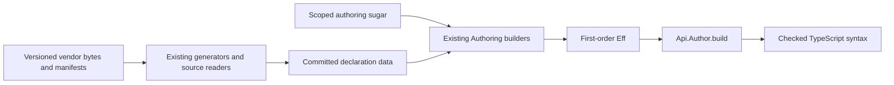

# Macro and declaration research

This review reads main at `33a1852942deaaa9c45a87a8a7e7b380b028043d`.
It proposes changes and does not implement them.
No Lean, TypeScript, OCaml, build, generator, installation or runtime command ran.
The source inventory and text checks appear in `sources.json` and `checks.json`.

## Recommendation

Consider four small changes, in this order.
Use an ordinary function for callback hygiene, declaration generation for repeated record data, and a script for vendoring.
Do not add a general macro framework.

| Rank | Change | Current consumers | Existing owner |
| --- | --- | --- | --- |
| 1 | Generate callback variants of the Ref term-row builders | P4's request/refill, P5's deposit, Queue take/offer/withdraw | `Authoring.performTerm`, `Effect4Gen.Rows` |
| 2 | Derive record helpers from one raw field declaration | P4 Window, P5 Account, P2 record fixtures | `Authoring.record`, `Program.Record`, `Machine.Record` |
| 3 | Consolidate versioned source identity around the existing vendor manifests | Runtime census, Variances, package-table provenance, release audits | Existing vendor `SHA256SUMS`, census and release scripts |
| 4 | Generate one existing host adapter from explicit contract data | `pKv`, `KvHandle.get`, package rows | `Packages.KeyValueStoreMemory`, existing TypeScript syntax, truth lane |

The first change needs no macro syntax.
The second should start with ordinary definitions; add a scoped command only when two callers demonstrate useful reduction.
The third must remain outside Lean macro expansion.

## Existing mechanisms worth keeping

`Program.Authoring.Sugar` already uses Lean's `doSeq` parser for scoped `eff do` syntax.
It expands into `bindName`, `andThen` and `succeed`.
`Authoring.elaborateModule` produces the one first-order `Eff` tree.
`Api.Author.build` assembles the table, checks services, types the program and admits it.
A proposed declaration command must call or generate ordinary inputs to these owners.

`Codegen.Forms.all` already supplies first-order expansion templates.
`Effect4Gen.Forms` derives authoring wrappers, scope lemmas and expansion guards.
`Drivers.TsGen.emitForms` exports that data to the TypeScript readers.
Another macro-owned forms table would recreate the duplication this design removes.

`Effect4Gen.Rows` reads `NativeOp.spelled` and operation constructor parameters.
It already derives wrappers and scope lemmas together.
Add a new wrapper form there, rather than writing eight handwritten Ref wrappers.

`OCaml5.Lcnf.Builtins` already owns lookup, support functions, reserved names and fidelity data.
Its `problemsOf` checks the admitted target syntax, dependencies and binding restrictions.
Keep explicit contracts without defaults.
A prettier builtin command would currently hide more important information than it removes.

The pinned `lean4-typescript` package owns first-order syntax, rendering, identifier rules and host pins.
It does not own Effect admission or denotation.
Its structural `TypeRef` and `Expr` constructors are suitable outputs of declaration generation.
Avoid macros that create unchecked raw TypeScript text or execute the compiler during Lean elaboration.



## 1. Callback variants of Ref rows

### Source evidence

`Test.Dogfood.P4RateLimiter.request` writes:

```lean
Ref.modify "w" (decision (var "w")) state
```

Its refill repeats that pattern with `Ref.update`.
`P5LedgerService.depositModule` manually repeats the current-value name within a captured amount expression.
The Queue controls in `Test.Codegen.TermRows` repeat the same pattern for take, offer and withdrawal.

`Authoring.performTerm` already distinguishes two scopes.
The callback term elaborates under the current-value binder.
The cell request elaborates under the caller's original environment.
Preserve that distinction.

`Authoring.foldWith` now supplies a directly reusable approach.
It mints reserved binder names and gives the body source readers of those names.
`bindWith` supplies another existing example.

### PROPOSED authoring sketch — not compiled

```lean
-- Existing
Ref.modify "w" (decision (var "w")) state

-- Proposed generated callback variant
Ref.modifyWith state fun current => decision current

-- Captured caller term stays explicit
Ref.modifyWith state fun current =>
  app "pair" [app "add" [field current "balance", amount],
    deposited current amount]
```

The common implementation should be an ordinary `performTermWith` builder.
It mints the current-value name and calls the existing `performTerm`.
Place it beside `performTerm` in `Program.Authoring`, using the environment directly.
Do not import `Authoring.Sugar`: Sugar imports the generated Rows module and would create a cycle.
The generated variants would only select the operation constructor and request shape.
Keep the current explicit-name API for compatibility and exact source tests.

No function enters stored program syntax.
The Lean callback only constructs a `TermSrc` before elaboration.
The result remains the same `.perform (.refModifyWith term) request` shape.
Do not change atomic update into separate reads and writes.

### Proposed proof connector

- Concept: initial-algebras-folds; required property: scoped operation data.
- Placement: helper of existing `operation-data-scoped`, consumed by generated Ref wrapper scope laws.
- Statement shape: `request.Scoped` and `(∀ current, current.Scoped → (body current).Scoped)` imply the callback wrapper is scoped.
- Additional hypothesis: the constructor's existing `ScopedOp.scopedAt` equation checks its term at `n + 1`.
- Reuse: `performTerm_scoped`, `minted_scoped`, `var_push_minted`; the pattern of `foldWith_scoped`.
- Observation: identical elaborated operation shape, current-value position, caller request and captured authored-variable levels.
- Exclusions: scope is not typing, membership, atomic execution agreement or host agreement.
- Prerequisite: one common builder and unchanged generated row ownership.

Do not claim hygiene for arbitrary environment-inspecting `TermSrc` functions.
The existing variable law applies to authored, nonreserved names under a minted binder.
Keep that domain explicit.

Planned controls: nested callbacks, a caller variable named `w`, a request outside the callback scope, and a captured value inside a nested fold.
The positive must retain the caller's value.
The fixed-name mutant must capture it and produce a different elaborated level or result.
These controls are proposed, not executed here.

`Test.Dogfood.Scenario.Atomic.note` gives a concrete acceptance-control candidate.
It accepts an arbitrary source `x`, then embeds it under the fixed name `xs`.
Use an outer `xs` list and pass `app "length" [var "xs"]` as the log entry.
The fixed binder can redirect that read to the log's current list, which has the same list type.
Different lengths distinguish the readings.
This is a source-derived candidate, not a compiled counterexample or a failing current scenario.

## 2. One record declaration, derived helpers

### Source evidence

P4 separately spells `windowFields`, a sorted `windowTy`, and sorted columns in `windowVal`.
Its `window0` uses the original field list.
P5 already avoids the first duplication with `(Ty.record accountFields).normalize`.
That is a useful immediate cleanup pattern without any new abstraction.

`Authoring.record` deliberately retains the raw declaration and supplied-name sequence.
`Program.Record.check` refuses repeated declarations and supplied names before returning a normalized type.
`Machine.Record.build` pairs names with values before canonicalization and refuses unequal columns or duplicates.
Reuse these functions rather than implementing another sorter or record representation.

### PROPOSED first slice — not compiled

```lean
def windowTy : Ty := (Ty.record windowFields).normalize

-- Keep fixtures paired, rather than copying two manually sorted columns.
def windowVal? (used admitted rejected : Nat) : Option Val :=
  Machine.Record.build ["used", "admitted", "rejected"]
    [.nat used, .nat admitted, .nat rejected]
```

The optional result must stay visible unless a checked declaration supplies a proof of acceptance.
Do not use a default value to conceal refusal.

### PROPOSED later declaration syntax — design sketch only

```lean
declare_record Window where
  used : .nat
  admitted : .nat
  rejected : .nat
```

The command would generate ordinary `fields`, `ty` and `term` declarations.
It could generate field-name helpers after those have two callers.
It must retain raw field order and spelling in `fields` and in record terms.
It may derive the canonical type with the existing normalizer.
It must reject malformed declarations before normalization can erase duplicates.
No automatic runtime encoder, decoder or host class is part of this proposal.

### Proposed proof connector

- Concept: subtyping-algebra; property: raw formation, serving claim `raw-formation`.
- Companion concept: exact-codecs, serving existing record printer/readback laws for R2/R3.
- Consumer: P4/P5 authored records and their existing checked module emission.
- Statement shape: generated `fields` equal the written raw fields; generated `term present` equals `Authoring.record fields present`.
- Hypotheses: declaration formation succeeds; each supplied child source satisfies its existing scope premise.
- Reuse: `record_scoped`, `Formation.checkInput_eq_none_iff`, `readRecord_writeRecord`, `readRecord_exact`.
- Observation: raw fields, supplied names, child terms, canonical declared type and existing located refusal.
- Exclusions: no automatic inhabitance, codec admission, host reply admission or JavaScript runtime equivalence.
- Prerequisite: demonstrate the ordinary-definition cleanup on P4 and P5 before introducing command syntax.

Planned controls include duplicate fields, duplicate supplied names, omitted required fields and optional absence.
Retain `__proto__` and nonidentifier names through the existing computed-property image.
A normalizer-before-formation mutant must not pass.

## 3. Mechanical vendoring with explicit source identity

### Source evidence

Both Effect vendor trees already contain complete `SHA256SUMS` manifests.
The release README records the registry URL, integrity, tarball digest and provenance source.
It explicitly states that nobody verified the attestation's signature.
The release tree is a citation input; it is not the census pin.

The runtime census repeats the pinned version, commit, source directory and twelve whole-file digests.
`Tools.Variances` repeats the version and source root.
The package-table generator and Makefile name particular vendor files as inputs.
These consumers need the same source identity but retain different semantic extraction rules.

The bounded text check in `checks.json` compares the twelve census digests with the existing manifest and committed source bytes.
It also retains a changed-digest refusal control.
This checks source identity only.

### PROPOSED boundary — no tool added

Add a small machine-readable identity record beside each existing vendor manifest.
Retain package/version, upstream commit, archive integrity and digest, manifest path, retrieval evidence and verification status.
Use a local archive or already-installed source as an explicit input to a refresh script.
The script verifies and copies exact bytes, then writes a reviewable report.
Network retrieval and source promotion remain separate explicit operations.

Consumers select a named input record rather than a mutable global latest version.
Their allowlisted file sets, anchors, span digests and semantic claims remain explicit.
Changing vendor metadata cannot automatically move the census, proof citations or runtime agreement profile.

### PROPOSED invocation sketch — not implemented

```text
vendor-source verify --source effect-4.0.1 --archive <retained-archive>
vendor-source prepare --source effect-4.0.1 --output <scratch-candidate>
```

This belongs in ordinary scripts and `docs/GENERATED.md`'s input ownership map.
Do not perform filesystem copying, downloads or compiler execution inside a Lean macro.
Do not restore per-file git fingerprints: `Tools.GeneratedStamp` deliberately leaves freshness to the existing build graph.

### Contract and controls

The required property is exact source provenance, not a new theorem about Effect behavior.
The consumers are the census, variance reader, package projection and release audit.
The hypotheses are the named input identity, an explicit file allowlist and accepted digest algorithms.
The observation is byte equality, deterministic manifest order and fail-closed rejection.
The exclusions are signature verification unless actually performed, runtime agreement, compiler correctness and automatic semantic migration.
The prerequisite is coordinator ownership of promotion and migration row 253's versioned evidence.

Planned controls: unchanged archive, one changed byte, a duplicate path, a missing file, path escape, ambiguous anchor and wrong version.
Retain the current independent semantic controls in Variances and the runtime census.

## 4. Vendoring an operation into the reified surfaces

Copying upstream source is only one meaning of vendoring.
The other is adapting an operation so its stored row, authoring face, printed call and backing implementation state the same contract.
The source manifest cannot establish that relation.

### Concrete pilot: the existing `kvGet` adapter

`Packages.KeyValueStoreMemory.keyValueStoreMemory` already owns the `kvGet` row.
Its request is a store handle and a string key.
Its answer is `option string`, and its error column is `kvError`.
The upstream declaration returns `string | undefined` and may fail with `KeyValueStoreError`.
These are different boundary representations.

`harness/truth/prelude.ts` supplies the adaptation explicitly:

```typescript
get(key: string) { return Effect.mapError(recorded("get", [this, key], Effect.map(this.store.get(key), Option.fromNullishOr)), toPair) }
```

The error rule is equally important.
The current `toPair` path can turn a richer `KeyValueStoreError` into a defect under the existing payload contract.
A generator must retain that behavior until a separately approved semantic change replaces it.
Do not infer an error projection from the printed error type.

### PROPOSED narrow slice — not implemented

Retain the existing row as the signature owner.
Add an explicit adapter description keyed by that row's stable name.
It states the receiver access, argument order, success conversion, error conversion and recording call.
Generate a standalone helper expression through `TypeScript.Expr` and `ConstDecl`.
Keep `KvHandle.get` as a thin call initially.

The package's `ClassDecl.members` still holds verbatim member lines.
Therefore this pilot should not claim structured coverage of whole class methods.
Do not expand the syntax package just to hide that limitation.

The existing row supplies the method name and signature.
The adapter supplies `Option.fromNullishOr` and `toPair` explicitly.
The truth lane supplies independent expected observations.
The printer/readback laws still come from the existing row machinery.
Other operation kinds use their current owners: `Rows`, `Forms`, `NativeAtom.row` or OCaml `Builtins`.
No universal operation-import macro chooses semantics from a TypeScript signature.

### Proposed connector and controls

- Concept: translation-simulation; proposed narrow adapter claim under R6/R8, placed before proof work.
- Consumer: `Truth.pKv`, its generated program and the host recorder.
- Statement shape: related handles and equal keys produce related successful answers after the named conversion, or the existing delivered failure observation.
- Hypotheses: pinned source identity, the admitted string-value profile, a valid related host handle, and the named backing operation's assumed or proved contract.
- Observation: missing versus present string, exact recording arguments, delivered exit and request order; receipt and application stay distinct.
- Exclusions: no proof of the host store implementation, allocation lifecycle, fairness, general failure payload equivalence or whole-runtime agreement.
- Prerequisite: a written adapter observation relation; generation alone cannot discharge it.

Finite controls should distinguish missing key, empty string and a nonempty string.
Use a backing failure that exercises `toPair`, with the current defect behavior retained as the expected observation where applicable.
Reverse or omit the conversion in a mutant.
The missing-key and empty-string controls must distinguish that mutant from the intended adapter.
Keep independent observations; a generated helper and a generated expected answer from the same recipe are insufficient.

This pilot removes mechanical wrapper repetition while keeping the semantic choices visible.
It can establish a reusable recipe without adding a new language constructor or widening the admitted profile.

## Boundaries and sequence

After the active slices settle, start the generated Ref callback variants with their existing scope laws.
Then make P4's direct record cleanup; decide on command syntax only from that result.
Prepare vendoring identity records without changing the pin or any semantic claim.

Keep T5's shared type reader an ordinary checked function.
Keep the existing tsgo 7 adapter research separate from authoring macros.
TypeScript compiler acceptance is one observation, not Lean membership or Effect behavior.
Keep OCaml builtin semantic contracts explicit and independent of the target spelling.
The seven judgments retain their current owners throughout these proposals.

The review establishes source-backed opportunities.
It establishes no new Lean theorem, compiler result, runtime result or landed change.
