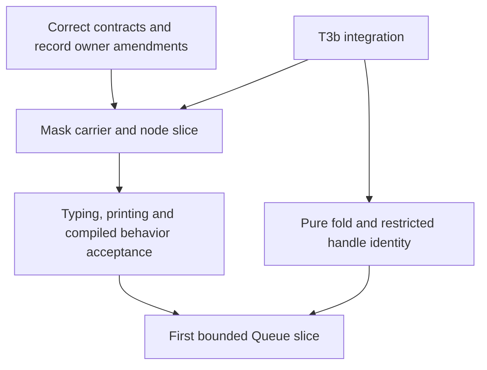

# Review of the second mask note

Recommendation: accept the three design directions after the corrections below.
Do not accept the note's current statements as an implementation contract.
This review proposes amendments. It records no owner ruling.

Reviewed source: `c3263529`, rechecked at `c49f2ba1` on `refactor/phase1-phase3`.
The proposal is `docs/research/2026-10-05-claude-lead/mask-second-note.md`.
The coordinator remains active. T3b continues its bounded implementation.
No repository edit, installation, generator or Lean command ran during this review.

## The three choices

| Choice | Recommendation | Required contract |
| --- | --- | --- |
| Give saved interruption state an opaque type | Accept | Reserve its target against external allocation. Define its canonical values and membership through stores, contexts and captured environments. |
| Give restoration one program node | Accept | Its body is child zero. Add the row-separation proof needed by its printed method call. |
| Permit the saved value as data | Accept | It selects identity or interruptible execution on the invoking fiber. Storage and capture retain that choice without retaining the parent's activation. |

These choices keep the program first-order.
They need no general function values and no second store model.
Passing the value as data amends row 227 beyond its recognized escaped-restore permission.
The owner still decides that amendment and the changes to row 239.

## Corrections before a brief

### 1. Address the body's actual child

F3 compiles the false branch at `p.child 1`.
`Node` in `src/Effect4/Program/Node.lean` counts node arguments only.
The saved `Term` is not a node argument.
Therefore the single body is child zero.

Use the same address in compilation, action resolution, typing and denotation.
A body containing only `succeed` can conceal the error.
Test both saved choices around a bind with an outer capture and a subsequent operation.
This finding reads the source. No proposed Lean node was executed.

### 2. Reserve the opaque value's external boundary

The latest F3 adds a `Fits` arm to its stated work.
The target reservation and transport obligations below remain.
`internalHandleTargets` in `src/Effect4/Program/Typed.lean` separates internal targets from external allocations.
Without reservation, an external handle can inhabit the proposed target spelling.
The proposed restore evaluator expects a saved Boolean instead.

Reserve the target and connect its membership to `Fits`, `FlatFits`, world extension and typed environments.
`findInternalHandle` in `src/Effect4/Program/Columns.lean` must refuse its introduction through external answer columns.
Cover Ref, Deferred and fork capture through the existing generic connectors.
Either support service-context transport explicitly or refuse it in the first profile.
The current service carrier permits handle targets other than the context target.

A Boolean source literal still infers `bool` under the current rules.
This review does not claim that a Boolean literal can already forge the proposed type.
Raw-value membership and external-reply admission remain separate obligations.
Specify the internal encoding before choosing between a tagged value and a raw Boolean representation.

### 3. Include the missing printer proof rule

F5 proposes `E.pipe(saved)`.
`Tpl.head?` in `src/Effect4/Codegen/Template.lean` returns no head for a method template.
`rowsApart` in `src/Effect4/Laws/Codegen/ReadPrint.lean` requires a reserved head before the effect-row fallback.
Therefore reserving the string `pipe` alone does not establish `table_apart` for the proposed row.

Add a method-specific separation rule and its proof, or choose another exact public spelling.
Keep the existing read/print theorem statements.
Prove their extended table premises instead of treating the formers' local laws as the whole result.
Require an actual checked printed module, including the restore-type alias and capture cases.
The handwritten TypeScript examples do not establish this connection.
Local annotated syntax has its existing reader restriction; do not silently enlarge `Readable`.

### 4. State interruption laws at region boundaries

F7 currently quantifies over any typed body.
Its first two flag assertions fail for ordinary nested regions.

| Finite control on both builds | Observed flag |
| --- | --- |
| Mask body with no override | false |
| Explicit `interruptible` outside any restore site | true |
| Restore of a plain body from an interruptible caller | true |
| Explicit `uninterruptible` inside that restore | false |
| Restore from a masked caller | false |

Both the native mask and the proposed printed expansion produce these observations.
Rewrite the laws around entry, completed exit and the pending-cause check.
Nested regions keep their own rules.
A false saved choice applies identity; it does not force the invoking fiber to become masked.
Keep an escaped false-choice control under an interruptible caller.

### 5. Keep the expanded form's interruption boundary explicit

The new probes exercise two windows omitted by the note's original scenarios.
They use a finite custom dispatcher that requests a yield at a chosen runtime checkpoint.
Both installed versions produce the same results.

- An interrupt requested while the getter is temporarily masked remains pending.
- The getter's restoring exit then interrupts before the derived form's body starts.
- The corresponding native masked pre-body case runs its body before returning the interruption.
- A masked incoming caller still runs the derived body's control case.
- Without the interruption, every paired control enters its body.

This is a boundary of the selected expansion, not a newly discovered upstream defect.
Retain it in the observation contract and the Queue wrapper's program-admission premises.
Do not claim unrestricted agreement with native callback spelling.
The wrapper must acquire no resource or register no request before its protective body begins.

### 6. Separate operation counts from loop checkpoints

The narrow plain-success result stands: native and printed roots have two and five loop checkpoints on both builds.
The general use of `currentOpCount` as an iteration count does not stand on 4.0.1.
Its `succeedWith` charges operations while running continuations outside the loop.

For a mapped body, the release's native and printed roots have three and six loop checkpoints.
Their operation counters are four and seven.
The pin's same roots have four and seven checkpoints and counter values.

Name the measured quantity in F6.
Leave machine-to-printed agreement open until the compiled programs and selected release semantics establish it.
The A401 audit already retains broader budget differences.

## The fold's adjoining constraint

The published `fold-design/fold-design.md` at `c49f2ba1` now restricts identity to Ref or Deferred values.
That resolves the earlier concern about using every opaque handle type.
Keep this restriction in the typing rule and the target identity relation.
Require key equality exactly when the corresponding host objects are identical.
A stable mapping alone does not establish that property.
The bounded source review finds no new error in the two-binder convention or nested weakening controls.
Keep the insertion-cut premise at or below the captured environment's length.
The new note retains the local-annotation reader restriction and lists its target typing check as open.
The model's finite controls do not replace these implementation obligations.

F2 of the mask note also needs a narrower rationale for layer identity.
Duplicating inline syntax creates different paths, but shared `LayerTerm.ref` values can still name the same target.
The existing selection printer prints both branches too.
Treat memo divergence under a proposed collapsing printer as an obligation until a witness fixes allocation points and memo-map lifetime.
The single-body direction remains useful without that stronger claim.

## Placement and order

These are proposed obligations. No new goal or theorem landed during this review.

| Property and placement | Consumer | Hypotheses and observation | Exclusion and prerequisite |
| --- | --- | --- | --- |
| Saved-value membership, `store-typing`, R4 | Getter answers, generic stores and captured environments on M5/M6 | Reserved target, canonical values, fitting environments and world extension | No reply admission by implication. Define the carrier and reservation first. |
| Restore path and binder correctness, `residual-program-typing`, R4 | `scoped-body-substitution-boundary`, then M5/M6 execution | Checked body, correct child address, typed stack and captures; no invalid lookup | No target agreement. Correct child zero first. |
| Region entry and exit law, `scope-lifetime-finalization`, R11 | `saved-mask-restoration`, Queue waiting and protected permits | Both saved choices, nested regions, each completed exit, pending causes | No fairness or cancellation rollback. Correct F7 before stating its goal. |
| Exact row reconstruction, R8 under existing codegen claims | Checked printed modules | Extended table premises, readable children, reserved methods and captured binders | No host behavior. Extend row separation first. |
| Expanded-form behavior, R10 and R11 | Queue wrapper and its budget condition | Selected version, compatible decisions, interruption boundaries and actual compiled programs | No native-spelling equality. Retain the new boundary controls first. |

Keep release migration as an explicit sequence beside this work.
The A401 audit changes runtime rules, scheduler accounting and scope behavior, not merely import paths.
Do not relabel rc.112 proofs or let target-package updates silently select different semantics.
Pure fold work does not depend on that migration.
Any budget-sensitive 4.0.1 claim depends on the corresponding migrated scheduler contract.

## Resolutions verified

`e5ae130d` removes the unbounded Queue's artificial limit and clears by the buffer's actual length.
It separates offer acceptance from posted answers and corrects the shutdown inference.
It retains exact terminal-signal controls and a deliberately silent shutdown that fails the new accounting check.
The wording corrections and signed operation differences are present.
The saved output records successful bounded explorations; this monitor did not rerun Lean.
Actual wrapper delivery remains open.

The A401 source manifest checks all 496 vendored source files with no hash mismatch.
That checks the retained manifest against local files.
It does not authenticate the downloaded package's publisher.
T3b remains active, so its unfinished cutover is outside this review's acceptance verdict.

## Evidence files

- `basis/review.md`: the representation and typed-state paths.
- `printing/review.md`: the row-separation and reader findings.
- `runtime/probe.mjs`: exact finite inputs and positive controls.
- `runtime/rc112.json` and `runtime/v401.json`: versions, source hashes and observations.
- `receipt.json`: reviewed heads, checks and delivery status.

The runtime probes use Bun 1.4.2 and installed Effect builds 4.0.0-rc.112 and 4.0.1.
They establish finite observations only.
The proposed Lean implementation, its proof obligations and whole-runtime agreement remain open.
