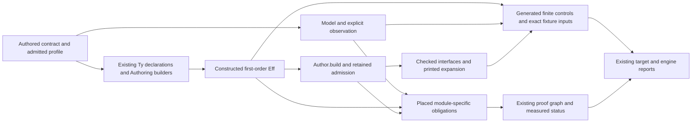

# A repeatable route for composed modules

Build the factory around the existing authoring, checking, generation and proof owners.
Queue is its first worked example; Semaphore should test which parts actually generalize.
Do not invent another language for modules or require every module to fit Queue's state machine.

Role: advisory design research. Evidence: source inspection at `a02126a85051ab7ec0be0a3bd30471feb18fbdd3`.
No implementation, Lean, compiler, runtime, build or generator ran.
Every new connector below is proposed and uncompiled.

## The route

The arrows describe responsibilities, not proved semantic implications.
Compiler success, readback, runtime observations and Lean proof status remain separate results.

## What is already mechanical

| Input and owner | Existing outputs | Boundary |
| --- | --- | --- |
| Constructor declarations and `binders.json`; `Effect4Gen.Authoring` | Binders, child paths, scoped folds, authoring lifts and scope lemmas | Scope does not imply typing or behaviour |
| `NativeOp.spelled` and constructor fields; `Effect4Gen.Rows` | Primitive wrappers and scope laws, including term and type parameters | These are primitive calls, not composed Queue/Semaphore operations |
| `Codegen.Forms.all`; `Effect4Gen.Forms` | Derived-form builders, minted private binders, scope laws and expansion guards | The finite template language does not express every stateful module |
| `Authoring.elaborateModule`, then `Api.Author.build` | One `Eff`, assembled rows, located refusals and retained admission | No additional certificate layer is needed |
| Existing checked printer, type reader and syntax package | Interfaces for the supported expanded program; readable-domain laws | A native convenience call needs its own agreement profile |
| `proof_goal`, `proof_sketch`, `Plan` and semantics placement | Open obligations, checked decomposition and status from actual dependencies | They do not discover the intended specification |
| `Effect4Gen.Driver`, its manifest and Makefile | Dependency order, staged outputs, freshness and regeneration refusal | Reuse this graph; do not add stamp files or another registry |

Sum-of-products signatures already support the constructor-driven generation above.
They describe syntax shapes and binder positions; they do not determine fairness, rollback, cancellation or resource ownership.
A repeatable operating procedure should preserve that distinction.

## The smallest missing piece

A composed module currently assembles several sound mechanisms by hand.
The immediate opportunity is a small, repeatable module packet with generated projections from existing declarations.
Start with Queue's existing packet; use Semaphore to prove the packet removes repeated work.

Keep the source of truth in ordinary module declarations and placed theorem statements:

1. Raw state fields and parameter types, with the existing profile predicate.
2. Named initial value and operation builders, returning the existing `TermSrc` or `Src NativeOp`.
3. Exact argument, reply and state types, at the real elaboration environment.
4. Model operations, encoding relation and public observation.
5. Placed typing, step-agreement and wrapper goals.
6. Named positive/refusal scenarios, their budgets and the observations each target can actually produce.

The generator may receive declaration names as selections.
Do not copy those facts into another semantic registry or store callbacks as program syntax.
The existing registry owns claims; `Ty`, `Term` and `Eff` own language content.

Generate only these first projections:

- State-type and field helpers from one raw field declaration, using the existing record checker and normalizer.
- Operation interface wrappers that call the authored expansion, without introducing a new `NativeOp` constructor for composition.
- Typing/step theorem skeletons instantiated at explicitly supplied premises and observations.
- Per-target fixture entrypoints and selections from the named scenarios.
- A report showing admission, readability, target typing, finite execution and measured theorem dependencies separately.

Keep the raw declaration available before normalization, so duplicate fields cannot disappear before admission.
Preserve frozen theorem statements while replacing repetitive proof bodies or derived declarations.
Queue's `cellFields` and sorted `cellTy` show the duplication; QTYPES currently owns their proof consumers.
Do not refactor those active definitions merely to establish a pattern.
Try the shared construction on Semaphore's new cell, then consolidate only what both actually use.

## Queue and Semaphore as the two concrete consumers

| Stage | Queue now | Semaphore pilot, proposed |
| --- | --- | --- |
| Contract/profile | Closed `FirstProfile`, positive bounded/open/suspend state and explicit signals | Begin with a chosen protected-permit profile; select counts and excluded operations explicitly |
| State | One Ref containing messages, capacity, takers and offers | Permit totals/usage and waiter information, with no message buffer |
| Pure step | Six authored terms; the five changing steps return reply plus next cell | Acquire-if-available, release and waiter selection as separate authored pure steps |
| Typing | `typeAt`, `MessageTy`, seven original statements; QTYPES proves the remaining five | Instantiate the shared native-call, record, fold and binder typing rules at the permit state |
| Atomic store | `step_updates` and `step_keeps_cell`, through `refStep_modify` and `fold_typed_atomic_update` | Reuse the generic content of those connectors once a second actual consumer needs their lower placement |
| Waiting body | Queue registration/retry/withdrawal and posted notifications | Wait for permits, restore the caller's mask around waiting and body, then release on exit |
| Public law | `queue-expansion-agrees`, with notification and budget obligations still explicit | A distinct permit/cleanup observation and waiter policy; do not instantiate Queue FIFO mechanically |
| Faces/evidence | `QueueFaces`, `QueueEngine` and their scenario selections | The same fixture-writing and comparison machinery over permit scenarios |

The Semaphore source proves why the policy must remain explicit.
`releaseUnsafe` schedules a traversal of the waiter set (`vendor/effect-4.0.0-rc.112/src/Semaphore.ts`).
Each observer checks its own requested count and returns when too few permits are free.
Thus an earlier oversized request can be skipped while a later eligible request proceeds.
A Queue strict-turn policy is not a correct default for this operation.
This is a source reading, not a new runtime probe or fairness theorem.

`withPermits` restores the incoming mask around both the wait and the supplied body.
It installs release through `onExitPrimitive` after acquisition.
Its completion, cancellation and cleanup contract therefore needs the existing saved-mask work, even if state-type and interface generation is automatic.
Choose the first Semaphore fragment before stating a capacity invariant: unrestricted manual release or resizing changes that invariant's premises.

## Obligations that can be assembled mechanically

These are proposed schemas, not new checked theorems.
The module's own law chooses which schemas apply.

| Property and placement | Exact premises and observation | Existing reuse and consumer | Exclusions/prerequisite |
| --- | --- | --- | --- |
| A constructed operation is well scoped; `initial-algebras-folds`, `operation-data-scoped`, serving R4/R10 | Scoped arguments; binder positions and capture domain; resulting Eff scope | Generated lift/row/Form scope laws; Queue and Semaphore builders | No arbitrary environment-inspecting source hygiene; finish the already-planned minted callback helper |
| An atomic step keeps its cell typed; `store-typing`, R4 | Exact elaborated term, signature/native atoms, captured type/value environment, `termTy ... = some (.prod Reply Cell)`, stored cell membership | `step_keeps_cell`, `fold_typed_atomic_update`; both modules' Ref.modify steps | No progress, notification delivery or universal message admission; use row 257 and QTYPES |
| One step agrees with its model; `translation-simulation`, R10 | Module-specific profile, state/input encoding, successful evaluation; exact reply, next state and ordered notifications | Queue's `Reads` lemmas, `step_updates`, existing step/model theorems | Requires the independently stated model and observation; a generator cannot infer them from the implementation |
| A protected operation releases its permit correctly; `scope-lifetime-finalization`, R11, serving R10 | Acquired permit identity/count, saved incoming mask, body exit, cleanup completion or retained frontier | Existing saved-mask/cleanup contracts; Semaphore `withPermits` | No whole-run release or liveness from local cleanup; mask and adequate driver budget remain prerequisites |
| A face reconstructs the program; existing `read_print`/`read_exact`, R8 | Lawful spelling, table premises, readable types, scope/class/annotation conditions | Checked module printer/readers; both modules' expanded interfaces | No native API or runtime agreement; no universal compiler correctness |

`proof_sketch` can apply a known decomposition and expose the remaining premises as placed goals.
It closes residual contexts, checks the decomposition in Lean and refuses logged errors.
It currently refuses universe-polymorphic statements; do not advertise arbitrary automatic proof extraction.
Generated goal declarations must be deliberate outputs of an approved obligation schema.
A failed proof attempt must not silently create a goal or broaden its statement.

`ProofRef.validate` already checks theorem identity, proposition, universe parameters and transitive axioms for reports.
`Plan` derives goal/modulo/proved from actual proof dependencies.
Use both owners rather than assigning status from a module name or an authored checklist.

## Pool and Cache: reuse the packet, retain their missing contracts

Pool can reuse state records, folds, typed updates, permit helpers, scoped cleanup and generated interfaces.
It also needs resource identity/lifetime, acquisition and release behaviour, scopes, timers and retained behaviour where its API requires it.
A generated permit wrapper does not establish pool-resource release.

Cache can reuse keyed records/maps, typed updates, failure handling and the same evidence route.
Its retained lookup needs a declared entry, captures, invocation context and lifetime under row 234.
Expiry needs the clock contract. Invalidation and concurrent lookup need their own observations.
Do not invent a general closure value or silently replace retained lookup with per-call behaviour.
Those are semantic design choices, not missing boilerplate.

## A practical operating procedure

1. Select one real consumer and profile; cite the pinned implementation and existing rulings.
2. State the model, encoding and observation; place the public goal before deriving helpers.
3. Construct the expansion from existing builders; admit one concrete application and retain its certificate.
4. Reuse shared constructor/record/fold rules; derive only mechanical interfaces and scope/typing scaffolding.
5. Generate the existing face and engine inputs from named scenarios and bind freshness to the existing graph.
6. Run the narrow applicable checks and retain an intentional mutation that tests the claimed connection.
7. Report exact landed obligations, finite observations and remaining goals; promote no result by association.

Initial falsifiers should include a same-typed capture, wrong cell reply type, missing notification and duplicate cleanup.
For Semaphore, add an oversized first waiter beside an eligible later waiter, plus interruption before and after acquisition.
For generation, mutate only a generated fixture input and require its evidence to refresh.
An unchanged input is the positive control.

The first deliverable is Queue's reusable packet and one Semaphore pilot, not a four-module framework.
Only shared code exercised by both should move lower.
Success means the second module writes fewer mechanical copies while keeping its different semantic obligations visible.

## Verification

Twenty-seven source snapshots are retained in `source-hashes.json` and compared again with the frozen commit.
Earlier macro research informed the ownership map; current declarations were rechecked.
No active repository source changed. No proposed control or proof was run.
