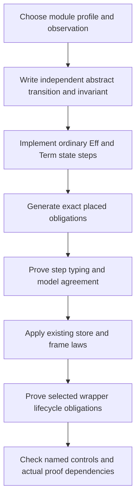

# Reusing Queue's proof structure across modules

Snapshot: `a02126a85051ab7ec0be0a3bd30471feb18fbdd3` in `/Users/pooks/Dev/lean4-effect4`.
Evidence: read-only source review. No Lean, build, generator, compiler, or runtime command runs in this review.
Scope: a reusable development procedure for Queue, Semaphore, Pool, and Cache. This report proposes no second program representation.

## Finding

A factory can generate declarations, exact obligations, and proofs that instantiate existing generic theorems. It cannot derive a module's intended behavior from its state fields.

The smallest useful common layer already largely exists. Keep each module's transition, invariant, profile, and observation explicit. Reuse the existing folds and store laws around them.

Queue and Semaphore justify the first shared interface. Pool and Cache justify keeping resource lifetime, retained behavior, ordering, and time outside that interface.

The full Semaphore, Pool, and Cache agreement contracts are not currently proved module instances. The source contains their planned consumers and pinned runtime behavior. Decisions row 234 reserves the retained-behavior contract; it does not supply it.

## What can be mechanical

| Work | Existing owner or law | What the instance must still supply |
| --- | --- | --- |
| Store the program and expose its syntax | `Eff`, `Term`, generated folds, ordinary authoring builders | The actual module implementation, using those carriers |
| Generate typing and scope obligations | Existing checker, generated scope laws, `ListFoldRules` | Exact signatures, environments, captures, and supported profile |
| Connect a list scan to a model fold | `reads_foldWith_model` in `Laws/Modules/Queue/Reading.lean` | The accumulator/item encodings and the body agreement proof |
| Run a typed state update | `refModify_typed_step` in `Laws/Program/Typed/ListFold.lean` | Typed captured environment, typed body, current cell membership, and actual cell lookup |
| Connect an authored step to one store operation | `step_updates` in `Laws/Modules/Queue/Steps.lean` | `Reads` for the exact reply and next state |
| Preserve an indexed cell invariant and frame other cells | `indexed_ref_step_preserves` in `Laws/Machine/RefKernel.lean` | `RefKernel.Keeps` for the selected cell, prior indexed invariants, and the successful step |
| Grow the typed world on allocation | `refMake_extension`, `deferredMake_extension` in `Laws/Program/Typed/World.lean` | The actual allocation equation and the incoming store assumptions |
| Prove allocation freshness | `refMake_fresh`, `deferredMake_fresh` in `Typed/ListFold.lean` | `CellsTyped` and the actual allocation equation; world growth alone is insufficient |
| Compose matching one-step representations | `Projects`, `projects_compose`, `projects_induces_refines` in `Laws/Machine/Refinement.lean` | Matching operation/answer carriers and every intermediate validity premise |
| Record remaining proof work | `proof_goal`, `#plan_status` in `tools/ProofGraph/Plan.lean` | A meaningful typed statement and its semantic placement |

These are conditional reusable proofs. Instantiating them can produce new kernel-checked theorems. Generating an unproved goal does not discharge it.

`Plan` derives goal, modulo, and proved status from actual proof dependencies. A factory must use that mechanism, not a second completion ledger.

## A minimal interface, only when Semaphore consumes it

Use an ordinary proof-side collection of parameters. Do not create a runtime module descriptor or another syntax language.

1. Name the abstract state, request, answer, and notification observation.
2. Supply the existing `TermSrc` or `Eff` implementation.
3. Supply the value encoding or relation, including world and handle declarations where needed.
4. Supply a typing theorem for the exact environment and state type.
5. Supply transition agreement for the pure step and preservation of its module invariant.
6. Apply the existing store connector and frame theorem.

An interface may package those fields in `Laws` after two consumers demonstrate the shared shape. Ordinary theorem parameters suffice before then.

The first consumers are Queue's state steps and Semaphore's permit/waiter steps. `Reads`, `reads_foldWith_model`, `step_updates`, and `step_keeps_cell` currently live under Queue but contain reusable structure.

Extract those helpers with unchanged statements when Semaphore uses them. Their existing Queue consumer must continue to use the extracted declarations. Do not extract unrelated Queue policy.

`reads_foldWith_model` currently assumes body agreement for every model accumulator and item. It also takes an item witness to obtain the elaborated body. Those premises must remain visible.

A future invariant-restricted variant may be useful when a second scan only admits reachable accumulators. That variant needs an initial invariant, step preservation, and an explicit elaboration witness. It is not already proved here.

The interface ends at one step. It does not silently include initialization, repeated execution, scheduler delivery, cancellation, or cleanup.

`Projects` and `Refines` compare one step with the same operation and answer carriers. They are not already the proposed stuttering module-expansion theorem.

## Where module-specific proofs remain

| Module | Reusable foundation | Irreducible contract choice and proof |
| --- | --- | --- |
| Queue | One-cell update, scan, handle identity, Deferred, membership | Capacity profile, message conservation, order, acceptance versus delivery, cancellation before and after commitment |
| Semaphore | Same update/scan/identity foundation; protected body uses mask and finalization | Permit accounting, waiter demand, selection order, resize policy, cancellation, exactly-once release for the chosen client discipline |
| Pool | Cell and ordered-work facts, Semaphore, Deferred, scope laws | Loan/reference counts, invalidation, item availability, acquisition failure, scope ownership, resource return, retained acquisition behavior |
| Cache | Map/list facts, ordered scans, Deferred, clock inputs | Entry identity, recency/eviction order, expiry boundary, concurrent lookup sharing, cancellation, failure caching, retained lookup behavior |

`Fits` says a value belongs to a type. It does not say that available permits plus outstanding loans equal capacity. A typed step can violate that equation.

`indexed_ref_step_preserves` frames all other cells. Its cell-local premise does not establish a cross-cell or cross-table conservation relation. That relation needs a separate proof.

A cell encoding containing handles needs declared handle types and message membership. An arbitrary model-to-value function is not a membership certificate.

All module implementations remain ordinary programs above `Program`. Runtime stored content remains first-order. Proof-side functions do not grant permission to store closures in `Eff` or `Ty`.

## Adversarial controls for the proposed factory

These are source-derived control designs, not newly executed tests.

**Typed but wrong conservation.** Change a successful Semaphore release to increment the permit count twice. The state may still have the same type. Typing must pass; the module accounting obligation must fail.

**Wrong queue discipline.** With one permit free, put a request for two permits before a request for one. The pinned Semaphore observer can reject the first and admit the second. A strict head-only FIFO model does not describe `releaseUnsafe`.

**Invalid invariant from an unrestricted API.** `Semaphore.resize` can lower capacity below the number already taken. A universal nonnegative-free-permits invariant then fails. State the supported resize/client discipline before generating the conservation goal.

**Wrong wake algebra.** Queue schedules service according to its pending state; Pool selects a counted batch. Replacing both by “wake all current waiters” changes observations. `transactions-and-clock.md` records these separate producer contracts.

**Commit erased by cancellation.** Cancel an offered Queue message after its accepting step commits, but before the caller receives its answer. Removing the message at that point violates the existing waiting contract. A notification is not the operation's commitment.

**Wrong map representation for eviction.** Insert `b`, then `a`, with capacity one. Cache's insertion-order eviction removes `b`. Evicting the lexically smallest canonical map key removes `a`. Keep order as explicit state if the map representation canonicalizes keys.

**Typed resource leak.** Let Pool acquisition succeed, then omit the scope finalizer. Types and single-cell transition agreement can remain unchanged. The resource-lifetime claim must fail.

**Insufficient fold premise.** Prove a scan body only for nonnegative counters, then instantiate a theorem quantified over all counters. The factory must retain the missing invariant restriction as an open obligation.

Positive controls should instantiate Queue unchanged and a small Semaphore profile. Each mutation must target a named property, not merely break parsing or typing.

## Proof placement

| Obligation | Existing concept and requirement | Consumer and limit |
| --- | --- | --- |
| State encoding membership and step typing | `store-typing`, R4; existing `fold-typed-atomic-update` placement | `step_keeps_cell`; no conservation or liveness |
| Hygienic authored scans and their evaluation | Existing fold/authoring laws; helper for module agreement | `reads_foldWith_model`; exact environment, body, and scan order |
| Cell invariant preservation and framing | `store-typing`, R4 | `indexed_ref_step_preserves`; indexed per-cell invariant, not arbitrary global conservation |
| Module transition/expansion agreement | `translation-simulation`, R10 | Existing open module `Agrees profile module expansion` requirement; exact profile and observation |
| Notification preservation and no registration gap | `reactive-scheduling`, R12; waiting obligation also serves R10/R11 | `waiting-request-obligation-preserved`, `wait-registration-no-gap`; notification debt is distinct from progress |
| Posted delivery agreement | `translation-simulation`, R10 | `posted-wake-profile-agrees`; owner, receiver/token, capture time, cancellation, and coalescing remain explicit |
| Protected resource release | `scope-lifetime-finalization`, R11 | `saved-mask-restoration` and module-specific cleanup obligations; count and identity need their own observations |
| Retained lookup/acquisition behavior | `residual-program-typing`, R7 | Reserved entry/capture/context/lifetime contract; row 234 leaves representation and evaluator work open |
| Expiry and scheduler-facing time | Existing explicit-input requirement, R13 | Cache/Pool clock consumer; include time decisions in the contract |

Names described as proposed in `foundation-contracts.md` or registry open parts remain proposed. This review does not promote them to proved claims.

## Recommended standard procedure

1. Freeze the supported operations, profile, ordering, identities, observation, and refusal/frontier behavior. Mark omitted operations explicitly.
2. Write the abstract transition independently of the generated implementation. Declare its invariant and initial-state requirements.
3. Build the implementation through existing authoring forms. Generate obligations from the exact fields and operations, with no `True` placeholders.
4. Prove the pure transition once. Reuse folds, typing, allocation, identity, and store connectors for the mechanical parts.
5. Prove only the wrapper obligations that the selected module reaches. Keep arrival, commitment, delivery, cleanup, and fairness separate.
6. Retain positive instances, property-specific mutations, narrow build/axiom results, and graph status in one receipt. The tools derive proof status.

The next useful factory experiment is Semaphore as the second consumer, with a deliberately bounded profile. It should delete duplicated connector proofs while leaving its permit and wake policy proofs visible.

Pool and Cache should shape the reserved interfaces now. They should not force an unneeded code-value representation before their first actual retained-behavior implementation.

## Why a broader factory would fail

A declaration of fields does not define resource ownership, policy, or temporal behavior. Shared field shapes can implement incompatible modules.

A generator that emits both an implementation and its copied model can prove agreement with the same mistake. Preserve an independently reviewed module contract and discriminating controls.

A successful closed checker certificate proves that instance. It does not prove a theorem quantified over arbitrary message types, worlds, environments, or captured terms.

A cell transition theorem does not establish wrapper progress. A delivered wake does not establish that the waiting request completes. A safety invariant does not supply fairness.

The useful output is therefore a repeatable proof packet with explicit open parts. The useful automation is applying shared, checked laws at those boundaries.
