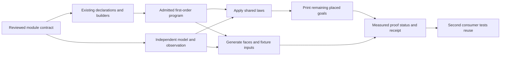

# A module factory after Queue

The owner asks for breadth and a repeatable production process. Queue is the first worked example, not the permanent centre of the backlog.

Role: advisory design review. Evidence: frozen-source inspection at `a02126a8` and eight finite Python design controls.

No Lean, compiler, runtime, build, generator or installation runs in this review. This review makes no active repository edits.

## Recommendation

Build a factory for composed modules from the current language, proof rules and reporting tools.

It should produce ordinary `Eff` programs, checked interfaces, placed obligations, proof instantiations and reproducible evidence.

Prepare Semaphore, Pool and Cache contracts now. Their distinct demands should shape the shared machinery before another large Queue extension.

Use Semaphore as the next implementation experiment when the coordinator supplies its prerequisites and slot.

Use Pool and Cache as concurrent design tests. Their resource and retained-work contracts must remain visible while the first implementation profile stays bounded.

The direction is already planned. The missing work is turning that direction into reusable connections and a repeatable procedure.

Do not restart the whole roadmap, finish every Queue obligation first, or create a second language for modules.

## Keep the earlier requirements on the same plan

The owner explicitly retains R1–R13 while accelerating mechanical module work. The factory is one contributor to that plan, not its replacement.

`Tools.Semantics.requirements` owns top declarations and unstated open parts. `Plan` owns measured proof status and dependencies.

The crosswalk below records relevance, not a new status ledger. Some authority prose still describes earlier face limitations; current landed declarations take precedence.

| Requirement | Factory contribution | Earlier work that must remain visible |
| --- | --- | --- |
| R1: application signatures | Carry the actual signature through generated construction and checking | Services through authoring, faces and sessions; service-code restrictions and structured carriers |
| R2: conservative extension | Show that generated additions preserve the existing admitted programs | Host-row meaning, protocol typing, world projection and per-form representation premises |
| R3: data | Reuse formation, canonical forms, membership and codecs for module state | Recursive types, residual tagged errors, numeric domains and missing data images |
| R4: typed state | Shared introduction rules, state membership, captures and atomic-update instances | Universal typing goals, target handle identity, saved-state membership and atomic isolation |
| R5: services and layers | State construction and invocation context in each module contract | Machine/layer-build agreement, context validation, Config and service identity |
| R6: host replies | Preserve independent host observations in the evidence path | Receipt versus application, retirement/cancellation, table-aware reference and lawful host relation |
| R7: retained behaviour | Pool acquisition and Cache lookup provide concrete consumers | Typed entry resolution, captures, invocation context and lifetime |
| R8: execution and generated faces | Reuse checked read/print laws and actual generated-target checks | Typed lowering, numeric limits, identity correspondence and general target agreement |
| R9: absence of language defects | Inherit the existing theorem only within its exact admitted fragment | Missing-service transport through saved frames; host and lowering scope exclusions |
| R10: composed-module behaviour | This is the factory's main integration claim | Module profiles, behaviour laws, public observation and private-step comparison |
| R11: resource release | Protected permits and Pool leases supply local consumers | Whole-run identity-counted release, close order and completed-cleanup evidence |
| R12: scheduling and frontiers | Parameterized registration, delivery and cancellation obligations | Retained driver continuation, frontier stability, divergence and separately governed liveness |
| R13: replay inputs | Bind generated evidence to actual programs, signatures, profiles and decisions | Load/environment/seed data, service inputs and clock-unit compatibility |

A completed Queue or Semaphore slice cannot close a whole requirement by association. A conditional instance retains every unmet premise.

Admission now supplies its lawfulness connection. Do not resurrect the historical `AdmissionGap` while retaining the genuinely open service and host connections.

Each integration receipt should show the existing R claims it advances, the goals it still depends on, and the older open parts it leaves untouched.

Review the complete R1–R13 view when choosing the next slice, including requirements with no current module consumer. Do not sort solely by easy generated goals.

Mechanical work and foundational proofs can occupy separate bounded slices. Existing parked work remains parked unless its actual authorization changes.

Use the current semantics report and registry for this accounting. Reconcile stale prose when its owning integration lands; do not create another backlog authority.

## What the factory can already do

Sum-of-products signatures describe constructors, fields and binder positions. Existing generators use those descriptions to produce structural code and scope laws.

`Effect4Gen.Authoring`, `Rows`, and `Forms` already generate authoring support, primitive wrappers and supported derived forms.

`Author.build` retains admission for the actual constructed program. The factory should keep that certificate instead of reconstructing an assertion elsewhere.

`proof_sketch` already applies a decomposition and prints its residual obligations. Each residual preserves its hypotheses and inherits semantic placement.

`proof_goal` keeps the original statement when its proof lands. `Plan` measures the resulting dependency status.

The existing generation graph owns outputs and freshness. The compiler and conformance tools own target diagnostics and finite execution evidence.

These owners provide the production infrastructure. Another registry, certificate layer or generic proof-status dashboard would duplicate it.

| Factory output | Mechanical part | Required semantic input |
| --- | --- | --- |
| State and interfaces | Record/type projections, fields, wrappers and supported read/print paths | Parameter domain, raw declaration, normalization and ownership |
| Scoped program | Existing minted builders and constructor-driven scope laws | Exact argument/capture environment and permitted operations |
| Typing evidence | Apply shared introduction rules or retain the exact checker certificate | Universal theorem versus concrete instance; actual signature and body |
| Atomic-step theorem | Apply existing evaluation, typed-update, allocation and frame laws | Model transition, encoding, cell invariant and successful step |
| Wrapper theorem | Assemble already-proved components and expose missing premises | Commit, wait, delivery, cancellation, context and cleanup contracts |
| Acceptance package | Select scenarios, emit inputs, run applicable checks and report dependencies | Independent expected observations and property-specific red controls |

Generating a goal is already feasible. Proving it mechanically requires a checked rule whose premises match the chosen module.

The factory cannot infer the intended behaviour from field names or an API name. That limitation does not prevent automation of the surrounding work.

## The important missing connections

### 1. Shared construction and typing rules

QTYPES is already addressing the repeated record, native-atom, fold and binder typing work. Preserve that seat's ownership.

The planned minted `performTermWith` and generated Ref helpers should serve the same consumers.

Reuse `Reads`, `reads_foldWith_model`, `step_updates`, and `step_keeps_cell` when Semaphore supplies the second actual consumer.

Move matching statements lower and migrate both callers. Do not copy Queue's entire policy into a generic module.

Generate canonical field views from one raw field declaration. Keep raw duplicates visible until admission refuses them.

The current scan connector quantifies over every model accumulator and item. Restricted reachable-state scans cannot silently instantiate that stronger premise.

A restricted connector may need an initial invariant, preservation and an explicit elaboration witness. Add it only when the second scan requires it.

### 2. A reusable connection from state steps to module behaviour

The existing atomic laws cover one update. Their generic content does not mention Queue policy.

`indexed_ref_step_preserves` already preserves indexed cell invariants and frames other cells. Reuse that law before designing another frame calculus.

`refMake_extension`, `refMake_fresh`, and their Deferred counterparts provide world extension and allocation connections with their actual premises.

Module composition still needs initialization, representation membership, owned identities and any cross-cell invariant.

`Fits` does not establish permit conservation or ownership. An arbitrary model encoder does not establish `Fits`.

The proposed Queue `cellVal_fits` connector supplies this missing membership premise for Queue. Semaphore and Pool need their own encoded-state instances.

Public module agreement also needs a named observation that can hide private bookkeeping while retaining required commitments and cleanup.

`StraightEq` already composes straight programs while observing complete stores. `Projects` already composes matching one-step representations.

Neither theorem automatically compares a scheduled public module with an expansion containing extra private cells and helper steps.

Therefore, propose the smallest public-observation connection used by both Queue and protected Semaphore operations. Keep scheduling and unfinished work explicit.

### 3. Waiting as parameterized policies

The common connection should separate posting, recipient selection, delivery, withdrawal and observation.

| Module | Selection and commitment that must remain explicit |
| --- | --- |
| Queue | Chosen strict order; consumption at the taker's step; ordered notifications; pre/post-commit cancellation |
| Semaphore | Native live waiter scan; eligibility rechecked against free permits; a later smaller request may proceed |
| Pool | Counted waiter selection inside the posted task, followed by delivery to that selected list |
| Cache | Shared lookup fiber, waiter counts, last-waiter cancellation and current-entry identity before stale cleanup |

One universal wake-all function cannot discharge these contracts. A reusable waiting proof can accept the relevant policy and require its laws.

Keep incoming mask restoration and cleanup placement as common foundations. Keep module enrollment and commitment with the module.

Notification preservation is safety. Delivery progress additionally needs the stated scheduling, receiver-progress and budget assumptions.

### 4. Resources and retained behaviour

Pool distinguishes a borrowed-resource return from destruction of the resource. A permit counter alone does not establish either lifetime.

Pool needs resource and lease identities, scope ownership, acquisition failure and finalization observations.

Cache needs shared lookup identity, replacement protection and an explicit order representation. Canonical sorted map keys do not implement recency.

Pool acquisition and Cache lookup also require construction/invocation context and lifetime contracts.

Row 234 reserves retained behaviour as a language obligation. Keep its entry, capture, context and lifetime connection in the breadth plan.

A fixed statically supplied entry can support an earlier restricted profile. It does not close the general stored-behaviour API.

Clock compatibility is necessary for timed profiles. Fixed-size and infinite-TTL profiles should not wait for unrelated elastic or timed features.

## Concrete next consumers

| Consumer | Useful first profile, proposed | What it teaches the factory | Deliberately separate work |
| --- | --- | --- | --- |
| Semaphore | Fixed limit, stated permit domain, acquisition/release and protected body | Reuse typed updates, waiting and cleanup with different selection | Resize, unrestricted over-release and general fairness |
| Pool | Fixed size, one borrower per item, typed acquisition entry, borrow/release/shutdown | Resource identity, scoped ownership and composition with permits | Elastic sizing, TTL and complete invalidation profile |
| Cache | String keys, finite capacity, fixed lookup entry, sharing/invalidation and recency | Keyed state, shared work, stale cleanup and ordered representation | General retained lookup values and timed expiry |

These profiles are research proposals. They are not new owner rulings or implementation dispatches.

Preparing their contracts need not wait for Queue batches, all generic typing proofs, or every target agreement theorem.

The coordinator still owns implementation sequence, available build slots and integration.

## What an obligation-producing pass should print

Select existing declarations and goals as inputs. Do not duplicate their facts in a separate handwritten semantic catalogue.

A small proof-side selection can name the implementation, model, profile, encoding, operations and existing claim pointers.

Generate exact theorem applications where laws already exist. Use approved `proof_sketch` decompositions for the remaining placed obligations.

The decomposition itself requires Lean checking in the owning implementation slot. No such decomposition is newly proved by this report.

| Proposed output | Concept and placement | Premises, observation and consumer | Immediate limit |
| --- | --- | --- | --- |
| Encoded state membership | `store-typing`, R4; helper for each module's public claim | World declarations, payload membership and actual encoder; feeds the typed update | Does not establish conservation, profile closure or ownership |
| Step typing and model connection | `store-typing` R4 and `translation-simulation` R10 | Exact body/signature/captures, profile and encoded input; reply, next cell and ordered notifications | Module supplies its model and body agreement |
| Invariant and frame instance | `store-typing`, R4; helper for module composition | Existing indexed invariant, local `Keeps`, actual step and allocated identities | Cross-cell conservation requires an explicit extra relation |
| Registration and notification connection | `reactive-scheduling`, R12; existing waiting obligations | Request identity, token, selected policy, incoming mask and outstanding work | Delivery is separate from commitment and progress |
| Protected permit law | `scope-lifetime-finalization`, R11; proposed `semaphore-protected-permit` | Successful acquisition, saved mask, full body exit and completed cleanup or retained frontier | Saved-mask connection is prerequisite; no whole-run liveness |
| Lease release law | `scope-lifetime-finalization`, R11; proposed `pool-lease-release` | Exact lease/resource identity, scope ownership and failure path | A resource return is not resource destruction |
| Current lookup and recency law | R4/R12, serving proposed `cache-expansion-agrees` R10 | Entry identity, waiter state, ordered keys and selected failure/expiry profile | No timed or general retained-entry result without its prerequisites |
| Public expansion agreement | `translation-simulation`, R10; module-specific profile | Initialization, representation, step laws and wrapper connections; named public observation | Private-step hiding and schedule relation are explicit premises |
| Checked faces and evidence | Existing R8 read/print and target claims | Readable domain, row/table premises, exact actual inputs and independent expected observations | Readback, compiler acceptance and finite execution remain distinct |

Residual goals must retain exact contexts. Unknown references, missing observations and unchosen policies must remain visible.

An instantiated theorem that depends on a planned goal remains modulo that goal. A passing finite type sample is not a universal certificate.

`proof_sketch` currently refuses universe-polymorphic statements. This does not prevent ordinary fixed-universe module parameters, but limits a blanket automation claim.

## The repeatable procedure

1. Record the module profile, observations, source version, ownership and semantic choices once.
2. Name the independent model, invariant, encoding and public goal before deriving helpers.
3. Construct one actual program with existing builders and retain its admission certificate.
4. Apply shared scope, typing, fold, store, allocation and frame laws.
5. Print missing obligations through the existing proof tools, with their premises and exclusions.
6. Generate interfaces and scenario inputs through the existing dependency graph.
7. Check positive controls and faults that distinguish the promised property from typing or compilation alone.
8. Keep exact inputs, outputs, proof dependencies, exclusions and future work in the normal receipt.
9. Extract common code when the second consumer demonstrates it; migrate callers and retire duplicate support.

This is also the answer to repeated confirmations. Reuse settled policies, derive routine evidence, and reserve owner questions for changed meaning, domain or representation.

The earlier compiler-client research belongs in this process: preserve source/config/version identity and compiler diagnostics at the existing target boundary.

Measure inferred calls as well as explicit generic instances. Their typing checks answer different questions.

Write rerun evidence to a fresh output directory. A filed baseline must not become a script's default output directory.

Fixture freshness is already active coordinator work. Review its eventual result; do not create a competing implementation.

## Checks performed

The detailed source maps are in [proof reuse](proofs/report.md), [generation](generation/report.md), and [future-module contracts](breadth/report.md).

Three independent source reviews cover proof reuse, generation and future-module contracts. Their detailed reports and source hashes are retained beside this report.

The parent compares every listed source hash against the frozen commit. `parent-verification.json` records the result.

Eight Python controls test three over-generalizations, with positive controls:

- Strict-head selection and eligible live scanning differ when an earlier request needs more permits.
- Canonical key order and insertion order can select different eviction victims.
- Two locally bounded objects can fail their independent composition observation if their private cells alias.

The alias case deliberately violates fresh allocation. It is not a reachable counterexample to the existing allocation laws.

These controls demonstrate required contract parameters. They are not Lean proofs, native executions or defects in current generated modules.

## Completion criteria for the first factory slice

The second module must use the shared construction and proof connections while preserving its different policy.

Its unresolved obligations must appear in the existing report without a second status ledger.

Its generated inputs must refresh through the existing build graph. Its deliberate faults must fail the particular properties they target.

Pool and Cache cards must identify any new resource, retained-entry or ordering prerequisite before a generic interface claims to cover them.

Success is less repeated construction and proof plumbing across modules. The number of generated goals alone is not a useful success measure.
