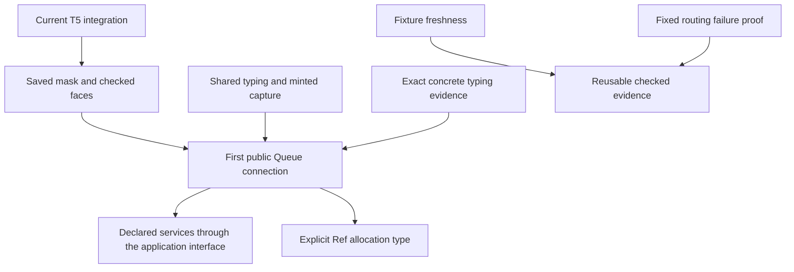

# Next work after the Queue steps

The existing plans cover the next useful work. Finish their connections and reduce repeated checking before adding another broad proof programme.

Role: advisory review. Evidence: source inspection, retained reports and eight finite Python mirror controls.
Scope: main `0e6077b6`; the active QTYPES brief is reviewed separately. No new Lean proof is claimed.

## Finish criteria and result

The review checks the actual proof inventory, compares existing plans, names consumers, and verifies every scout's source record.
Those checks are complete. The parent verifies 121 source comparisons across 89 distinct committed paths.
Two documented initial lookup mistakes remain visible; their corrected paths verify successfully.
The parent also snapshots the active QTYPES brief and checks eight bounded capture controls.

No repository edit, Lean command, compiler, runtime, generator, installation, branch change or implementation dispatch occurs.
The report does not accept the coordinator's active T5 integration or certify its build freshness.

## Recommended order

| Work | Existing status | Why it matters | Small completion boundary |
| --- | --- | --- | --- |
| Shared typing rules and minted caller capture | QSTEPS receipt; QTYPES brief now exists | Queue and later stateful modules reuse the same checker and binder rules | One symbolic withdrawal proof and one actual caller at an extended scope |
| Saved-mask boundary, then one public Queue connection | Existing mask brief and waiting contract | Connects committed state changes to real waiting, posted replies and cancellation | First Queue profile with exact commits, replies, pending notifications and interruption |
| Fixture freshness in the current build graph | Already proposed in DOGFOOD receipt; repeated by QSTEPS | Removes a manual re-elaboration step that can leave evidence stale | Fixture-only mutation forces fresh Lean expectations and the corresponding engine check |
| Infrastructure failures escape the routing handler | Existing placed scenario goal | Proves a useful handler composition on a contained script | Preserve the exact non-business failure payload at the existing fixed script and budgets |
| Declared service types through the application interface | Remaining application-signature steps 4, then 3 | Makes lower-level admitted service types usable through ordinary authoring and checked faces | Existing fresh-code Greeting example builds, prints, reads and starts with its declared carrier |
| Explicit Ref allocation type | Already scheduled after Queue | Supports empty or narrowly inferred initial values without artificial container workarounds | Empty typed collection, valid later write, incompatible write refusal, old declarations preserved |

QTYPES and the Queue prerequisites keep their existing owners. This table does not request another seat or change build scheduling.
The public example may use exact concrete typing evidence under the earlier recommendation. It must not claim the universal goals thereby proved.

## The algebra already exists

The tree has syntax-fold uniqueness, fold connections for evaluation and typing, weakening, typed list folds, and composition through handlers.
`StraightEq` already composes a nested rewrite through a bind and cleanup handler.
Its runtime theorem compares the exit and complete stores, using independent sufficient budgets.
Its existing fixture refuses exit-only comparison and programs outside its fragment.

Do not start another monad, category or traversal hierarchy for Queue.
Do not infer unrestricted raw-bind laws from the separate free-monad representation.
Automatic semantic transport through addressed replacement waits for a real transformation consumer.

The useful algebra work is smaller: introduction rules for existing checker equations, followed by existing Queue passes.
The active QTYPES brief already asks for that work and preserves the five frozen goal statements.
The review adds no competing typing plan.

## Two small connections worth keeping explicit

The QSTEPS receipt already requests capture evidence for caller identities made by `bindWith`.
`captured_var` handles author-written names; the generated caller names use `minted` instead.
Use the existing name-resolution and list-lookup laws, with distinctness from the fold's two new names.
Keep the helper local until another module consumes it.

The eight Python controls retain a same-type collision and an environment-sensitive source beside stable positives.
A source can produce a natural literal from its current environment length and change value when elaborated under more binders.
Scope and typing therefore do not alone establish stable capture. These are finite source mirrors, not Lean execution or a reachable wrapper run.
QTYPES already distinguishes weakening from re-elaboration; retain that distinction for its typed capture relation.

Fixture freshness is a second concrete improvement.
`QueueEngine.lean` and `Scenario/Lowered.lean` embed text with `include_str` and document a required fresh elaboration after fixture changes.
The Dune fixture dependency does not refresh the Lean expectation.
Both receipts already recognize this repeated manual work.
Connect these inputs through the existing generation/build ownership described in `docs/GENERATED.md`.
Do not create another stamp, report or certificate framework.

Proposed acceptance uses one unchanged positive and one fixture-only mutation.
The mutation must cause fresh expectations and a visible mismatch, without a person remembering an extra command.
This is evidence freshness for the existing R8/R10 comparisons, not a new semantic theorem or general compiler guarantee.

## The language backlog is narrower than old monitoring text suggests

The old `AdmissionGap` is closed. `lawfulSig_of_admitted` now projects checked signature admission without that premise.
`Built` already retains the exact program's admission certificate.
Do not create another certificate owner or keep reporting that historical gap as open.

The remaining application restriction is declared-service threading through checked faces, authoring and session creation.
Follow the existing step order: faces at the application signature before the ordinary authoring API accepts those declarations.
Keep flat carriers, fresh-code hypotheses and the existing row-table session wire format.
M7 still has its empty-table, closed-requirement and answer-free-tape scope.

Explicit `Ref.make<A>` is already a separate post-Queue slice.
Reuse generic allocation, world-extension and store-implementation proofs; do not invent a new store model.
The next stored-type constructor is also a good local consumer for an operation-view coherence check.
Admission's `ScopedOp` views should expose the term and types read by the signature's typing and printing views.
No current native mismatch was found. This is optional hardening with the constructor, not a separate framework or defect report.

## Which proof to take from the application examples

Prefer `Routing.infrastructure_escapes` as the first independent scenario proof.
It quantifies over payloads but fixes its script and budgets.
The existing catch-all mutant gives a direct wrong-result control.
The proof must use the actual nonempty host-row table and answer path.
An empty-table theorem or tag predicate alone cannot discharge it.

Workers cleanup and timeout stale-reply goals quantify over arbitrary scripts.
They need multi-step invariants, not another successful fixture or a local finalizer law.
Keep them planned while their required connections land.

## Keep the Queue boundary visible

The six step proofs compare cell updates, replies and ordered notification outputs.
The wrapper must retain each notification occurrence until delivery or discharge, including old hints after rearming.
Before-consumption cancellation and after-consumption interruption have different commitments.
Masking does not erase a committed consumption or guarantee caller continuation entry.

Use the existing request, identity-table, store, Deferred and scheduling definitions.
Place the concrete sufficient embedded-budget goal before proving it.
The existing R12 open part records that alternative; the standalone F7 name is not yet a registry claim.
The bound must cover reached receiver work, automatic yield and unfinished command drain, or state its admitted-client restriction.
No general fairness, starvation or full driver-resumption claim follows.

## Detailed proof maps

- [Algebra, capture and typing](algebra/review.md).
- [Language and service path](language/report.md).
- [Mask, public Queue and scenario goals](backlog/report.md).
- [Parent source verification](parent-verification.json).
- [Capture controls](capture-controls.json).
- [Active QTYPES brief snapshot](qtypes-brief-snapshot.md).

Each detailed map names the concept, claim or proposed placement, consumer, hypotheses, observation, exclusions and prerequisite.
Proposed Lean statements and acceptance controls remain uncompiled unless explicitly identified as existing retained evidence.
