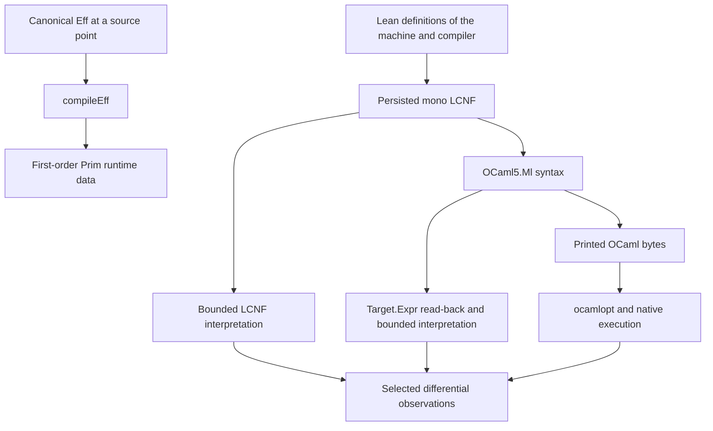
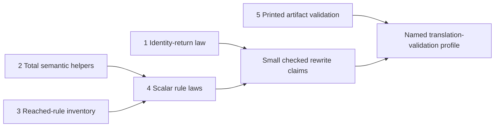

# Lowering proof scouting

Reviewed HEAD: `182312f30194f0beefa7a6273eb1144aa834c0f0`.
Evidence status: source inspection and finite Python controls.
Scope: existing declaration lowering and its OCaml checks.
No repository files changed. No Lean, OCaml, generator, installation or build ran.

## Recommendation

Use OCaml's standard library and compiler as implementation tools with explicit assumptions.
They do not automatically prove correspondence with Lean.
The existing route can gain small checked laws without starting a second machine or compiler.
Start with one existing rewrite and exact coverage of reached primitive contracts.
Prepare total semantic helpers alongside that work.

The UTF-8 precedent is useful but narrower than a verified compiler.
`docs/research/2026-10-02-ocaml-idioms/receipt.md` records a standard-library substitution and finite independent controls.
It explicitly claims no new Lean correctness theorem.
Its exact `let x = rhs in x` cleanup supplies a small first proof consumer.
The historical `lcnf-idioms` generator fixture and `scripts/test-generators.py` are absent from the current tree.
Reuse the current Conform compiler checkpoint and focused fixtures instead of dispatching those retired commands.

## The actual routes



`compileEff` does not supply the LCNF translator's input.
`translateClosure` reads declaration bodies through the persisted mono index.
`Translate.code` and its type translation remain metaprogramming with partial definitions.
The route has missing-name, cap-frontier, hole and clock-boundary checks.
Those checks are not a semantic simulation.

| Connection | Current evidence and remaining boundary |
| --- | --- |
| Lean definition to persisted mono | Pinned compiler input, structural checking and selected compiled-Lean comparisons. No compiler preservation theorem. |
| Mono to `Ml` syntax | Production translator, shared constructor table, checked refusal data and selected comparisons. No general translation theorem. |
| `Ml` syntax to `Target.Expr` | Constructor-refusing reader. It reads in-memory syntax, not printed text. |
| Target interpretation | Fuelled evaluator with explicit primitive meanings. Some called helpers remain partial. |
| Syntax to printed bytes | Real compiler checkpoint exercises selected emitted bytes. No general exact read-back theorem. |
| Bytes to native behavior | Pinned OCaml compiler/runtime and primitive contracts. Native typing alone establishes no Lean correspondence. |

`tools/Conform/README.md` describes the current compiler checkpoint.
`Conform.Effect4.Normalization.main` compares selected normalization and merge inputs through source interpretation, target interpretation and emitted OCaml.
`scripts/check-conform.py` compiles those bytes and requires an emitted UTF-8 mutation to fail semantically.
This standing checkpoint supersedes the dated claim that no compiler lane runs in `docs/core/lcnf-route.md` section 3.
It does not broaden the checkpoint to all machine declarations.

## Two concrete scouting findings

### Semantic helpers need a proof route

The headers in both semantic interpreters say their partial helpers are outside the semantics.
The following definitions contradict that narrow statement:

- `Target.evalArms` calls partial `matchPat` in `tools/Conform/Lcnf/SemanticsTarget.lean`.
- `Target.applyPrim` calls partial `asListV` for list operations.
- `Target.applyPrim` reaches partial `TValue.beq` through `structEq`.
- `Prim.apply` calls partial `Value.toList?` for list length and conversion in `tools/Conform/Lcnf/Semantics.lean`.

The outer fuel recursions do not provide kernel reduction equations for those partial helpers.
A theorem can mention the evaluators, but proof work needs total helper equations or explicit restricted assumptions.
This is a proof prerequisite and documentation correction, not a demonstrated execution failure.
Keep diagnostic rendering separate from semantic discrimination.

### The primitive contract inventory misses production names

`fidelityTableCovers` in `tools/Conform/Effect4/Lcnf.lean` checks listed names against `builtin?`.
It does not check the reverse inclusion.
`fidelity.json` is emitted from the listed table, so missing production names receive no row there.

A bounded source inventory finds thirteen absent production names:

- `Effect4.ClockMillis.ofNat`, `toNat`, `add`, `decLe`, `decLt`, `beq`, `toDecimal`, and `ofDecimal`.
- `Effect4.instDecidableEqClockMillis`.
- `UInt64.beq`, `UInt64.decEq`, `UInt64.toNat`, and `instDecidableEqUInt64`.

The control checks four existing names and detects a deliberately removed `Nat.add` row.
This source scanner is not a substitute for Lean reflection or a complete lexical parser.
The exact output is `primitive-inventory.json`.
It establishes an inventory gap, not incorrect clock or UInt64 implementations.

The smallest useful correction checks every reached primitive against an explicit contract or open entry.
A global builtin census can follow, but reached roots provide an immediate consumer.
Keep semantic fidelity, cost, evidence status and domain as separate fields.
For example, the current `.approximate` class combines Array complexity with numerical approximation.

## Ranked independent slices

All placements below are proposals under `translation-simulation`, serving R8.
Rows 28, 29 and 31 remain open. These slices do not silently ratify their wider architecture.
Row 108 governs numerical refusal. The current request authorizes scouting, not implementation dispatch.
The coordinator owns registry entries, root anchors and acceptance order.
`lakefile.toml` explicitly keeps Laws and Conform independent above the shared ProofGraph seam.
Do not make Laws import Conform merely to place these obligations.
Start in a Test contract fixture, which may import Conform and use `proof_goal` under the existing rule.
`Test/fixtures/ty-rule/CensusMirrorsConformLcnfSemantics.lean` provides an existing Test-to-Conform import precedent.
The coordinator must add the assigned Test module to its build and report roots.
The proposed registry claim remains `translation-simulation`, serving R8.
A later shared semantics module needs a coordinator-approved dependency design; none is required for the first fixture.

### 1. Prove the existing identity-continuation rewrite

Concept and required property: translation simulation; preserve the observed evaluator outcome under the exact rewrite.
Proposed claim: `ocaml-let-return-outcome`.
Consumer: `OCaml5.Lcnf.code`'s existing identity-continuation case.

Candidate statement, not Lean-checked here:

```lean
Target.evalT prog (n + 2) env (.letIn x e (.var x)) =
  Target.evalT prog (n + 1) env e
```

Hypotheses: the existing target language, environment lookup and evaluator definitions.
The statement retains any existing bindings of `x` and shadows them correctly.
It observes all modeled outcome constructors, including exceptions, refusals and exhausted fuel.
The budgets differ because removing a let removes a step.

Reusable ingredients: the `evalT` let and variable equations, `TEnv.find?`, and a case split on the right-hand outcome.
No induction over the full machine is needed.
The proof can treat the inner `evalT` result as opaque data.
It should not unfold `matchPat`, `TValue.beq`, `asListV`, or diagnostic rendering.
Slice 2 is therefore not a prerequisite for this law.
The owner must still obtain the exact theorem and axiom receipt; the candidate has not been elaborated here.
The source translator's metadata updates and dependency collection must remain unchanged.
An exact shape check must connect the emitted before/after terms to this law.

Exclusions: printed bytes, native OCaml semantics, the Lean compiler and all other rewrites.
It establishes no same-fuel claim or native cost claim.
Immediate prerequisite: freeze this statement and its representation-level rewrite relation.
Place its goal and eventual proof in `Test/Codegen/LoweringIdentityReturn.lean`, with coordinator-owned build and report anchors.
This keeps Conform out of the Laws import closure.
Do not modify `Translate.lean` or generated files during T3b ownership.

Finite preparation: twenty-four fragment cases pass with shifted fuel.
A same-fuel positive countercontrol distinguishes a literal from its one-let wrapper at fuel one.
The retained mirror is not a proof of the candidate statement.

### 2. Make the semantic helpers usable by the proof kernel

Concept and property: translation simulation; defined pattern matching, list decoding and data equality on finite syntax.
Proposed claim: `lowering-data-operations-defined`.
Consumers: `Target.evalArms`, list primitive interpretation and selected scalar proof reductions.

Use the existing `TValue`, `Value` and `Pat` representations.
Replace only proof-relevant partial helper definitions with explicit structural or well-founded recursion.
Do not introduce a second evaluator or a second program IR.
Keep diagnostic printing outside the equality observation where practical.

Hypotheses: finite values and patterns, named data-only equality domain, and unique admitted record fields.
Observations: list decoding result, exact pattern bindings and refusal, and data equality.
State malformed-shape refusal separately from native OCaml exceptions.
For closure values, preserve the current excluded equality domain explicitly.

Reusable ingredients: existing helper equations and `Target.TValue.ofList`.
Prove decode/encode reconstruction before proving list primitive correspondence.
For patterns, induct on the pattern and its child list.
`Conform.Layout.Laws` offers injectivity ingredients but is not already a theorem about `TValue` or production construction.

Exclusions: semantic preservation of all translation rules, compiler correctness and native equality on closures.
Immediate prerequisite: choose the smallest admitted helper domain and preserve current finite outputs.
Conflict-free paths: the two `tools/Conform/Lcnf/Semantics*.lean` modules and a focused Test contract fixture.
Do not move these tool semantics into Laws without a separate dependency decision.
The coordinator should confirm no current seat owns these tooling modules.

### 3. Join reached rules to contracts and independent controls

Concept and property: translation simulation; every admitted lowering assumption is named and covered.
Proposed claim: `lowering-rule-coverage`.
Consumers: `Conform.Effect4.Lcnf` receipts and the existing compiler checkpoint.
This is an evidence coverage property, not a semantic compiler theorem.

Use `walkClosure.primitives`, normalized wrapper names, and the translator's extern-use records.
Join each reached item to its domain, observation, primitive source, status and test or theorem.
Refuse duplicate, missing and unknown references.
Keep an open contract visible; never turn its absence into an exact default.

Hypotheses: frozen roots, complete persisted closure, pinned profile and fresh input manifest.
Observation: exact coverage of reached primitive identifiers and their evidence bindings.
Reusable ingredients: `fidelityTable`, `Report.required`, `ProofGraph.ProofRef.validate`, and `conform_report.validate`.
The existing `ProofRef` checks proposition, universes and transitive axioms.
It does not make a named primitive correct until a semantic theorem states that connection.

Exclusions: native execution equivalence or proof from a mutation count.
Immediate prerequisite: contract entries for the currently missing clock and UInt64 names.
Independent paths: `tools/Conform/Effect4/Lcnf.lean`, new `tools/Conform/Effect4/PrimitiveContracts.lean`, and focused fixtures.
Producer edits and generated artifacts wait until the coordinator releases the lowering lane.

### 4. Prove a small scalar fragment and connect real emitted expressions

Concept and property: translation simulation; each selected rewrite preserves a returned value under its domain.
Proposed claims: `lowering-nat-sub`, `lowering-nat-div-zero`, and `lowering-nat-mod-zero`.
Consumer: the corresponding `builtin?` rows and selected normalization or parser programs.

Start with subtraction, division and remainder on nonnegative representable inputs.
These have explicit zero behavior and require no choice between saturation and arbitrary precision.
State target word width, operand representation, output representation and sufficient fuel.
For addition or multiplication, also bound every relevant intermediate value.

Reusable ingredients: `Word.wrap`, `Word.fits`, `Prim.apply`, `Target.applyPrim` and the actual `applyBuiltin` expression.
Prove `wrap` is the identity within the signed interval first.
Prove the selected expression's result rather than only a renamed primitive's equation.
A total reader on this tiny emitted subset can bridge the actual AST to `Target.Expr`.
It must refuse unsupported expressions visibly.

Exclusions: out-of-range admission, saturation correctness, arbitrary target programs and native OCaml compiler correctness.
The native side remains a separately stated primitive/runtime assumption, checked with actual emitted boundary controls.
Immediate prerequisite: slice 2 for any helper reductions the selected expressions reach.
Paths: a new Test scalar contract fixture, focused Conform contract file and scalar fixtures.
A Laws consumer waits for an approved lower shared semantics seam, if one becomes necessary.
Defer edits to the production builtin table until T3b finishes.

### 5. Validate printed artifacts through the installed OCaml parser

Concept and property: translation simulation; the parser recovers the admitted emitted syntax modulo a named normalizer.
Proposed claim: `ocaml-emitted-image-validation`.
Consumer: the LCNF generator's exact output files and compiler checkpoint.

Use the pinned OCaml compiler's parser and type checker instead of writing a general OCaml parser.
Project its parsed tree into the existing emitted subset.
Refuse unknown constructs, duplicate bindings and unexplained layout changes.
Retain output hash, profile, primitive table, compiler version and source closure in the result.
Keep source locations and harmless formatting in a named normalization.

Hypotheses: the admitted emitted subset and exact pinned compiler-libs version.
Observation: normalized syntax and binding graph of the actual printed bytes.
Reusable ingredients: `Ml.Syntax`, constructor tables, current AST reader, strict reports and fresh-run artifact hashes.
Positive controls include nested shadowing, empty declarations and non-ASCII literals.
Negative controls change an operator, argument order, constructor tag or quoted byte.

Exclusions: a proof of OCaml's parser/compiler, native semantics and arbitrary source ingestion.
A parser/type check alone does not establish semantic equality.
A future proved checker can validate each translation without proving the partial translator implementation.
Immediate prerequisite: a fixed printed subset and compiler-libs availability in the existing switch.
No installation is authorized by this scout.
Possible isolated paths: a new `ocaml/tools/lcnf_check/` library and thin driver, plus compiler checkpoint integration.
Coordinate shared dune and script edits. No generated machine file needs hand editing.

## Order and acceptance



Slices 1 and 3 provide the fastest independent results.
Slice 2 prepares proofs without widening the runtime surface.
Slice 4 gives a small honest formal guarantee.
Slice 5 checks the currently separate printed-byte connection.

Record each goal before proving it, with its R8 placement and concrete consumer.
Keep these goals outside the application root.
Use actual dependency status for goal, modulo and proved.
Do not attach native agreement to an AST theorem through metadata alone.
Keep row 108's broader arithmetic admission open until its dedicated contract lands.
Keep array-carrier replacement and the complete engine refinement separate from these small slices.
