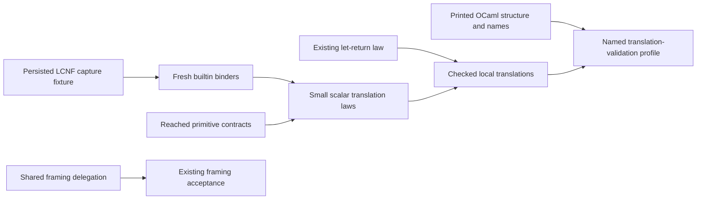

# OCaml and general lowering: independent work recommendations

Reviewed main: `182312f30194f0beefa7a6273eb1144aa834c0f0`.
Proof role: proposed obligations and implementation slices.
Evidence status: source review, primary literature, and finite isolated controls.
Scope: the existing LCNF route and OCaml framing; no new backend or program representation.

## Recommendation

Keep OCaml as the proving ground.
Combine its compiler checks with small Lean proofs that connect specific translations to their stated observations.
Use existing libraries where their contracts match, as the UTF-8 work does.
Do not equate native type checking with preservation of the Lean result.

Three dedicated scouts reviewed implementation, proof opportunities, and primary sources.
The parent rechecked the source findings and reran the framing, capture, inventory, and local-rewrite controls.
No active repository changed. No Lean, dune, generator, installation, or active build ran.

The current request authorizes scouting.
Implementation dispatch, shared files, generated outputs, and registry changes remain with the coordinator.
Rows 28 and 29 remain open; these recommendations do not ratify their broader architecture.

## First slices

| Priority | Slice | Practical result | Immediate prerequisite |
| --- | --- | --- | --- |
| 1 | Confirm and repair introduced-name capture | Builtin expansions cannot accidentally read their own temporary variable instead of an operand. | A persisted-LCNF fixture and ownership of `Translate.lean`. |
| 2 | Delegate engine framing to the existing shared library | One implementation owns framing; checked wrappers retain their public behavior. | Confirm ownership of the hand-written framing modules. |
| 3 | Prove the existing redundant-let rewrite | One production simplification gains a precise kernel-checked outcome law. | Place the goal and exact rewrite relation without reversing library dependencies. |
| 4 | Complete the reached-primitive contract inventory | Every reached lowering assumption has a contract or an explicit open entry. | Include the thirteen currently omitted production names. |
| 5 | Read back actual printed OCaml using its compiler | Check printed structure and resolved names against the intended syntax. | Freeze the printed subset and compiler-libs version. |

Slices 2 and 3 can form independent work after coordinator ownership checks.
Slice 1 has the highest correctness priority.
Slice 4 gives the next proofs a reliable list of assumptions.
Slice 5 extends the existing compiler checkpoint; it does not replace it.



## 1. Introduced-name capture

Source: `builtin?`, `applyBuiltin`, `preUsed`, `bindVar`, and `argExpr?` in `src/OCaml5/Lcnf/Translate.lean`.
`localName` in `src/OCaml5/Lcnf/Naming.lean` preserves the relevant simple names.

Several builtin expansions introduce fixed names without using the translator's freshness mechanism.
The reserved list includes the power helper names, but omits multiplication, shifting, list, and partial-application names.
The naming and argument path permits those names at the constructed translation input.

| Constructed input | Capturing expansion | Fresh-name control |
| --- | --- | --- |
| Multiply 3 by an operand named `_mula` holding 5 | 9 | 15 |
| Partially apply addition to `_b1` holding 3, then apply 5 | 10 | 8 |
| Shift `_shift_scale` holding 3 by 2 | 16 | 12 |

The installed OCaml interpreter reproduces these expansion witnesses.
They do not establish that a current generated engine run reaches the defect.
The next assigned seat should retain the smallest Lean source and its persisted LCNF before changing the translator.
Then allocate every introduced binder through a checked fresh-name mechanism.
Preserve evaluation count, order, partial application, and dependency collection.

Proposed placement: `translation-simulation`, R8's typed-lowering open part.
Required property: an admitted builtin expansion preserves operand denotations and avoids variable capture.
Consumer: `letValueExpr`, `translateDecl`, and the emitted API and engine closures.
Hypotheses: represented operands, supported arity, scalar domain, and freshness against free names.
Observation: result, exception, and relevant callback order.
Exclusions: source compiler correctness, arbitrary host callbacks, and whole-engine agreement.
Prerequisite: the persisted-input fixture and ordinary-name positive control.
Acceptance also checks alpha-renaming and actual emitted OCaml.

## 2. Shared framing

Source: `ocaml/engine/e4_be.ml`, `e4_be.mli`, `ocaml/eff/eff_frame.ml`, and `ocaml/engine/dune`.
The engine already depends on `effect4_eff`.
The interface's historical reason for duplicating framing no longer applies.
The dune comment says framing is forwarded, while the implementation still duplicates it.

Delegate matching operations first.
Keep the checked `read_be64` wrapper, negative-input exceptions, offset checks, and trailing-byte refusals.
The shared low-level reader assumes a valid window; its caller must establish that premise.
Standard-library big-endian operations are an optional second slice.
They still need range guards and high-bit refusal.

Proposed placement: `exact-codecs`, serving R8's canonical wire connection.
Required property: admitted host framing agrees with the Lean byte operation.
Consumer: `E4_program`, wire admission, CAS framing, and canonical hashing inputs.
Hypotheses: the recorded 63-bit host profile, bounded lengths, and valid read windows.
Observation: exact bytes, decoded value, next offset, or refusal.
Exclusions: arbitrary execution, compiler correctness, allocation failure, and new 32-bit portability.
Prerequisite: preserve the current wrapper contracts before delegation.

Reuse `be64_eq_shifts`, `natOfDigits_be64`, `be64_natOfDigits`, and `natOfDigits_natBytes` in `src/Effect4/Store/Carrier/Digits.lean`.
Reuse `framed_length` and `framed_inj` in `src/Effect4/Store/Carrier/Val.lean`.
Those laws do not themselves prove the OCaml library implementation.
Use existing `test_frame.ml` and `test_math.ml` for the assigned seat's native acceptance.
This slice needs no LCNF regeneration.

## 3. A first useful lowering proof

The UTF-8-era cleanup already removes exactly `let x = rhs in x`.
Its target-language candidate law is:

```lean
Target.evalT prog (n + 2) env (.letIn x e (.var x)) =
  Target.evalT prog (n + 1) env e
```

This is proposed, not elaborated or proved during this scouting pass.
The fuel shift matters; the same-fuel statement already fails on a literal at fuel one.
The proof should split on the inner result and use the let and variable equations.
It can leave the inner evaluation opaque.
It therefore does not require a broad rewrite of the evaluator first.

Proposed placement: `translation-simulation`, R8; proposed claim `ocaml-let-return-outcome`.
Required property: the exact rewrite preserves all modeled outcome constructors under the related budgets.
Consumer: the existing identity-continuation case of `OCaml5.Lcnf.code`.
Hypotheses: the displayed evaluator and lookup definitions, with arbitrary existing bindings of `x`.
Observation: target value, exception, refusal, or fuel frontier.
Exclusions: printed bytes, native runtime cost, host state, and all other translation rules.
Prerequisite: place the exact rewrite relation and connect it to the actual emitted expressions.

Start with a placed Test fixture if it imports Conform tooling.
Do not make `Effect4.Laws` import Conform merely to host this theorem.
`lakefile.toml` keeps their dependency direction separate.
A later shared semantic seam requires its own bounded design; it is not a prerequisite for this first fixture.
Use `proof_goal`, the registry, `#plan_status`, and the axiom audit to track the actual proof dependency.

Broader proofs need total equations for the semantic helpers they unfold.
`matchPat`, `asListV`, and `TValue.beq` participate in evaluation despite the header's contrary claim.
Totalize only the helper needed by the next proof.
Keep diagnostics separate from semantic discrimination.

## 4. Complete the contract inventory

Source: `fidelityTable` and `fidelityTableCovers` in `tools/Conform/Effect4/Lcnf.lean`.
The check validates listed names against the builtin table, but not the reverse inclusion.
The bounded source inventory finds thirteen omitted names: nine clock names and four UInt64 names.
This is a coverage gap, not evidence those implementations compute wrong answers.

Proposed placement: `translation-simulation`, R8; proposed evidence property `lowering-rule-coverage`.
Consumer: the closure receipt and existing Conform compiler checkpoint.
Required property: every reached primitive or extern has an explicit domain, observation, status, and evidence binding.
Hypotheses: fixed roots, a complete persisted closure, a pinned profile, and a fresh manifest.
Observation: coverage of reached names, including visible open entries.
Exclusions: proof of primitive meaning or whole-compiler correctness from inventory counts.
Prerequisite: add the missing entries and retain duplicate, unknown, and missing-reference controls.

Reuse `walkClosure.primitives`, extern-use records, `Report.required`, and `ProofRef.validate`.
Keep cost, semantic agreement, proof status, and domain separate.
Do not turn an absent entry into an exact default.

## 5. Reuse the compiler without overstating its guarantee

Conform already compiles and executes selected printed OCaml, including a semantic UTF-8 mutation control.
The current path is `Normalization.main`, `CompilerControls.hostChecks`, and `step_compiler` in `scripts/check-conform.py`.
The historical `lcnf-idioms` harness is removed; do not restore it merely for this work.

The addition is structural readback of the actual output, followed by resolved-name checks.
Use the pinned OCaml parser and typechecker; project their accepted subset into the existing target syntax.
The installed compiler-libs exposes typed paths and source/import metadata.
Fresh parsing and typing is the simplest initial provenance rule.
An arbitrary CMT file is not a certificate; stale digests and partial typing must be refused.

Proposed placement: `exact-codecs` and R8's target-syntax-to-bytes connection.
Required property: parsed bytes recover the intended binding structure modulo a named normalization.
Consumer: generated API/engine acceptance and the existing compiler checkpoint.
Hypotheses: exact bytes, fixed compiler version, imports, flags, and supported syntax.
Observation: literals, binders, argument order, constructors, and resolved primitive paths.
Exclusions: proof of OCaml's parser/backend, native semantics, and arbitrary source ingestion.
Prerequisite: enumerate the emitted subset before writing the adapter.
Retain wrong-parenthesis, escaping, shadowed-name, constructor-layout, and stale-artifact controls.

The longer-term technique is a small proved validator for each supported transformation.
Its acceptance theorem establishes the selected semantic relation; the translator itself can remain untrusted.
This follows [Tristan and Leroy's verified-validator method](https://xavierleroy.org/publi/validation-scheduling.pdf).
Exceptions and operation-definedness remain part of the relation.

OCaml leaves argument and record-field evaluation order unspecified.
Preserve explicit LCNF sequencing unless purity or order independence is established.
Source: [OCaml expression semantics](https://ocaml.org/manual/5.1/expr.html).

## Later, bounded follow-ups

Reuse the existing `E4_nat.pow` fixed-point algorithm in emitted code after binder hygiene is established.
Prove its saturated recurrence law separately from exact natural-number agreement.
The million-exponent control returns the same answer in both versions; no stack-overflow defect was observed.

Retain DI-56's chosen exact-within-profile contract and row 108's pending implementation choices.
Do not introduce saturation as exact Lean arithmetic or install Zarith without a consumer and ruling.
Use `Int64` for future exact bit-pattern consumers with checked narrowing and unsigned comparisons.
Ordinary OCaml integer arithmetic can overflow without a type error. [Stdlib reference](https://ocaml.org/manual/5.1/api/Stdlib.html).

Keep the local carrier fixed-point limit visible for later inspection.
`translateDecl` stops after sixteen rounds without the outer inference loop's explicit exhaustion failure.
This is a source-level concern; no reachable incomplete-inference witness was established here.

Do not start a full compiler simulation, alternate effect-handler runtime, or external prover migration now.
CFML, Cameleer, and CakeML provide useful methods, but none certifies this existing route automatically.
The primary-source details and boundaries are in `references/recommendations.md`.

## Evidence and ownership

The installed OCaml 5.1.1 interpreter passes 9,757 assertions on the retained script, including framing and capture controls.
The parent rerun reproduces that output with 63-bit integers.
The Python mirror passes twenty-four related-fuel cases and retains the same-fuel countercontrol.
The inventory check retains four existing-name controls and a missing-`Nat.add` mutant.
None is a Lean proof or whole-runtime claim.

Main remains clean at the reviewed head before advisory delivery.
T3b reaches `1ff9a94a` in its seat; the source worktree is clean at the observed snapshot.
M0 remains active in `/Users/pooks/Dev/lean4-effect4-m0`.
The coordinator must verify T3b's receipt and base before assigning overlapping lowering work.
Respect the existing two-seat limit; this scout creates no implementation seat.

Detailed notes: `ocaml/recommendations.md`, `proof/review.md`, and `references/recommendations.md`.
Receipts retain exact commands, outputs, versions, hashes, positive controls, and exclusions.
Primary papers were read through the web tool; failed sandbox PDF downloads are recorded without claiming local copies.
