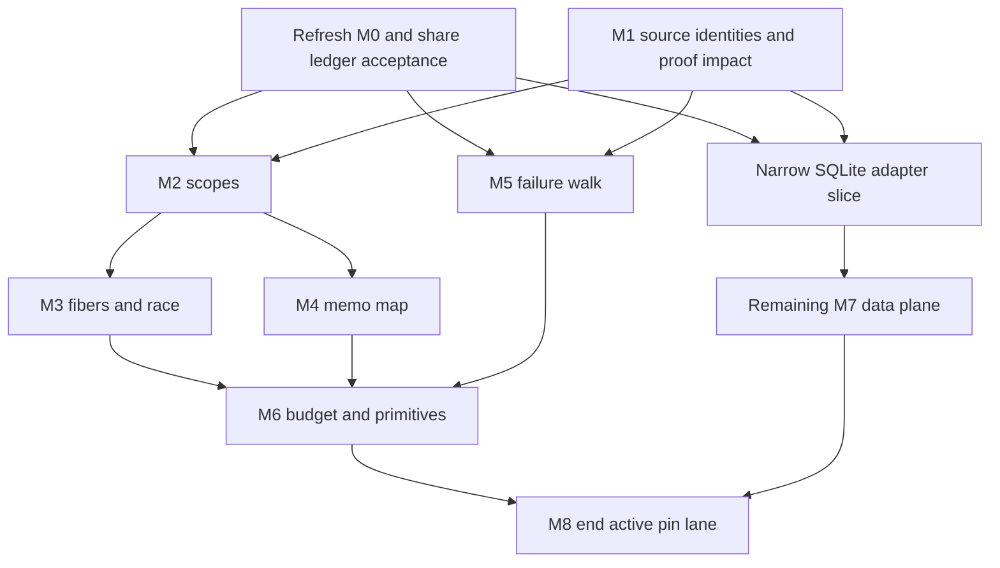

# Migration mechanics review

Status: recommendation. Evidence: source reading and seven isolated Python validator controls. Reviewed main: `da41297b95f21b7cfef08b4cb54edf5bf7d8c8b1`.

## Recommendation

Accept F2 option B: migrate one semantic area in place, with an explicit contract for each changed area.
The owner has accepted incremental migration and its mechanics in principle. Recording that instruction must not become another approval round.
Do not require whole-runtime agreement with 4.0.1 before unrelated API, proof, or lowering work continues.
Keep one semantic implementation. A temporary old/new definition and connecting proof inside one slice can still support a safe cutover.
That local technique does not require duplicating the entire machine until M8.

## Necessary mechanics

The first semantic slice needs one acceptance rule shared by the two truth lanes.
M0 already provides `truth_ledger.judge`, which compares each build and observation separately.
The pinned `run-truth.ts` still refuses every disagreement except its exact U-01 case.
`scripts/check-truth.py` also requires exactly that signed case. This is M0's documented open obligation, not a newly discovered defect.

Separate collecting host observations from accepting them. Reuse the existing ledger judge for both builds, including pinned-only observations.
Retain the exact U-01 counterexample as evidence. Do not replace it with a blanket exception for interruption or failure.
Preserve refusal for failed compilation, missing results, changed differences, malformed ledgers, and stale manifests.
The seven controls here confirm the existing judge supports this reuse and refuses changes in an unrelated observation.
These controls do not run either runtime or establish agreement.

M0's post-T3b refresh already landed. The 20:07 integration review checked 74 byte and digest comparisons at `cfb70462`.
That receipt confirms the current corpus and selected module hashes match the retained post-merge run.
Do not repeat the T3b refresh. The coordinator owns the next refresh and promotion after FOLD.
A changed expected result needs its semantic explanation and owning slice. Promotion must not silently bless an unexplained difference.

M1 should precede changes to machine semantics. Its build identity must reach the census witness join, not only the report header.
`Test.Audit.RuntimeCoverage.Row` currently has no build field. The generator still selects rc.112 globally.
Preserve stable behavior identifiers and associate each source contract with its exact build and source digest.
One theorem may support both contracts when its statement and definition genuinely supply both required properties.
Equal source bytes are useful evidence; they do not themselves prove context-sensitive whole-program agreement.

## Mixed-version observations

During migration, name the machine revision separately from each host build.
A machine containing release scopes and pinned scheduling is not automatically a complete 4.0.1 model.
Record exit, compared schedule, and synchronous exit independently, as M0 already does.
A known schedule difference must not excuse a changed exit. `not-run` must remain distinct from disagreement or agreement.
A program combining migrated and unmigrated features may agree with neither build on one observation.
Allow that only as a precise, owned, explained expectation. Do not require a false whole-program build label.

Keep rule-local source contracts and per-module agreement profiles alongside the finite ledger.
Native Queue calls already need a narrower profile than the accepted expanded Queue contract.
Migration must not erase accepted Queue, refSet, deferredPoll, or Scope.close differences merely to make a release comparison green.

## Proof impact and preserved witnesses

Reuse `ProofGraph.reachedAxiomsMany` for the syntactic impact query already proposed in F2.
Use changed declarations as stop leaves. Query registry witnesses, requirement tops, placed goals, and census witnesses.
Validate every requested root and changed declaration before the walk; its underlying lookup treats missing declarations as empty dependencies.
Use a fresh memo for every environment and stop set. Report budget exhaustion visibly.

The query answers which proofs depend on a change. It does not show that a changed definition preserves its former meaning.
For each affected claim, keep or amend the exact proposition, hypotheses, observation, and fragment explicitly.
Retain goal/modulo/proved status and axiom coverage from actual dependencies. Placement metadata is not dependency evidence.

An old pin witness remains evidence about its original definition and revision.
After replacing that definition, a theorem with the same name may instead prove the new statement.
Keep the old commit, source citation, statement, and receipt addressable. Do not relabel old evidence as release evidence.
Unchanged, source-independent invariants can remain useful without maintaining a second runtime implementation.

## Implementation order

This preserves F3's substantive dependencies without imposing a single serial queue on independent work.
Run migration work beside the authorized foundation sequence: fold, T5 binder-term faces, mask, then the first Queue path.
Keep the two-seat limit and existing file ownership.
Replace F4's absolute no-wait claim with a dependency rule: independent slices proceed; consumers of changed semantics wait for their named prerequisite.
Budget-sensitive claims must name the relevant runtime's charging behavior until M6 establishes the selected contract.
Do not delay API work for unrelated release differences. Investigate an unexpected difference before changing its ledger expectation.

## SQLite: a narrow complete slice

`Packages.sqliteBun` currently types `sqliteOpen` with error `never`.
`Sql.open` mints a scope and returns the handle after `SqliteClient.make`; it does not project a typed opening error.
The installed 4.0.1 driver types `make` with `SqlError` and catches database-opening and configuration failures.
The existing row is therefore the pinned contract, not the complete release adapter contract.

Adopt the release's typed opening failure in a named SQLite slice. Reuse the established SQL error projection if its admitted shape remains correct.
Connect the row error column, printed annotation, host projection, recorded reply, and replay admission.
Keep `Die`, interruption, and typed failure distinct; do not discard the error to preserve an obsolete `never` annotation.
Check the existing projection's documented omissions against the release reason structure and row120's policy.

Include successful opening as a control, plus opening failure and failure after connection acquisition.
The release driver registers a close finalizer before configuration finishes.
The adapter must specify who closes its minted scope when construction fails before returning a handle.
This is a required cleanup contract, not a measured leak finding.
Observe handle creation, failure payload, finalizer execution, and subsequent caller behavior separately.
Do not infer whole-run resource release from the local cleanup control.

This slice can precede the remainder of M7 if it enables useful release observations without overlapping active owners.
It need not wait for unrelated Schema or Config changes. The SQL type-check failures remain explicit until the slice lands.
The coordinator reports four failing modules under tsgo 7; `pSqlOrDie` passes. This monitor did not rerun that check.
No download approval remains: row250 authorized the installed tracked release recipe.

## Decisions and document maintenance

Already answered: incremental migration, continued development, forked Scope.close returning void, the release-driver install, and the foundation sequence.
The direct owner acceptance settles F2 mechanics in principle. The coordinator should record that acceptance rather than ask it again.
The remaining explicit owner choice is retaining the pinned vendor after M8. Recommend retaining its historical evidence until all citations have a durable home.
That choice can wait; ending an active test lane need not delete its source evidence.
A new source conflict with a ratified API or failure contract would need a separate ruling when demonstrated.
There is no such new owner decision established by this review.

Small corrections avoid repeated clarification:
- Update STATE's claim that no tracked recipe installs the release; `ts/release/package.json` now exists.
- Mark the migration header, F2 driver group, F3 M0, F4 M0, and F6 historical requests as superseded by their recorded answers.
- Replace the limits statement that the release driver was unread; F7 now reads both driver sources.
- Describe M8 as one host-build group with separate observations, rather than one undifferentiated column.
- State that source reading, finite comparisons, and Lean proof status establish different things.

## Boundaries

No repository file changed. No build, generator, compiler, host runtime, installation, download, or UI action ran.
The review does not prove migration preservation or runtime agreement. It identifies contracts and prerequisites for the next slices.
