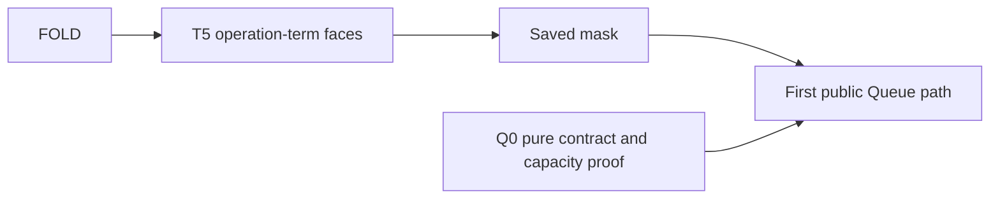

# Open questions, dogfooding and Queue preparation

Evidence: source review, existing receipts, seven isolated validator controls, and current Claude UI.
Status: recommendations and preparation. No monitor Lean build or runtime comparison ran.
Reviewed main: `da41297b`; the coordinator now edits row 253 and the build ledger.
FOLD and LOWER remain active. Their unfinished edits are not accepted landings.

## Decisions

The owner accepts incremental migration mechanics and prioritizes coherent APIs, semantics and proof infrastructure.
The migration follows feature needs. It does not impose whole-release agreement on unrelated implementation.
Row 253 records this direction in the coordinator's current edits.
Codex corrected the spoken phrase before the coordinator recorded any new SQLite divergence.
A deferred release case stays `not-run` with its reason. Failed compilation does not establish runtime disagreement or agreement.

The existing foundation order remains FOLD, T5 operation-term faces, mask, then the first Queue path.
Scope.close returning void, the release-driver install and LOWER's scope are already answered.
No repeated owner approval is needed for those choices.

When SQLite needs the release, recommend one complete adapter slice with typed opening failure and its cleanup contract.
Connect the row, printed type, error projection, recorded reply and replay admission in that slice.
Do not discard an opening error merely to retain the old never annotation.
The coordinator reports four SQL type-check failures and one passing module, pSqlOrDie. This monitor did not rerun tsgo.

The migration packet explains shared acceptance, build identity, proof impact and old-witness retention.
The post-T3b refresh is complete. The coordinator owns promotion and the next refresh after FOLD.

## Fold proof reuse

The current fold edits use the intended existing proof paths.
The decoded-key result follows raw handle containment through Val.keys_subset_of_handles, without another list induction.
The generic fold invariant helper supports raw containment and both typing judgments.
Progress uses a separate helper because it must establish that each step answers.
The existing termMaps_of_typed connector retains captured environments and later-world transport for atomic updates.
Ref and Deferred inversions move unchanged into membership, avoiding a backward import and copied proofs.

Keep those routes during final acceptance. Review the actual propositions, dependencies and axioms in the seat receipt.
Do not create another Queue-specific fold typing proof or collapse preservation and progress into one claim.
These conclusions inspect active source; they do not certify the final landing.

## Dogfooding priorities

The applications already exercise meaningful combinations, including failure, cleanup, atomic state, handlers and keyed host replies.
The worker example currently sends all five jobs through one worker. Its queue remains implemented by host rows.
The cache example exercises retry and timeout, without shared cache misses or expiry.
Their names therefore cover more behavior than their admitted programs.

Extend existing consumers in this order:

1. Run two workers with two pending replies. Deliver and apply replies in different orders, then cancel one worker.
2. Check exact handler routing. Unauthorized calls must skip the repository; infrastructure failures must escape the business handler.
3. Combine atomic state, failure and cleanup. Observe the whole record and cleanup identities, not only the returned answer.
4. Exercise replies before and after timeout, including receipt before timeout followed by application afterward.

Use positive cases and deliberate defects for each scenario.
Reuse Run, Rows, HostSession, the existing journal, StraightEq and generic store preservation.
A small shared scenario driver should expose keyed receipt and application separately.
It must not introduce another scheduler or program representation.
Keep receipt commutation separate from execution commutation: applying two replies can change shared state in different orders.

The dogfood packet gives each proposed obligation its concept, placement, consumer, hypotheses, observation, exclusions and prerequisite.
Host application typing, retirement and AdmissionGap remain explicit open boundaries.

## Queue preparation and ownership

Codex prepares Q0: the existing pure Queue transition specification, retained small controls and the first general capacity-proof route.
This preparation touches scratch files only while FOLD and LOWER hold the implementation seats.
No third build or active repository edit starts.

The proposed integration paths are Test/contracts/queue.contract.md and Test/Program/QueueModel.lean, QueueContract.lean and QueueCapacity.lean.
The coordinator owns the Test/All import anchor, registry integration and the later isolated base and build slot.
The model definitions must retain their exact bodies. The large exploration stays outside default imports.
Any uncompiled proof candidate remains labelled and excluded from a checked integration claim.

The first proposed property bounds the buffer after every abstract step under a positive fixed capacity and suspend strategy.
Its immediate helper bounds acceptLoop by initial buffer length plus finite room.
It serves R10 queue-expansion-agrees, with the production encoding and atomic-step connector still owed.
It establishes neither notification delivery nor cancellation, FIFO progress, host agreement or fairness.

The public Queue path uses one atomic Ref.modify and one posted helper per signal occurrence.
Keep the saved-mask, request identity, current hint and terminal-answer obligations separate.
The Queue packet states their existing claim placements and exact prerequisites.

## Packets

- [Migration review](migration/review.md)
- [Dogfood review](dogfood/review.md)
- [Queue scope and fold reuse review](queue/review.md)
- Queue source preparation: queue/package/; the receipt labels checked extraction separately from uncompiled Lean candidates.
