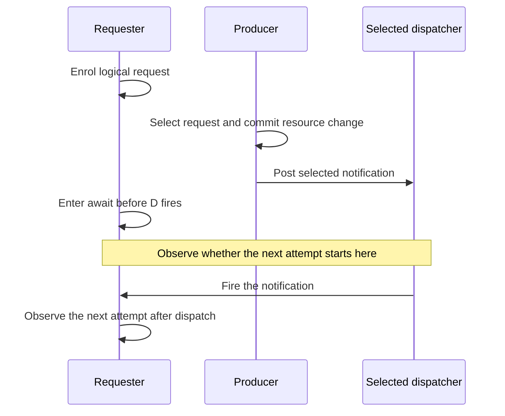

# Design W: the completion-before-await control

The completion time and the delivery time need separate observations.
Scheduling existing waiters does not delay a later await of an already completed Deferred.
This is a source fact, not a defect in an unpublished design.

Status: read-only support audit.
Base: `5ebacecc8631b9897652a86f67b7f1d3097dcffc`.
No new W design note appears among the coordinator's current research files.
No build, generator, installation, or runtime probe runs in this audit.

## Question

Does completing a Deferred now, then scheduling its owed resumes, have the same timing as scheduling the completion itself?
What must the forthcoming wrapper prove before either implementation satisfies its Queue profile?

## What was read

- Decisions rows 220 to 227 in `/Users/pooks/Dev/lean4-effect4/docs/core/decisions.md`.
- F2 and F3 in `/Users/pooks/Dev/lean4-effect4/docs/research/2026-10-05-claude-lead/foundation-contracts.md`.
- `DeferredStore.complete`, `DeferredStore.register`, `DeferredStore.poll`, `DeferredStore.isDone`, and `deferredStore_register_done` in `/Users/pooks/Dev/lean4-effect4/src/Effect4/Machine/Stores.lean`.
- `evaluatePrim`, `drainOwed`, `Task`, `taskCmds`, `postTask`, and `fireState` in `/Users/pooks/Dev/lean4-effect4/src/Effect4/Machine/Fibers.lean`.
- `_await` and `doneUnsafe` in `/Users/pooks/Dev/lean4-effect4/vendor/effect-4.0.0-rc.112/src/Deferred.ts`.
- `scheduleReleaseTaker` and `releaseTakers` in `/Users/pooks/Dev/lean4-effect4/vendor/effect-4.0.0-rc.112/src/Queue.ts`.
- The existing `postedWake` results in `/private/tmp/codex-effect4-overnight-monitor/2026-10-05-deferred-latch-probes/runtime/results.json`.

## Findings

### Verified support fact: the done path does not consult scheduled delivery

`DeferredStore.register` returns the stored completion immediately when the cell is done.
It adds no waiter in that case.
`deferredStore_register_done` states this equation in the current tree.
`evaluatePrim` uses that answer as the current code and returns `Outcome.continue_`.
It neither parks the receiver nor requires a dispatcher task.
The pinned `_await` invokes `resume(self.effect)` through the corresponding completed-cell branch.

`DeferredStore.complete` currently stores the completion and owes every existing waiter an inline resume.
There is no scheduled-completion variant in that declaration.
`drainOwed` already supports `WakeMode.scheduled owner priority` for an owed resume.
That mode changes delivery of an existing debt, not the completed-cell branch of a later registration.

Therefore these candidate meanings differ before dispatch:

| Candidate | Completed slot before dispatch | Await starting after the signal | Existing parked waiter |
| --- | --- | --- | --- |
| Commit completion now; schedule its owed resumes | Present | Continues immediately through the done branch | Waits for scheduled delivery |
| Schedule an `Eff` body that completes the Deferred | Absent until the body runs | Registers and parks, absent another completion | Waits until that body completes it |

These are conditional consequences of the proposed operations.
The first candidate is not an existing public Deferred operation.
The table assumes sufficient work budget, no cancellation, and no second completion.
It does not claim that a private helper's completion slot belongs to the Queue's public observation.

### Acceptance control: sharpen the existing notification-before-await case

Use a manually stepped dispatcher with automatic yielding excluded from the observed segment.
Record request enrolment, notification selection, Deferred completion, dispatcher entry, and the next attempt separately.

For a Queue profile that requires this next attempt to follow dispatch, assert its absence before `fire`.
Then assert one accepted notification and one next attempt after `fire`.
Keep cancellation absent in this first control, so a stale token cannot hide early delivery.

Use two positive controls:

1. Park the receiver before notifying it. Both candidates must retain and deliver its notification.
2. Store a completion in an ordinary Deferred before awaiting it. The await must continue inline, as row 220 requires.

If the wrapper permits no transition between enrolment and await, prove that exclusion instead of constructing an unreachable machine state.
If the interval is reachable, its delivery phase must enforce the selected timing.
Scheduling the completion itself is another candidate; it still needs its own cancellation and lifetime contract.
This audit does not choose between those designs.

The scenario already exists in row 221 and F3 of `foundation-contracts.md`.
The previous statement checks notification-before-await, but does not specify dispatch-relative entry of the next attempt.
The new contribution is that timing assertion and the exact declaration that can bypass it.
It needs no new general obligation or repeated runtime probe before W supplies a concrete proposal.

### Existing obligations that consume the control

| Existing obligation | Placement and consumer | Premises and observation | Exclusions and immediate prerequisite |
| --- | --- | --- | --- |
| `posted-wake-profile-agrees` | `translation-simulation`, R10; the Queue's first posted producer and `TaskMeans` | The selected dispatcher, admitted wrapper, sufficient budget, and fixed decisions; compare next-attempt order around dispatch | Not arbitrary callback equivalence or public visibility of private cells; W must name the completion event and delivery event |
| `wait-registration-no-gap` | `reactive-scheduling`, R12; the waiting wrapper and Queue quiet-state law | The wrapper's actual transition relation; prove notification retention or prove the tested interval unreachable | Notification retention alone does not establish delivery timing; W must define enrolment and await entry |
| `waiting-request-obligation-preserved` | `reactive-scheduling`, R11, serving R10 and R12; wrapper delivery | Request identity, await token, and notification phase remain distinct; track debt until the receiver accepts it | Not progress without scheduling and budget premises; W must expose the phase transitions |

These names remain proposals in `foundation-contracts.md`; this receipt installs no goal.
Each implementation slice supplies its statement, registry claim, and consumer under the existing placement rules.

## Watchpoints already under discussion

These are not new discoveries or reasons to reject W before it exists.

- `scopedAlgebra.action_fork` retains the lexical level in `/Users/pooks/Dev/lean4-effect4/src/Effect4/Program/Scoped.lean`.
  `actionAt` retains `Point.env` for that child in `/Users/pooks/Dev/lean4-effect4/src/Effect4/Program/Compile.lean`.
  `spawn` starts a fresh frame in `Machine/Fibers.lean`.
  Row 227's no-escape profile therefore needs more than ordinary lexical scoping.
  Its refusal control places a restore reference in deferred child work that outlives the mask activation.
  Its positive control restores directly within the activation.
- `RunFiber.cleared` removes service context while retaining the dispatcher in `Machine/Fibers.lean`.
  A delayed body must use the service-context policy W chooses, including after the dispatcher's owner exits.
  A maker and a later poster with different contexts distinguish those choices if the body profile permits service reads.
- The retained `postedWake` probe already separates ordinary, detached, and joined child lifetimes from native Latch delivery.
  Reuse those finite rc.112 results when W chooses helper execution; do not repeat them as new evidence.
- `fireStep` uses `settled`, which accepts an empty command queue even when a fiber parks.
  Thus task dispatch finishing does not itself prove an arbitrary posted body's completion.
  W may exclude parking bodies or state their retained lifetime; the existing progress obligation owns this boundary.

## What this does not establish

There is no finding against an implemented W proposal.
The source argument distinguishes candidate protocols on the stated trace.
It is not an executed wrapper test, a Queue simulation, or a progress theorem.
The existing owner-exit probe remains finite rc.112 evidence only.
