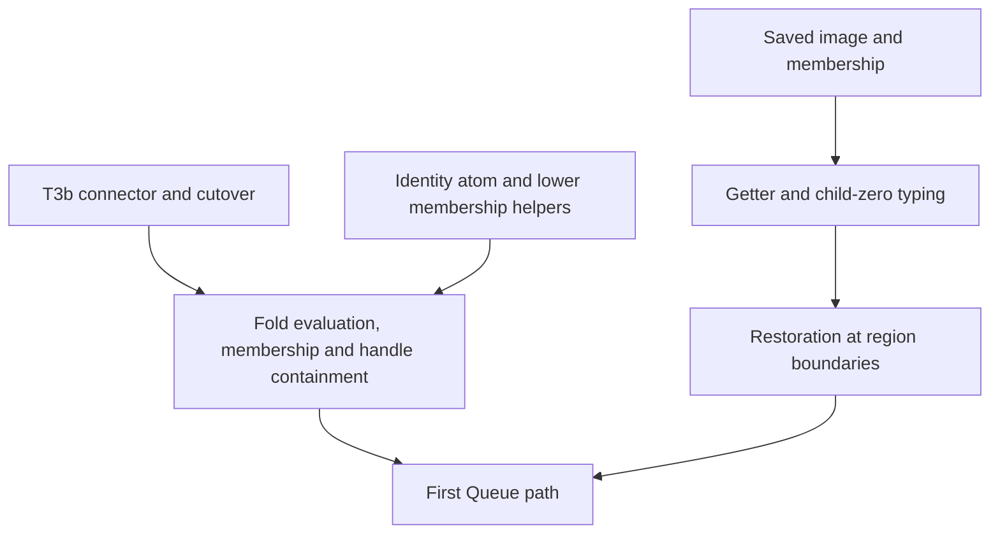
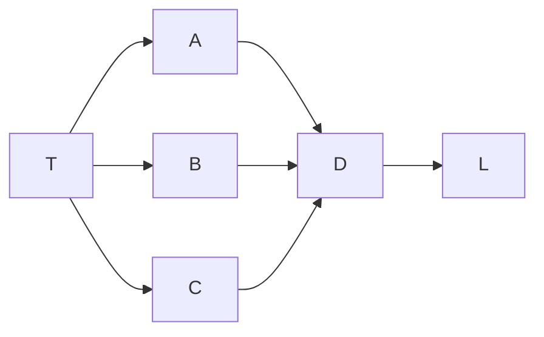

# Proof scouting and proof graph dogfooding

Reviewed main: `4977c4f3db4db51903ed9437022fd0f27d6fa41f`.
The owner requests continuing proof scouting and practical improvements to the existing proof tools.
This packet is advisory. It creates no new implementation assignment.

## The next proof steps

The detailed statements, hypotheses, placements and exclusions are in `fold.md`, `mask-tooling.md` and `migration.md` beside this note.
They are source-grounded outlines, not new Lean proofs.

For the fold, reuse `fits_list_iff`, `envTyped_append`, `fits_subN` and `RawHandles.evalTerm_handles`.
T3b's `termMaps_of_typed` connects the pure body to the existing atomic store step.
The existing Ref/Deferred inversion helpers live above membership in `Typed/Denotation.lean`.
Move or factor these small helpers lower before `AtomFits` reuses them; avoid a backward import.
Successful-result membership alone does not establish `atom_progress`.

For the mask, choose the canonical image before stating its membership goal.
Then connect the getter and restore body to existing source-point typing, followed by the region-boundary behavior law.
Reuse `read_print` and `read_exact`; prove the extended table premises instead of adding duplicate round-trip claims.
The mask note's five obligation groups are not all explicit in the current semantics registry.
Add the missing parts and update the stale mask wording, retaining unrelated scoped-body work.
Use the existing placed `proof_goal` declarations and `.witness` pointers once their definitions exist.
Check both metadata placement and actual consumer dependencies; they establish different facts.

For migration, extend the existing dependency collector with a changed-declaration stop set before the first semantic cutover.
Use a fresh memo for each environment and stop set, and retain complete-root and budget diagnostics.
This measures syntactic dependency reach; it does not establish that the claim keeps its meaning.
M1's source build must also reach the Lean witness join.
M0's ledger should retain each observation separately, including result agreement under a known schedule-only difference.
These are acceptance prerequisites; the active M0 seat has no completed receipt yet.

## Tool finding 1: missing fields look empty

Role: report input validation. Evidence: the actual extracted JavaScript validator was executed under Node v22.23.2.
Scope: `validatePlan` in `tools/Tools/ProofGraphView.js`, using a retained report with 134 nodes and 13 requirements.
The artifact is not claimed fresh at HEAD.

The untouched report passes, and an unknown nearest-node reference is refused.
Deleting each of these required fields still returns no validation problem:

- a node's statement;
- its axiom list;
- its nearest-node list;
- a requirement's open-part list.

The view then substitutes empty text or empty lists for these fields.
A missing dependency list can hide edges; a missing open-part list can hide work.
This affects evidence presentation, not the Lean kernel or the underlying proof status calculation.

Smallest correction: require these fields with their proper types before constructing the view.
An empty list is valid; an absent list is not.
Extend `scripts/check-proofgraph-input.mjs` with these mutations and the unchanged positive control.
The existing validator is the consumer; no new validation framework is needed.
The full report format should supply the list of required fields.
`view-validation.mjs` and `view-validation.json` retain the commands' inputs, source hashes and exact outcomes.
An extra diagnostic-field experiment is exploratory and is not used as a reported defect.

## Tool finding 2: duplicate visits exhaust the Markdown traversal

Role: dependency report rendering. Evidence: source inspection and a finite Python mirror, not execution of the Lean renderer.
Scope: `renderPlan` in `tools/Tools/Semantics.lean`.

The traversal bounds queue pops by `nodes.size + 1`.
Repeated visits consume that bound even when they add no new node.
This six-node graph omits L:

A six-node chain is the positive control and includes every node.
The traversal without the fixed bound includes L; the current bounded algorithm stops with L still pending.
The retained 134-node report has no omitted nodes under this comparison.
Three requirement traversals stop with duplicate work pending, so their success does not establish the bound's validity.

Smallest correction: mark nodes when enqueuing, so each node consumes the bound once.
Alternatively, use an edge-aware bound and fail visibly if unvisited work remains.
Add this shared-dependency fixture beside the existing plan report controls.
The diagram and Markdown tables consume this fix; requirement status and JSON nodes are separate computations.
`render-reach.py` and `render-reach.json` retain the exact graph, positive control, source hash and artifact comparison.

## Verification and limits

`node scripts/check-proofgraph-input.mjs` passes its existing four refusal controls.
The new validator probe runs the same source block on copied data, outside the repository.
The traversal probe checks its witness and positive control with assertions.
No repository file, build, generator, installed package or active seat was changed.
No source review here establishes compiled axiom closure or a new proof.

The owner can use these two faults to justify small tool repairs alongside the next slices.
Proof scouting should continue through actual consumers rather than creating a separate completion ledger.
