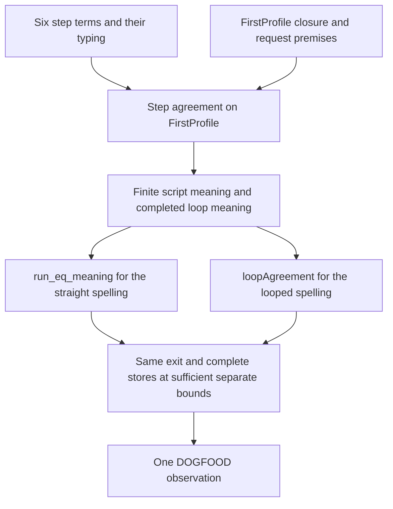

# Queue and DOGFOOD: one finite script, two execution forms

Evidence kind: source review and proposed implementation cut. No command in this review runs Lean, a host, a compiler, or a generator.

The DOGFOOD checkout is clean at `01bc224b55d53b52f5a9269eb442bc42338c55bf`. Main advances during review to `09d35eafd4e68ef86916dced39d003fd4cf8fbd3`.
The source manifest records the final working files. Main is moving the Queue model into the law graph; that work remains uncommitted.

## 1. The useful next consumer

Use one finite capacity-one Queue script, with a shared setup and two program spellings.
The first spelling writes its operations straight-line. The second repeats the consuming step through `iterate`.
Both use the six library step terms after QSTEPS lands. Neither needs a new evaluator or operation language.

Allocate the cell and request identities through one common prefix. Allocate the required replacement hints there too.
Both spellings use the same allocation order, encoding table, and hint replacements.
Record each operation's reply, complete cell, and ordered notifications in the same log shape.
Return that log and the final cell. This makes the first comparison sensitive to intermediate commits.

The abstract trace below follows `take`, `offer`, and `afterConsume` in the existing Queue model.
It is a source-derived example, not an executed result.
`A` and `B` are takers; `P` and `Q` are distinct offer identities.

| Operation | Reply | Buffered messages | Waiting takers | Pending offers | Notifications, in order |
| --- | --- | --- | --- | --- | --- |
| take A | wait | [] | [A] | [] | [] |
| take B | wait | [] | [A, B] | [] | [] |
| offer P 10 | accepted true | [10] | [A, B] | [] | [again A] |
| offer Q 20 | wait | [10] | [A, B] | [Q:20] | [again A] |
| take A | got [10] | [20] | [B] | [] | [offered Q true, again B] |
| take B | got [20] | [] | [] | [] | [] |

The last two operations form the loop. Their unrolled spelling forms the straight comparison.
The repeated `again A` notifications are separate occurrences. No deduplication or delivery occurs in this program.
The fifth operation commits offer Q before naming B's wake. This distinguishes commit order from callback execution.

Two deliberate faults discriminate this observation: reverse the fifth operation's notifications; retain its reply but discard its cell update.
Both must change the named observation. Reuse these faults from the step contract rather than adding unrelated controls.

Keep withdrawal inside this same workload, with two selected positions rather than a separate scenario family.
Before the fifth operation, `withdrawOffer Q` removes the pending offer and emits another `again A`.
The following take A receives 10; the final take B answers wait, with no buffered message.
After the fifth operation, `withdrawOffer Q` leaves the accepted 20 and emits another `again B`.
The final take B receives 20. The prior `offered Q true` notification remains an observed occurrence.
Each version has its own matching straight and loop spelling, with the same withdrawal position.

This tests explicit withdrawal as a pure step. It does not test fiber interruption or prove that cancellation invokes withdrawal.
The scheduled wrapper later reuses these expected commit outcomes while adding delivery and interruption observations.
A take-step reply of wait is data here; the finite client does not block and supplies no liveness evidence.

## 2. The existing proof route

| Obligation | Existing owner or proposed placement | Consumer and premises | Observation and exclusions |
| --- | --- | --- | --- |
| Step typing | QSTEPS; `store-typing`, R4 | The atomic `Ref.modify` callers; supported cell message type | Typed reply and cell. No model agreement follows from typing. |
| Step agreement | QSTEPS; `translation-simulation`, R10; proposed `queue-expansion-agrees` | This finite client and the later wrapper; `FirstProfile`, `Requested`, injective identity table, prescribed hint replacement | Reply, full cell, ordered notifications. No delivery or cancellation law. |
| Script composition | Proposed helper of `queue-expansion-agrees`, under `translation-simulation`, R10 | This one straight/loop pair; every prefix remains related and supplies the next request premises | Complete operation log and final state. No generic scheduler equivalence. |
| Straight machine connection | Proved `run_eq_meaning`; registry `run-eq-meaning` | Straight spelling; fragment witness and depth/step bounds | Finished exit and complete stores. No trace or same-fuel claim. |
| Loop machine connection | Proved `Agreement.loopAgreement`; registry `loop-agreement` | Looped spelling; a proved `meaningB` completion at a named budget | Finished exit and complete stores beyond a bound. No termination from fragment membership alone. |
| Local rewrite | Proved `StraightEq` congruences; registry `straight-composition-agreement` | Optional suspension removal within the straight client, including `onExit` | Exit and complete stores for every environment/store. No loop-wide `StraightEq`. |

`queue-expansion-agrees` is currently an R10 open part, not an implemented registry witness.
State an exact planned goal before proving the proposed script helper. Retain its step-goal dependencies in the plan.
Do not promote finite controls to proofs or mark the whole Queue expansion complete.

The current fragment definitions admit synchronous store operations and `iterate` for `Looped`.
They exclude waiting, forks, scopes, masks, and host operations from this denotational route.
A source-linear call to the proposed public Queue.take wrapper can still expand to all these operations.
Call only the synchronous step API in the first comparison; source presentation does not establish fragment membership.
The first program therefore inspects notifications as data. It does not signal their Deferreds or wait on them.

`StraightEq` already gives compositional proofs for `bind`, branches, errors, and finalizers.
`Test/Program/MeaningEqContract.lean` supplies a concrete write-then-fail cleanup consumer.
A Queue version can later fail after the first consuming commit and inspect the retained cell in `onExit`.
That scenario needs its own expected observation claim. The general `meaning_onExit` equation also holds for a wrongly written finalizer.
A duplicate log entry tests the log property; it does not by itself test execution count per registration.

## 3. Reuse the session driver at its actual boundary

The current workers call `Jobs.take` and `Jobs.run`, both host rows from `P3WorkerQueue`.
They do not exercise a local Queue cell or establish its backpressure.
Keep that scenario as host-session coverage while the step library lands.

After the mask and posted-delivery wrapper laws, replace only `Jobs.take` with the local Queue operation.
Keep `Jobs.run` external. This gives one application using local scheduling and real host call identities.
Reuse `Scenario.play`, the journal, and the current worker observation; add the Queue's named projection.
Do not create a second scenario runner.

The next observation separates these events:

1. A Queue step commits a message or records a notification.
2. A posted helper delivers that notification.
3. A host reply arrives and is stored under its exact call key.
4. A reply application advances its selected call.
5. A cleanup executes for a particular registration.

Use the existing `ReceiptInert`, `AppliedSelects`, and `ControlRetires` clauses.
`reply_commute` concerns independent receipts. It gives no commutation of applications that update shared state.
Cancellation before a Queue commit and cancellation after that commit require different expected observations.
Withdrawal after acceptance must not remove an accepted message. An old hint after replacement belongs to the wrapper's occurrence relation.
These are consumers of `posted-wake-profile-agrees` and `waiting-request-obligation-preserved`, both still proposed obligations.
They do not follow from the six pure step laws.

For pure controls, `Run.runPure_eq_run` requires both control rows to progress.
For scripts containing applications, `Scenario.tape_replays` remains a planned goal.
`journal_replays` reconstructs the Run from its journal; it does not discharge that tape goal or prove an outside implementation.
The generated engine comparison remains the named machine projection. It omits receipts, stored replies, and retired calls.

## 4. Landed corrections and present limits

The correction at `01bc224b` addresses the earlier top-to-clause issue.
`#scenario_gate` now follows actual plan dependencies and rejects an assembled clause that the top claim does not reach.
It also rejects unlisted goals. Associated laws remain a separate field and make no dependency claim.
The `wrongTop` fixture covers substituting an unrelated top theorem.
The table flag now says `observedTableDifference`; it records one finite projected difference, not table necessity.

`workers` still rests on `releases_once`. `tape_replays` still has a planned body.
Their finite controls are useful without closing those goals.
No `Test/Dogfood/Scenario/Atomic.lean` file is visible in the final clean DOGFOOD snapshot.
This review therefore does not certify a current Atomic edit and does not repeat the previously delivered finding.

## 5. Smallest done criteria for the proposed client

- Both spellings use the checked library step terms and build through the existing authoring surface.
- The same workload observes both withdrawal positions, preserving every notification occurrence.
- The shared setup respects the encoding and hint premises at each operation.
- The straight and loop fragment witnesses are checked, together with a loop completion witness.
- One claim derives the common observation from the step and execution laws.
- Every open prerequisite remains visible in the existing proof plan.
- The two named faults change that observation.
- Any later engine run compares only the same declared projection and retains its bounded evidence label.

No new general loop-equivalence API, operation interpreter, or testing framework is necessary for this cut.
