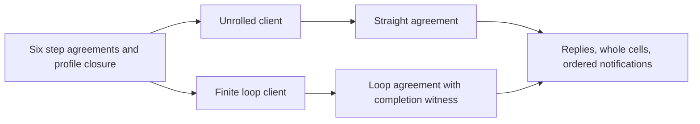

# Queue and DOGFOOD: focused design research

Keep the ratified design: one cell, pure step terms, and one atomic update per mutating step.
Reuse those steps for both straight-line and iterative clients.
Keep waiting and notification delivery in the public wrapper.

The three research seats found one concrete authoring risk and several small improvements.
They propose no second Queue interpreter, new stored binding form, or additional implementation seat.
Row 255 controls the scope. The coordinator is already moving the model into the law graph.

Evidence: source review and finite Python name-resolution controls.
The parent independently reran those controls and checked the relevant source definitions.
No Lean, compiler, host runtime, generator, or build ran here.
The receipt distinguishes committed sources from the coordinator's active move.

## 1. Avoid caller-variable capture before promoting the builders

`QueueSteps.enrolled` binds the fixed names `e_acc` and `e_t` around a caller-supplied identity term.
The authoring fold resolves that term under its new names.
An outer request written as `field (var "e_t") "id"` then reads the folded item's identity instead.
It compares that identity with itself and reports enrollment for a different request.
The corresponding `removeTaker` collision with `r_t` removes every entry.
Both expressions can retain their expected record types.

This is a source-composed witness for the proposed public builders.
It is not a failed Lean run or an observed failure of the current closed probe.
Eight retained Python controls cover collisions, ordinary names, matching identities, and reserved-name candidates.

Use one `foldWith` authoring convenience following `Env.mint`, `minted`, and `iterateWith`.
Give the body its accumulator and element terms through a Lean function.
The convenience still emits the existing `Term.fold`.
It needs no new program syntax or exception to row 255.

Reuse `var_push_minted` for the authoring scope argument.
Have the implementation owner check nested uses and unequal identities with equal record types.
`accept` places its current arguments outside its body, so this witness does not indict every fixed name.

Sources and an uncompiled Lean inspection snippet: [Queue review](queue/review.md).

## 2. Simplify the first-profile acceptance pass with its existing theorem

`acceptLoop_single` already characterizes the model on singleton, nonbatch pending offers.
For available room `r`, let `k` be the smaller of `r` and the pending-offer count.
The accepted entries are the first `k`; the remaining entries are the suffix after `k`.
Append only the accepted entries' payloads to the buffer.
Their notifications stay in arrival order.

The current general pass reconstructs accepted and remaining lists and handles partial batches with a stop flag.
Those branches are unnecessary under this first profile.
A specialized term can use `take`, `drop`, and one payload-append fold.
It can still repeat pure expressions, as row 255 requires.

Keep the six step statements and their observations unchanged.
Prove the specialized outputs against the existing closed form.
Keep the general model as the semantic owner.
Measure the actual term size and runtime before claiming a performance improvement.
No candidate term was compiled or timed here.

This proposal concerns only positive bounded suspend queues with singleton, nonbatch offers.
It establishes nothing for batches, rendezvous, terminal operations, or notification delivery.
The proof must carry the message-value relation for generic message type `A`.
The current research model's Nat messages do not supply that relation automatically.

Exact theorem and connector route: [proof review](proof/report.md).

## 3. Dogfood one workload in two spellings

Use a capacity-one Queue and allocate the same identities and hints in one shared setup.
Enrol takers A and B, then offer messages 10 and 20.
The first consuming step gets 10, accepts pending 20, and names notifications in this order:
the pending offer's accepted answer, then B's wake.
The second consuming step gets 20.

Write those two consuming steps once as an unrolled sequence and once as a finite loop.
Both use the same library step terms.
Observe every operation's reply, whole cell, and ordered notification occurrences.
Earlier repeated wakes remain separate occurrences.
Use the existing reversed-notification and discarded-cell-update faults against this observation.

Add two withdrawal positions to this same workload.
Withdrawal before acceptance removes pending 20.
Withdrawal after acceptance leaves accepted 20 committed.
These cases exercise explicit withdrawal steps, not actual fiber interruption.

The synchronous step programs can use the existing straight-line and loop agreement theorems.
The loop still needs a completion witness.
Use sufficient bounds for each program; do not compare equal fuel or instruction traces.
The shared setup must give both programs the same allocation order and store observation.

The proposed trace and exact proof map are in the [DOGFOOD review](dogfood/review.md).
They are source-derived expectations, not executions from this review.

## 4. Keep the public waiting operation easy to use

The current take wrapper repeats an option-valued attempt until it has a message.
It then writes a defensive empty-option arm that the loop's normal finish should never select.
Factor this plumbing into a Queue-private `untilSome` helper over the existing `iterateWith` and `selectOption`.
Keep it private until another consumer needs it.

Prove the local fact first: a typed option cursor whose exact loop test is false contains a typed message.
Then connect that fact to the actual normal loop-finish hook and its cursor invariant.
Keep failure, an unanswered wait, and exhausted fuel distinct.
The helper must not turn an unfinished program into its defensive defect.
It must keep the surrounding cleanup region and saved-mask behavior.

A source-linear call to this wrapper still contains masks, helper forks, waits, and iteration.
The existing `Straight` and `Looped` fragments exclude those scheduled constructs.
Their theorems cover the synchronous step clients above, not the public waiting wrapper as a whole.
The wrapper still needs its scheduled observation relation, delivery obligations, and cleanup proof.

Later, replace only the workers' host-backed `Jobs.take` with the local Queue wrapper.
Keep `Jobs.run` external and reuse the current session driver.
Retain receipt versus application, commit versus delivery, stale hints, and cleanup identities as separate observations.
This extends an existing application without creating another test engine.

## 5. Reuse the exact existing proof machinery

| Required connection | Existing material | Small remaining work |
| --- | --- | --- |
| Successful term to actual atomic update | `refStep_modify`, `ListFoldRules.step`, `refModify_implements` | Supply the cell relation, captures and exact reply/store pair |
| Fresh identity absent from waiter records | `HandleIdentityLaws.freshDeferred`, typed record projection, `fits_mono` | Connect each nested identity to the whole cell's contained handles |
| Successive attempts | `first_profile_closed`, `runP_bind`, current request premise | Induct over this workload, keeping the encoding and hint map |
| Finite loop | `iter_soundB`, `Agreement.loopAgreement` | State the per-round relation and show this loop's budgeted meaning finishes |
| Normal option-loop finish | `fits_option_inv`, loop-frame typing, real loop hooks | Prove the false test implies a present message |
| Scheduled wrapper | Existing waiting, mask, finalizer and host-session machinery | Keep the planned delivery, retirement and cancellation connectors visible |

`notMemberDeferred` applies to lists of Deferred values directly.
Waiters are records containing handles, so use nested freshness or prove the projected list premise explicitly.
`StraightEq` quantifies over every environment and store.
A conditional Queue relation cannot become `StraightEq` by dropping its profile and encoding premises.

Each proposed helper serves `queue-expansion-agrees`, under `translation-simulation`, R10.
Typing and cursor membership reuse `store-typing`, R4.
The consumers and exact hypotheses appear in the [proof review](proof/report.md).
No new helper is proved in this packet.

## 6. One representation clarification before the cell lands

Record the full cell's actual reply and terminal-payload types, not only its field names.
The probe's offer hint carries a Boolean; the model's later batch answer can carry leftover messages.
The terminal phase also contains an end payload.
Keeping the fields does not by itself keep the future `Ref` or `Deferred` type unchanged.

Either select those later shapes now, or document their later type migration explicitly.
This does not request batch or terminal implementation in QSTEPS.
It narrows the claim about what the first cell declaration settles.

## Current corrections and follow-through

The DOGFOOD correction at `01bc224b` now checks measured top-to-clause dependencies.
Its table flag names the finite difference it observes.
The former findings are resolved in the reviewed source.
The workers' cleanup and tape-replay goals remain open.
No Atomic draft was present in the final clean scout snapshot, so its old finding is not repeated.

The coordinator already owns the model move and implementation schedule.
Send the builder-capture witness before promotion.
Offer the acceptance specialization while the seat proves its unchanged step goals.
Give DOGFOOD the single workload above after the step API exists.
Track those items through consumption, implementation, and retained verification results.
