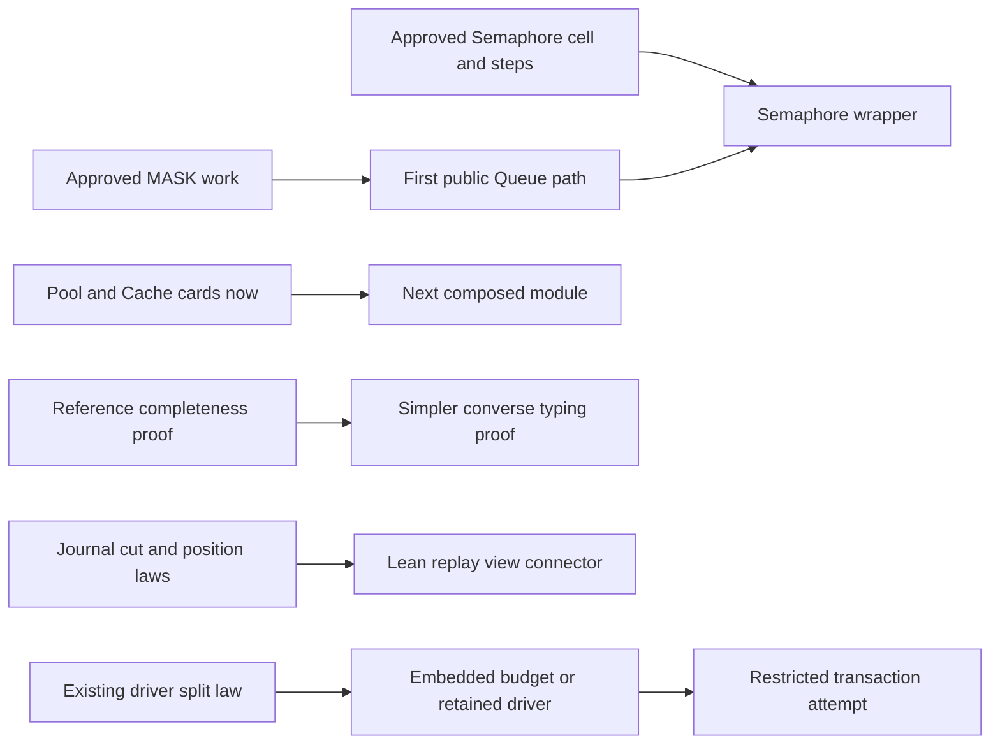

# Corrected roadmap and next work

The roadmap identifies useful work. Keep module breadth moving while one independent foundation proof is prepared.
Do not make reference expansion, tape cuts or general STM prerequisites for the authorized Semaphore cell slice.

Evidence status: source review, retained primary literature and finite Python models.
Proof role: proposed next obligations and contract corrections.
Scope: main `d3a3e558`, with closing source checks and current UI observations.
No Lean proof, build, compiler, runtime or generator runs in this review.

## Current authority

The Queue step and typing landings are current. All six step agreement goals and five modifying-step typing goals are proved and merged.
The typing statements retain their exact elaboration, literal-flag and capture premises.
The T5 receipt records 43 finite truth-program agreements, with its stated observations and exclusions.
These results do not establish public Queue scheduling, notification delivery or whole host agreement.

Commit `d3a3e558` records rows 259–265 after the owner's “yes to all”.
Semaphore's live scan, first operation set and over-release rule are approved.
The third Semaphore cell-and-steps seat is authorized. Its wrapper still waits for the mask and Queue public path.
The UI confirms the submitted owner ruling and the coordinator preparing its brief.
MASK and HOST remain in progress.
The compiler local-sweep rule lands separately at `0acec081`; its documents land at `7e3f7911`.
This review does not repeat its acceptance runs.

## Recommended work order

1. Continue the approved Semaphore cell slice, MASK and HOST under coordinator allocation.
2. Prepare Pool and Cache cards now. Use their concrete steps to identify the next shared helper.
3. Take reference-expansion completeness as the next independent foundation proof when the coordinator allocates it.
4. Add the small journal-cut and position connectors with their existing replay consumer.
5. Retain the approved transaction body contract. Prove its execution-isolation and budget connection before stronger agreement claims.

These are parallel design and proof tracks, not one serial release gate.
The first Queue public path remains the wrapper consumer for mask, registration, cancellation and notification obligations.
Do not dispatch another implementation seat from this review.

## 1. Reference completeness: retain the goal, narrow the claimed gap

The independent goal is valuable: valid original reference sites should disappear within the existing expansion bound.
Use original reference occurrences as the finite rank domain.
An edge runs from a caller occurrence to each original reference inside the target it copies.
Prove that every such occurrence precedes the caller. Transport those ranks through copied syntax.
Then prove disappearance at the actual bound used by `Eff.expandRefs`.
The count of copies can increase; it is not the decreasing measure.

`TypedProgram.expanded_refSites` already derives the evidence from a successful whole-program check.
Therefore checked callers do not all carry a separate manual premise.
The direct benefit is to `checkTypedProgram_of_hasTy` and `typeOfProgram_expandRefs`.
First prove completeness; then derive checker equivalence. Removing the executable guard is optional.
If removed, `Api.explain` and its completeness law must stay aligned.
Typing expansion does not replace runtime layer sharing or prove layer-allocation agreement.

The [proof review](proofs/review.md) maps existing lemmas, required intermediate facts and proposed placement.
The [proposed statements](proofs/proposals.md) are uncompiled.
Gambino–Hyland provides a well-founded indexed-induction technique, not this project's rank theorem.

## 2. Replay cuts: prove completed prefixes, retain suspension separately

The proposed append law matches `tapeFrom`.
Strengthen the cut fact to retain exact positions: `tapeFrom s done = (positions, [])`.
The machine clause then reuses `tape_replays`.
Add the per-position connector for `Position.after` to serve `Lowered.shown`.
An outstanding external call alone does not mean that a tape has an unread suffix.

The completed prefix stops before the first stopped command.
That command may already change machine state before it reports a frontier.
The prefix theorem does not reconstruct its unfinished work.
`driveState_add` already splits command-loop fuel while retaining remaining commands.
Row 226 still needs outer dispatcher tasks, clock/flush phases and ownership to survive suspension.
A tape-cut law cannot recover those from a sufficiency Boolean.

Initially specialize the `Lowered.shown` theorem to a fresh `Run.open`.
Its raw replay loads a fresh machine and its tape uses the whole journal.
Current fixtures satisfy that condition; the proposed universal theorem needs to say it.
Arbitrary progressed runs instead need `replayFrom` and newly appended rows.
Generated-engine comparisons remain finite target evidence.

The [citation check](proofs/literature/review.md) corrects Lynch–Vaandrager's Proposition 3.9: it proves composition, not prefix lifting.
Lemma 3.8 is the relevant finite-move lifting pattern.

## 3. Pool and Cache: preserve their actual lifecycle differences

The [Pool draft card](modules/pool-card.proposed.md) separates a lease return, item retirement and acquisition-scope cleanup.
Healthy return usually retains the resource. Invalidation, expiry and failed acquisition can finalize before shutdown.
The posted Pool task selects a counted snapshot of notifications when the task executes.
It assigns no resources; each resumed borrower checks state again.

The [Cache draft card](modules/cache-card.proposed.md) separates key membership, entry identity, lookup lifetime and recency order.
A `get` touches recency; `has` does not. Native `set` on an existing key keeps its position.
Eviction and invalidation remove membership without directly cancelling a lookup held by existing awaiters.
A replacement entry can coexist with that older lookup. Capacity does not bound all live lookup tasks.
Old cleanup must test current entry identity on the admitted route.

The [module review](modules/review.md) identifies meaningful rc.112 versus 4.0.1 differences.
Do not claim a common profile merely by excluding TTL.
Use the approved feature-driven migration procedure to select and record each module's version and observation.
Ask the owner only where meaning, domain or representation needs a new ruling.
No pin moves in this review. No new profile is ratified.

Pool's shutdown cannot silently inherit native `releaseAll`, which the first Semaphore profile excludes.
The acquisition and lookup contracts also retain R7's entry, capture, context and lifetime obligations.
An ordinary scoped body helper may serve the first concrete use without storing a general callback value.

## 4. Transactions: apply the existing restriction and prove its execution premise

Row 223 already restricts existing `Eff`. Define `TxBody` as admission of that fragment, not as a second program representation.
Excluding host IO and ordinary Ref access is necessary but insufficient.
Keep transitive call closure, immutable payloads, no receiver reentry and the embedded budget or full continuation contract.
Outer success, failure, retry, caught inner failure and retry alternatives have distinct rollback rules.
The first profile already excludes caught inner failure and allocation.

The [STM review](stm/review.md) corrects the literature and gives the source map.
Harris et al.'s 2006 appendix changes the original 2005 caught-exception rule.
Use the appendix for local rollback, with its allocation exception.
Opacity requires legal sequential completions at observed history prefixes, including live and aborted attempts.
It includes each attempt's own tentative writes and does not enforce every application invariant between its individual writes.
It supplies no fairness or eventual completion claim.

## Existing proof plan stays authoritative

Use `Tools.Semantics.requirements`, including `openParts`, and actual Plan dependencies.
Reference completeness serves R5 and the R4 typing consumer; it does not itself close R8.
Replay connectors serve existing R8/R13 consumers. Full continuation ownership remains R12 work.
Module steps serve R10, with R4 typing, R7 retained behavior and R11/R12 lifecycle obligations.
The transaction claims stay under their existing R4/R10 open parts and budget prerequisite.
R1–R3, R6 and R9 remain unchanged. No other requirement or parked obligation disappears.
These associations describe intended consumers, not measured proof dependencies or proved status.

## Verification and delivery

The parent verifies 90 source and artifact identities against their recorded sources.
Thirty further closing comparisons confirm that reviewed core sources remain unchanged.
It reruns three independent Python models: 8,403 journal cases with 40,617 splits; 15 module controls; eight transaction-history controls.
Five reference fixtures include nested targets and a diamond whose count grows from six to nine.
All retained results match. These are finite checks, not Lean or target execution.
The source review checks actual definitions and existing theorem statements separately from those models.
`parent-verification.json` records the comparisons and commands.

Normal UI Message74 delivers the corrections and the proposed cards. The composer is empty afterward.
The coordinator begins responding; detailed adoption remains for the next check.
Seat SEM is now running from `05489250` on `seat/semaphore` in the former QSTEPS worktree.
Its first machine wake controls precede model work; this review accepts no new seat result.
