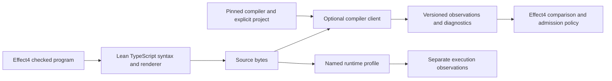

# TypeScript compiler research: a reusable boundary

Recommend a shared compiler client beside `lean4-typescript`, built from the existing Effect4 query layer.
Keep TypeScript program syntax and rendering usable without Node or a compiler installation.
Keep Effect4's program admission and Effect type policies in Effect4.

Status: research finished; implementation proposed.
Evidence: current source inspection, primary documentation, and a finite file-selection probe.
No compiler, Lean, host runtime, or build ran in this review.
The accompanying `parent-receipt.json` records the exact snapshots and independent checks.

## What the research seat examined

The [compiler inventory](inventory.json) names the executable entrypoints and their owners.
The [main review](report.md) traces process selection, virtual projects, configurations, diagnostics, type queries, and failure handling.
The [library review](library/review.md) examines the installed package and the boundary with Effect4.

The installed `typescript` Lake package is version 0.7.0 at `f5878bf879bd5712db964c2cd12802748c707605`.
It provides syntax data, rendering, identifiers, structural equality, and descriptive host pins.
It has no compiler client or general TypeScript typing semantics.

The existing `tools/target/oracle.ts` supplies serializable requests and responses.
Its companion `checker.ts` opens a virtual project and queries the selected compiler.
Several target checks already use this boundary.
The research therefore identifies an extraction opportunity with real consumers.

## A small correction worth landing through the coordinator

`scripts/check-truth.py` copies the record and fold typing controls into its work directory.
It omits `harness/truth/tuples.typecheck.ts`, although the copied `tsconfig.json` includes that filename.
The runtime helper `tuples.ts` is a different file.

The pinned truth marker also omits both tuple files from its prerequisites in `Makefile`.
The release lane names them, which does not invalidate the pinned marker.
This finding concerns the ordinary truth check and its freshness dependencies.
It does not claim that no other command can run the tuple controls.

The parent independently ran `copy-selection-probe.py`.
The current selection omits the tuple control.
The scratch correction selects it, and deliberately removing the fold control detects that omission.
These are file-selection results, not compiler results or an executed stale-marker failure.

Smallest correction: copy the tuple control and add the tuple implementation and control to the pinned marker's inputs.
Then validate the selected files before invoking the compiler.
The release driver's existing missing-pattern refusal offers a local precedent.
The implementation owner should run the relevant typing check when its slot is available.

## Proposed ownership

| Owner | Responsibility | First consumer |
| --- | --- | --- |
| Existing Lean TypeScript package | Syntax, renderer, identifiers, structural laws | Effect4 module printer |
| Optional compiler component | Provider selection, project lifecycle, requests, diagnostics, source identity | Target query runner, then styles checker |
| Effect4 | Effect A/E/R comparison, unknown restrictions, service identity, source admission, conformance verdicts | Existing target and ingestion tools |
| Named runtime profile | JavaScript and Effect execution observations | Existing truth harness |

A companion module can begin inside the existing tooling estate.
A separate published package is a later distribution decision.
The pure Lean root should not acquire a transitive compiler-process dependency.

## The first useful API

This is a proposed data contract, not a new program representation.

| Record | Required content |
| --- | --- |
| Compiler identity | Implementation, package, exact version, selected installation and client protocol version |
| Project input | Source identities and bytes, config, explicit options, library/package selection, requested diagnostic phases |
| Request | Schema version, request ID, operation, exact source/query selection |
| Diagnostic | Provider, phase, category, code, message chain, raw span, related locations, source identity |
| Observation | Query ID, requested answer, optional display text, compiler/project identity |
| Outcome | Finished check, diagnostic result, unsupported query, missing input, timeout, process failure, or malformed response |

Initially expose only operations that existing callers need:

1. Check a named project, with explicit required inputs and diagnostic phases.
2. Inspect selected expressions or declarations, with missing and ambiguous selections reported explicitly.
3. Compare types through the checker relation and through actual assignment statements, retaining both answers.
4. Return the small syntax projections already used by the styles and target tools.

The current `Direction` in `oracle.ts` already separates the two assignment observations.
Keep those answers separate when moving code.
Keep `typeToString` as display text, not semantic equality.
Return serializable data instead of compiler objects or native handles.

Select projects by their config identity, rather than the first project returned.
Check that every required source loaded and every requested query has an outcome.
Keep project and dependency diagnostics separate from per-program diagnostics.
Do not broaden a syntax-only check into a typing claim.

Retain the compiler's raw source offsets and name their unit.
The current target report restricts its position claim to ASCII query modules.
A broader location API needs CRLF, BMP, and supplementary-character controls against the selected compiler.
Do not equate oxc offsets with native compiler offsets without that connection.

The first extraction can remain host-side, serving two existing callers.
Add Lean request constructors and a report decoder when a named Lean tool consumes this protocol.
Decoding a compiler report into Lean does not turn it into a kernel proof.

## Language semantics with immediate consumers

Formalize the project's admitted TypeScript program fragment and its observations as features arrive.
A whole TypeScript type-system formalization is unnecessary for these first improvements.

| Feature | Existing need | Evidence to retain |
| --- | --- | --- |
| Contextual callback inference | T5's operation-carried functions and atomic state updates | Printed callback, inferred parameters, result type, captured environment, exact diagnostics |
| Literal widening | List/fold atoms with different number literals | Inferred versus annotated collections, including nested collections |
| Generic allocation | Empty `Deferred.make` and typed references | Explicit arguments, missing-argument refusal, invariant parameter controls |
| Narrowing and overloads | `catchIf`, tagged records and selectors | Predicate context, selected signature, branch/result assignments |
| Optional fields | Record updates and schema output | Absence versus present `undefined`, with effective compiler options |
| Structural compatibility | Target type comparisons | Checker relation plus actual assignment context, with any/unknown/never policy kept explicit |
| Module and binding identity | Imports, aliases and service keys | Type/value namespace, shadowing, source origin, resolved symbol where needed |
| Object execution | Computed keys, spread order and `__proto__` | Separate syntax, compiler acceptance and runtime observations |

Each feature record should name its concrete syntax, inferred typing observation, execution observation, and admitted TypeScript program fragment.
Use the existing positive examples and deliberate failing controls.
Add examples when a feature needs them, rather than accumulating an unrelated language corpus.

TypeScript's compatibility rules are structural and deliberately allow some operations without runtime safety guarantees.
Compiler acceptance therefore remains one external observation.
It cannot establish Effect4 membership, codec admission, reply admission, or execution agreement by itself.
See Microsoft's [Type Compatibility](https://www.typescriptlang.org/docs/handbook/type-compatibility).

## Proof placement and formalization

The current semantics registry already separates structural metadata and target execution.
Use `type-metadata-exact` under `exact-codecs` for retained type declarations.
Keep the existing read/print and module-admission theorems on their stated domains.
Requirement R8 still names the TypeScript face's finite truth-harness evidence.

| Proposed work | Placement and consumer | Reach and hypotheses | Exclusion and prerequisite |
| --- | --- | --- | --- |
| Request/report codec, if a Lean consumer needs one | Package-local exact-codec property; Effect4 tooling consumes the decoded report | Named schema version, accepted constructors, exact IDs and fields | No compiler correctness; first choose the actual decoder consumer |
| Compiler-client extraction | R8 validation support, initially finite differential evidence | Fixed compiler, project inputs, options, phase selection, and query selection | No runtime agreement; freeze the current reports before migration |
| Generic binding extraction | Existing `Codegen.Bindings` laws and `SourceBindings` consumer | Same type/value namespace, shadowing, and lawful-import policy | No package export or target typing claim; retain the exact laws and select a second consumer |
| A future target feature law | Proposed R8 `translation-simulation` placement before proof work | Explicit generated fragment, runtime profile, decisions and observation | No arbitrary TypeScript claim; first state the concrete feature's semantic connection |

Passive request records need local validation, not invented semantic goals.
A requirement association is not a measured proof dependency.
The research proposes no new theorem declaration and claims no newly checked proof.

## Efficiency: reuse first, measure next

The target runner already batches a request into one compiler project.
The installed API also supplies array overloads for selected type queries.
Use those capabilities where the current call graph repeats remote requests.

Before choosing a persistent service, measure process startup, project loading, diagnostics, query traffic, and memory separately.
Compare cold and warm runs with the same input inventory and observations.
Only then choose additional batching or project reuse.
No performance measurement ran in this research, so no speedup is claimed.

For reuse across requests, scope native IDs and caches to the project and snapshot.
The current `forbiddenTypes` memo is suitable only within its present process lifetime.
A persistent service must also account for configuration, libraries, module resolution, and changed filesystem inputs.
New files can change resolution even when previously loaded files remain unchanged.
Keep failed attempts and partial responses distinct from successful cached reports.

## Upstream facts that affect the design

Microsoft released native TypeScript 7 under the `typescript` package with a `tsc` executable.
Its release announcement states that 7.0 does not ship a stable API and describes a later API as planned.
Our installed preview exposes an explicitly unstable API.
Keep the adapter versioned and identify the compiler implementation independently from its launcher name.
This recommends no pin change or use of a prohibited compiler command.
See the [TypeScript 7 announcement](https://devblogs.microsoft.com/typescript/announcing-typescript-7-0/).

The [typescript-go staging repository](https://github.com/microsoft/typescript-go) is archived and directs development back to `microsoft/TypeScript`.
Use the exact installed package for current API facts, and current official sources for future planning.
This review makes no claim about the newest available package release.

## Suggested landing order

1. Correct the omitted tuple control and its freshness inputs through the current owner.
2. Extract a small shared compiler session and retain diagnostics for two existing callers.
3. Add the versioned protocol with exact selection and identity checks.
4. Add a Lean consumer and codec when a real tool needs compiler observations inside Lean.
5. Extend the language-feature records alongside T5, masks, queues, and subsequent consumers.
6. Measure compiler costs before adding a persistent service or wider caching.

Defer removal of legacy Effect convenience syntax from the shared package.
Defer a general TypeScript AST mirror and broad compiler-type serialization.
Those changes have larger migration costs and do not unblock the current compiler boundary.

The coordinator retains implementation timing and seat allocation.
T5 and DOGFOOD remain active during this source review.
