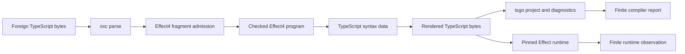

# TypeScript compiler surface research

Status: research only. No repository change, compiler run, generation, installation, or proof is part of this packet.

Initial main: `33a39ca4192079af788e2df2932cce0d7c8103fd`. Final source snapshot: `6acbf7909eceb253d3bec2e713a5fd2d514846e6`. The installed Lean package is `typescript` 0.7.0 at `f5878bf879bd5712db964c2cd12802748c707605`.
T5 is active at `f2760046`. Its uncommitted reader, atom, prelude, and generator work is excluded from acceptance here.

## Recommendation

Centralize compiler access, report data, and configuration handling before expanding the syntax package.
Use the existing `tools/target/oracle.ts` and `checker.ts` as the starting implementation.
Keep Effect-specific typing comparisons and program admission in Effect4.
A reusable compiler adapter can accompany `lean4-typescript` without making its pure syntax root import process execution.

This is an extraction proposal, not permission to start a third implementation seat.
The current small repair is the omitted tuple typing control described below.
Other changes follow T5's integration and a concrete consumer.

## Current boundaries

These arrows have different owners and evidence.
A clean compiler report does not prove runtime agreement or admit a foreign program into Effect4.
Two recognizers currently share oxc parsing, as decisions row 168 records.
Their agreement checks separate walks, not independent parsers.

### The Lean package

`TypeScript.TypeRef` carries qualified generic names, literal strings, tuple types, unions, object fields, and function types.
`TypeScript.Syntax` carries expressions, statements, declarations, imports, annotations, object spreads, computed keys, and generators.
`TypeScript.Render` prints them. Structural equality has separate proofs.
The package has no compiler-process API, source parser, TypeScript typing judgment, or general execution semantics.
Its README correctly assigns admitted grammar and target behaviour to consumers.

The package's generic description has inherited exceptions.
`Stmt.scopedGen`, `Stmt.scopedGenMasked`, `ProgDecl`, and `EffectfulFieldDecl` render hard-coded Effect constructs.
`Decl.raw` and class member strings remain escape hatches.
Effect4's `Codegen.SourceBindings` refuses raw declarations and effectful-field declarations in its checked module profile.
Do not broaden that profile merely because the carrier can represent a node.

A future generalization can move Effect convenience constructors into Effect4 and expand them into existing generic syntax.
That migration needs a rendering relation and caller migration before deleting any constructor.
It is not a small prerequisite for compiler access.

### Compiler processes and APIs

The installed native preview is `@typescript/native-preview@7.0.0-dev.20260629.1`.
The native client runs under Node. Existing comments record why Bun cannot drive its synchronous pipe client.
Bun remains the host for several callers and runtime checks.

Three executable files construct native API projects:

| Entry | Existing capability | Important distinction |
| --- | --- | --- |
| `tools/target/checker.ts` | Virtual projects, parse queries, diagnostics, type-at-location, signatures, two-direction assignments and `isTypeAssignableTo` | Effect A/E/R policies and generic compiler mechanics coexist here |
| `harness/tsdiag/run-tsdiag.mjs` | One project for corpus diagnostic comparison | Per-file syntax/semantic diagnostics only; codes are compared with Effect4 refusal predictions |
| `ts/eff/check-styles.ts --tsgo` | One virtual project for syntax checks | Checks exact loaded-file coverage; intentionally excludes type resolution and semantics |

`tools/target/oracle.ts` already separates JSON requests and reports from the Node compiler process.
`profile.ts`, `rows.ts`, `corpus.ts`, and `assignability.ts` reuse it.
`query` and `assignability` reject duplicate IDs and empty selections.
`checker.ts` batches each selection into one project and closes its API in `finally`.
Its `forbiddenTypes` cache is process-local today. A persistent server must scope that cache to the snapshot and policy.
Native type and symbol IDs must never become persistent Lean identities.

`check-styles.ts` uses the published `unstable/sync` export.
The target checker and diagnostic lane use installed `dist` paths.
The installed package also exports `unstable/ast`, `unstable/ast/is`, and related modules.
A single provider loader can contain those version-specific imports.
Do not infer a stable upstream API from the word “exported”.

CLI typing also occurs in the truth, release, corpus, service-identity, host-protocol, target, and schema-codec checks.
`scripts/lib/truth_host.py` already shares installation selection and the native CLI command across several lanes.
The release lane has stronger compiler-version and explicit-install validation than some earlier direct callers.
Reuse its checks rather than creating another selection policy.

The Schema generation lane has a separate declared profile.
Its manifest requests `typescript@7.0.2` and `@effect/tsgo@0.38.0`.
Its script selects `tsc.original` and invokes `effect-tsgo diagnostics` separately.
That installation is absent in this checkout, so this review does not identify its installed binary implementation.
Do not classify it as an accidental old compiler from the filename alone.
Keep the native compiler and Effect language-service evidence separately named.

## Small findings and consolidation opportunities

### 1. A tuple typing control is omitted from the ordinary truth work directory

`harness/truth/tsconfig.json` includes `tuples.typecheck.ts`.
`scripts/check-truth.py` copies the record and fold typing controls, but not this tuple control.
`truth_host.copy_prelude` copies `tuples.ts`, which implements runtime helpers, not `tuples.typecheck.ts`.
No other source imports the omitted control.
This finding concerns `check-truth.py` only. It does not claim that no other command can run the tuple controls.
The same omission exists in T5, with no active diff on the relevant files.

The omitted file contains positive tuple-index checks and seven expected-error checks.
A pure file-selection probe reconstructs the script's explicit copies.
It finds the missing tuple control.
Adding that file in scratch clears the finding. Removing the fold control instead identifies the fold control.
The probe executes no compiler and claims no new TypeScript result.

Smallest repair: copy the tuple control alongside its peers.
The Makefile also omits `tuples.ts` from `TRUTH_SOURCES` and `tuples.typecheck.ts` from the pinned truth marker prerequisites.
Both files are named in `TRUTH_RELEASE_LANE`, but that does not invalidate the pinned marker.
Add both dependencies to the pinned lane, so their edits trigger its actual check.
This is a source-confirmed freshness gap, not a newly executed stale-cache failure.
Small consolidation: enumerate required typing controls once and refuse a required selection that matches no file.
The release lane already rejects unmatched include patterns in `source_closure`'s path.
Use that experience without copying the whole release driver.

### 2. Compiler identity and configuration have several owners

The preview version appears in the package manifests, `Codegen.HostConfig`, and ingest pins.
Each serves a different receipt, but the consistency relation is not one shared operation.
`truth_host.select` checks compiler presence; `select_release` also checks the installed version against the manifest.
`check-host-protocol.py` checks presence rather than the compiler package's exact version.
The target checker validates the installed version against `ts/eff/package.json`.

A shared selection result should name package, version, executable/client identity, effective options, and selected installation.
Keep Effect library versions as profile dependencies, not fields of a universal TypeScript identity.
A provider identity includes implementation and version, not merely its executable name.
This report proposes no compiler upgrade.

`Codegen.HostConfig` is already first-order configuration data.
Its defaults mostly duplicate `ts/eff/tsconfig.json` and `harness/truth/tsconfig.json`.
The diagnostic lane deliberately emits `types: []`, while the other two use `types: ["bun"]`.
Centralize common options with explicit overlays; do not erase this distinction by forcing one project configuration.

`TypeScript.HostPin` records a version string without a compiler package identity.
`TsGen.hostPin` contains Schema-host compiler fields, but only `.libraries` feeds the generated profile address.
The current compiler fields do not certify those outputs.
A small cleanup can replace that local misleading record with the library dependency data it actually uses.
A package-level identity redesign is a separate, consumer-driven change.

### 3. Diagnostics should have one generic representation and separate lane policies

The target report retains code, file, line, column, and message.
The diagnostic lane writes position, end, code, and one flattened message.
The corpus CLI reader keeps only the first matching diagnostic per generated program.
The Schema language-service lane validates a different JSON report.
These are different observations, not interchangeable formats.

Use one lossless diagnostic datum for compiler-produced fields.
Keep provider, category, message chain, raw span, related locations, and source identity when available.
Store the span's unit explicitly. Native and parser spans must not be compared without a conversion rule.
Line/column rendering belongs above that datum.
Effect4 refusal-to-code prediction stays in `Codegen.codesOf`.
A syntactic-only styles result must stay syntactic-only.

The target query lane includes configuration, program, global, syntactic, and semantic diagnostics.
The tsdiag lane currently reads only per-file syntax and semantics.
The corpus CLI reader accepts exit 1 or 2, then retains only lines matching generated `gN.ts` paths.
A dependency or project diagnostic can therefore disappear from that local table.
This is a source-level reporting risk; this review does not demonstrate a failing current compiler run.
Preserve unassigned diagnostics and fail project acceptance where the lane requires a complete typing result.
Do not silently assign them to an arbitrary program.

### 4. The existing process seam needs validation before becoming a public Lean API

`oracle.ts` parses child JSON and casts it to `Report` or `PairReport`.
The CLI validates external query input, but the internal child protocol has no versioned request decoder.
The current child is repository-owned; no current compiler result is alleged wrong.
An exported adapter should validate the report's schema, request ID, selection, and evidence identity.
Unknown commands, missing files, malformed results, timeout, and process failure need distinct outcomes.
A compiler diagnostic is not a transport failure.

Reuse the current positive and mutation fixtures when extracting this boundary.
Do not introduce a second status system beside the project's existing evidence vocabulary.
Do not turn an external report into a proof certificate merely by decoding it into Lean.

## Language-feature focus

| Feature | Real consumer | Useful next work |
| --- | --- | --- |
| Contextual typing of callback parameters | T5 operation terms and `Ref.modify` | Keep T5's explicit inference controls and captured-variable examples |
| Literal widening and readonly collections | Fold/list atoms and tuple helpers | Preserve annotation versus inferred-type observations; include distinct literal values |
| Generic type arguments | `Deferred.make`, row templates, type-pair queries | Separate source syntax support from the instantiated query; retain refusal for unsupported generic signatures |
| Optional fields and undefined | Record terms, schema types, exact optional property checks | Keep `optional` distinct from a union containing `undefined` |
| Narrowing and overload resolution | `catchIf`, selectors, atoms | Keep assignment statements and checker relation side by side; neither replaces the other |
| Module and service identities | `SourceBindings`, module emission, service-identity controls | Ask the compiler about resolved symbols only when the consumer needs it; keep full Effect service-key identity |
| Computed keys, spread order, `__proto__` | Record update and payload classes | Keep syntax, static typing, and object runtime observations separate |
| Foreign declarations and aliases | Ingest census and prospective vendoring scanner | Reuse checker export/symbol queries for a future typed scanner; keep current oxc admission independent |

Do not add all TypeScript constructs speculatively.
Row 247 already permits a package change when a real consumer needs syntax.
The missing generic API is mostly project/configuration/query/report infrastructure, not a full TypeScript AST mirror.

## Staged reusable boundary

1. Repair the omitted tuple control through its current owner.
2. Extract compiler selection, provider loading, project coverage, and diagnostic normalization from existing callers.
3. Keep Effect column extraction, deliberate type cuts, and known differences in Effect4 consumers.
4. Add a versioned request/report datum and a separate process client in the TypeScript package estate.
5. Migrate one existing consumer first, preserving its input bytes, options, verdicts, and diagnostics.
6. Add a Lean decoder and report inspection API for a named consumer.
7. Evaluate process reuse only after measuring one-shot startup and cross-process query costs.

Initial generic operations can be project syntax checking, project typing diagnostics, selected type inspection, and two-direction assignability.
Preserve the current batched requests. The installed API accepts arrays in `getTypeAtLocation`.
Batch where a real query repeats remote calls, then compare complete reports against the current implementation.
Do not promise a speedup before measuring it.
A long-lived service adds snapshot invalidation, cancellation, and resource ownership obligations.
It is not needed for the first extraction.

A possible module division is pure `TypeScript.Compiler.Protocol` data plus a separate host adapter/client package.
The existing pure `TypeScript` root should remain usable without Node or tsgo.
Use immutable requests containing source/configuration identities.
Return observations about the selected compiler and snapshot.
Never store live native compiler objects, functions, or handles in canonical program syntax.

## Proposed obligations and placement

These are proposed obligations, not theorem declarations or proved results.

| Concept and proposed placement | Consumer and required property | Hypotheses and observation | Exclusions and immediate prerequisite |
| --- | --- | --- | --- |
| `translation-simulation`, R8 helper for printed-module validation | Shared project runner accounts for every required source and diagnostic phase | Exact request file selection, selected compiler, effective configuration, no unresolved required source; observation is source coverage and complete diagnostics | No TypeScript soundness or runtime agreement; first extract the current runner and retain omitted-file controls |
| `exact-codecs`, proposed package protocol claim with Effect4 R8 association | Lean decoder preserves the accepted request/report fields | Versioned schema, explicit span unit, exact IDs and file hashes; observation is decoded field equality | No claim that the external compiler told the truth; first select the concrete protocol and its consumer |
| `translation-simulation`, R8 extraction helper | Migrated adapter returns the same selected observations as the old driver | Fixed compiler/package bytes, sources, options and query selection; observation includes both assignability readings and diagnostics | Initially finite differential evidence, not a compiler theorem; first freeze a small positive/mutation corpus |
| `translation-simulation`, existing printed-module/readback claims | Later generic syntax adapter retains supported annotations and bindings | Named canonical fragment, scope and class coverage; observation is syntax reconstruction under the stated normalization | No arbitrary-source admission or TypeScript execution; first choose a consumer and preserve existing exact-reader premises |

The generic protocol property needs a package-local owner before any proof is worked.
Effect4's requirement association alone is not a proof dependency.
Existing core formation, canonical form, membership, inhabitance, profile support, codec admission, and reply admission remain distinct.

## Evidence and limits

`inventory.json` enumerates the concrete entrypoints and source owners.
`receipt.json` and `sources.json` retain source hashes, commits, and the executed probe command.
The pure probe checks source copying and local file selection only.
No Lean, tsgo, Node compiler client, host runtime, or OCaml build ran for this research.
The Schema-host install was unavailable and was not installed.
Parent research supplies current upstream documentation separately.
