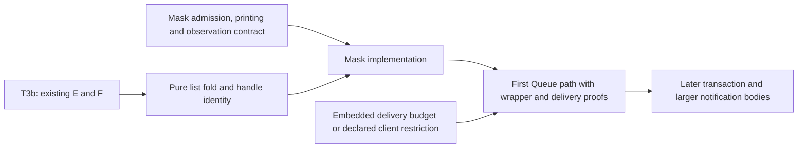

# Implementation audit: recommendation on waiting design W

Approve the detached helper for the first Queue delivery profile, after the contract corrections below.
Accept the saved-Boolean mask design in principle; finish its checked TypeScript printing and reading route before assigning implementation.
T3b can continue its existing assignment independently.

Proof role: design review and implementation support.
Evidence status: source review and eight finite host controls, with positive controls.
Scope: W at `261b4a8e`; existing T3b A–D and the recorded E/F assignment.
No Lean build, generator, installation, or active-repository edit runs in this audit.

## Recommendations

1. Keep F3's existing detached fork, with one helper per signal occurrence.
   The source supports the stated dispatcher and lifetime after the signalling fiber exits.
   It also posts completion itself, so the late-await case does not bypass dispatch.
   These are ingredients of the composed Queue proof, not that proof itself.

2. Correct the work bound before stating its theorem.
   Posting a helper and completing its delivery are different amounts of work.
   Completing the hint runs receiver code under the same driver budget, including code after the Queue operation returns.
   An interruption mask also does not prevent automatic yield.
   Include reached continuations and command work in `embedded-budget-sufficient`, or state the admitted continuation restriction.
   Exclude cuts inside dispatch until the full driver suspension exists.
   No new posting construct follows from this finding.

3. Specify the mask's representation-to-TypeScript contract.
   `Forms.Template.expand` expands forms; the present printer does not recognize this complete mask expansion.
   Specify recognition, nested lexical captures, refusal of unsupported saved-Boolean uses, and the exact reading/printing equations.
   Treat the extra getter and selection steps separately in the behavior relation.
   The existing exactness laws must retain their meaning.

4. Recommend the proposed row-227 amendment for recognized escaped restore uses.
   Both inspected releases capture identity or the global interruptible wrapper, rather than a live parent activation.
   A captured Boolean can select the same wrapper in the child.
   This recommendation needs the owner's recorded amendment and a checked capture path.
   The first Queue needs only local restore; unsupported captures may remain refused until their connector lands.

5. Qualify F3/F5's immediate-withdrawal claim by the caller's incoming interruptibility.
   Four cases on each release confirm registration cleanup and distinguish a masked caller from an interruptible caller.
   The masked caller can stay registered, consume after notification, and run code inside its outer mask before restoration interrupts.
   This is intended mask behavior, not a Queue defect.

6. Keep the probe's limits next to its conclusions.
   Its strategies exclude suspended offers; its step produces at most one hint.
   Reconcile F6's grouped-helper wording with F3 before using the result for a multi-hint operation.
   Check a blocked offerer's cancellation and notification forwarding with the first positive-capacity suspend slice.
   Keep the old-hint-after-rearming control open.

## Implementation order

The coordinator can develop the contracts while the existing seats work.
This audit assigns no new seat and changes no implementation authority.

## Evidence and placement

`review.md` maps delivery findings to `embedded-budget-sufficient`, `waiting-request-obligation-preserved`, and `posted-wake-profile-agrees`.
`mask-review.md` maps the mask contract to R4, R8, R10, and R11, with premises and exclusions.
`queue-review.md` describes the eight finite controls; `receipt.json` retains commands, versions, hashes, and outputs.
These controls are not Lean proofs, fairness results, or general runtime agreement.

The earlier registry correction has landed at `261b4a8e`.
Its cancellation claim again requires cancellation to win before consumption.
No new defect was found in T3b's reviewed A–D source.
The active E changes remain an unfinished seat implementation, not an accepted cutover.
