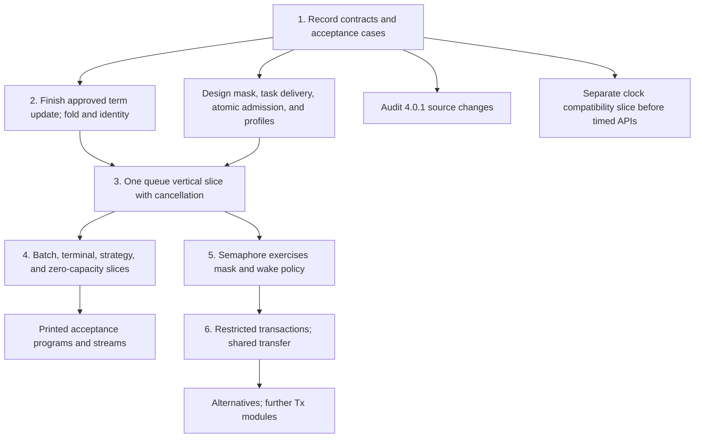

# Transaction and task design recommendations

Status: evidence and option assessment. The owner subsequently ratifies the final recommendations.
The [decision packet](contracts-and-literature.md) controls the final selections and implementation sequence.
The coordinator must record them in tracked authority before dispatch.
Proof role: design review and proposed obligations.
Evidence status: source reading, retained receipts, and finite probes with controls.
Scope: the three planning notes at commit `0741ab17cc99d1c3944e1cf52e838b93bf5fec65`.

**Recommendation.** Accept shared first-order bodies, explicit task delivery, and a restricted snapshot transaction model as design directions.
Require separate contracts for atomic attempts, request lifetime, and signal delivery before accepting their implementation slices.
The existing model supports useful composition, but it does not establish arbitrary fair composition or a universal waiting wrapper.

## Questions reviewed

The inputs are Claude's [groundwork plan](/Users/pooks/Dev/lean4-effect4/docs/research/2026-10-05-claude-lead/groundwork-plan.md), [queue review](/Users/pooks/Dev/lean4-effect4/docs/research/2026-10-05-claude-lead/queues-review.md), and [transactions note](/Users/pooks/Dev/lean4-effect4/docs/research/2026-10-05-claude-lead/transactions-and-clock.md).
The current [decisions](/Users/pooks/Dev/lean4-effect4/docs/core/decisions.md), especially rows 79–84 and 204–213, bound this review.
Research proposals do not amend those decisions.
Claude's latest response finishes its research turn; it does not establish a development handoff.

## Choices I recommend

| Open question | Recommendation | Acceptance boundary |
| --- | --- | --- |
| Groundwork 7; transactions 1: one waiting wrapper | Accept a common attempt and waiting protocol for admitted bodies. Keep module enrollment and its cleanup explicit. | Tracking every state-dependent read, atomic check/registration, stable request identity, and ownership of every notification. Replace “any body” with these premises. |
| Groundwork 17; transactions 2: atomic region | Design now. Begin with pure computations and transactional reads/writes of existing cells. Separate commit from delivery. | Exclude every route to another fiber, external effects, allocation, and unresolved calls. Prove the embedded budget connector before admitting general program bodies. |
| Groundwork 10; transactions 3: generalized tasks | Accept existing `Eff` bodies under explicit task metadata. Extend the current `Task` interpretation only where a consumer requires it. | Dispatch owner, execution identity, receiver/token, priority, captures, service context, supervision, selection timing, and completion rules remain explicit. |
| Queue 10: inline or posted delivery | Prefer posted delivery for the default Effect 4 queue profile. Keep ordinary Deferred's inline behavior. | This keeps the source's timing choice. Inline queue delivery remains an optional, explicitly different profile; it is not a free simplification. |
| Queue 2–4: consumption and turn order | Accept consumption at the taker's committed step. Choose strict arrival order, including nonblocking consumers. | A head batch can block smaller requests. This is a deliberate divergence from 4.0.1. Retry timing still affects batches, sliding values, and dropping replies. |
| Queue 1: use Latch | Accept no Latch dependency for Queue. | Scheduled delivery still needs its own contract. Row 81's separate Latch obligations remain open. |
| Groundwork 3–4: list iteration | Keep the selected pure list fold, with accumulator and element binders. Add `listTake` and `listDrop` only for the demonstrated consumers. | Use the existing binder convention, generated scoping/capture checks, arbitrary element/accumulator types, and exact print/read forms. No counted loop is justified yet. |
| Groundwork 5–6: identity and nested handles | Prefer same-kind Ref/Deferred identity equality. Exercise a cell containing a list of Deferred handles. | Compare identity, not payloads. Require membership, fresh identity, world extension, and target identity correspondence. Do not replace these with raw registration-number assumptions. |
| Groundwork 8: mask/restore | Accept its design now. Use a first-order lexical reference to the saved mask. Land it with its first required consumer. | Restore the caller's saved state, including when already uninterruptible. Cover nested masks, failure, cancellation, and escaping references. |
| Groundwork 9; queue 6: law-kit client alphabet | Prefer application-signature rows with clients still expressed in `Eff`. | Queue supplies the first concrete expansion and observation. Extend only the demonstrated missing relation; do not introduce another program representation. |
| Groundwork 11–13: retained behavior and observer helpers | Defer general stored behavior values. Keep watcher and first-exit race proposals conditional on their own controls. | A detached watcher is not automatically the source observer. Resolution, context, lifetime, cancellation, and observation remain obligations. |
| Transactions 5–6: shared standalone and transactional queue | Accept reuse of pure transition bodies. Keep arbitrary fair composition experimental. | The same body may need different enrollment protocols. Test a two-queue transfer and ticket cycles before claiming one full queue API serves both uses. |
| Transaction nesting | Choose flat nesting for the initial restricted profile. | Only the outer attempt commits or discards. Defer savepoints and recovery inside a failed attempt. SQL nesting has a different contract. |
| Transaction alternatives | Design a project-specific retry-only alternative. Implement it with `takeEither` after the base attempt works. | Discard the left branch's tentative writes; retain enclosing writes. If both branches retry, retain both dependencies. Ordinary failure propagates. |
| Groundwork 18; transactions 7: clock unit | Accept exact nanoseconds internally, with explicit compatibility conversion and separate wall/elapsed meanings. | Existing `sleep(1)` must remain one millisecond. Keep old journal/wire meanings. Public nanosecond readings require a distinct target `bigint` contract. |
| Groundwork 16; queue 8; transactions 9: pin | Accept a scoped 4.0.1 migration audit now. Ratify the pin change after the affected claims and receipts are mapped. | Retain rc.112 evidence. Do not relabel its runtime census. Independent pure term work need not wait for the audit. |
| Groundwork 2: T3b | Recommend finishing the existing bounded term-update assignment before its consumers. | The final decision packet records the owner-ratified bounded continuation through the coordinator. No expanded assignment follows. |
| Upstream reports | Retain versioned candidates for owner review. | Repaired pin behavior is historical. Finite bypass or timing differences alone do not establish an upstream bug or infinite starvation. |

The strict-order recommendation prioritizes predictable request order.
The posted-delivery recommendation prioritizes Effect 4 compatibility where a stronger queue contract does not require a change.
These are separate choices.
Strict order does not require immediate delivery.

## Evidence that changes the decisions

### A. Fair single-queue operations do not automatically compose fairly

The [finite model review](model/review.txt) retains 22 Python checks, exact inputs, witnesses, and positive controls.
It mirrors Claude's `TxModel` at its recorded source hash.

Committing tickets separately can create opposing orders.
Queue A contains `10`; queue B contains `20`.
P enrolls on A, Q on B, P on B, then Q on A.
A's tickets are `[P,Q]`; B's are `[Q,P]`.
P tentatively takes from A, then retries at B.
Q tentatively takes from B, then retries at A.
Both attempts restore their writes.
Both messages remain available, but neither composed operation commits.
The model's `quiet` predicate still holds: both waiting bodies would retry.
That predicate is not a progress property.

The positive control commits each request's two enrollments together, with the same order on both queues.
P then takes both values.
Putting enrollment inside a retrying body instead discards its ticket on retry and permits later arrivals to overtake.

**Smallest correction:** share transition bodies now, and specify request enrollment separately.
Do not promise arbitrary fair composition until enrollment, dependency discovery, cancellation, and ordering have a contract.
A known, jointly enrolled footprint is a possible restricted extension; the control does not justify dynamic footprints.

The same model exposes two narrower limits.
Its `offer` always retries at capacity zero, so it does not express rendezvous.
A hypothetical cancellation that removes only generic retry registration leaves a committed ticket blocking successors.
The control that removes the ticket signals the successor and permits consumption.
These are acceptance gaps in the candidate, not defects in implemented cancellation code.

For the initial queue slice, require positive capacity explicitly.
Specify zero-capacity suspend as a pending-offer protocol before adding it.
Refuse sliding-zero initially rather than claiming a zero buffer bound while storing one value.
Keep every configured strategy's zero behavior explicit.

### B. Masking and prevented yields do not establish isolation

The [inline reentry probe](atomic/inline-reentry.mjs) ran on installed rc.112 and 4.0.1 with Bun 1.4.2.
A writer sets a Ref to `1`, completes a Deferred, then sets the Ref to `2`.
The writer is uninterruptible and sets `PreventSchedulerYield` to true.
The registered waiter nevertheless runs inline and observes `1`.
Completing after both writes yields `2`, the positive control.
No dispatcher task is scheduled or flushed in either case.

These are four finite host executions, not a transaction implementation test.
They confirm the existing non-reentrancy concern in decisions row 80.

**Smallest correction:** finish the state calculation allowed by the atomic-body profile and notification bookkeeping before executing receiver continuations.
Do not call a body plus inline delivery one region in which no other fiber runs.
An admission rule must also cover called programs, captures, completion code, and ordinary synchronous effects.

The raw model type `Acc → Step` does not enforce complete read tracking.
Its inspected combinators do track reads.
A generic theorem therefore needs a footprint premise or checked first-order program data whose interpretation establishes it.

### C. A posted program is not automatically an ordinary child fiber

The [task source review](task/review.md) checks the existing `Task`, dispatcher, wake, typing, and observation paths.
It also reuses the earlier `postedWake` runtime receipt.
In that finite rc.112 run, a Latch wake survives the opener's exit.
An ordinary child fork is interrupted before its wake and leaves the waiter pending.
Detaching the child delivers the wake but adds a fiber.
Joining it delays the opener until the wake completes.
These are differences in lifecycle and ordering, beyond a helper's visible identity.

The pin also uses different selection policies.
Queue and Semaphore can reread resources after a resumed waiter runs.
Latch coalesces later waiters into its pending batch.
Capturing only its initial list loses later joiners.
Testing a captured phase against the newest phase can wrongly discard a valid coalesced batch.

**Smallest correction:** reuse `Eff` code while retaining the existing task interpretation and explicit producer policy.
Start with one posting site and its typed environment.
Do not generalize a pure initial selection into every source callback's live sweep.
Preserve `TaskMeans`, `SnapshotTyped`, `EditTask`, and the receiver's stale-token guard in the integration plan.

### D. Rollback, nesting, and alternatives need precise profiles

The [versioned transaction receipt](scout/audit-receipt.json) retains fresh runs and source provenance.
On both rc.112 and 4.0.1, catching an inner transaction failure inside an outer transaction commits the inner write.
Allowing that failure to escape discards the write, the control.
The source's SQL wrapper instead provides nested savepoints.
Its shared bracket shape does not establish the same rollback contract.

Catching `txRetry` also runs the handler and following effects while retaining the retry flag.
A bounded body that retries only on its first attempt therefore runs twice without an external write.
Exclude cause-catching retry from the initial transaction-body profile.

Mutating an object obtained through `TxRef.get` survives an aborted attempt with its version unchanged.
Replacing the object through `TxRef.set` rolls back correctly.
This bounds target payload ownership; it does not refute immutable Lean values.

The model's `orElse` combines retry-only fallback, left-write rollback, and left-read retention.
Fresh installed Effect 3.22.2 probes show that its `STM.orElse` also handles failure and drops left reads.
Its `STM.orTry` retains left writes.
Neither name establishes the model's claimed attribution.
The model's own stronger rollback/dependency controls pass.
Retain that proposed behavior, but remove the exact Effect 3 claim.

### E. Nanoseconds do not merge wall time with elapsed time

The [clock probe](atomic/clock-profile.mjs) uses each version's live clock implementation.
It simulates a five-second backwards change to process-local `Date.now` and restores it afterwards.
Wall time moves backwards while monotonic time increases in both rc.112 and 4.0.1.
The unchanged-clock control keeps both nondecreasing.
No operating-system clock, setting, or TestClock is changed.

**Smallest correction:** one counter is valid for a declared logical-clock profile with a shared origin.
Refusing program-level `setTime` does not establish agreement with all host clocks.
Keep duration, wall origin, monotonic origin, numerical precision, and timer resolution distinct.

Retain the current millisecond rows and journal commands through explicit conversion.
A new interpretation of existing encoded `sleep(1)` would change old programs by a factor of one million.
Use an explicit compatibility/version plan before adding nanosecond entry points.
Current `nat`, `int`, and `number` render as TypeScript `number`, so they do not supply the required `bigint` face.

### F. Commitment and caller interruption are different observations

The [new cancellation probe](atomic/cancel-return/README.md) retains five controls on each installed Effect version.
A protected body consumes a queue message and reaches its result.
A separate fiber requests interruption before the body restores the incoming interruption state.
The operation and caller then exit through interruption, before caller code receives the value.
The queue remains empty.
The no-cancellation control returns the value.
The control interrupted while waiting consumes no later message.

**Selected contract:** when withdrawal wins before consumption, no value is consumed.
After consumption, state remains committed even if the caller receives interruption before its continuation runs.
Record commitment, operation exit, continuation entry, and whole-fiber exit separately.
Masking alone does not provide a guarantee that an interrupted take has no effect.
A stronger guarantee needs its own profile and adapter.
Protected permit lifetimes still require installed cleanup.

## Implementation order I recommend

1. **Record the decisions and acceptance cases first.** Place goals through existing metadata and keep unplanned requirement parts visible.
   Freeze the queue transition contract for every planned operation, even when later slices implement only part of its surface.
   Specify posted delivery, strict order, cancellation, terminal phases, and permitted capacities.
   Design mask/restore, task metadata, and the restricted atomic attempt together, with distinct boundaries.
2. **Finish the existing term foundation through the coordinator after the owner-ratified scope and base checks.** Reuse its binder machinery for the fold and handle identity.
   Exercise nested Deferred handles and the queue's pure service pass.
   Keep scoping, captured environments, typing, compilation, and exact printing/reading in the slice's acceptance path.
3. **Land one queue path through the API and evaluator.** Use a positive-capacity suspend queue with make, offer, take, poll, and size.
   Include cancellation and the internal terminal-state invariant immediately.
   Establish notification ownership and the named client expansion with the first wrapper.
   A pure `Ref.modify` already provides a narrow atomic calculation; arbitrary transaction execution is not a prerequisite.
4. **Extend against the frozen contract.** Add batches, dropping/sliding, zero-capacity rendezvous, and terminal operations in separately checked slices.
   Keep row 205's stream-end connection named.
   Exercise TypeScript-printed acceptance programs as soon as the corresponding T5 faces admit them.
5. **Use Semaphore as the second wrapper consumer.** Land restore behavior and its actual wake policy where required.
   This tests whether shared infrastructure covers a genuinely different module before adding more generality.
6. **Implement restricted transactions and a shared transfer.** Prove the embedded budget/ownership connector before using arbitrary admitted `Eff` bodies.
   Begin with existing cells, immutable values, flat nesting, and no internal recovery.
   Then implement the project-specific alternative with `takeEither`.
   Keep arbitrary fair multi-queue composition outside the initial profile.

The clock compatibility slice can proceed beside these stages.
It should precede new timed APIs, but it need not block Queue or Semaphore.
Audit the pin concurrently; ratify a migration before changing source-agreement claims.
Defer general retained behavior, savepoints, general effectful transactions, and parallel execution.
Buffers, validation versions, and locks belong to a later engine refinement when a consumer requires them.

## Acceptance gates and proposed placement

These are proposed obligations, not installed goals or proved results.
Each property must receive its semantics-registry placement in the slice that owns it.
The table names the immediate prerequisite and consumer to avoid proofs without a use.

| Property and proposed placement | Hypotheses and observation | Consumer; prerequisite | Exclusions |
| --- | --- | --- | --- |
| Admitted attempt footprint and isolation; `reactive-scheduling`, R10, serving M6 | Transitively admitted body, typed captures, sufficient embedded budget, selected cell writes. Observe exit, committed cells, and retry registration. | Shared attempt; first fix grammar, rollback domain, and row 84 connector. | No arbitrary effects, host rollback, or eventual success. |
| Typed fold and atomic update; `store-typing` and `translation-simulation`, R4/R10 | Two typed binders, typed captured environment, nested handles, pure total evaluation. Observe returned B and stored A in one operation. | Queue service pass and M5–M6; first settle binder signature and generated traversals. | No queue invariant or scheduling agreement follows from typing alone. |
| Waiting ownership and cancellation; `scope-lifetime-finalization`, R10/R11 | Cleanup installed before enrollment, stable request identity, explicit committed tickets, owned notifications. Observe resolved or transferred notification debt and withdrawal state. | Queue wrapper; first choose exact commit and handoff boundaries. | No whole-run resource release or infinite fairness. |
| Producer-specific posted execution; `reactive-scheduling` plus `translation-simulation`, R10/R12, rows 79/81 | One producer, dispatch owner, priority, receiver/token, capture timing, task completion, and explicit observation. | `TaskMeans`, `EditTask`, then module expansion; first choose one producer and delivery policy. | No universal fork substitution; bounded entry is not body completion. |
| Shared fair queue composition; proposed `translation-simulation`, R10 | Named enrollment order/footprint and cancellation policy. Observe consumed values, committed tickets, retry registrations, and partial-write absence. | Atomic transfer; first defeat the opposing-ticket and cancellation controls. | No arbitrary dynamic composition or progress from `quiet` alone. |
| Transaction target agreement; `translation-simulation`, R10, rows 80/84 | Restricted body, flat nesting, immutable payloads, named release version, explicit retry policy. Observe exit, committed store, and waits. | Initial transaction profile and M7; first establish attempt isolation and budget. | No general Effect.tx, SQL savepoint, or Effect 3 alternative agreement. |
| Clock compatibility; proposed `translation-simulation`, R10, row 83 | Named origin/profile, exact unit conversion, admitted legacy wire data. Observe old sleep deadlines and clock replies. | Timer/session migration; first freeze protocol conversions and target numeric image. | No physical timer precision or arbitrary wall-clock agreement. |

## Verification and limits

The runtime and model probes retain their exact commands, versions, input hashes, outputs, and positive controls in [receipt.json](receipt.json).
The model checks passed; the runtime controls distinguish the tested behaviors.
None establishes a Lean theorem, concurrency correctness, fairness, or unrestricted runtime agreement.
No repository file, branch, or dependency was changed by this review.
No Lean build, generator, or compiler ran.
Existing receipts were reused where they answered the question.
