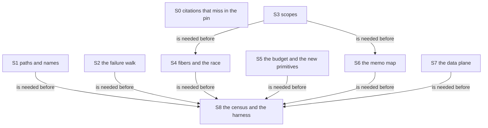

# 2026-10-05 the release 4.0.1 against the pin rc.112: the audit

Status: research note (history, not authority). Base: `5ebacecc`. Seat A401, under decisions
rows 232 and 236. The pin does not move by this note.

**The one thing to know:** for this tree, 4.0.1 is a new runtime revision. It is not a patch
release over the pin. The release rewrites the failure walk, the scope linkage, the race clean-up
and the memo map of layers. It also passes some values to the next continuation without a loop
iteration. It repairs `U-01` on the row's reproduction, and `U-02` stands and reaches one case
more. The census's own test fails on 54 of its 137 rows when it reads the release.

## Question

If the pin moved from `effect@4.0.0-rc.112` to `effect@4.0.1`, which statements of this
repository would change, and which would not?

The note answers in five parts:

1. which lines of the pin the tree cites, by file;
2. which cited lines stand in the release, which changed, and how;
3. what the changes do to the run loop, the scheduler and the completion store;
4. whether the two rows of the upstream backlog are repaired;
5. which census rows, declarations, register rows and harness expectations rest on a change.

## What was read or run

Every number below comes from a script of `docs/research/2026-10-05-seat-A401/scripts/`. Its
output is in `docs/research/2026-10-05-seat-A401/out/`, and `out/numbers.txt` holds the totals.
The scripts name their inputs in their headers.

| What | Evidence word | Where |
| --- | --- | --- |
| The registry record and the tarball of `effect@4.0.1`, both hashes checked | tested | `provenance/retrieval.txt` |
| The vendored tree against the tarball, and against an installed copy, byte for byte | tested | `vendor/effect-4.0.1/README.md` |
| The census table, written again by its generator with the new folder present | reproduced | `scripts/generate-effect-runtime-census.sh`, byte-equal to `generated/effect-runtime-census.tsv` |
| Both source trees and both compiled trees, parsed by `oxc-parser` 0.147.0 with no parse error | tested | `scripts/strip.mjs`, `scripts/units.mjs` |
| The file comparison | tested | `scripts/compare_trees.py`, `out/files.tsv` |
| The inventory of citations | tested, with a hand reading of 51 rows | `scripts/inventory.py`, `scripts/defaults.tsv`, `scripts/overrides.tsv`, `out/citations.tsv` |
| The map of every cited range to the release | tested | `scripts/map_citations.py`, `out/ranges.tsv`, `out/hunks.tsv`, `out/hunks/` |
| The class of every hunk that a cited range meets | reading | `scripts/hunk-classes.tsv`, joined by `scripts/classify.py` |
| The census's anchor and digest test, applied to the release | tested | `scripts/census_against_release.py`, `out/census-against-release.tsv` |
| The sentence of every census row that is not equal | reading | `scripts/census-summaries.tsv` |
| The run loop, the scheduler, the completion store, the scopes and the memo map, in both trees | reading | F4 to F9 |
| Four probes on both builds, bun 1.4.2, loaded by directory | tested (finite runs) | `probes/*.mjs`, `probes/*.out` |
| The truth harness's host phase, in a copy outside the repository | reproduced on the pin, tested on the release | F12, `out/truth-401/` |

The pin's build is `ts/eff/node_modules/effect` of the main checkout. The release's build is the
installed copy that equals the tarball in all its files. No Lean file changed, and no `lake`
command ran.

## Findings

### F1. The two trees

Measured by `scripts/compare_trees.py` (tested). A file's code is compared without comments, and
its compiled JavaScript shows whether a change is more than types.

| Measure | Count |
| --- | --- |
| Source files of the pin | 452 |
| Source files of the release | 496 |
| Files at the same path in both | 180 |
| Of those, equal in bytes | 54 |
| Of those, different in bytes | 126 |
| Files of the pin that moved | 267 |
| Files of the pin with no counterpart | 5 |
| Files that only the release has, after the moves | 49 |

- **The release has no `unstable/` folder.** Each area of the pin's `src/unstable/` is a top-level
  folder, and `unstable/httpapi/` is `http-api/`. The package entry points move with them:
  `effect/unstable/sql` is `effect/sql` (tested, `probes/profile-heads.*.out`).
- With the moves applied, 447 files pair up. Their status:

| Status of a paired file | Count |
| --- | --- |
| Equal in bytes | 61 |
| Comments or layout only | 33 |
| Moved, and equal once import paths are tree paths | 55 |
| Types only: the compiled JavaScript is equal | 14 |
| The compiled JavaScript differs | 284 |

- The brief's list holds for 4.0.1 itself. `Ref.ts`, `Latch.ts`, `Clock.ts` and
  `testing/TestClock.ts` are equal in bytes, and `Semaphore.ts` differs in comments only.
- `internal/effect.ts` has 236 hunks: 208 change compiled code, 27 are types only and 1 is an
  import.
- Of its 499 declarations, 373 have an equal TypeScript syntax tree, 104 compile to different JavaScript and
  16 are gone. The release adds 44 (`scripts/unit_status.py`).

### F2. The citations by file

Measured by `scripts/inventory.py` (tested). A citation has one of four forms:

- the full path of a pinned file, with or without lines;
- a bare file name with lines;
- a line part alone, which continues a file named before it;
- a row of the census table.

| Measure | Count |
| --- | --- |
| Citation rows found | 3190 |
| Rows that cite a file of the pin | 2980 |
| Line parts that continue a file outside the pin | 210 |
| Distinct cited ranges | 1190 |
| Cited files of the pin | 60 |
| Rows in the brief's domain, live files | 2503 |
| Rows in the brief's domain, archive files | 191 |
| Rows in other tracked files | 286 |

The twelve files with the most citations, and the status of their citations in the release
(`out/by-file.tsv` holds all 60):

| Cited file | Citations | Same text | Changed | Removed |
| --- | --- | --- | --- | --- |
| `internal/effect.ts` | 1318 | 913 | 370 | 12 |
| `Layer.ts` | 345 | 243 | 31 | 50 |
| `SchemaRepresentation.ts` | 245 | 224 | 13 | 0 |
| `Ref.ts` | 127 | 124 | 0 | 0 |
| `Deferred.ts` | 127 | 113 | 8 | 0 |
| `ConfigProvider.ts` | 92 | 61 | 17 | 2 |
| `Config.ts` | 69 | 15 | 45 | 4 |
| `Effect.ts` | 69 | 67 | 1 | 0 |
| `Scheduler.ts` | 64 | 58 | 5 | 0 |
| `SchemaAST.ts` | 40 | 22 | 9 | 0 |
| `testing/TestClock.ts` | 39 | 39 | 0 | 0 |
| `unstable/httpapi/HttpApiBuilder.ts` | 38 | 38 | 0 | 0 |

Over all rows that cite the pin, the status in the release is:

| Status | Rows |
| --- | --- |
| Same code at a mapped range | 2223 |
| A comment only, and the same text | 71 |
| The same code at another place of the file | 1 |
| Changed code | 550 |
| Removed code | 68 |
| A comment only, and the text differs | 8 |
| The file is named with no line | 59 |

- The release's range of each row is in `out/citations-mapped.tsv`. A range with the same code
  moves by the file's shift at that place.
- **A line part with no file name is attributed by rule.** The script takes the file named before
  it in the same block, the citing file's declared default, or the last file cited. A name check
  then tests the choice against the cited lines. 51 rows are attributed by hand
  (`scripts/overrides.tsv`).

### F3. The changed citations and their classes

Every hunk that a cited range meets has one class, read by hand (`scripts/hunk-classes.tsv`,
184 hunks). `scripts/classify.py` gives each changed citation the strongest class among its
hunks. No hunk is left without a class (`out/unclassified.tsv` is empty).

| Class | Meaning | Citations |
| --- | --- | --- |
| behaviour | An exit, a cause, an order, a mask or a state differs on some input | 287 |
| cosmetic | A rename, a field move, an object shape, a type, a stack-trace helper | 129 |
| refactor | The same exits in the same order, by the argument in the table | 107 |
| host | A difference at the host boundary only | 49 |
| api | A public name, a type signature or an entry point changes | 46 |

The 287 `behaviour` citations divide by reach:

| Reach | Meaning | Citations |
| --- | --- | --- |
| main | On an ordinary path of the modelled fragment | 104 |
| corner | On a named corner | 164 |
| budget | Only where one run-loop entry spends the operation budget | 15 |
| outside | Outside the fragment this tree models | 4 |

- `out/changed-citations.tsv` lists the 618 rows: the citing file and line, the Lean declaration
  that carries the citation, the release's range, the class and the hunks.
- A class is the class of the change that the range meets. It does not say that the citing
  sentence is false. F10 reads the census sentences one by one.
- The compiled JavaScript settles `types only`. A hunk is types only when no difference of the
  JavaScript comes from its lines, by the builds' source maps.

### F4. The run loop, declaration by declaration

Evidence: reading of `vendor/effect-4.0.0-rc.112/src/internal/effect.ts` and
`vendor/effect-4.0.1/src/internal/effect.ts`, with the probes named.

| Declaration | Pin | Release | What changed |
| --- | --- | --- | --- |
| `FiberImpl`, fields | `:526-552` | `:506-528` | The nine cached context fields move into one `cache` object. `_parent` and `_asyncContext` are new. `_observers` starts undefined |
| `FiberImpl.runLoop` | `:629-679` | `:622-674` | The same loop. It reads `this.cache` once per iteration. The three tests and their order are the same |
| `FiberImpl.evaluate` | `:599-628` | `:580-621` | A parked fiber keeps a node `AsyncResource` and re-enters inside it. At the exit the child leaves its parent's set by `_parent`, before the observers run |
| `FiberImpl.interruptUnsafe` | `:574-595` | `:555-576` | The stack frame is read from the cache. Nothing else |
| `FiberImpl.getCont` | `:680-698` | `:675-696` | The same pops. `contAll` is called through a local |
| `FiberImpl.succeedWith` | none | `:701-707` | New. It counts one operation and calls the next `contA` at once. Every 32nd call returns an exit to the loop |
| `FiberImpl.yieldWith` | `:699-702` | `:708-711` | Equal |
| `FiberImpl.setContext` | `:709-731` | `:718-733` | One cache object per context root, shared by the fibers of that root |
| `callback` (the `Async` primitive) | `:1102-1143` | `:1136-1185` | The same statements. The primitive has named fields |
| `AsyncFinalizer` | `:1145-1160` | `:1187-1202` | A cancel effect that fails is merged into the interrupt cause |
| `uninterruptible`, `uninterruptibleMask`, `interruptible`, `interruptibleMask`, `setInterruptible` | `:4302-4367` | `:4550-4643` | Equal text. Two helpers are new: `fiberEnterUninterruptibleUnsafe` and `fiberEnterInterruptibleUnsafe` |
| `forkUnsafe` | `:5264-5284` | `:5517-5539` | A deferred start captures the async context. The child is tracked by `child._parent`, not by an observer |
| `Latch` | `:5568-5651` | `:5825-5908` | Equal syntax tree |
| the `Failure` primitive | `internal/core.ts:529-547` | `internal/core.ts:580-610` | The walk sanitises the cause. This is `U-01`'s repair (F6) |

- **The operation counter and its budget.** `MaxOpsBeforeYield` keeps its default, and the
  scheduler's test is the same comparison (`Scheduler.ts:175` in the pin, `:185` in the release).
  The loop still counts one operation per iteration, resets the counter at each entry and injects
  one yield per entry at most.
- **The release counts more than iterations.** `succeedWith` counts each value that it passes on.
  `map`, `tap`, `match`, `matchCause` and the `Exit` frame use it. The budget is tested only when
  control returns to the loop.
- **The counts per combinator are almost all equal** (tested, probe R4, 31 combinators). Three
  differ by one operation fewer: `scoped`, `provideService` and every program inside a `scoped`.
  `acquireUseRelease` charges one more.
- **The budget's yield lands at another step** (tested, probe R5, budget 64). In a chain of 300
  maps the pin yields after steps 5, 67, 129, 191 and 253. The release yields after 6, 67, 128,
  189 and 250. A loop of 300 generator steps differs from its fifth yield on.
- The primitive tags grow from 17 to 20: `Match`, `MatchCause` and `WithFiberSucceed` are new
  (reading).

### F5. `Scheduler.ts`, `Deferred.ts` and the wake

Evidence: reading; every hunk of the two files is in `out/hunks/`.

- **`Scheduler.ts` has three hunks.** The priority buckets, the arming of the dispatcher,
  `runTasks`, `flush` and the two references are equal in bytes (the census rows pass).
- The first two hunks wrap the host timer: when the timer call throws, the scheduler arms a
  microtask instead (`Scheduler.ts:93-113` in the release). This is a host change.
- The third reads the budget from the cache (`Scheduler.ts:185`).
- **`Deferred.ts` has one hunk.** `makeUnsafe` builds the Deferred with a constructor, with the
  same two fields (`Deferred.ts:120-146`). Completion, the waiter order and `await` are equal.
- The posted wake of the queue moves two lines. The pin clears `scheduleRunning` inside
  `releaseTakers` (`Queue.ts:1956`), and the release clears it in the posted task
  (`Queue.ts:2462-2465`).

### F6. `U-01`: repaired on the row's reproduction

The row: a typed failure escapes an interruptible catch.

- **By reading, the release repairs it.** The `Failure` evaluator of the release
  (`vendor/effect-4.0.1/src/internal/core.ts:591-605`) reads the recorded interrupt once. When
  the fiber is interrupted and interruptible, it skips the continuations as the pin does.
- It notes whether a skipped continuation is a recovery handler. If one is, it drops the `Fail`
  reasons of the cause. In both cases it then adds the interrupt reasons.
- The pin's loop passes the cause on unchanged (`vendor/effect-4.0.0-rc.112/src/internal/core.ts:539-545`).
- **By the probe, the row's reproduction answers the interrupt** (tested, `probes/backlog.mjs`).

| Row of the probe | Pin | Release |
| --- | --- | --- |
| `poison`, the row's reproduction | `Cause([Fail(42)])` | `Cause([Interrupt(undefined)])` |
| `poisonOuterHandler`, what a masked outer handler is handed | `Cause([Fail(42)])` | `Cause([Interrupt(undefined)])` |
| `poisonFinalizerSees`, what a finalizer is handed | `Cause([Fail(42)])` | `Cause([Interrupt(undefined)])` |
| `poisonDie`, a defect in place of the failure | `Cause([Die("boom")])` | `Cause([Die("boom"),Interrupt(undefined)])` |
| `poisonNoHandler`, no recovery handler above | `Cause([Fail(42)])` | `Cause([Fail(42),Interrupt(undefined)])` |
| `quiet`, no interrupt | `Success 0` | `Success 0` |

- **The tree's signed divergence agrees with the release where a handler is skipped.** The
  machine passes on `Cause.sanitize` at each skipped frame with a failure arm: `skippedCause`
  (`src/Effect4/Machine/Frames.lean`) and `sanitize` (`src/Effect4/Machine/Cause.lean`). That is
  the release's rule on the first four rows (reading of both).
- **A new difference appears where no handler is skipped.** The machine then passes the cause on
  unchanged, as the pin does. The release adds the interrupt reasons (row `poisonNoHandler`).
- The truth harness shows the same on its fixture (F12): `pInterruptEscape` answers the
  interrupt on the release, as the Lean machine does.

### F7. `U-02`: not repaired, and it reaches one case more

The row: `Scope.close` answers a lone finalizer's value.

- **By reading, the release keeps both lone branches.** `scopeCloseUnsafe` still returns the
  finalizer's own effect (`vendor/effect-4.0.1/src/internal/effect.ts:3946-3952`), and
  `scopeClose` returns it as it is (`:3929-3935`).
- **By the probe, the row's five reproductions answer the same on both builds** (tested).
  `inline` and `mapOne` answer `5`. `zero` and `two` answer `undefined`. `loneDie` passes the
  defect.
- **A forked scope with one finalizer now takes the lone branch.** In the pin a forked scope
  holds a finalizer that removes it from its parent, so it holds two and the close answers
  `undefined`. In the release the link is a parent pointer, and the close answers the finalizer's
  value: `7` (tested, row `forkedChildOne`).
- **Three more changes of the scope show in the same probe:**

| Row of the probe | Pin | Release |
| --- | --- | --- |
| `parentAfterChildClose`, the parent's state tag | `Open -> Open` | `Open -> Empty` |
| `closeInterruptedMidFinalizer`, the finalizer's log | `finalizer started` | `finalizer started, finalizer finished` |
| `forkedChildOne`, the close's answer | `undefined` | `7` |

- `Scope.close` enters an uninterruptible region before the finalizers run
  (`vendor/effect-4.0.1/src/internal/effect.ts:3933`). The pin runs them with the caller's mask.
- The tree's disposition for `U-02` voids the lone finalizer at `Scope.close`. That disposition
  still departs from the release, and now on forked scopes too.

### F8. The five known defects, by line

Evidence: reading. The probes of the two lead notes showed the repairs.

| Defect | Pin | Release | The repair |
| --- | --- | --- | --- |
| P2. `takeBetween` drops its minimum after a wait | `Queue.ts:1431-1432` | `Queue.ts:1843-1845` | The retry keeps `min`. The taker registers with a readiness test (`:2496-2505`, `canTake` at `:2489-2491`), and the wake skips a taker that is not ready (`:2448`) |
| P3. An ending queue leaves a batch taker parked | `Queue.ts:1015` | `Queue.ts:1242-1244` | The close posts the wake. A closing queue is ready with one message (`:2490`) |
| P4. An interrupted pending offer is still delivered in a closing queue | `Queue.ts:2010-2012`, `:2030-2031` | `Queue.ts:2516-2521` | The entry is removed while the queue is open or closing, and a drained closing queue is finished |
| TX1. A transaction that retries on a stale read waits for ever | `Effect.ts:24322-24341` | `Effect.ts:24890-24913` | The wait checks the read set and registers in one synchronous step (`:24895-24897`) |
| TX2. A plain read wakes waiting transactions | `Effect.ts:24343-24354` | `Effect.ts:24915-24927` | The commit wakes only for a cell that the body wrote (`:24917`). It compares values with `Object.is` (`:24918`) |

All paths are under `vendor/effect-4.0.0-rc.112/src/` for the pin and `vendor/effect-4.0.1/src/`
for the release.

### F9. Other changes of behaviour in the cited files

Evidence: reading, with a probe where one is named.

| Where | Change | Probe |
| --- | --- | --- |
| `raceAll`, `raceAllFirst` (`internal/effect.ts:1603-1693` in the release) | The clean-up of the losers is decided at the race's exit, by an `OnExit` frame. The pin decides at the winner's resume. A loser forked while the race settles is never interrupted in the pin | R1: `B was not interrupted` on the pin, `B interrupted` on the release |
| `awaitAllChildren` (`:5569-5591`) | The await of the children is interruptible when the fiber was. The pin awaits inside a masked finalizer | R2: `still running` after the interrupt on the pin |
| `AsyncFinalizer` (`:1197-1201`) | A cancel effect that fails is merged into the interrupt | R3: `Cause([Die("cancel boom")])` on the pin, with the interrupt added on the release |
| `scopeForkUnsafe`, `scopeCloseUnsafe`, `scopeRemoveFinalizerUnsafe` (`:3938-4067`) | The link of a forked scope is a parent pointer. A scope with no finalizer left is `Empty` | F7 |
| `timeout` (`:3855-3881`) | The `TimeoutError` carries a message | R7 |
| The memo map of `Layer.ts` (`:235-265`, `:418-455`) | An observer is counted and registered in one synchronous step. The exit handler is installed before the entry is published. A closed scope builds with no entry | none; reading |
| `causeCombine` (`internal/core.ts:306-322`) | It moved, over `dedupeReasons`. The union and its order are the same if `Hash` agrees with `Equal` | none; reading |
| `SchemaRepresentation.ts`, the `Union` node | The field `mode` becomes an optional `options` record (interface `:453`, codec `:2746-2748`). The persisted shape of a union changes | none; reading |
| `Config.ts` | The evaluation carries no input evidence. `Config.all` fails at its first failing member. The constructors are renamed: `Config.string` is `Config.String` | none; reading |
| `ConfigProvider.ts` | An array index is canonical below 2^32 - 1 only (`:1236`). An interpolated value with a `$` pattern is inserted literally (`:1396`) | none; reading |
| `acquireUseRelease` (`:4396-4408`) | `use` runs inside a `suspend`, so a `use` function that throws still releases | R4: one operation more |

- The `Union` change meets no cited range. It is listed because the Schema census reads that
  file whole.
- **The seat reads four of these as repairs of the pin.** They are the race leak, the masked
  await of children, the lost interrupt of a failing cancel and the stranded memo observer.
- In the pin each leaves a fiber or an observer for ever, or loses a cause. Whether one is an
  upstream defect is the owner's decision (row 232).

### F10. The census against the release

`scripts/census_against_release.py` applies the generator's test to
`vendor/effect-4.0.1/src` (tested). The census itself stays on the pin.

| Verdict of a row | Rows |
| --- | --- |
| The anchor stands once and the span has the pinned digest | 83 |
| The anchor stands once and the span's bytes differ | 44 |
| The anchor stands on no line | 10 |

Eight of the twelve input files differ in bytes, so the generator stops at its first file test
before it reads a span. For the 54 rows that do not pass, the sentence was read against the
release (`scripts/census-summaries.tsv`, reading):

| Verdict of the sentence | Rows |
| --- | --- |
| Holds as written | 31 |
| Holds once a name or a mechanism is renamed | 11 |
| Changes | 12 |

The twelve rows whose sentence changes:

| Row | Why |
| --- | --- |
| `op.Failure`, `checkpoint.exit-failcause-skip` | The walk sanitises the cause (F6) |
| `op.AsyncFinalizer` | A failing cancel effect is merged |
| `op.Exit` | Either arm passes the exit to `succeedWith` |
| `fork.race-all` | The clean-up is decided at the exit |
| `fork.await-all-children` | The await is interruptible |
| `scope.remove-finalizer` | An emptied scope is reset to `Empty` |
| `scope.fork-linkage` | A parent pointer, and no finalizer in the child |
| `scheduler.host-loop` | A microtask fallback |
| `rule.budget-per-runloop-entry` | `succeedWith` counts too, and the test runs at an iteration only |
| `layer.memo-build-once`, `layer.memo-reuse-observer-count` | The entry's shape and the synchronous registration |

- The `op` kind has 17 rows for the pin's 17 primitive tags. The release has 20 tags.
- `out/census-dependents.tsv` gives every row with its verdict, its class, its coverage state
  and its witnesses.

### F11. What rests on the changes

Read from the tree as text by `scripts/dependents.py` (tested). No Lean build ran, so a
dependence through other theorems is not found here.

- **Declarations.** 287 Lean declarations in 58 files carry a changed citation
  (`out/declarations.tsv`). By the strongest class of their citations: 158 `behaviour`,
  50 `cosmetic`, 49 `refactor`, 23 `host`, 7 `api`.
- **Census rows.** The table below gives the rows of F10 whose sentence changes, with their
  coverage rows of `Test/Audit/RuntimeCoverage.lean`.

| Census row | Coverage | Witnesses |
| --- | --- | --- |
| `op.Failure` | partial | 4 |
| `checkpoint.exit-failcause-skip` | diverged (`U-01`) | 5 |
| `op.AsyncFinalizer` | green | 6 |
| `op.Exit` | green | 5 |
| `fork.race-all` | green | 33 |
| `fork.await-all-children` | green | 13 |
| `scope.remove-finalizer` | green | 10 |
| `scope.fork-linkage` | green | 10 |
| `scheduler.host-loop` | absent, target only | 0 |
| `layer.memo-build-once` | green | 7 |
| `layer.memo-reuse-observer-count` | green | 3 |
| `rule.budget-per-runloop-entry` | green | 14 |

- **Registry claims.** Four claims of `tools/Tools/SemanticsRegistry.lean` point at a witness of
  a census row whose span meets a change (`out/registry-direct.tsv`). They are
  `close-idempotent`, `close-twice`, `close-order-eq` and `close-reentrant-add`, all of the
  concept `scope-lifetime-finalization`. Their pointers are `Effect4.Scope.close_idempotent`,
  `Effect4.Scope.close_twice`, `Effect4.Scope.closeOrder_eq` and
  `Effect4.Scope.close_reentrant_add`.
- The join is direct only. Every claim about a run of the machine rests on the machine's step
  functions, and those transcribe the changed lines. The proof graph of a Lean build gives that
  closure.
- **Counterexample register.** Seven live rows hold a changed citation
  (`out/register-rows.tsv`):

| Row | Class of the change | Cited |
| --- | --- | --- |
| `E4-CONF-CE-003` | behaviour | `ConfigProvider.ts:1396-1399` |
| `E4-CONF-CE-005` | behaviour | `Config.ts:847-852`, `:674-675`, `:1041`, `:1211-1213` |
| `E4-RUN-CE-040` | behaviour | `Queue.ts:1974` |
| `E4-STORES-CE-004` | behaviour | `Layer.ts:396-411`, `:434-443` |
| `E4-SEM-CE-005` | host | `internal/effect.ts:4023-4028` |
| `E4-CONF-CE-001`, `E4-CONF-CE-006` | cosmetic | `ConfigProvider.ts:373` |

- `E4-SCHED-CE-008` is the register row of `U-01`. It cites no line of the pin, so it is not in
  the table. The release answers its program as the divergence does (F6, F12).
- **Generated TypeScript.** All 58 heads of the target profile resolve on the release (tested,
  `probes/profile-heads.*.out`). Two entry points that the tree imports are absent:
  `effect/unstable/sql` and `effect/unstable/persistence`.
- `Scope.close` takes a `Closeable` in the release, by type (`Scope.ts:568`). The type oracle
  reads that.

### F12. The truth harness on the release

`harness/truth/run-truth.ts` imports the bare name `effect`, which resolves through
`harness/truth/node_modules`. `scripts/lib/truth_host.py` refuses an install that is not
rc.112. The host phase needs no Lean build: it reads the committed `corpus.json`.

The seat ran the host phase in two copies outside the repository. Nothing committed changed.

1. **The control.** A copy of `harness/truth` and `ts/eff` at `5ebacecc`, linked to the pin's
   install. Its `result.json`, `result.md` and six tapes equal the committed files in bytes
   (reproduced).
2. **The release.** The same copy, linked to the release's build, with two import paths of
   `prelude.ts` changed in the copy and a stub for the SQLite driver. The driver of 4.0.1 was
   not fetched (tested, a finite run of 39 programs).

| Outcome on the release | Programs |
| --- | --- |
| The same verdict and the same exit as on the pin | 30 |
| `pInterruptEscape`: the host now answers the interrupt, as the Lean machine does | 1 |
| The exit agrees and the schedule differs: `pProvideMerge`, `pProvideTwice`, `pMergeAll` | 3 |
| Not comparable: the five programs that reach the SQLite driver | 5 |

- **The three schedule differences are one fork fewer.** Each program ends with one more
  `forked`, `started`, `exited` triple on the pin than on the release. The Lean machine has the
  pin's triple.
- By reading, the cause is the scope link. A forked scope holds no removal finalizer in the
  release, so a parallel close has one finalizer fewer to fork. This cause is not tested.
- The recorded primitive frames differ in 20 programs. They are not part of the verdict, and
  they are part of the committed `result.json`.
- `out/truth-401/summary.tsv` gives every program. `out/truth-401/result.v401.json` is the
  release's result.

### F13. Citations that miss in the pin itself

Some citations do not point at what they name in rc.112. This is independent of the release.

- **The arms table.** `Effect4.Program.arms` (`src/Effect4/Program/Eff.lean`) cites
  `internal/effect.ts:1275` for `succeed`. The pin declares `succeed` at
  `vendor/effect-4.0.0-rc.112/src/internal/effect.ts:920`. Of the 22 rows that cite that file,
  12 cite a line outside the declaration they name. `src/Effect4/Laws/Program/Typing/HasTy.lean`
  copies them (tested by a script run of the seat, then reading).
- **Join and await.** The machine cites `:5291` and `:5304` for `fiberJoin` and `fiberAwait`.
  Those lines are inside `forkDetach`. The pin declares the two at `:814` and `:767`.
- `scripts/stale_in_pin.py` lists 77 candidates of this kind (`out/stale-in-pin.tsv`). A row is
  a candidate, not a verdict.
- The name check of F2 gives the wider measure. For 1667 line citations the citing text names an
  identifier of the cited lines. For 1090 the check finds no such name, and 27 were read by hand.

## Proposals (not rulings)

### The migration, in slices

The diagram shows the order of the slices. It claims no estimate of effort.

| Slice | Transcribes again | Proves again |
| --- | --- | --- |
| S0. Citations that miss in the pin | The arms table and the candidates of F13, against rc.112. No pin move | Nothing |
| S1. Paths and names | The package tables (`src/Effect4/Program/Packages/`), `tools/Drivers/TsGen.lean`, the harness prelude's imports, the `Config` constructor names | Nothing; the generators and the type oracle run again |
| S2. The failure walk | `exitFailCause` of the release into `skippedCause` and the pop walk: add the interrupt reasons when no handler is skipped | The failure clauses of the frame machine, the walk's typed-state lemmas, the agreement on the failure path. The signed divergence `U-01` retires |
| S3. Scopes | The parent pointer, the `Empty` reset, the uninterruptible `Scope.close`, the directly pushed `OnExit` frame of `scoped` | The scope machine's laws and the four registry claims, the store laws of the scope rows, every charged-operation count through `scoped` |
| S4. Fibers and the race | The parent pointer of a child, the race's `OnExit` frame, the interruptible await of children, the merged cancel failure | The clauses and witnesses of `fork.race-all` and `fork.await-all-children`, the command preservation for the race |
| S5. The budget and the new primitives | `succeedWith`, the three new tags, the yield test at an iteration only | The budget clauses, and each agreement that counts operations |
| S6. The memo map | The entry's shape and the synchronous registration | The sixteen layer rows' witnesses, the memo world's laws |
| S7. The data plane | The `Union` options of the persisted representation, the `Config` evaluation, the two provider corners | The codec retractions of the union node, the Config contract |
| S8. The census and the harness | 54 census rows with new anchors and digests, three new `op` rows, the coverage join, the harness's version test and its committed result | Nothing; the gates run again |

- **The pin move is one step for the census.** Its file digests change together. So S2 to S7
  land beside the pin's definitions first, each with its agreement theorem, and the callers move
  with S8.
- **`U-02` needs a ruling before S3.** The release keeps the defect. The tree's void at
  `Scope.close` stays a divergence, and the forked scope with one finalizer is a new case of it.
- **The SQLite driver is not audited.** `@effect/sql-sqlite-bun@4.0.1` was outside this seat's
  network grant. Five harness programs wait on it.

### Follow-up lanes

1. **The truth lane on the release**, as F12, with the driver installed. It takes one host run
   of the corpus, and no Lean build while the manifest is the committed one.
2. **The corpus lane** (`scripts/check-corpus.py`) on the release, by the same copy.
3. **The proof-graph closure** of the 287 declarations, by a Lean build of the plan tooling.

### Register rows the seat proposes

The coordinator writes the registers. The receipt lists each row.

## What this does not establish

- **No proof.** Every statement about behaviour is a reading or a finite probe on bun 1.4.2.
  A probe that agrees on both builds shows no difference on its inputs only.
- **A class is a judgment of the seat.** `refactor` rests on the argument in the table, not on a
  run of every path. Three arguments carry an assumption that the table names.
- **Only the cited ranges are classified.** The cited files hold 1296 hunks that change compiled
  code, and 155 of them meet a cited range. The `Union` change of F9 shows that an uncited hunk
  can matter.
- **Attribution of bare line parts is by rule.** 346 rows are attributed with no confirming
  name. The archive files are not read by hand.
- **The dependence join is direct.** A claim that rests on a changed declaration through other
  theorems is not listed.
- **The tree's machine was not run.** The comparison of the signed divergence with the release
  reads the Lean source and the recorded harness manifest.
- **The release's own tests and documentation were not read.** Whether a change is intended
  upstream is not established, except where a comment of the release says so.
- **The provenance attestation of `registry.npmjs.org` is not verified.** Its subject digest
  equals the tarball's, and its signature was not checked.
- **4.0.0 is not compared.** The brief's earlier measure was against 4.0.0; 38 source files
  differ between 4.0.0 and 4.0.1.
