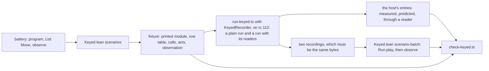

# 2026-10-05 seat HOST design: the scenarios on the printed TypeScript module, on the keyed lane

Status: a design note (history, not authority). Brief:
`docs/research/2026-10-05-claude-lead/briefs/seat-host-brief.md`. Base: `310c8314`. Written on
2026-10-06, before the first commit of the seat. Section 8 was amended the same day, after the
coordinator's ruling.

The note fixes six things. They are one run's parts, the host's act for each `Move`, and each
field's source of evidence. Then come the scripts a host can perform, the schedule and the
files. Section 8 holds the coordinator's ruling on the recorder's extension and on the readers.

A draft of the lane ran on 2026-10-06, on effect 4.0.0-rc.112 under bun 1.4.2, with tsgo
7.0.0-dev.20260629.1. Each number below is a count of that draft's finite host runs. No number
is a status of the tree.

## 1. One run

A host run is one script of a battery on one program that the battery builds. The lane is the
keyed lane of `harness/truth/session/`, extended. It gets no second runner and no second recorder.

- **The fixture** holds the printed module (`Api.printModule`), verbatim, and the row table. It
  holds the script as the journal rows that the battery's own driver leaves
  (`Test.Dogfood.Scenario.play`). It holds the battery's `observe` of that run, one JSON value a
  field.
- **The host** acts out each row on the printed module, through `KeyedRecorder`. It writes each
  record from what it did. A record holds the call's own row and request, the recorder's own call
  id, and the completion that the call's host operation gave.
- **The host's entries** are the fields of the observation that the host has a source for
  (section 3). The check compares each with the same field of the fixture.
- **Lean's replay** plays the rows of the recording with `Run.play`, from the run that the
  battery opens. It reads the battery's `observe`, and it compares by the battery's own equality.
  It shows that the session accepts what the host did. It measures nothing more of the host.

## 2. How a `Move` becomes a host act

The driver turns a move into journal rows (`Move.rows`, `Test/Dogfood/Scenario.lean`). The host
acts out each row, so no selector is resolved a second time in TypeScript.

| `Move` | Journal rows | The host's act |
| --- | --- | --- |
| `control` of the root's evaluation (`Move.start`) | one control row | Start the printed `main` with `Effect.runFork`. rc.112 runs the root at once, to its first suspension. No dispatcher runs before the next act. |
| `control` of a flush | one control row | Let every dispatcher run. |
| `control` of a clock step (`Move.tick`) | one control row | `TestClock.adjust` at the clock boundary (`clock.ts`), then let every dispatcher run. |
| `control` of an interruption with no interruptor (`Move.cancel`) | one control row | `interruptUnsafe()` on the runtime fiber of that fiber, then let every dispatcher run. |
| any other `control` | one control row | No act of a host: `fire`, a yield verdict, the middleware latch, an interruption by a fiber, a direct answer decision. |
| `hold` | one `bind` row, or none | Hold the live call at the row's key: write its `call` record with the recorder's next call id. |
| `receive` | one `submit` row, or `bind` then `submit`, or none | Hold the call first when the driver did. Stage the scripted completion. The call's host operation gives it, and the recorder stores it or refuses it. |
| `apply` | one `apply` row, or none | Resume the call with its stored reply, or note the ledger's refusal. |
| `row` | the raw row | The act of that row when it restates the recorder's ledger. A forged reply has no host act. |

A move with no row has no act. The script `lookups` offers a repository answer to a request that
made no repository call: the driver plays nothing, and the host does nothing.

## 3. The source of evidence of each field

Each table has one row for each field. A field has one of four sources.

- **Host**: the host measures the field by itself, in a run with no reader.
- **Ledger**: the field holds the session's refusals. The recorder's ledger predicts each one,
  and the check compares each prediction with the verdict of Lean's replay for the same record.
  The verdict itself is replay evidence.
- **Reader**: the host measures the field through a named reader of section 8, at the script's
  end. It is no unassisted host measurement.
- **Replay only**: the field has no reader on the host. Lean's replay is then its only
  evidence, and the scenario's whole-observation comparison waits for it.

The checkpoint of every field is the end of the script, after the last act.

Two identity mappings serve every table.

- **A call to its key.** The fixture lists every call that the machine waits on during the
  script, in the order of the guard tokens. The recorder gives the n-th call that the module
  starts the n-th key. It checks the row and the request, and it keeps the association of runtime
  fibers and machine fibers bijective.
- **A runtime fiber to a fiber of the machine.** The root is fiber 0. Any other fiber gets its
  number at its first call. A fiber that makes no call has no number on the host.

### 3.1 Routing: three fields, two measured on the host and one predicted by the ledger

| Field | The host's measurement | Serialization | Identity | Source |
| --- | --- | --- | --- | --- |
| `outcome` | The root fiber's exit, from its observer; none while the root is live. | The lane's exit wire. A record is its frame: names in byte order, then values. | root | Host |
| `repositoryCalls` | The request of each call that the script held on the row spelled `UserRepo.findById`, read from the module's own argument, in hold order. | The lane's value wire. | call to key | Host |
| `refusals` | The records that the recorder's ledger predicts as refused, in order: a reply or an application with no live call (`noCall`), and a second reply at a key (`pendingReply`). | Pairs of the row's kind and the session's word. | call to key | Ledger |

The session has refusals that no ledger predicts. `envelope` is reply admission, and a host has
none of its own. A script with such a refusal is not performable (section 4).

### 3.2 Workers: seven fields, the work left in five parts

| Field | The host's measurement | Identity | Source |
| --- | --- | --- | --- |
| `assignment` | The cell `assigned` of the program, the third cell. | cell by allocation index | Reader: cells |
| `receipts` | The replies that the ledger stored, in order. | call to key | Host |
| `applications` | The replies that the recorder applied, in order. | call to key | Host |
| `retired` | The held calls whose callback a cancellation interrupted, each with whether a stored reply waited. Within one act they stand in hold order, as the session's `retire` lists them. | call to key | Host |
| `cleanups` | The cell `released` of the program, the second cell. | cell by allocation index | Reader: cells |
| `rootExit` | The root fiber's exit. | root | Host |
| `workLeft.awaiting` | The module's live calls, held or not, by the machine's fiber. | call to key | Host |
| `workLeft.pending` | The stored replies that no application consumed, in hold order. | call to key | Host |
| `workLeft.runnable`, `workLeft.queued` | The count of armed dispatchers. Zero is the two empty lists. The count names no fiber, so the fields wait in a script where Lean's field names one. | — | Reader: dispatchers |
| `workLeft.timers` | The pending sleeps of the clock boundary, each with its fiber and its wake time. | runtime fiber to fiber | Reader: sleeps |

### 3.3 Timeout: nine fields, one with two sources

| Field | The host's measurement | Source |
| --- | --- | --- |
| `calls` | The fate of each held call on `Http.getQuote`, from the ledger: live, applied with its stored completion, or retired with or without a kept reply. | Host |
| `receipts`, `applications`, `retired`, `stored` | The ledger's keys, as in workers. | Host |
| `attempts` | The cell `count`, the first cell. | Reader: cells |
| `cleanups` | The cell `ended`, the second cell. | Reader: cells |
| `root` | The ending that the root fiber's exit shows. | Host |
| `timers` | The pending sleeps of the clock boundary, in a script where every sleeping fiber is the root or made a call. None in any other script: a timer's fiber makes no call, so it has no number on the host. | Reader: sleeps, or replay only |

### 3.4 Atomic: five fields, each through a reader

`decisions` and `completed` read each request fiber's exit: the fibers reader. `window`,
`account` and `cleanups` read three cells: the cells reader. The shop has no host row, so the
recorder sees no call and names no fiber but the root. The root's exit is no field of the
observation, and the lane does not put it in a field's place. With no reader, every field is
replay only.

## 4. Which scripts a host can perform

The Lean driver decides it by rule, for each script of each control (`performable`,
`harness/truth/session/Keyed.lean`). It writes a fixture or a reason.

| Rule | Reason when it fails |
| --- | --- |
| The first row is the root's evaluation, and no later row is one. | A second evaluation is no act of a host. |
| Every control is a flush, a clock step or an interruption with no interruptor. | A direct answer decision or a scheduler control is no act of a host. |
| A cancellation names the root or a fiber that made a call. | The host has no name for that fiber. |
| A reply carries the call id of the call held at its key. | A forged reply: the recorder's replies carry its own call ids. |
| A host answer is a success or one tagged failure. | The scripted host gives no other completion. |
| A refused reply is refused as `noCall` or `pendingReply`. A refused application is refused as `noCall`. | The session's refusal is its own: a host has no reply admission. |
| No row stops at a frontier of the budget. | A host has no budget. |
| After a row the machine has no armed owner and no runnable fiber, unless the row is the root's evaluation or the next row is a flush. | The host lets every dispatcher run after each act but the root's start. |

The draft's driver listed 54 scripts: each script of each control, on the program of that
control. A red control of a battery often runs a faulty twin of the scenario's program, and the
driver lists those scripts too. One of them is the only routing script whose refusals are not
empty on the host.

The draft performed 48 scripts: 9 of routing, 16 of workers, 15 of timeout and 8 of atomic. In
each of the 48 runs every measured field agreed with Lean's field, and Lean's replay gave the
script's observation. Six scripts have no host act:

| Script | Reason |
| --- | --- |
| routing, the wider record | The session refuses the reply as `envelope`. |
| routing, the business tag under the exact error column | The session refuses the reply as `envelope`. |
| workers, worker 1's reply under worker 2's key | A forged reply. |
| timeout, the first attempt's reply under the second attempt's key | A forged reply. |
| timeout, an answer decision at the second attempt's key | A direct answer decision. |
| atomic, the interruption of request 2 | The host has no name for fiber 3. |

One performed script leaves the lane. tsgo 7 refuses the printed module of the twin with the
exact error column, with two diagnostics `TS2375`. The lane runs only a module that type-checks,
so the driver names that script with this reason. The other 47 modules type-check, the shop's
among them.

Two more controls have no script of the driver's alphabet. The timeout battery's frontier control
edits the run's budget. The journal controls play a journal, and section 7's replay control
covers them.

The coordinator repaired the retry form's delays on 2026-10-06 (`0f76dd2a`). The driver's
timeout scripts took the battery's new delays, and the same 15 scripts agreed again. The driver
restates a control's script from the battery's named parts and its literal moves, as
`Test/Dogfood/Scenario/Tape.lean` does. A changed literal of a control does not reach the driver
by itself.

## 5. How the host knows a scripted completion

The fixture's `reply` act carries the completion. The runner stages it, and then it asks the
recorder for the reply's receipt. The recorder runs the host operation of the answered call. In a
scenario that operation gives the staged completion, once (`ScriptedHost`,
`harness/truth/session/keyed-bindings.ts`). The recorder writes the `reply` record from the exit
that the operation gave. So a recorded completion is the value that resumed the module.

## 6. How the schedule is fixed on rc.112

- **The script states every decision of the host.** They are the order of the receipts, the
  order of the applications, each cancellation and each clock step.
- **rc.112 chooses the rest.** It starts the forked fibers in fork order. It wakes the sleeps
  of one clock step in deadline order. It runs an interruption's cascade at once.
- **The host lets every dispatcher run where the machine drains.** The four places are a
  flush, a reply application, a cancellation and a clock step. The root's start is not one.
  rc.112 runs a dispatcher's tasks in one macrotask (`Scheduler.ts`,
  `MixedSchedulerDispatcher`). The plain run cannot read whether a dispatcher is armed, so it
  waits 64 turns. The run with its readers waits until the count of armed dispatchers is zero.
- **The recording carries no order of its own.** Its records are the script's acts. The
  machine's order inside a flush is no decision, so Lean has no second schedule to replay. An
  order of rc.112 that differs from the machine's shows as a refusal of the recorder, or as a
  disagreement of a field.

One limit stands. Both workers call `Jobs.take` with one request. If rc.112 started worker 2
first, the recorder would give worker 2 the key of worker 1 without a refusal. Only a field that
names a worker would show it: the cell `assigned`, or the released order in the root's exit.

## 7. The files, the check and the three red controls

| File | Change |
| --- | --- |
| `harness/truth/session/Keyed.lean` | The modes `scenarios` and `scenario-batch`: the runs, the rule of section 4, the fixture, the replay. `consume` reads a record through `command`, the one reading of a record. |
| `harness/truth/session/keyed-recorder.ts` | A fixture may be `scripted`: the ledger of held calls, `hold`, `cancel`, `flush`, `snapshot`, the ledger's refusals. Records enter the value wire. |
| `harness/truth/session/keyed-bindings.ts` | The scripted host, and the rows of a scenario's table as the objects that its module names. The cells reader's `Ref`, the fibers reader's `Effect` and the count of armed dispatchers. |
| `harness/truth/session/clock.ts` | The sleeps reader, off by default. |
| `harness/truth/session/keyed-observation.ts`, new | Each field's source on the host, for each scenario. |
| `harness/truth/session/run-keyed.ts` | A third argument: the scenarios' fixtures. It performs each script twice, with no reader and with its readers. |
| `harness/truth/session/prepare-keyed-controls.ts`, `check-keyed.ts` | The scenarios' controls and the comparison. |
| `harness/truth/session/keyed-protocol.test.ts` | Unit tests of the scripted recorder and of each reader. |
| `scripts/check-host-protocol.py`, `Makefile` | The steps below, the pinned digest, and the batteries as inputs of the check's marker. |

No fixture is committed. The check writes each fixture afresh under the lane's work folder, as
it writes the lane's own fixtures.

`scripts/check-host-protocol.py` adds these steps to its run.

1. Build the four batteries.
2. Write the fixtures with `Keyed.lean scenarios`.
3. Perform the scripts with `run-keyed.ts`.
4. Compare the digest of the four fixture families' recordings with its pin.
5. Check each written module with tsgo 7, under each header, beside the lane's sources.
6. Replay the recordings with `Keyed.lean scenario-batch`.
7. Compare each entry, each replay, each prediction and each pair of recordings with `check-keyed.ts`.

The three red controls of the brief, one for each connector, and two more:

| Connector | Fault | The check must |
| --- | --- | --- |
| The host's measurement | A fault on the host only: a faulty `Ref` drops one update of the cell `assigned`. The root's exit does not read that cell. | Fail at `assignment`, and at no other entry. |
| The comparator | One changed expectation of a fixture. | Fail by the run's name. |
| Lean's replay | One recording with a moved record: a reply application before its receipt, or a late reply moved to stand after its call. | Report another observation, or another verdict than the ledger predicted. |
| The readers' control | One dropped record of a recording. | Report a difference of the two recordings. |
| The ledger's predictions | One prediction taken away. | Report a verdict that no prediction covers. |

## 8. The coordinator's ruling of 2026-10-06

**The planned extension of the recorder.** The recorder refuses an operation that completes
after its cancellation. The design: a cancellation retires the held calls whose callback it
interrupts, and it keeps each stored reply with its retired call. A reply for a call that is
gone is a late reply. The recorder runs the call's host operation, writes the `reply` record
with the call's own id, stores nothing and notes `noCall`. An application with no stored reply
writes the `apply` record, resumes nothing and notes `noCall`. So the session gives each row its
own verdict on replay. The lane's four fixtures of today keep the refusals of today: only a
`scripted` fixture takes this branch.

The coordinator had no objection, and added one rule. A note of the recorder is a prediction,
and the recorder is no second session. So the recorder holds no rule that the session does not
have, and the check compares each prediction with the verdict of Lean's replay. The recorder's
two rules are `submit`'s and `applyReply`'s (`src/Effect4/Api/HostSession.lean`).

**Four readers inside the program's state.** The coordinator settled all four, under six
conditions.

| Condition | How the lane meets it |
| --- | --- |
| A transparency control | The runner performs each script with no reader, with its readers, and with each reader alone. The check compares each recording with the plain run's, byte for byte. It also compares the root's exit, and what a reader gives alone with what it gives among the others. |
| Off by default | A reader is on only where Lean grants it in the fixture (`readersOf`). The check pins the digest of the four fixture families' recordings. |
| Harness only | Each reader lives under `harness/truth/session/`. The module's text under the header stays verbatim, and tsgo 7 checks it under both headers. |
| A spy gives the pinned object | The reader's `Ref` and `Effect` inherit from the pinned ones. A spy calls the pinned head and hands on the cell or the fiber that it made. |
| An evidence word a field | A field is measured by the host, predicted by the ledger, measured through a named reader, or replay only. |
| A reader refuses, and does not guess | Lean checks each premise on the program and the run. The runner checks each count, and it refuses a reader on a difference. |

| Reader | What it reads | Where | Its premise, checked in Lean | Fields it gives |
| --- | --- | --- | --- | --- |
| Cells | The value of each cell that the module makes, by allocation index. | The header binds `Ref` to an object that inherits from the pinned `Ref` and owns `make`. The read is `Ref.getUnsafe` at the script's end. | The root makes every cell before it makes a fiber (`cellsFirst`). The fixture holds the count of cells. | workers `assignment`, `cleanups`; timeout `attempts`, `cleanups`; atomic `window`, `account`, `cleanups` |
| Forked fibers | Each fiber that the module forks, in fork order, with its exit. | The header binds `Effect` to an object that inherits from the pinned `Effect` and owns the three fork heads, in both call forms. | The program holds no race, and every fiber of the run but the root has a source point. The fixture holds their count. | atomic `decisions`, `completed` |
| Sleeps | Each pending sleep: its fiber and its wake time. | The clock boundary's own `sleep` notes a sleep's start and its end. | Every fiber that sleeps at the script's end is the root or made a call. | workers `workLeft.timers`; timeout `timers`, in each script where the premise holds |
| Armed dispatchers | Whether a dispatcher of the run is armed, as a count. | A `Scheduler` at the boundary: the pinned `MixedScheduler` in its mode `"async"`, over the real `setImmediate` behind a counter. | Lean's two lists are empty at the script's end. | workers `workLeft.runnable`, `workLeft.queued`; the exact wait of every run with readers |

Three limits stand.

- A race forks two fibers of the machine through no fork head. So the fibers reader has no
  premise for the timeout scenario, and a timer's fiber has no number on the host. Timeout's
  `timers` is replay only in each script where a timer's fiber sleeps at the end. The
  coordinator agreed to the split by script on 2026-10-06.
- The fibers reader gives a fiber a name, and a script that cancels a fiber with no call needs
  that name to run at all. Such a script has no run with no reader, so the readers' control
  has no reference for it. The atomic script that interrupts request 2 stays without a host run.
- The plain run keeps the fixed wait of 64 turns. It is the reference of the readers' control,
  and no measured run uses it.
