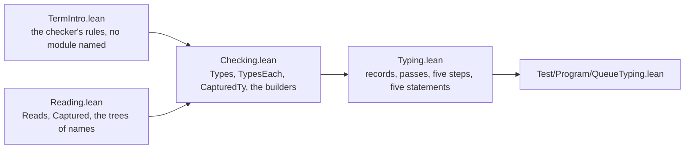

# 2026-10-05 seat QTYPES receipt: the checker read at a symbolic type, and the Queue's five typing goals

Status: receipt (history, not authority). Brief:
`docs/research/2026-10-05-claude-lead/briefs/seat-qtypes-brief.md`, with the dispatch message.
The coordinator sent three messages after it. The first accepts the plan and adds three points.
The second names the merged head `e9a3b1af`. The third names the merged head `835696c1` and
asks for four things, among them a positional read's rule. Codex's review of this seat is
`docs/research/2026-10-05-codex-foundation-packet/implementation-audit/heartbeat-0451-fixtures-semaphore/qtypes/report.md`.
It read the tree at the dispatch commit, before the first proof, and it names no finding on the
seat's source (reading).

**The one thing to know before merging:** `generated/semantics.md` is stale by part 2. No
node, statement or placement changes since `598ef8e0`. Part 2 adds four untagged theorems to
two modules that have a default concept, so the report's count of inherited theorems moves.
The proofs of `takeStep_types` and `pollStep_types` read two of them, so those nodes' counts
can move too. I did not run the generator: the two effects are my reading.

Five more facts stand beside it.

- **The five statements are unchanged word for word.** No step term, no model file and no
  statement of `src/Effect4/Laws/Modules/Queue/Steps.lean` changed.
- **A caller's term has its type under each literal flag.** A string literal has two types, so
  it is no caller's term of a step's theorem. A wrapper binds a message before the offer step
  takes it (section 9, item 3).
- **The capture's resolution premise stays a premise.** `captured_minted` asks that the name
  resolves at the step's scope of names. Two lemmas discharge it for the names that `bindWith`
  mints: `written_ne_mint` and `mint_depth_inj`.
- **Part 2 lands a positional read's rule**, at the coordinator's request. Its consumer is the
  wrapper's law, and its control is in the battery.
- **Three syntaxes reserve the token `under`.** A hypothesis of that name fails the proof-style
  scan. Section 10 gives the repair, which I did not apply.

## 1. Base, head and commits

| Item | Value |
| --- | --- |
| Branch | `seat/qtypes`, in the worktree `/Users/pooks/Dev/lean4-effect4-qtypes` |
| Base | `2f22ad7b` |
| Main-line heads taken in by a merge commit | `e9a3b1af` as `cc357895`; `835696c1` as `f5221d5a`. No conflict |
| Part 1's head, merged by the coordinator as `0b048da4` | `598ef8e0` |
| Head | the commit that adds this receipt; its parent is `e3d18567` |

Nothing is pushed.

| Commit | Part | Content |
| --- | --- | --- |
| `8989628e` | 1 | `Reading.lean`: the capture of a minted name, for values |
| `c85376dd` | 1 | `TermIntro.lean`: the term checker's rules in their introduction form |
| `ae9a9658` | 1 | `Checking.lean`: the judgment `Types`, the typed capture, one lemma for each builder |
| `b720414a` | 1 | `Typing.lean`: the records, the passes, the five steps at every scope, the five goals |
| `cc357895` | — | the merge of `e9a3b1af` |
| `59870b75` | 1 | the hypothesis `under` renamed in two proofs |
| `598ef8e0` | 1 | `Test/Program/QueueTyping.lean`, with its red controls and pins |
| `a4f71231` | 2 | `Reading.lean`: `written_ne_mint`, `mint_depth_inj` |
| `f2d1fdc5` | 2 | a positional read's rules, and the replies' normal forms |
| `344639d6` | 2 | the battery at a scope of three minted names; the architecture row |
| `f5221d5a` | — | the merge of `835696c1` |
| `e3d18567` | 2 | the connector at every scope; two lemmas without a consumer deleted |

## 2. Changed files

| File | What changed |
| --- | --- |
| `src/Effect4/Laws/Program/Typing/TermIntro.lean` | new: 58 theorems and 5 private ones. It names no module |
| `src/Effect4/Laws/Modules/Queue/Checking.lean` | new: `Types`, `TypesEach`, `CapturedTy`, `TypesAll`, and 48 theorems |
| `src/Effect4/Laws/Modules/Queue/Reading.lean` | 11 new theorems. `reads_minted_acc`, `reads_minted_item` and `captured_var` keep their statements and read the new tree lemmas |
| `src/Effect4/Laws/Modules/Queue/Typing.lean` | 51 new theorems, counting the five goals. One new import: `Checking.lean`. The header says what is proved |
| `src/Effect4/Laws.lean` | two imports after `import Effect4.Laws.Modules.Queue.Steps` |
| `Test/Program/QueueTyping.lean` | new battery: 34 guards, 12 examples, 5 theorems, 33 pinned outputs |
| `Test/Program/QueueSteps.lean` | prose only, and one name left an `open` list. Every guard and red control stays |
| `Test/All.lean` | one import after `import Test.Program.QueueFaces` |
| `docs/ARCHITECTURE.md` | the row of `src/Effect4/Laws/Modules` names `Checking.lean` and `TermIntro.lean` |
| this receipt | new |

The counts come from a script over the four law files against `2f22ad7b`. Its output is
`final2/declarations.txt` in the scratch folder.

The four law files import in one order.



I edited no model file, no step term and no statement of `Steps.lean`. I edited none of the
coordinator's files: `tools/Tools/SemanticsRegistry.lean`, `generated/semantics.md`,
`docs/core/decisions.md`, `docs/STATE.md`, `lakefile.toml` and `Test/Audit/AxiomGate.lean`. I
edited no file under `src/Effect4/Laws/Auto/`.

## 3. Commands and results

Each Lean or Lake command ran through `/Users/pooks/Dev/lean4-effect4/scratch/lean-slot.sh`,
named `SLOT` below. The scratch folder is
`/private/tmp/claude-501/-Users-pooks-Dev-lean4-effect4/acf2315e-02ac-4acd-9ef9-b0734bd686a7/scratchpad/qtypes/`,
named `SCRATCH`. No `make` target ran.

| Command | Result | Evidence |
| --- | --- | --- |
| `SLOT lake build`, on `2f22ad7b` | `Build completed successfully (953 jobs)`; 29 planned goals | tested: the baseline |
| `SLOT lake env lean -DwarningAsError=true src/Effect4/Laws/Program/Typing/TermIntro.lean` | exit 0, no output | proved |
| `SLOT lake build Effect4.Laws.Modules.Queue.Checking` | `Build completed successfully (455 jobs)` | proved |
| `SLOT lake build Effect4.Laws.Modules.Queue.Typing`, first run | one error, in `typeAt_tree`: `Option.noConfusion typed` did not elaborate | reproduced red: one proof step, repaired with `absurd` |
| the same, second run | `Build completed successfully (456 jobs)` | proved |
| `python3 SCRATCH/compare_goals.py` | five lines `statement and placement unchanged: True`, against `2f22ad7b` | tested |
| `SLOT lake build`, after the merge of `e9a3b1af` | failed at `Test/Audit/ProofStyle.lean`: two findings `new unread command`, for `captured_minted` and `capturedTy_minted` | reproduced red: the token `under` |
| `SLOT lake build`, on `598ef8e0`'s tree | `Build completed successfully (956 jobs)`; Lake restored every module but the changed ones from its artifact cache | proved, tested |
| `SLOT lake build`, on `f5221d5a`'s tree | `Build completed successfully (956 jobs)` | proved, tested |
| `SLOT lake build`, on `e3d18567`'s tree | `Build completed successfully (956 jobs)` | proved, tested |
| `SLOT lake env lean SCRATCH/final2/Axioms.lean` | 168 lines, one for each new public theorem | proved: section 5 |
| `SLOT lake env lean SCRATCH/red3/QueueTypingRed.lean` | exit 1, 12 errors: each falsified check, and no other | tested: the battery's red controls |
| `SLOT lake env lean SCRATCH/under/Contextual.lean` | exit 0 | tested: a toy syntax |
| `SLOT lake env lean SCRATCH/under/Reserved.lean` | exit 1: `unexpected token 'under'` | tested: a toy syntax |
| `python3 scripts/check-docs.py` | `PASS check-docs: every path, link, citation and make target in 74 documents resolves` | tested |
| `python3 scripts/check-language.py --show docs/ARCHITECTURE.md` | no finding at the edited row | tested |

The gates of the last default build, on `e3d18567`'s tree, as `Test/All.lean` prints them:

| Gate | Result |
| --- | --- |
| Library-root gate | 167 API and utility modules, 287 Laws-only modules; every library source is reachable; `Effect4` never reaches Laws |
| Module and axiom gate | 706 modules and 86047 declarations; semantic and test axioms are `[propext, Quot.sound]` |
| Goal gate | 24 planned goals; 11 declarations rest on goals; no other declaration reaches `sorryAx` |
| Proof-style gate | no finding; the recorded uses and unread commands are the baseline's |

The baseline on `2f22ad7b` gave 285 Laws-only modules, 703 modules, 85805 declarations and 29
planned goals. The head commit adds this receipt only, and no build ran after it.

### The battery

`Test/Program/QueueTyping.lean` holds six sections.

| Section | Checks | Evidence |
| --- | --- | --- |
| 1. A record message type, and one that holds a handle | `MessageTy` at both by `decide`; `takeStep_typed` and `offerStep_typed` applied; two guards of the checker's own answer | proved, and tested |
| 2. Another scope of names | `withdrawOffer_types` with a binder before the arguments; `withdrawTake_types` with an identity that is a field of a caller's record; two guards and one red control | proved, and tested |
| 3. An identity and a hint that `bindWith` binds | at the scope of three minted names and a row's binder: `withdrawTake_agrees`, `takeStep_agrees` and `takeStep_types`, with no assumed capture; the program's step term is the examples' term; the red control of the capture | proved, and tested |
| 4. The red controls of the new rules | a fold's body above its accumulator's type; a field named twice; the accumulator and the item exchanged; a term without its capture; the literal flag; a positional read of a reply | tested, with two proved instances of the flag and one of the read |
| 5. The connector | `withdrawOffer_keeps_cell` through `typeAt_tree`; `withdrawTake_keeps_cell` at every scope through `Types.tree` | proved |
| 6. Pins | 28 axiom outputs and 5 plan outputs | tested by `#guard_msgs` |

The red controls ran on a falsified copy in `SCRATCH/red3/`. The copy falsifies twelve checks.

- The six red controls of sections 2 to 4: the identity at a number, the capture's clash, and
  the four of the new rules.
- The tag field at a string, and the fourth part of a tuple of three.
- Two `bindWith`s at one depth, and the program's step term with two names exchanged.
- One pinned standing and one pinned axiom list.

Each falsified check failed, and no other check did (tested).

### The acceptance, item by item

| Item of the brief | Result |
| --- | --- |
| 1. The five goals are theorems, unchanged; the goal gate counts 24 | yes (proved; the statements compared by script) |
| 2. `#print axioms` and `#plan_status` for the five and for each pass | pinned in `Test/Program/QueueTyping.lean`, section 6 |
| 3. Two instances at a scope that is not the goal's | section 2 of the battery (proved) |
| 4. The example of item 8, with its plan status | `withdrawOffer_keeps_cell`: proved, no goal (pinned) |
| 5. A record message type and a handle message type | section 1; `MessageTy` refuses neither |
| 6. The red controls of `Test/Program/QueueSteps.lean` stay red | yes: no guard of that file changed |
| 7. Four red controls of the new rules | section 4 of the battery (tested) |
| 8. An identity that `bindWith` binds, into `withdrawTake_agrees` | section 3, with its red control (proved, tested) |
| 9. The proof-style baseline does not grow | yes: the gate reports no finding |

### Not run

- `make gen-semantics` and `make check-semantics`: the coordinator regenerates on the main line.
- `make check-language` as a target, `make check-cases`, `make check-gen`, `make check-slow`,
  `make check-corpus`, `make check-target`, `make gen-architecture` and `make status`.
- `#auto_census`: no proof was rewritten against a bank.
- Every OCaml and TypeScript lane, and every host run.

## 4. Evidence: what is proved, and what is only tested

| Claim | Evidence |
| --- | --- |
| Each of the five steps of a `Ref.modify` has its stated type at the step's own scope of names, at every message type with `MessageTy` | proved |
| Each of the five steps has its stated type at every scope of names, for caller's terms typed under each literal flag and kept under a fold's binders | proved |
| Each of the ten passes has its type at the cell's, an offer's and a taker's type | proved |
| A minted name is a caller's term under a step's folds, from the three premises; the name that `bindWith` mints meets the two distinctness premises | proved |
| A step's typing reaches `step_keeps_cell` with no planned goal among its dependencies | proved; the plan status is pinned |
| The checker refuses each term that one premise of a new rule excludes | tested: one guard for each, and the falsified copy |
| The program's step term stands at the scope where the capture is stated | tested: one program |
| The contextual form of the token `under` parses, and keeps the name free | tested: a toy syntax in the scratch folder, not the tree's syntaxes |
| The steps type at a message below the cell's message type | tested only: one guard of `Test/Program/QueueSteps.lean`, outside the theorems |

No evidence in this slice is host-only: no tsgo run and no bun run. Every guard is bounded: one
term at one scope of names. The theorems are not bounded in the message type or in the scope.

## 5. Axiom output and plan status

The axiom gate holds every declaration at `[propext, Quot.sound]`. `SCRATCH/final2/axioms.out`
holds one line for each of the 168 new public theorems.

| Axioms | Theorems |
| --- | --- |
| `[propext, Quot.sound]` | 164 |
| `[propext]` | 3: `var_tree`, `resolve_under_pair`, `captured_minted` |
| none | 1: `minted_tree` |

The battery pins these lines by `#guard_msgs`, among others.

```text
'Effect4.Queue.Model.takeStep_typed' depends on axioms: [propext, Quot.sound]
'Effect4.Queue.Model.offerStep_typed' depends on axioms: [propext, Quot.sound]
'Effect4.Queue.Model.pollStep_typed' depends on axioms: [propext, Quot.sound]
'Effect4.Queue.Model.withdrawTake_typed' depends on axioms: [propext, Quot.sound]
'Effect4.Queue.Model.withdrawOffer_typed' depends on axioms: [propext, Quot.sound]
'Effect4.Queue.Model.takeStep_types' depends on axioms: [propext, Quot.sound]
'Effect4.Queue.Model.captured_minted' depends on axioms: [propext]
'Effect4.Queue.Model.capturedTy_minted' depends on axioms: [propext, Quot.sound]
'Test.Program.QueueTyping.withdrawOffer_keeps_cell' depends on axioms: [propext, Quot.sound]
```

The plan status of the five statements and of their theorems at every scope, as pinned:

```text
Effect4.Queue.Model.takeStep_typed: proved; nearest [Effect4.Queue.Model.takeStep_types]; 0 lemmas, 0 definitions
Effect4.Queue.Model.offerStep_typed: proved; nearest [Effect4.Queue.Model.offerStep_types]; 0 lemmas, 0 definitions
Effect4.Queue.Model.pollStep_typed: proved; nearest [Effect4.Queue.Model.pollStep_types]; 0 lemmas, 0 definitions
Effect4.Queue.Model.withdrawTake_typed: proved; nearest [Effect4.Queue.Model.withdrawTake_types]; 0 lemmas, 0 definitions
Effect4.Queue.Model.withdrawOffer_typed: proved; nearest [Effect4.Queue.Model.withdrawOffer_types]; 0 lemmas, 0 definitions
Effect4.Queue.Model.takeStep_types: proved; nearest []; 0 lemmas, 0 definitions
Effect4.Queue.Model.offerStep_types: proved; nearest []; 0 lemmas, 0 definitions
Effect4.Queue.Model.pollStep_types: proved; nearest []; 0 lemmas, 0 definitions
Effect4.Queue.Model.withdrawTake_types: proved; nearest []; 0 lemmas, 0 definitions
Effect4.Queue.Model.withdrawOffer_types: proved; nearest []; 0 lemmas, 0 definitions
next goals: 0
```

The counts are of the battery's tree, which holds no step of a proof. The ten passes, the
capture lemmas, `typeAt_tree` and the two connector theorems have the same standing: proved,
and no next goal.

## 6. Landed theorems and their placement

### The nodes of R4

Ten theorems carry `@[semantics "store-typing" (requirement := R4)]`, all in
`src/Effect4/Laws/Modules/Queue/Typing.lean`.

- Concept: `store-typing`; property: a step term of a `Ref.modify` is typed at the pair of its
  reply's type and the cell's type.
- Question: the five statements, each proved in place of its planned goal: `takeStep_typed`,
  `offerStep_typed`, `pollStep_typed`, `withdrawTake_typed`, `withdrawOffer_typed`. Their
  general forms are new nodes: `takeStep_types`, `offerStep_types`, `pollStep_types`,
  `withdrawTake_types`, `withdrawOffer_types`. Consumer: the wrapper's law, through
  `step_keeps_cell` (`src/Effect4/Laws/Modules/Queue/Steps.lean`).
- Reach: the checker's `argTy` on the step's tree. The premises are `sig.atomOf = nativeAtomTy`
  and `MessageTy A`. A statement stands at the step's own names. A general form stands at every
  scope of names, for caller's terms typed under each literal flag. It asks `CapturedTy` where
  a fold's body holds the term. Decisions rows 255 and 257.
- Does not establish: agreement with the model, a wrapper's typing, a target's typing, program
  admission, progress or delivery. A general form leaves its premises open.
- Unlocks: R4, as nodes. The public path's promise for every `MessageTy` (row 257, point 3).

### The helpers

| Theorems | Path | Concept, requirement | Reach | Consumer |
| --- | --- | --- | --- | --- |
| The rules of the nodes: `argTy_app_intro`, `argTy_field_intro`, `argTy_recordSet_intro`, `argTy_record_intro`, `argTy_fold_intro`, `argsTy_cons_intro` | `src/Effect4/Laws/Program/Typing/TermIntro.lean` | `store-typing`, R4, helpers | an equation of the checker at one node, under each literal flag | the builder lemmas of `Checking.lean` |
| The native calls: `nativeAtomTy_take`, `_drop`, `_get`, `_append`, `_cons_nil`, `_some`, `_pair`, `_tuple`, `_length`, `_sameHandle_deferred`, `_ite_above`, `_ite_self`, `_ite_below`, and the fixed signatures | the same file | the same | `nativeAtomTy` at a symbolic type; `cons` and the arm below ask a normal form | the words of `Checking.lean` |
| The records: `Record.fieldType_normal`, `Record.setType_normal`, `Record.setType_same`, `Record.check_declared`, `Ty.record_normal_fields` | the same file | the same | a record type in normal form; the field list is a parameter | the Queue's record lemmas of `Typing.lean` |
| The normal forms and the order: `Ty.normalize_list_canonical`, `_option_`, `_prod_`, `_pair_`, `_tuple_`, `_triple_`, `Ty.sub_list`, `sub_option`, `sub_prod`, `sub_tuple_of_items`, `eq_of_sub_of_sub`, `eq_never_of_sub_never` | the same file | the same | `Ty.normalize` and `Ty.sub` at a symbolic type | the native calls and the replies |
| The templates: `Ty.matchTemplate_exact`, `matchTemplate_below`, `infer_var_fresh`, `infer_var_bound` and six more | the same file | the same | `Ty.matchTemplate` at a parameter's first and second occurrence | the native calls |
| A positional read: `argTy_tupleAt_intro`, `Tuple.typeAt_normal`, `types_tupleAt` | the same file, and `Checking.lean` | `store-typing`, R4, helpers of the wrapper's law | a tuple type in normal form | the wrapper's law; one control in the battery |
| The builders: `types_lit`, `types_app`, `types_field`, `types_recordSet`, `types_record`, `types_foldWith`, `types_foldWith_same`, `types_minted_acc`, `types_minted_item`, `types_var`, `types_minted`, `Types.tree` | `src/Effect4/Laws/Modules/Queue/Checking.lean` | `store-typing`, R4, helpers | every scope of names; each premise at the builder's own flag | the passes, and the wrapper's law |
| The typed capture: `capturedTy_var`, `capturedTy_minted`, `capturedTy_answer`, `capturedTy_field` | the same file | `store-typing`, R4, helpers | one typing under a fold's two binders | the `CapturedTy` premises of the general forms |
| The words: `types_len`, `types_isEmpty`, `types_ifT`, `types_ifT_above`, `types_ifT_below`, `types_snoc` and twenty more | the same file | the same | the native atoms; a term typed under each flag | the passes and the steps |
| The Queue's records and passes: `cell_capTy` to `offer_checkTy`, `types_cellMsgs` to `types_mkOffer`, `types_wake`, `types_enrolled`, `types_isHead`, `types_removeById`, `types_removeTaker`, `types_removeOffer`, `types_renewHint`, `types_fitting`, `types_entering`, `types_staying`, `types_gained` | `src/Effect4/Laws/Modules/Queue/Typing.lean` | `store-typing`, R4, helpers; the module's default concept | the cell's, an offer's and a taker's type | the five general forms |
| The connectors: `typeAt_of_types`, `typeAt_tree` | the same file | `store-typing`, R4, helpers of the wrapper's law | `typeAt`'s definition | the five statements; `step_keeps_cell`'s typing premise |
| The capture of a minted name: `captured_minted`, `captured_answer`, `mint_acc_ne_answer`, `mint_item_ne_answer`, `written_ne_mint`, `mint_depth_inj`, `resolve_under_pair`, and four tree lemmas | `src/Effect4/Laws/Modules/Queue/Reading.lean` | `translation-simulation`, R10, helpers of `queue-steps-agree`'s use by the wrapper | one read under a fold's two binders; the name that `bindWith` mints | the `Captured` premises of `takeStep_agrees`, `withdrawTake_agrees` and `withdrawOffer_agrees` |

No helper states evaluation, a model's step, progress, delivery, cancellation or a host run.

## 7. Requirements R1 to R13: three lists

The source is `generated/semantics.md` at `835696c1`, with the `#plan_status` pins of the
battery. I keep no other list of statuses.

### List 1: what the slice advances

| Requirement | Node | At `2f22ad7b` | At `835696c1` |
| --- | --- | --- | --- |
| R4 | `takeStep_typed`, `offerStep_typed`, `pollStep_typed`, `withdrawTake_typed`, `withdrawOffer_typed` | goal | proved |
| R4 | `takeStep_types`, `offerStep_types`, `pollStep_types`, `withdrawTake_types`, `withdrawOffer_types` | not declared | proved |
| the plan | next goals | 15 | 10 |

The ten theorems are nodes of R4. **They close R4 no more than one module's typing can.** R4's
status stays open in the report. No registry claim changes its status, and the slice adds no
claim. `step_keeps_cell` reads `fold-typed-atomic-update`, which stays proved.

No node of R10 changes. The capture of a minted name serves R10's open part
`queue-expansion-agrees`, and that part stays open.

### List 2: what the theorems still rest on

No theorem of the slice rests on a planned goal: each pinned plan status says `proved` and
`next goals: 0`. The premises below stay with the user of each theorem.

| Theorem | Premises that its user owes |
| --- | --- |
| The five statements at a step's own names | `sig.atomOf = nativeAtomTy`; `MessageTy A` |
| The five general forms | the same two; `types.length = env.names.length` where the step folds; each caller's term typed under each literal flag; `CapturedTy` for the identity, and for the hint in the take step |
| `captured_minted`, `capturedTy_minted` | the name resolves at the scope of names; the values or the types hold the entry at that level; the name differs from the fold's two names |
| `captured_answer`, `capturedTy_answer` | the first two of those |
| `step_keeps_cell` on a step's typing | `EnvTyped` for the captured values; the cell's lookup; the cell's membership in the cell's type; the step's evaluation |
| The record rules | the record type's normal form; a lookup that `rfl` decides; distinct names that `decide` decides |

### List 3: the older open parts that the slice leaves untouched

| Requirement | Status in the report | Untouched open parts and nodes |
| --- | --- | --- |
| R4 | open | five open parts: the faces of `Ref<A>` and `Deferred<A, E>`; the target half of `handle-identity-laws`; `atomic-attempt-isolation`; `scoped-body-substitution-boundary`; `saved-mask-image-membership`. The nodes `atomic` (modulo), `bounded`, `committed`, `counted` (goals) |
| R10 | open | every part: eleven open parts, among them `queue-expansion-agrees`, `posted-wake-profile-agrees`, `mask-printed-form-profile` and `atomic-attempt-agreement`. The nodes `infrastructure_escapes`, `retries_declared` (goals), `routing` (modulo) |
| R1, R2, R3, R5, R6, R7, R8, R9, R11, R12, R13 | open | every node and every open part: the slice declares nothing at them |

The five theorems close no other part of R4, and no part of R10.

## 8. Choices

1. **`Types` carries the checker's literal flag.** It is tied by definition to the elaboration
   and to `argTy sig types const`. Each builder lemma takes each premise at the flag that the
   builder's node gives its part, and its conclusion holds under each flag.
2. **`TypesEach` is `Types` under each flag.** A step uses one argument under several flags:
   the identity stands in `sameHandle`'s call and in a record's construction. The flag of an
   atom's arguments is `sig.constAtom atom`, which the goals do not fix. So the words, the
   passes and the steps take and give `TypesEach`, and no premise names `sig.constAtom`.
3. **The typed capture asks every pair of binder types.** `CapturedTy.underFold` holds for
   every accumulator type and element type, because a step folds at several types.
4. **A record rule takes its field list as a parameter.** `Record.setType_same` proves that a
   same-field overwrite keeps a record type in normal form, by `Field.ascending_ext`. A cell's
   instance is one application: `Record.setType_same (cellTy_normal canonical) rfl …`.
5. **`ite` has two rules.** An arm that answers no message has the type of `none`, an option of
   the empty union. `nativeAtomTy_ite_above` answers the second arm's type. Where the second
   arm is below the first, `nativeAtomTy_ite_below` answers the first arm's type. There the
   binding stays, or both arms are one type by antisymmetry on normal forms.
6. **`cons` onto the empty list asks the element's normal form.** The tail's binding replaces
   the element's only where the element's type is below the empty union. Among normal forms
   that type is the empty union itself (`Ty.eq_never_of_sub_never`).
7. **`removeTaker` and `removeOffer` are one fold.** `types_removeById` types it once, at an
   entry type that holds a `Deferred` identity.
8. **Each statement is an instance.** `typeAt_of_types` reads a statement from the step's
   general form at the statement's own names, with every implicit argument written.
9. **The general forms stand at `Signature NativeOp`**, as the statements do. Every lemma of
   `TermIntro.lean` and of `Checking.lean` holds at every operation alphabet.
10. **No rule bank is landed, and I tried none.** Each derivation is a term that applies one
    rule for each node. A bank under decisions row 65 waits for the second module that types a
    builder so.
11. **Two lemmas of mine had no consumer and are deleted**: a `sameHandle` rule at two `Ref`
    handles, and a cast of `TypesEach`.
12. **The same-stem lemma is narrow.** `mint_depth_inj` relates one stem at two depths, by
    `repr_inj` (`src/Effect4/Laws/Codegen/ReadLeaf.lean`). Two stems can give one name: `a` at
    depth 12 and `a1` at depth 2.

## 9. Open obligations, and what the public path's slice takes

1. **The wrapper's law**, and its typing of its own terms. It owes the resolution premise of
   `captured_answer` at its own scope of names, by `written_ne_mint` and `mint_depth_inj`. The
   battery's section 3 shows the route at three minted names.
2. **The membership premise of `step_keeps_cell`.** No statement says that `cellVal tb msg s`
   is a member of `cellTy A`. Reading `CellsTyped.values`
   (`src/Effect4/Laws/Program/Typed/Adequacy.lean`), the typed store gives the membership of a
   cell that is declared at `cellTy A`. So I propose no statement now (section 10, item 7).
3. **A string literal as a caller's term.** It has its literal type under one flag and `string`
   under the other. The general forms do not cover it. A wrapper that binds the message first
   passes a variable, which the forms cover.
4. **A message below the cell's message type.** The checker types the offer step at a literal
   message in a cell of strings (tested, one guard). `offerStep_types` asks the cell's message
   type itself. The general case needs the order's monotonicity at `cons`, `append` and a
   record's construction.
5. **The atoms of the wrapper's own terms.** The rules cover the atoms that a step uses. A
   fixed signature at its own parameters is one line, by `NativeAtom.monoApply_self`. `isSome`
   at an option of any type follows the proof of `nativeAtomTy_length`.
6. **`generated/semantics.md`**, the semantics registry's entries and the role register
   (section 10).
7. **The older open parts of R4 and of R10** (list 3).

The public path's slice takes five things from this one.

- The general forms of the five steps, with `CapturedTy` and `TypesEach`.
- `captured_answer` and `capturedTy_answer`, with `written_ne_mint` and `mint_depth_inj`.
- `Types.tree` and `typeAt_tree`, for `step_keeps_cell`'s typing premise.
- The builder lemmas and the rules of `TermIntro.lean`, for its own terms.
- `types_tupleAt` with `takeReplyTy_normal` and `pollReplyTy_normal`, for its reads of a reply.

## 10. Proposals (proposals only)

| # | Topic | Proposal |
| --- | --- | --- |
| 1 | The registry's default for `Effect4.Laws.Modules.Queue.Checking` | `store-typing`. Every declaration is the judgment `Types` or a builder's type, and each consumer is a node of R4. Its twin `Reading.lean` is under `translation-simulation`, because it states values |
| 2 | The registry's default for `Effect4.Laws.Program.Typing.TermIntro` | `store-typing`. Each rule is an equation of the term checker, and each consumer is a node of R4. The first section speaks of normal forms and of `Ty.sub`, so `subtyping-algebra` is the second candidate. A default is one concept, and the file's consumers decide |
| 3 | A registry claim for the steps' typing | `queue-steps-typed`, concept `store-typing`, role `compatibility`, beside `queue-steps-agree`. Its witness would assemble the seven statements as one structure, each field word for word. I did not write the witness: it has no consumer before the claim exists |
| 4 | Row 257 | Record part 2: the positional read's rule, the two lemmas of the resolution premise, and the connector at every scope. Point 5 is landed |
| 5 | The token `under` | Three syntaxes reserve it, in two files. In `src/Effect4/Laws/Auto/Exhaustive.lean`: `syntax (name := exhaustiveGate) "#exhaustive_gate " ident (" under " ident)? : command`. In `src/Effect4/Laws/Auto/Traversals.lean`: `syntax (name := traversalCensus) "#traversal_census " ident (" under " ident)? : command` and `syntax (name := traversalClass) "#traversal_class " ident (" under " ident)? " for " ident+ : command`. The repair is one character in each: write `&" under "`, a keyword in that place only. Tested on a toy syntax in `SCRATCH/under/`: the command parses with and without the clause, and `have under : True := trivial` parses. The reserved form refuses the hypothesis there. Not applied to the tree |
| 6 | The role register, `tools/Tools/ArchitectureRoles.lean` | The row of `src/Effect4/Laws/Program/Typing` says "the checker sound and complete against `HasTy`; inversion". Add "the term checker's rules in their introduction form". The row of `src/Effect4/Laws/Modules/Queue` can name the judgment `Types`. I did not edit the register: its map is generated |
| 7 | The cell's membership | Propose no statement now. If the wrapper's relation needs it from the model's side, the statement is: `Fits w (cellVal tb msg s) (cellTy A)`, from the membership of each buffered and offered message in `A`, and of each stored request's two handles in its `Deferred` type |
| 8 | The home of `Reads` and `Types` | Unchanged: the Queue's folder, until a second module types a builder. Then `Types`, `TypesEach`, `CapturedTy`, the builder lemmas and the capture lemmas move as they are. Their statements name no type of the Queue. The words of `Steps.lean` stay |
| 9 | A message as a string literal | Keep the general forms as they are, and let the wrapper bind its message. The other route adds the premise `sig.constAtom = nativeConstAtom` to the general forms. The five statements need neither |
