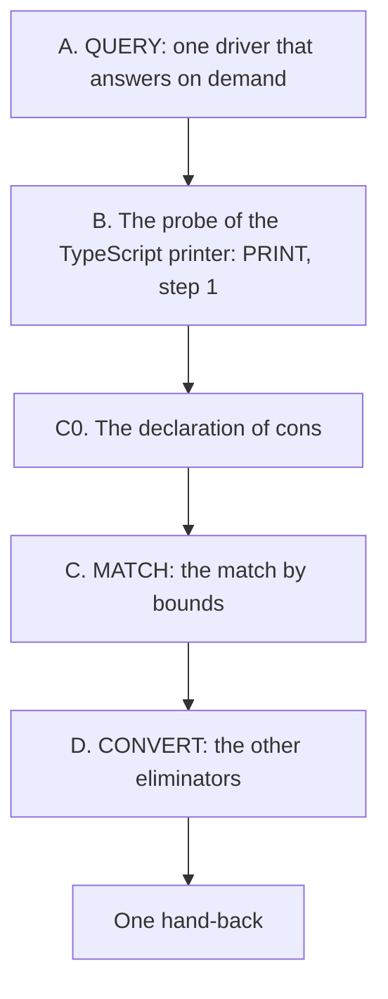

# 2026-10-06 the brief of chunk 2: QUERY, the probe of the TypeScript printer, MATCH and CONVERT

Status: a research note (history, not authority). It rules nothing. The coordinator wrote it for
the second model, at the owner's request: map the next few slices, and land a bigger chunk at
once. Base: main at the commit that enters decisions row 302.

The plan is `docs/research/2026-10-06-next-slices-plan.md`. Its sections 5.3 to 5.6 give each
slice's goal, files, statements and placement, and they stand. This brief adds what a chunk
needs beyond them. It gives the order and the stages inside a slice. It gives the rules that
the two landings taught, where to stop, and how to hand back.

## 1. The chunk

| Step | What it is | It rebuilds | The plan |
| --- | --- | --- | --- |
| A | QUERY: a pure function of requests, and a thin driver over it | `tools/` and one battery | 5.3 |
| B | A finite probe with tsgo 7: every printed form that a join's type arguments must enter | nothing: a note with its evidence | 5.4, step 1 |
| C0 | The prelude declares `cons` in the whole form | the modules above the prelude | 5.6, "a first commit" |
| C | MATCH: one match for atoms, rows and binder terms | the tree, twice | 5.6 |
| D | CONVERT: four rules in the fiber rule's form, then the tests by equality | the tree | 5.5 |

**Why this order.** A and B read the tree and change no core module, so they run while every
build is warm. C and D each rebuild the tree, so they come last and in a row. A and B do not
depend on C or D. If C goes wrong, A and B still land.

## 2. Read first

- `AGENTS.md`, in full. Then the plan's sections 5.3 to 5.6 and 5.13.
- The two reviews: `docs/research/2026-10-06-slice-ORDER-review.md` and
  `docs/research/2026-10-06-slice-TABLE-review.md`. Each rule there holds for this chunk.
- Decisions rows 298 to 302 (`docs/core/decisions.md`).
- For C: `docs/research/2026-10-06-seat-BOUNDS-receipt.md`, sections 6, 7, 10 and 11, and
  `docs/research/2026-10-06-seat-BOUNDS-evidence/scripts/Bounds.lean.txt`.
- For D: `docs/research/2026-10-06-seat-PILOT-receipt.md` and its evidence folder, and the
  section of `Member.fiber` in `src/Effect4/Laws/Program/Eliminators.lean`.

## 3. The rules of the chunk

**Where you work.**

- Work on a branch of this checkout: `git switch -c chunk-2`, from the base commit.
- Commit each stage of section 4 to 7 on that branch. Use `git add <paths>` and
  `git commit -F <file>`. A note under `docs/research` needs `git add -f`, in its own call.
- Never push. Never run `git add -A`. Never amend or rebase a commit of the coordinator.
- Leave the owner's untracked `docs/*.md` and `README.md` as they are.
- If you cannot commit, name the files of each stage in the receipt, and finish C before you
  start D.

**How you build.**

- Run every Lean, Lake and `make` command through `scratch/lean-slot.sh`. Run one `lake` at a
  time.
- Write `-o ts/eff/node_modules -o harness/truth/node_modules` on every `make` call.
- Install nothing. Run tsgo by its path under `ts/eff/node_modules/.bin`. A `bun` run outside
  `ts/eff` and `harness/truth` takes `--no-install`.
- Stop below 4 GiB of free disk.

**What every stage owes** (the two reviews, as a list).

1. A design note before the code, one page, with each statement compiled in scratch.
2. A new function beside the old one, with its connector. The callers move, then the old one
   goes (`AGENTS.md`, Working).
3. A law for each function that restates a part of the checker, in the same stage.
4. No planned goal, unless the law one level higher was tried and failed. Say what you tried.
5. Before a receipt says "holds at X", the battery applies the theorem at X.
6. Each helper's docstring names the claim that it is a step of, and its consumer.
7. One name for one thing. No lemma and no instance without a consumer.
8. A battery line is a reader, a control or a finite evaluation. No `#print axioms` line. A
   control for each case of a table, and a red control for its `none`.
9. `simp only`, `dsimp only`. No `simp_all`, no `first`, no `try`.
10. The goal gate pins its count (`restingPin`, `Test/Audit/AxiomGate.lean`). If your stage
    moves it, move the pin and say why in the receipt.

**Files that are the coordinator's.** Propose a change in the receipt, and do not edit:
`lakefile.toml`, `Makefile`, `docs/core/decisions.md`, `tools/Tools/SemanticsRegistry.lean`,
`docs/core/semantics.md`, `docs/core/controlled-english.md`, `docs/ARCHITECTURE.md`,
`docs/STATE.md`, `docs/core/system-map.md`. In the three root imports, add one line after the
last import of the same folder. In `Test/Audit/AxiomGate.lean`, move `restingPin` and touch
nothing else.

**Where to stop.** Hand back at once, with what stands, when one of these holds:

1. a statement of the plan or of seat BOUNDS's receipt is false. File the counterexample;
2. a program of the two corpora that was admitted is refused;
3. a module of the truth lane or a generated program changes a byte where this brief says
   "unchanged";
4. a choice changes meaning, the supported programs or a representation beyond what the plan
   states. That is the owner's question;
5. a step needs a package, an install, or an edit of a coordinator's file;
6. the disk rule fires.

Otherwise go on to the next step. Do not wait for a review between steps.

## 4. Step A: QUERY

The plan's section 5.3 stands. What this brief adds:

- **Two files, and no executable entry.** The pure function goes to the tools library:
  `tools/Tools/Query.lean`, with a request type, an answer type, their JSON forms and
  `answer`. The driver is `tools/Drivers/Query.lean`: it reads one JSON object for each line
  of standard input and prints one answer for each. Run it as
  `lake env lean --run tools/Drivers/Query.lean`. The library's globs build both files, so
  `lakefile.toml` does not change.
- **The operations**, each one library function, each answer naming its law:

| Operation | Function | The law that the answer names |
| --- | --- | --- |
| check | `Sketch.check` | `holes_conservative` |
| addresses | `Node.addresses` | `mem_addresses_iff` |
| focus at an address | `Sketch.focusAt` | `focusAt_typed` |
| table | `Sketch.table` | `refusals_nil_iff` |
| refusals | `Sketch.refusals` | `refusals_head`, `refusals_nil_iff` |
| slots at an address | `Node.extSlotTerm`, `Node.extSlotEnv` | `hasTy_extSlotEnv` |
| omit at an address | `Sketch.omitAt`, with the hole row of the focus's type | `Sketch.check_omit_focusAt` |
| fill at an address | `Sketch.fillAt` | `Sketch.check_fill_focusAt` at the focus's type; a new check otherwise |

- **The input.** A program arrives as its canonical bytes (`decodeProgram`,
  `src/Effect4/Store/Domain/ProgramWire.lean`). The application is the empty one, and each
  answer says so. Say in the design note how a request carries a hole table. If that needs a
  new codec, land the operations at a program first and propose the codec.
- **The acceptance.** A transcript file under `Test/fixtures/query/`, and one battery,
  `Test/Program/QueryControls.lean`. The battery reads the transcript with `include_str`. For
  each request it compares the answer with the value that `Test/Program/FocusControls.lean` or
  `Test/Program/TableControls.lean` guards. Keep rendered text inside `#guard`: a battery
  `def` over rendered text reaches `Classical.choice`.
- **The root import**: one line in `Test/All.lean`, after `import Test.Program.TableControls`.
- **It adds no theorem**, so it owes no registry claim. Propose the rows of
  `docs/ARCHITECTURE.md` in the receipt.
- **Not in this step**: a server, a package, a stored session, an editor view.

## 5. Step B: the probe of the TypeScript printer

It is step 1 of the plan's section 5.4, and it changes no file of the tree. It answers the
plan's review question 3: which printed form has no place for a type argument?

- List every printed form that an eliminator's term enters. Take the table "where an
  eliminator's term stands" of `docs/research/2026-10-06-seat-TRACE-receipt.md`, and each row
  call with a binder term.
- For each form, write one TypeScript module whose term has two union members, with the type
  arguments written at the join. Write one more with one member too few, as the red control.
- Run tsgo 7 on each, and record the compiler's version with each result. Run it as seat
  BOUNDS ran its target forms. Its receipt's section 6.8 and the scripts of its evidence
  folder show how. Use the same compiler and the pinned packages, and install nothing.
- File each module as a `.ts.txt` file in an evidence folder beside the note. Leave no file
  under `ts/` or `harness/`.
- Hand back a note, `docs/research/2026-10-06-print-probe.md`, with one row for each form.
  A row gives the form, where the type arguments stand, tsgo's verdict, and the evidence file.
- A form with no place for a type argument is the finding. List each one first.

## 6. Step C: MATCH

The plan's section 5.6 stands, with its four ratified parts and its six statements. The owner
ratified the recommendations (decisions row 299, point 10). The stages:

| Stage | What lands | The tree after it |
| --- | --- | --- |
| C0 | The prelude declares `cons` in the whole form, and the citation query reads that form. Today's match does not change | green; `make check-target` passes |
| C1 | The match by bounds in a new core module after `src/Effect4/Program/Ty.lean`, beside today's match: `cands`, `solve`, `matchB`, `matchArgsB`, `bindTermB` | green; the root imports the module, and no caller reads it |
| C2 | Its laws in a new law module: S1, S2, S4, S5 and S6 of the receipt's section 10 | green |
| C3 | The connector, S3: where today's match answers, the match by bounds answers the same types | green |
| C4 | The callers move: `Scheme.apply` loses the `join` flag, and `bindTerm` and `checkRow` call the new match. The five other atoms of the probe take the whole form. The guards stand by site. `Ty.templateAdmissible` refuses a parameter under a nominal reference | green after one rebuild; the differential runs |
| C5 | Today's match and its anchored laws go. Each reader moves to a law of C2 | green after one rebuild |

- **C0 first, alone.** It removes a disagreement between the checker and its prelude that
  stands today (the plan's section 4.3). The whole form has one cost: the citation query
  must read a declaration at the parameter's template (the receipt's sections 6.8 and 7,
  P3). The probe emulated that query and did not run it. So C0 changes the query, and it runs
  `make check-target`. Expect `harness/truth/prelude-atoms.gen.ts` to move, and no row of
  `generated/row-citations.tsv`. A moved row is a finding: say so first.
- **C1 to C3 rebuild nothing above them.** The walk needs `Ty.join`, which `Ty.lean` declares
  after today's match. A module after `Ty.lean` has it. The scratch files hold the function
  and 67 theorems (`scripts/Bounds.lean.txt` and `scripts/Laws.tail.lean.txt` of the evidence
  folder). Move them in. Do not write them again.
- **Prove S3 before a caller moves.** The receipt compiled it within a premise at an argument
  list, and it is open at a binder term's raw type. Where a caller cannot meet the premise,
  that caller's move is a widening: name it in the receipt.
- **The eight other template atoms** have no whole form in the probe. Say in the design note
  why each keeps its declaration, or write its whole form.
- **C4 is the stage that admits more programs.** Run the differential of the two corpora
  before and after. Its producer is
  `docs/research/2026-10-06-seat-PILOT-evidence/differential.lean.txt`. Name each moved row
  in the compatibility policy. A program that was admitted and is refused is stop rule 2.
- **The whole form or the cross form.** The whole form is the first choice at each of the six
  atoms. If `make check-target` refuses it at one atom, take the cross form with its guard
  there, and say so first in the receipt. Do not use the plain split.
- **The case policy.** A match on `Ty` that moves needs its row pinned again: run the audit
  with `--seed-policy`, and edit the notes of `tools/Conform/Effect4/cases-policy.json` as
  text.
- **Two small things ride with C4**, since the tree rebuilds anyway:
  1. **One function of the bindings** (decisions row 302, point 5). `bindTerm` computes the
     instance of an operation's parameter, and `Node.extSlotEnv` repeats that line. Give the
     instance one function, and let both call it. `hasTy_extSlotEnv` must still hold.
  2. **The population filter** reads a name as generated (rows 286 and 293). Repair it.
- **C5 has three known readers to move.** `src/Effect4/Laws/Program/Typing/TermIntro.lean`
  restates its section on a parameter's first and second occurrence.
  `nativeAtomTy_ite_above` loses its premise. The traversal census lists `Ty.infer` as a
  hand match, and the candidate walk is one too: propose its row.
- **A host row's templates.** S6 decides the tree's own templates. A host row that an
  application supplies is checked at admission (`rowChecks`), by the new clause of
  `Ty.templateAdmissible`. Give that its control.
- **The statement lists.** C4 and C5 change and remove statements. Give three lists for each
  stage: added, changed and removed, as the compiler prints them.
- **The registry texts** are proposals in the receipt: the claim of the complete match in the
  place of `template-match-anchored`, and the new sentence of `checker-monotone`.
- **Gates that you run**, each through the slot: `lake build Test`; `make check-cases`;
  `make check-target`; `make check-tsdiag`; `make check-corpus`; `make check-ingest`. The
  coordinator runs the wide gates again at the landing.
- **Do not touch**: `Ty.join`, `Ty.normalize`, `Ty.sub`; the rules of `HasTy`.

## 7. Step D: CONVERT

The plan's section 5.5 stands. The stages:

| Stage | What lands |
| --- | --- |
| D1 | `HasTy` states the list rule and the exit rule through the function, where it states them by shape today. Two statement lists |
| D2 | The list rule: `Checker.listOf?` is the extended rule of `Member.list` |
| D3 | The exit rule, in the same form |
| D4 | `Decision.arms` at an option, in the same form |
| D5 | The cause rule. It reads two heads, so it owes four member facts |
| D6 | The tests by equality read the order: `Ty.sub t T` in the place of `t = T` at the four Boolean tests, `restore`, the scope of `forkIn`, `setContext` and the interruptor |

- **One conversion has four parts**, as the fiber rule's landed (the plan's section 5.5). The
  contract is `Eliminator.extend_laws`. No conversion proves it again.
- **Each stage runs the differential** and pins the case policy again.
- **Each stage admits more programs**: at `never`, and at one union member under a raw union.
  D6 widens each test. List the programs that each stage newly types, with one control for
  each. The coordinator reports it to the owner at the landing.
- **`hasTy_extSlotEnv` reads the Boolean test of `catchIf` and of `iterate`.** D6 changes those
  premises. Keep the law's statement, and repair its proof.
- **D6 lands after its own run of tsgo** (decisions row 285, point 3). Print each test at
  `never` and at one union member under a raw union, and run tsgo 7 on each form. If tsgo
  refuses a form, leave that test as it is, and say so first in the receipt.
- **D6 stands alone.** It is the last stage. If the chunk runs long, hand back before it.
- **A rule on an invariant handle is not converted.**

## 8. The hand-back

Hand back once, when D is done or a stop rule fires. Use the handoff form of `AGENTS.md`. The
message holds, in this order:

1. the one thing that the coordinator must know before the landing;
2. for each step: its commits, its files, and its three statement lists;
3. the exact commands and their results, with the counts of the three gates of `lake build
   Test`;
4. the programs that each of C4 and D2 to D6 newly types, and each moved row of the corpora;
5. the open obligations, and for each planned goal what was tried;
6. the proposals: texts of the semantics registry, decisions rows, dictionary words,
   architecture rows.

One receipt for each step: `docs/research/<date>-seat-<STEP>-receipt.md`, with its design note
beside it.

## 9. What the coordinator checks at the landing

So check it yourself first.

- Each theorem that a receipt says "holds at X" is applied at X in a battery.
- No statement changed outside the lists.
- Each new function that restates the checker has its law.
- Each planned goal is one that the law above it could not close.
- The differential: no admitted program is refused, and each moved row has its policy name.
- `lake build Test` is green with its three gates. So are `make check-cases`, `check-docs`
  and `check-language`.
- The docstrings name claims and consumers, and the module heads say what the module is not.

## 10. After this chunk

| Chunk | Slices | Entry |
| --- | --- | --- |
| 3 | PRINT, steps 2 to 5; COLUMN | the note of step B; MATCH's guard at a binder term |
| 4 | UNGUARD | PRINT, CONVERT and MATCH are landed, and the owner has heard each widening |
| Later | PASS, CLASSES, GAPLEAF | each has its entry condition (the plan, 5.9 to 5.11) |

## 11. What this does not establish

- No theorem of the tree. The stages of section 6 are a plan of work, and no stage is compiled.
- That S3 holds at every caller. The receipt compiled it within a premise.
- That `make check-target` accepts the whole form. The probe emulated the citation query.
- That the chunk fits one session of the second model. A stop rule may end it early.
